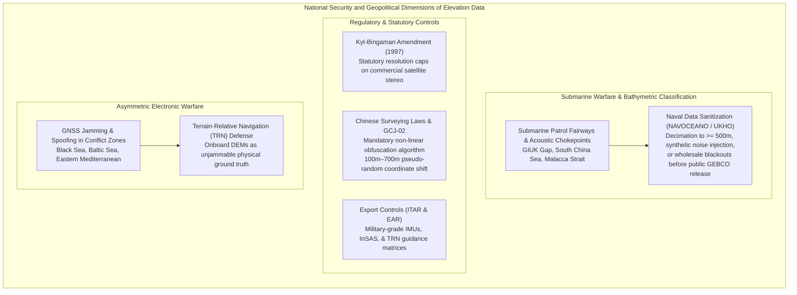
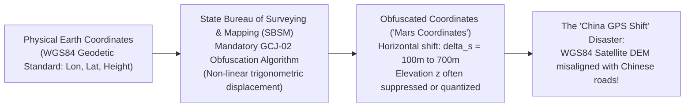

# Chapter 27: Legal, Privacy, Sovereignty, National Security, and Cost Optimization

*The human, legal, geopolitical, and economic dimensions of collecting and publishing 3D models of the world.*

---

## 27.3 Country, National Security, and Sovereignty Issues

Digital elevation models are strategic military assets. High-resolution terrain matrices guide cruise missiles flying beneath radar coverage, provide the targeting envelopes for hypersonic glide vehicles, and determine acoustic shadow zones where nuclear attack submarines hide from active sonar. Consequently, sovereign states treat 3D geographic data with extreme sensitivity, enacting strict export controls, spatial resolution caps, coordinate obfuscation laws, and classification barriers.

Understanding the geopolitical landscape of elevation modeling is essential for international researchers, commercial remote sensing operators, and autonomous vehicle engineers.

---

### 27.3.1 Military Classification of Bathymetry and Submarine Acoustics

While open-science initiatives (such as the Nippon Foundation-GEBCO Seabed 2030 project) seek to map the entire ocean floor by 2030, they routinely collide with classified naval defense mandates.

#### 1. Undersea Acoustic Warfare and Submarine Operations
For a nuclear ballistic missile submarine (SSBN) or attack submarine (SSN), survival depends on stealth. Ocean topography dictates underwater acoustics:
* **Acoustic Shadow Zones:** Deep submarine canyons, seamounts, and tectonic trenches block the transmission of active active sonar pulses, creating acoustic dead zones where a submarine can lurk undetected.
* **Undersea Navigation:** Navigating submerged at high speed without emitting detectable active sonar requires ultra-high-resolution, verified bathymetric DEMs paired with Bathymetric-Aided Navigation (BAN) to avoid seamounts.
* **Chokepoints:** Strategic acoustic corridors—such as the **Greenland-Iceland-United Kingdom (GIUK) Gap**, the **Bashi Channel in the Luzon Strait**, and the **Strait of Hormuz**—are heavily monitored by seabed acoustic hydrophone arrays (e.g., US Navy SOSUS/IUSS).

#### 2. Naval Sanitization and Redaction Protocols
Naval hydrographic offices (including the US Navy's Naval Oceanographic Office - NAVOCEANO, the British UKHO, the French SHOM, and the Russian Directorate of Navigation and Oceanography - DNO) maintain vast archives of high-resolution multibeam bathymetry:
* When contributing data to public databases (GEBCO, NOAA NCEI, EMODnet), naval censors execute **data sanitization**:
* *Downsampling:* Swath bathymetry collected at $5\text{-meter}$ or $10\text{-meter}$ resolution is systematically decimated and Gaussian-smoothed to coarse $500\text{-meter}$ or $1,000\text{-meter}$ grid cells.
* *Synthetic Noise Injection:* Controlled pseudo-random vertical perturbations ($\pm 10\text{–}50\text{ m}$) are injected into deep-water areas to destroy the subtle geomorphic signatures used by adversary TRN algorithms.
* *Complete Data Blackouts:* Areas containing critical submarine transit routes, undersea fiber-optic cable landing stations, or military seabed installations are completely excised, leaving large synthetic interpolation holes in global public datasets.

---

### 27.3.2 Satellite Resolution Limits: The Kyl-Bingaman Amendment

The spatial resolution of commercial spaceborne elevation models is governed by federal national security legislation.

#### 1. The 1997 Kyl-Bingaman Amendment (KBA)
Enacted as Section 1064 of the National Defense Authorization Act for Fiscal Year 1997 (Public Law 104-201), the **Kyl-Bingaman Amendment (KBA)** prohibited US federal agencies (specifically NOAA's Commercial Remote Sensing Regulatory Affairs office) from licensing US commercial satellite operators to collect or distribute satellite imagery over Israel at a spatial resolution finer than what was available from non-US commercial sources.
* For over two decades, while US commercial satellites (such as Maxar WorldView-3) collected $0.3\text{-meter}$ imagery globally, all imagery and derived stereo elevation models covering Israel and the Palestinian territories were legally crippled to a maximum ground sample distance of **$2.0\text{ meters}$**.
* In July 2020, NOAA formally determined that foreign commercial operators (including Airbus Pleiades and Korean KOMPSAT) routinely offered sub-meter imagery of the region, officially lifting the KBA limit to **$0.40\text{ meters}$**.

#### 2. The US Commercial Remote Sensing Space Policy
Administered by the Department of Commerce and NOAA, current regulations divide commercial spaceborne sensors into three regulatory tiers:
* **Tier 1:** Systems with capabilities identical to existing foreign commercial satellites; subject to minimal licensing conditions.
* **Tier 2:** Systems with capabilities available only from a restricted set of allied foreign commercial operators.
* **Tier 3:** Systems with novel, unprecedented sensing capabilities (e.g., ultra-high-resolution spaceborne LiDAR or military-grade X-band InSAR). Tier 3 licenses include strict "shutter control" clauses, allowing the US Department of Defense to legally order commercial satellite operators to suspend imaging operations over specific conflict theaters during wartime.

---

### 27.3.3 State-Mandated Coordinate Obfuscation: The China GCJ-02 Law

In the People's Republic of China, geographic elevation data and survey coordinates are strictly regulated under the **Surveying and Mapping Law of the PRC**. Under Chinese law, unauthorized surveying, GPS logging, or elevation mapping by foreign individuals or entities constitutes illegal espionage, punishable by heavy fines and imprisonment.

#### The GCJ-02 Obfuscation Algorithm
To protect national security infrastructure, the State Bureau of Surveying and Mapping (SBSM) formulated the **GCJ-02 coordinate system** (popularly known as *Mars Coordinates*):
* Every commercial mapping provider (Baidu, AutoNavi, Apple Maps, Google Maps China) and GPS receiver sold in China is legally required to implement an encrypted non-linear shift algorithm.
* The algorithm accepts true geodetic coordinates $(\lambda_{\text{WGS84}}, \phi_{\text{WGS84}})$ and applies a complex, multi-frequency sinusoidal displacement:
  $$\Delta \lambda = f(\lambda, \phi) + \sum_{k} A_k \sin(\omega_k \lambda) \cos(\omega_k \phi)$$
  $$\Delta \phi = g(\lambda, \phi) + \sum_{k} B_k \cos(\omega_k \lambda) \sin(\omega_k \phi)$$
* *Consequence:* True coordinates are displaced by a pseudo-random, location-dependent vector of **$100\text{ to }700\text{ meters}$**.
* When international users attempt to drape high-resolution WGS84 satellite DEMs or LiDAR point clouds over official Chinese road networks, the layers suffer the infamous **"China GPS Shift"**: roads appear offset into rivers, and bridges cross dry land. Reverse-transforming GCJ-02 back to WGS84 within Chinese borders is technically illegal under national surveying statutes.

---

### 27.3.4 Export Controls: ITAR and EAR

Advanced hardware and algorithms used in digital elevation modeling are classified as dual-use goods or military defense articles.

#### 1. International Traffic in Arms Regulations (ITAR)
Administered by the US Department of State Directorate of Defense Trade Controls (DDTC) under the United States Munitions List (USML):
* **Category XII (Optical and Guidance):** Controls military-grade inertial measurement units (IMUs) with gyro bias stability $<0.001^\circ/\text{hr}$ and accelerometers $<10\,\mu g$ used for mobile LiDAR georeferencing.
* **Category XII(d):** Controls proprietary military software algorithms for **Terrain Contour Matching (TERCOM)**, Sandia Inertial Terrain-Aided Navigation (SITAN), and real-time DEM correlation used in cruise missile guidance.
* **Interferometric Synthetic Aperture Sonar (InSAS):** Military InSAS systems capable of resolving seafloor mine targets with centimeter resolution are ITAR-controlled and barred from export to non-allied nations.

#### 2. Export Administration Regulations (EAR)
Administered by the US Department of Commerce Bureau of Industry and Security (BIS) under the Commerce Control List (CCL):
* Controls commercial airborne multibeam bathymetric LiDAR and dual-use multi-frequency swath sonars (ECCN 6A001 and 6A008). Selling advanced topo-bathy LiDAR scanners to entities on the BIS Entity List is strictly prohibited.

---

### 27.3.5 Electronic Warfare: GNSS Jamming, Spoofing, and DEM Defense

In 21st-century conflict zones (including the Black Sea, the Baltic corridor, and the Middle East), electronic warfare (EW) units routinely deploy high-power GNSS jammers and spoofers:
* **Jamming:** Saturates GPS $L_1/L_2/L_5$ frequencies with noise, denying position fixes to drones, commercial airliners, and maritime vessels.
* **Spoofing:** Transmits synthesized counterfeit satellite signals with falsified pseudoranges, leading autonomous drones and commercial ships to calculate erroneous coordinates (often indicating they are miles away at international airport runways).

**The Elevation Model as Unjammable Defense:**
Because radio signals can be jammed or spoofed, **Terrain-Relative Navigation (TRN)** operating on internal, encrypted reference DEMs provides the ultimate counter-measure. Physical terrain slopes, mountain peaks, and seafloor trenches cannot be spoofed by radio transmitters. By matching real-time laser, radar, or sonar altimeter profiles directly against an onboard DEM via particle filtering, autonomous aircraft and submarines maintain flawless navigation without receiving a single external radio transmission.
