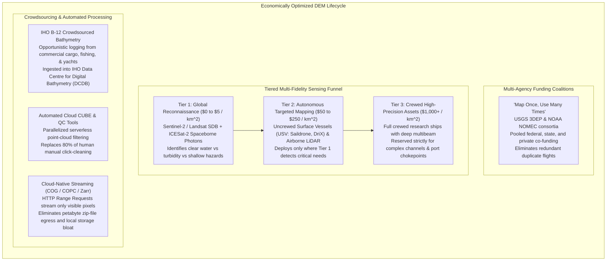
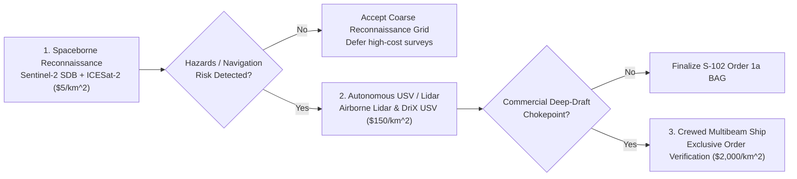

# Chapter 27: Legal, Privacy, Sovereignty, National Security, and Cost Optimization

*The human, legal, geopolitical, and economic dimensions of collecting and publishing 3D models of the world.*

---

## 27.4 Reducing the Cost of Collecting, Processing, Validating, and Using DEM Data

Collecting and maintaining high-resolution digital elevation models is among the most capital-intensive activities in earth observation. A full-ocean hydrographic research vessel costs between $\$25,000$ and $\$65,000$ per day to operate; an airborne topo-bathy LiDAR campaign over a complex coastal archipelago costs hundreds of thousands of dollars; and legacy point-by-point manual data cleaning consumes up to $80\%$ of total project labor hours.

To make national and global elevation models economically viable, the geospatial industry has developed systemic strategies to drive down the cost-per-square-kilometer: **multi-agency funding coalitions**, **tiered sensor screening**, **crowdsourced observations (CSB)**, **automated cloud quality assurance**, and **cloud-native streaming architectures**.

---

### 27.4.1 Multi-Agency Coalitions: "Map Once, Use Many Times"

Historically, spatial data acquisition was plagued by wasteful duplication: a state department of transportation would fly aerial photogrammetry for a highway corridor; the following year, the US Army Corps of Engineers would fly LiDAR over the adjacent river; and two years later, the county tax assessor would commission a municipal orthophoto. Each flight collected redundant, uncoordinated elevation data with mismatched datums and incompatible specifications.

#### 1. The USGS 3DEP Partnership Model
The **USGS 3D Elevation Program (3DEP)** pioneered the modern co-funding coalition model:
* **The Broad Agency Announcement (BAA):** A competitive annual solicitation where federal agencies (USGS, FEMA, USACE, NOAA, NRCS, US Forest Service), state governments, regional councils, and private utility partners pool financial resources into a unified acquisition fund.
* **Return on Investment (ROI):** Independent economic audits demonstrated that for every $\$1.00$ invested in national 3DEP LiDAR, the American economy realizes over **$\$5.00\text{ to }\$13.00$ in documented operational benefits** across flood risk management, precision agriculture, infrastructure engineering, and geological hazard mitigation.
* **Open Public Access:** By contractually mandating that all co-funded data enters the public domain without restrictive licenses, the program prevents downstream agencies from re-flying identical terrain.

#### 2. The NOMEC Council and Seabed 2030
At sea, the US **National Ocean Mapping, Exploration, and Characterization (NOMEC)** Council and the international **Nippon Foundation-GEBCO Seabed 2030 Project** coordinate academic, military, and commercial oceanographic voyages. Research vessels transiting between survey sites are required to leave their multibeam echosounders running ("transit mapping"), capturing opportunistic deep-ocean swaths that cost zero additional ship days.

---

### 27.4.2 The Tiered Sensing Funnel: SDB to USVs

Rather than blindly deploying expensive crewed assets across unmapped regions, efficient operators deploy a **Tiered Sensing Funnel**, escalating sensor fidelity only where justified by physical risk:

1. **Tier 1: Spaceborne Reconnaissance ($\approx \$0\text{–}\$5/\text{km}^2$):**
   * Optical **Satellite-Derived Bathymetry (SDB)**—leveraging free, open Sentinel-2 and Landsat 8/9 imagery paired with radiative transfer inversions (Stumpf ratio model)—maps coastal waters down to depths of $15\text{–}25\text{ meters}$ in clear tropical seas.
   * **NASA ICESat-2 (ATLAS)** spaceborne photon-counting LiDAR provides uncalibrated vertical transects through shallow waters, serving as absolute geodetic control to anchor the SDB models without touching the water.
2. **Tier 2: Autonomous and Airborne Screening ($\approx \$50\text{–}\$250/\text{km}^2$):**
   * Where SDB indicates dangerous shoals, unmapped shipping fairways, or optical opacity due to coastal turbidity, operators deploy **Uncrewed Surface Vessels (USVs)** (e.g., Saildrone Surveyor, Exail DriX) or airborne topobathymetric LiDAR.
   * USVs operate uncrewed for weeks at a time powered by diesel-electric or wind/solar systems, slashing survey carbon footprints by $90\%$ and reducing daily operational costs by $75\%$ compared to crewed research ships.
3. **Tier 3: Crewed Specialized Vessels ($\approx \$1,000\text{–}\$5,000/\text{km}^2$):**
   * Full crewed hydrographic survey vessels are reserved strictly for critical port harbor entrances, berthing drydocks, and complex engineering fairways where IHO Exclusive Order object detection ($0.5\text{-m}$ cubes) and diver/ROV ground-truthing are legally required.

---

### 27.4.3 Crowdsourced Bathymetry (CSB) and IHO Guidance B-12

Over $75\%$ of the world's coastal waters remain inadequately surveyed. To fill vast spatial gaps without commissioning multi-million-dollar government vessels, the International Hydrographic Organization established the **IHO Crowdsourced Bathymetry Working Group (CSBWG)** and issued standard **IHO Publication B-12** (*Guidance on Crowdsourced Bathymetry*).

* **Operational Framework:** Standard NMEA 0183/2000 digital data loggers are installed aboard opportunistic vessels of opportunity—commercial container ships, cruise liners, commercial fishing trawlers, tugboats, and private sailing yachts.
* **Data Flow:** The loggers automatically record time-stamped GNSS latitude/longitude coordinates and single-beam sounder depths $(x, y, z_{\text{raw}}, t)$ during routine commercial voyages, uploading the encrypted logs via Wi-Fi or cellular connections upon port arrival.
* **Central Clearinghouse:** Data is ingested into the **IHO Data Centre for Digital Bathymetry (DCDB)**, hosted openly by NOAA NCEI.
* **Automated Post-Processing:** Automated cloud algorithms evaluate cross-line intersections between disparate vessel tracks to estimate and remove static vessel draft offsets, dynamic squat, and tidal stage biases. While CSB data does not meet IHO Special Order for navigation charting, it is invaluable for updating regional GEBCO bathymetric models and identifying uncharted seamounts.

---

### 27.4.4 Automated Cloud Quality Control: Replacing Human Click-Cleaning

Historically, hydrographic data processing was dominated by "point-by-point cleaning": human hydrographers sitting in dark rooms for weeks, using 3D mouse controllers to manually inspect billions of acoustic sounding pings and delete individual noise spikes (fish schools, kelp, side-lobe multipath).

Modern pipelines replace manual editing with automated, mathematically defensible cloud algorithms:
* **The CUBE Algorithm (Combined Uncertainty and Bathymetric Estimator):** Developed by Brian Calder at UNB CCOM. Operates as an automated, multi-hypothesis recursive Kalman filter that ingests full Total Propagated Uncertainty (TPU) matrices for every sounding, statistically isolating true seafloor surfaces from acoustic flyers without human bias.
* **Serverless Parallel Quality Control:** Cloud engines (AWS Lambda, Google Cloud Run) execute automated HSSD validation scripts (such as NOAA HydrOffice QC Tools) across thousands of tiles in parallel, checking TVU/THU compliance ratios, searching for unflagged bathymetric fliers, and verifying cross-line agreement in minutes rather than months.

---

### 27.4.5 Cloud-Native Streaming Architectures: COG, COPC, and Zarr

The final frontier of cost reduction is eliminating data movement bloat. In legacy GIS, analyzing a $100\text{-meter}$ road embankment required downloading a $50\text{-gigabyte}$ compressed `.zip` archive containing hundreds of raw quadrangle tiles, extracting them locally, and overflowing hard drives.

Modern elevation architectures employ **Cloud-Native Geospatial formats**:

1. **Cloud Optimized GeoTIFF (COG):**
   * Incorporates an internal tile organization ($256\times 256$ pixel chunks) and pre-rendered overview pyramids.
   * Enables HTTP clients to issue **HTTP GET Range Requests** (`Range: bytes=1048576-2097152`), fetching only the specific spatial bytes required to render the user's current screen bounding box or local simulation cell.
2. **Cloud Optimized Point Cloud (COPC):**
   * Stores classified LiDAR point clouds in a hierarchical octree embedded within a backward-compatible LAZ 1.4 container. Clients stream points progressively across the network based on distance from the camera.
3. **Zarr and TileDB:**
   * Multi-dimensional chunked array storage formats optimized for massively parallel cloud computing (Dask, Xarray, Apache Spark). Allows scientific climate and hydrodynamic models to slice multi-terabyte elevation and sea-level time series arrays directly from cloud object storage (AWS S3, Google Cloud Storage) without local downloading.
* *Economic Impact:* Eliminates $99\%$ of network bandwidth egress costs, slashes cloud storage requirements, and enables instantaneous, global-scale spatial analysis inside standard web browsers.
