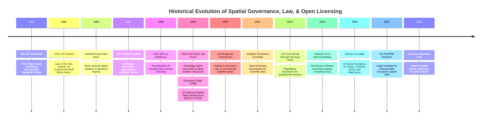

# Chapter 27: Legal, Privacy, Sovereignty, National Security, and Cost Optimization

*The human, legal, geopolitical, and economic dimensions of collecting and publishing 3D models of the world.*

---

## 27.5 Historical Evolution: Legal Treaties, Open Source, and Spatial Data Infrastructure

The legal and institutional governance of spatial elevation data developed in tandem with international maritime law, open-source software licenses, and national spatial data infrastructures. The timeline below, anchored in the `schwehr/gis-history` repository, highlights how geopolitical treaties, maritime disasters, and open-data movements shaped the governance of digital elevation models.

---

### 27.5.1 Maritime Safety Treaties and International Law: 1914 to 1982

#### 1914: The SOLAS Convention
Following the sinking of the RMS *Titanic* in April 1912, maritime nations convened in London to adopt the first **International Convention for the Safety of Life at Sea (SOLAS)**. 
* Chapter V of SOLAS codified the legal obligation of contracting governments to ensure that hydrographic surveys are carried out and that official nautical charts, notices to mariners, and depth models are published to ensure safe navigation. 
* SOLAS established the principle that navigational bathymetry is an essential public safety responsibility of coastal sovereign states.

#### 1982: UNCLOS and Article 76
Adopted in Montego Bay, Jamaica, in December 1982, the **Third United Nations Convention on the Law of the Sea (UNCLOS)** created the modern international maritime legal order:
* Codified the **$12\text{-nautical-mile}$ Territorial Sea** and the **$200\text{-nautical-mile}$ Exclusive Economic Zone (EEZ)**.
* **Article 76** formulated the mathematical and geodetic rules enabling coastal states to claim an **Extended Continental Shelf (ECS)** beyond $200\text{ nmi}$ based on bathymetric criteria (the Foot of the Continental Slope and the $2,500\text{-meter}$ isobath). When UNCLOS officially entered into force in November 1994, it triggered a global race among maritime nations to acquire high-resolution deep-water multibeam surveys to secure sovereign mineral rights over millions of square kilometers of abyssal seafloor.

---

### 27.5.2 The Open-Source Licensing Foundation: 1987 to 1991

The digital elevation processing engines used today (GDAL, PROJ, PDAL, GRASS, QGIS) rely on legal software licenses formulated during the software freedom movement of the late 1980s:

* **1987: The MIT License:** Drafted at the Massachusetts Institute of Technology, this permissive license granted users unconditional rights to use, copy, modify, merge, publish, and sell software with only a simple attribution and copyright notice. It became the legal bedrock of foundational geospatial libraries (including PROJ and MapLibre).
* **1989: GNU General Public License (GPL v1):** Authored by Richard Stallman of the Free Software Foundation (FSF), the GPL established **copyleft**. It legally required that any distributed software incorporating GPL code must make its complete source code available under the same terms. The GPL and LGPL (1991) govern core open-source GIS packages, including QGIS and GRASS GIS.
* **1990: The BSD License:** Formulated at UC Berkeley for the Computer Systems Research Group (CSRG), establishing the four-clause (and later two/three-clause) permissive framework widely used across Unix and academic geospatial tools.

---

### 27.5.3 National Spatial Data Infrastructures and Statutory Caps: 1994 to 1997

#### 1994: Executive Order 12906 and the US NSDI
On April 11, 1994, President Bill Clinton signed **Executive Order 12906**, *Coordinating Geographic Data Acquisition and Access: The National Spatial Data Infrastructure (NSDI)*:
* Mandated that federal agencies coordinate spatial data collection through the **Federal Geographic Data Committee (FGDC)**.
* Established the first public federal metadata clearinghouses and prohibited federal agencies from using taxpayer funds to collect spatial data if existing data met standard specifications. This executive mandate laid the institutional groundwork that culminated in the unified USGS 3D Elevation Program (3DEP).

#### 1997: The Kyl-Bingaman Amendment
Passed as Section 1064 of Public Law 104-201, the amendment barred US commercial satellite operators from releasing high-resolution imagery and derived stereo elevation models over Israel at a resolution finer than commercially available foreign sources. This established a 23-year statutory ceiling ($2.0\text{-meter}$ GSD) that shaped commercial remote sensing policy until its revision in 2020.

---

### 27.5.4 Open Data, Crowdsourcing, and Cloud Infrastructure: 2001 to 2009

#### 2001: Foundation of Creative Commons
Legal scholar Lawrence Lessig and colleagues founded **Creative Commons (CC)**, releasing standardized public copyright licenses (CC-BY, CC-BY-SA, CC-NC). This provided spatial data creators with legal tools to share elevation rasters and scientific bathymetry with clear reuse permissions.

#### 2004: Apache 2.0, OpenStreetMap, and AWS
The year 2004 represented a triple inflection point for modern spatial computing:
1. **The Apache 2.0 License:** Released by the Apache Software Foundation, adding explicit patent grants and trademark protections to permissive open-source licensing (used by GDAL, Arrow, and modern big-data geospatial stacks).
2. **OpenStreetMap (OSM):** Steve Coast founded OpenStreetMap in the UK, demonstrating that crowdsourced spatial contributors could map global road networks and topography faster and more flexibly than centralized commercial mapping monopolies.
3. **Cloud Infrastructure:** Amazon Web Services (AWS) launched its foundational cloud infrastructure, while Google published the seminal *MapReduce* paper. Together, these technologies enabled the parallelized, petabyte-scale processing of global satellite elevation models.

#### 2006: The Open Source Geospatial Foundation (OSGeo)
In February 2006, open-source geospatial developers formed the **Open Source Geospatial Foundation (OSGeo)**. OSGeo established a non-profit legal umbrella, software quality governance, and code provenance verification for foundational projects:
* **GDAL/OGR** (Frank Warmerdam): The universal translator for raster and vector geospatial formats.
* **PROJ**: The universal coordinate transformation library.
* **GRASS GIS and QGIS**: Desktop analysis and cartography suites.

#### 2007: The European Union INSPIRE Directive
Enacted by the European Parliament and Council, the **INSPIRE Directive (2007/2/EC)** legally mandated that all 27 EU member states establish standardized, interoperable spatial data infrastructures covering 34 spatial data themes—including **Elevation (Theme 11)**. INSPIRE required national mapping agencies to publish classified LiDAR DTMs and bathymetric grids via standardized OGC Web Coverage Services (WCS).

#### 2009: Creative Commons Zero (CC0)
In 2009, Creative Commons published **CC0 1.0 Universal (Public Domain Dedication)**. CC0 allowed international researchers, private foundations, and national agencies (such as the Nippon Foundation-GEBCO Seabed 2030 and OpenTopography) to legally waive all copyright and database protections worldwide, establishing the legal standard for frictionless, cloud-native open elevation data.
