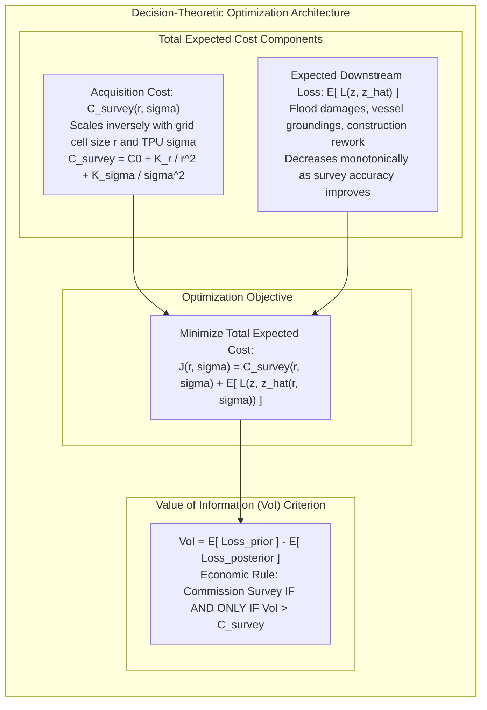

# Chapter 27: Legal, Privacy, Sovereignty, National Security, and Cost Optimization

*The human, legal, geopolitical, and economic dimensions of collecting and publishing 3D models of the world.*

---

## 27.6 Mathematical Foundations of Survey Economics and Value of Information

How does a national mapping director decide whether to commission an expensive $0.5\text{-meter}$ QL1 LiDAR survey ($\$350/\text{km}^2$) or accept a free $30\text{-meter}$ satellite DEM? How does a port authority decide whether to conduct a high-precision IHO Exclusive Order multibeam survey or rely on historical soundings?

In engineering economics, this decision is not resolved by intuition; it is solved via **Decision Theory** and the **Value of Information (VoI)**. By modeling elevation accuracy as a continuous reduction in downstream expected loss (flood damage, dredging volume overruns, vessel groundings), decision-makers can mathematically determine the optimal survey resolution and sensor budget.

---

### 27.6.1 The Survey Cost Model

The financial cost of collecting spatial elevation data is governed by the physics of sensor coverage and line geometry.

#### 1. Resolution and Flight-Line Mileage Scaling
Let an area of interest have spatial extent $A$ ($\text{km}^2$). To resolve terrain features at grid resolution $r$ ($\text{meters}$), the nominal pulse spacing or sounding density $\rho$ ($\text{pts/m}^2$) must satisfy:
$$\rho \propto \frac{1}{r^2}$$

In airborne LiDAR and marine multibeam sonar, achieving a pulse density $\rho$ requires flying or sailing parallel survey swaths with across-track swath width $W$. Because swath width is constrained by sensor altitude $H$ or water depth $d$ ($W \approx 2 H \tan(\theta/2)$), increasing point density requires lowering flight altitude $H$ or narrowing line spacing:
* Narrowing swath line spacing by a factor of 2 doubles the total linear survey mileage $L_{\text{miles}} = \frac{A}{W (1 - \text{overlap})}$.
* Doubling flight lines doubles vessel fuel burn, pilot flight hours, and operator labor costs.

#### 2. The Total Survey Cost Function
The direct financial cost $C_{\text{survey}}(r, \sigma)$ of acquiring an elevation dataset with spatial resolution $r$ and vertical measurement uncertainty $\sigma$ is formulated as:

$$C_{\text{survey}}(r, \sigma) = C_0 + \frac{K_r}{r^2} + \frac{K_\sigma}{\sigma^2}$$
where:
* $C_0$: Fixed project overhead (mobilization, port fees, base station setup, flight permits).
* $K_r$: Resolution cost coefficient (swath density, flight time, point-cloud storage, GPU processing).
* $K_\sigma$: Precision cost coefficient (higher-grade navigation-grade IMUs, multi-frequency dual-swath sonars, RTK GNSS networks, intensive sound speed profiling).

---

### 27.6.2 The Downstream Loss Function

An elevation model is an intermediate input into downstream operational decisions. Errors in the DEM lead to bad decisions that manifest as real financial losses.

#### 1. Asymmetric Loss in Marine Navigation and Flood Risk
In coastal dredging and marine navigation, the loss function is highly asymmetric:
* If the estimated seafloor depth $\hat{z}$ is deeper than true depth $z$ ($\hat{z} > z$, underestimating shallow hazards), a ship drawing draft $T$ runs aground. The financial loss includes vessel salvage, environmental oil spill cleanup, and cargo loss ($C_{\text{grounding}} \sim \$10^7\text{–}\$10^9$).
* If estimated depth $\hat{z}$ is shallower than true depth $z$ ($\hat{z} < z$, overestimating hazards), the port authority unnecessarily dredges deeper than required, or ships carry less cargo ("light-loading"), wasting dredging capital ($C_{\text{dredge}} \sim \$15\text{–}\$50/\text{m}^3$).

The asymmetric loss function is modeled as a piecewise-linear **pinball (quantile) loss**:
$$L(z, \hat{z}) = \begin{cases} c_{\text{hazard}} \cdot (\hat{z} - z), & \text{if } \hat{z} > z \quad (\text{under-reporting shoal}) \\ c_{\text{waste}} \cdot (z - \hat{z}), & \text{if } \hat{z} \le z \quad (\text{false alarm / over-dredge}) \end{cases}$$
where $c_{\text{hazard}} \gg c_{\text{waste}}$ (typically by a factor of $100:1$ to $10,000:1$).

#### 2. Quadratic Error Loss in Infrastructure Design
In civil earthwork grading and flood inundation modeling, loss is frequently modeled as quadratic in vertical error $\epsilon = z - \hat{z}$:
$$L(z, \hat{z}) = k_L \cdot (z - \hat{z})^2$$
where $k_L$ represents the marginal economic penalty per square meter of vertical variance.

Given that total vertical error variance $\sigma_z^2$ combines sensor uncertainty $\sigma^2$ and spatial discretization error $\sigma_{\text{grid}}^2(r) \approx \gamma \cdot r^2$ (where $\gamma$ depends on terrain roughness):
$$\mathbb{E}\big[ L(z, \hat{z}) \big] = k_L \cdot \big( \sigma^2 + \gamma \cdot r^2 \big)$$

---

### 27.6.3 Minimizing Total Expected Lifecycle Cost

The project planner's objective is to minimize the **Total Expected Cost $\mathcal{J}(r, \sigma)$**:

$$\mathcal{J}(r, \sigma) = C_{\text{survey}}(r, \sigma) + \mathbb{E}\big[ L(z, \hat{z}) \big] = C_0 + \frac{K_r}{r^2} + \frac{K_\sigma}{\sigma^2} + k_L \big( \sigma^2 + \gamma \cdot r^2 \big)$$

To find the optimal spatial resolution $r^*$ and optimal sensor precision $\sigma^*$, we compute the partial derivatives and set them to zero:

#### 1. Optimal Spatial Resolution $r^*$
$$\frac{\partial \mathcal{J}}{\partial r} = -\frac{2 K_r}{r^3} + 2 k_L \gamma r = 0$$
$$\frac{K_r}{r^3} = k_L \gamma r \implies r^4 = \frac{K_r}{k_L \gamma}$$

$$r^* = \left( \frac{K_r}{k_L \gamma} \right)^{1/4}$$

* **Interpretation:**
  * As the downstream risk of terrain error increases ($k_L \to \infty$, such as an urban flood basin or high-density nuclear power plant site), the optimal grid cell size $r^*$ shrinks to sub-meter tolerances.
  * In rugged terrain with high roughness ($\gamma$ large), optimal resolution $r^*$ must be tightened.
  * In low-consequence environments (open desert or agricultural range land where $k_L$ is small), optimal resolution relaxes to coarse satellite tiers ($30\text{ m}$).

#### 2. Optimal Sensor Uncertainty $\sigma^*$
$$\frac{\partial \mathcal{J}}{\partial \sigma} = -\frac{2 K_\sigma}{\sigma^3} + 2 k_L \sigma = 0$$
$$\frac{K_\sigma}{\sigma^3} = k_L \sigma \implies \sigma^4 = \frac{K_\sigma}{k_L}$$

$$\sigma^* = \left( \frac{K_\sigma}{k_L} \right)^{1/4}$$

---

### 27.6.4 The Value of Information (VoI) Decision Criterion

In formal Bayesian decision theory, a new survey should be commissioned **if and only if** the expected reduction in downstream risk exceeds the full cost of the survey.

Let:
* $\mathcal{D}_0$: The prior decision state based on pre-existing legacy data (e.g., a 1970 single-beam chart or $30\text{-m}$ SRTM DEM) with prior expected loss $\mathbb{E}[L \mid \mathcal{D}_0]$.
* $\mathcal{D}_1$: The posterior decision state after collecting a new high-resolution survey with posterior expected loss $\mathbb{E}[L \mid \mathcal{D}_1]$.

The **Value of Information (VoI)** is defined as:

$$\text{VoI} = \mathbb{E}\big[ L \mid \mathcal{D}_0 \big] - \mathbb{E}\big[ L \mid \mathcal{D}_1 \big]$$

$$\text{The Golden Economic Decision Rule:}$$
$$\text{Commission Survey } \iff \text{VoI} > C_{\text{survey}}(r^*, \sigma^*)$$

#### Operational Case Study: Port Channel Deepening
* **Scenario:** A port authority is evaluating whether to commission a $\$150,000$ IHO Exclusive Order multibeam survey ($C_{\text{survey}} = \$150,000$) before deepening a container terminal fairway.
* **Prior State ($\mathcal{D}_0$):** Using an uncalibrated 2012 single-beam dataset ($\sigma \approx 0.50\text{ m}$), dredging contractors must build in a $0.60\text{-meter}$ "over-dredge safety buffer" across $2\text{ km}^2$ of rock seabed to ensure deep-draft ships will not strike bedrock. At $\$40/\text{m}^3$, dredging that unnecessary safety buffer costs:
  $$\text{Loss}(\mathcal{D}_0) = 2,000,000\text{ m}^2 \times 0.60\text{ m} \times \$40/\text{m}^3 = \$48,000,000$$
* **Posterior State ($\mathcal{D}_1$):** Commissioning the Exclusive Order multibeam survey provides a verified $0.5\text{-meter}$ grid with $\sigma \le 0.15\text{ m}$, reducing the required over-dredge buffer from $0.60\text{ m}$ to $0.15\text{ m}$:
  $$\text{Loss}(\mathcal{D}_1) = 2,000,000\text{ m}^2 \times 0.15\text{ m} \times \$40/\text{m}^3 = \$12,000,000$$
* **Value of Information:**
  $$\text{VoI} = \$48,000,000 - \$12,000,000 = \$36,000,000$$
Since $\text{VoI} = \$36\text{M} \gg C_{\text{survey}} = \$0.15\text{M}$, the survey yields a **$240:1$ return on investment**, providing an overwhelming mathematical justification for the survey expenditure.
