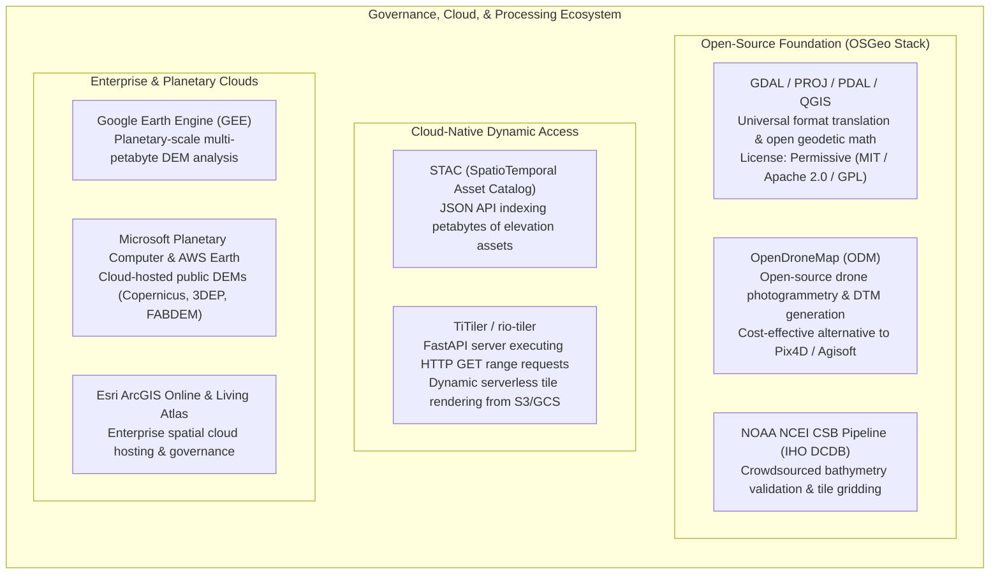

# Chapter 27: Legal, Privacy, Sovereignty, National Security, and Cost Optimization

*The human, legal, geopolitical, and economic dimensions of collecting and publishing 3D models of the world.*

---

## 27.7 Software Ecosystem

Managing legal compliance, crowdsourced data ingestion, open-source governance, and cost optimization requires an integrated software stack spanning open-source foundations, federal pipelines, and planetary cloud platforms. This section reviews the open-source engines and enterprise platforms that power legal and economic spatial data management.



---

### 27.7.1 Open-Source Processing and Crowdsourcing Platforms

#### 1. The OSGeo Foundation Stack
The **Open Source Geospatial Foundation (OSGeo)** curates the fundamental libraries that underpin $95\%$ of all geospatial software:
* **GDAL/OGR:** Translates over 200 raster formats and provides the core engine for generating Cloud Optimized GeoTIFFs (`gdal_translate -of COG -co COMPRESS=DEFLATE`).
* **PROJ:** Handles geodetic datum conversions and map projections, including modern vertical grid-shift transformations (e.g., transforming ellipsoidal heights to orthometric NAVD88 via NGS `geoid18.gtx`).
* **PDAL (Point Data Abstraction Library):** The point-cloud equivalent of GDAL. Automates classified LiDAR filtering, ground-surface extraction, and conversion between LAS/LAZ and Cloud Optimized Point Cloud (COPC) formats.

#### 2. OpenDroneMap (ODM)
For organizations seeking to bypass expensive commercial photogrammetry subscriptions (e.g., Pix4D, Agisoft Metashape):
* **OpenDroneMap (ODM)** is an open-source, Docker-based photogrammetric computer vision engine built on top of OpenSfM and OpenMVS.
* Ingests consumer drone RGB imagery, performs structure-from-motion (SfM) bundle adjustment, and generates georeferenced classified dense point clouds, digital surface models (DSM), and bare-earth digital terrain models (DTM) with sub-centimeter resolution.

#### 3. NOAA NCEI Crowdsourced Bathymetry (CSB) Pipeline
Maintained on GitHub by NOAA National Centers for Environmental Information, the open-source **CSB Processing Pipeline**:
* Validates incoming NMEA 0183/2000 sounding streams submitted by commercial vessels to the IHO Data Centre for Digital Bathymetry (DCDB).
* Automatically checks incoming soundings for geographic bounds, parses vessel speed over ground (SOG), strips invalid sounding strings, and aggregates soundings into open GeoJSON and spatial database records.

---

### 27.7.2 Cloud-Native Ingestion: STAC and HTTP Range Requests

The modern standard for cost-effective elevation data access is the **SpatioTemporal Asset Catalog (STAC)** specification paired with **Cloud Optimized GeoTIFFs (COG)**. Rather than downloading gigabytes of imagery, a Python client queries a STAC metadata catalog, identifies the target asset, and streams only the requested bounding box via HTTP GET range requests.

```python
"""
Cloud-native elevation extraction using pystac_client, odc.stac, and rioxarray.
Queries the Microsoft Planetary Computer STAC API to stream a small bounding box
from the global Copernicus GLO-30 DEM without downloading full tile archives.
"""

from pystac_client import Client
import planetary_computer as pc
import odc.stac
import matplotlib.pyplot as plt

def stream_cloud_dem(bbox: list[float], output_png: str = "streamed_elevation.png"):
    """
    Streams elevation pixels from a cloud-hosted COG via HTTP Range Requests.
    
    Args:
        bbox: [min_lon, min_lat, max_lon, max_lat] in EPSG:4326.
    """
    print(f"Connecting to Planetary Computer STAC catalog for bbox: {bbox}")
    catalog = Client.open(
        "https://planetarycomputer.microsoft.com/api/stac/v1",
        modifier=pc.sign_inplace
    )
    
    # Search for Copernicus GLO-30 DEM items intersecting the bounding box
    search = catalog.search(
        collections=["cop-dem-glo-30"],
        bbox=bbox
    )
    items = list(search.items())
    print(f"Found {len(items)} intersecting STAC items.")
    
    # Stream and crop the data directly into an xarray.Dataset
    # odc.stac issues HTTP GET range requests for only the target pixels
    data = odc.stac.load(
        items,
        bands=["data"],
        bbox=bbox,
        crs="EPSG:4326",
        resolution=0.000277777777778 # ~30m resolution in degrees
    )
    
    dem_array = data["data"].squeeze().values
    print(f"Streamed array shape: {dem_array.shape}, min elev: {dem_array.min():.1f}m, max: {dem_array.max():.1f}m")
    
    # Render quick-look plot
    plt.figure(figsize=(8, 6), dpi=300)
    plt.imshow(dem_array, cmap="terrain")
    plt.colorbar(label="Elevation (meters, EGM2008)")
    plt.title("Streamed Copernicus GLO-30 (Zero Local Storage)")
    plt.axis("off")
    plt.tight_layout()
    plt.savefig(output_png)
    plt.close()
    print(f"Saved quick-look to {output_png}")

# Example: Mount St. Helens Crater, Washington State
# [min_lon, min_lat, max_lon, max_lat]
# stream_cloud_dem([-122.22, 46.18, -122.16, 46.22])
```

---

### 27.7.3 Enterprise and Planetary Geospatial Platforms

#### 1. Google Earth Engine (GEE)
The premier platform for multi-temporal, planetary-scale elevation analysis:
* Hosts pre-tiled, server-side catalogs of **Copernicus GLO-30/90**, **NASADEM**, **ALOS AW3D30**, **USGS 3DEP 1m/10m**, and **FABDEM**.
* Executes parallelized geospatial algorithms (such as watershed flow accumulation, slope, aspect, and volumetric change detection) across tens of thousands of Google Cloud CPUs, enabling researchers to process global mountain ranges in seconds.

#### 2. Commercial Geospatial Clouds: AWS and Microsoft Planetary Computer
* **AWS Registry of Open Data:** Hosts the entire **USGS 3DEP** point cloud repository (in COPC format) and NOAA's National Ocean Service bathymetric database, allowing cloud computing instances running in US-West-2 to process terabytes of LiDAR with zero egress fees.
* **Microsoft Planetary Computer:** Hosts global Copernicus GLO-30 and ArcticDEM datasets indexed via dynamic STAC APIs, paired with managed JupyterHub compute clusters.

#### 3. Esri ArcGIS Online and the Living Atlas
Esri's commercial cloud platform:
* Provides access to the **World Elevation Service**, which dynamically merges multi-resolution datasets into a single continuous raster endpoint.
* While convenient for web mapping, enterprise users must manage credit consumption models and be mindful of dynamic server-side resampling filters.
