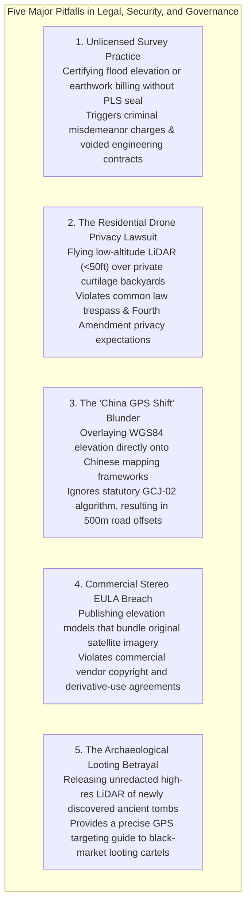

# Chapter 27: Legal, Privacy, Sovereignty, National Security, and Cost Optimization

*The human, legal, geopolitical, and economic dimensions of collecting and publishing 3D models of the world.*

---

## 27.8 Common Pitfalls and Key Takeaways

The governance, legal exposure, and economics of digital elevation modeling represent some of the most complex traps in geospatial practice. Unlike algorithmic bugs that fail at runtime, legal and geopolitical missteps result in civil liability, criminal prosecution, international territorial disputes, and multi-million-dollar economic waste.

---

### 27.8.1 Common Pitfalls in Legal, Security, and Governance Dimensions

#### 1. The Unlicensed Practice of Surveying
* **The Failure Mode:** A commercial drone mapping startup or GIS consulting firm captures aerial LiDAR of a construction site, computes cut-and-fill volume differences, and signs an official certificate submitted for contractor payment or municipal grading permits.
* **Legal Reality:** In almost all jurisdictions, certifying spatial data for legal property boundaries, building foundation elevation certificates, or contractual earthwork billing legally constitutes the **regulated practice of Professional Land Surveying (PLS)** or **Licensed Photogrammetric Surveying**.
* **Forensic Consequence:** State surveying licensing boards issue cease-and-desist orders and impose thousands of dollars in statutory fines. If the contractor's billing is challenged in court, the uncertified DEM is ruled legally inadmissible, voiding contractor payments and exposing the mapping firm to civil malpractice liability.
* **Remedy:** Know the statutory boundary between general GIS analysis and legal surveying. Always have legal deliverables reviewed, verified, and stamped by a licensed Professional Land Surveyor (PLS) or Certified Photogrammetrist.

#### 2. The Residential Drone Curtilage Intrusion
* **The Failure Mode:** An aerial drone survey collecting corridor LiDAR for a municipal utility pipeline flies at low altitude ($<50\text{ feet}$) directly over private residential backyards, capturing sub-decimeter 3D point clouds of private patios, swimming pools, and interior spaces through glass skylights.
* **Legal Reality:** While high-altitude navigable airspace ($\ge 100\text{–}400\text{ feet}$) is federally managed by the FAA, the common law doctrine of **curtilage** (*United States v. Causby*, *Kyllo v. United States*) protects the immediate vertical envelope of private residential life.
* **Forensic Consequence:** Homeowners file civil lawsuits for **common law trespass**, **invasion of privacy**, and **private nuisance**. In several jurisdictions, state statutes impose statutory damages and criminal penalties for non-consensual surveillance of private residential grounds using unmanned aircraft.
* **Remedy:** Plan drone flight paths to remain above $100\text{ feet}$ over residential areas. When corridor surveys require low-altitude flight, obtain prior written right-of-entry agreements, or program automated software filters to delete private curtilage points outside the utility right-of-way.

#### 3. The "China GPS Shift" Alignment Disaster
* **The Failure Mode:** An international logistics or engineering team operating in China ingests a global WGS84 elevation model (e.g., Copernicus GLO-30 or SRTM) and drapes it over local Chinese vector road networks and cadastre databases.
* **Legal Reality:** Under the Surveying and Mapping Law of the People's Republic of China, all public commercial mapping must implement the mandatory state-encrypted **GCJ-02 ("Mars Coordinates")** algorithm, which shifts true WGS84 coordinates by a non-linear pseudo-random displacement of $100\text{ to }700\text{ meters}$.
* **Forensic Consequence:** Because the WGS84 DEM is geographically true while the Chinese road vectors are mathematically shifted, mountain tunnels appear offset into valley rivers, and highway bridges cross dry fields. Attempting to deploy autonomous vehicles using this misaligned data causes catastrophic navigation failures. Furthermore, creating unauthorized reverse-transformation software within China exposes engineers to arrest for illegal surveying.
* **Remedy:** Work through licensed Chinese mapping partners who hold certified statutory encryption licenses to perform authorized datum transformations within Chinese legal frameworks.

#### 4. Commercial Satellite Imagery EULA Violations
* **The Failure Mode:** A research team purchases commercial high-resolution optical stereo pairs (e.g., Maxar WorldView-3 or Airbus Pleiades) using an academic grant, extracts a digital surface model, and uploads the entire dataset—including the original imagery bands and textured orthophotos—to a public GitHub or open-access Zenodo repository.
* **Legal Reality:** Commercial satellite vendors sell *licenses to use* imagery under strict End User License Agreements (EULAs), retaining underlying copyright. While derived mathematical matrices containing pure coordinate elevations $(x, y, z)$ are classified as derivative works that may be publicly shared under CC-BY, redistributing the original imagery pixels or textured ortho-mosaics is a direct breach of contract and copyright infringement.
* **Forensic Consequence:** Satellite vendors issue immediate copyright takedown notices (DMCA), revoke organizational enterprise data access, and sue for copyright infringement and statutory damages.
* **Remedy:** Scrub all proprietary optical spectral bands, original pixel radiance, and commercial RPC sensor model files prior to publishing derivative elevation models. Distribute pure floating-point elevation rasters (GeoTIFF) or coordinate point clouds only.

#### 5. Exposing Archaeological and Cultural Heritage Sites to Plunder
* **The Failure Mode:** An archaeological research team processes airborne LiDAR over an unexcavated jungle region, discovers a complex of unmapped ancient pyramids and royal tombs, and publishes the full-resolution, georeferenced bare-earth DTM online in an open-access journal article.
* **Physical Reality:** Organised antiquities trafficking networks actively monitor academic geospatial publications for newly identified cultural ruins.
* **Forensic Consequence:** Within weeks of publication, black-market looting cartels use the exact GPS coordinates and high-resolution bare-earth hillshades to navigate deep into the jungle, digging destructive looting trenches into unexcavated tombs, stealing priceless cultural artifacts, and destroying stratigraphic context before professional archaeologists can secure the site.
* **Remedy:** Follow the **CARE Principles** and archaeological preservation protocols: strip absolute geodetic coordinates, publish regional hillshades in arbitrary local coordinates, fuzz spatial boundaries, and store raw point clouds in access-controlled, credentialed research repositories.

---

### 27.8.2 Key Takeaways for Practitioners

1. **Know the Limits of Sovereign Immunity:** Government agencies enjoy discretionary immunity under the FTCA, but private survey contractors bear full civil liability for negligence in detecting hazards or establishing vertical datums.
2. **Respect the Statutory Surveying Boundary:** General GIS analysis is unregulated; certifying elevations for boundaries, legal subdivisions, flood insurance (LOMA/LOMR), or earthwork billing requires a licensed Professional Land Surveyor (PLS).
3. **Anonymize PII in Mobile 3D Models:** Implement automated neural network blurring (faces and license plates) and point-cloud decimation to comply with GDPR and privacy statutes.
4. **Practice Indigenous Data Sovereignty:** Adhere to the CARE Principles (Collective Benefit, Authority to Control, Responsibility, Ethics) when mapping Indigenous lands, and redact sacred sites in collaboration with tribal authorities.
5. **Optimize Costs via the Tiered Funnel:** Deploy low-cost satellite SDB and spaceborne ICESat-2 LiDAR first; escalate to autonomous USVs and airborne bathylidar second; reserve multi-million-dollar crewed ships strictly for critical navigation chokepoints.
6. **Embrace Cloud-Native Streaming:** Replace bandwidth-heavy `.zip` downloads with Cloud Optimized GeoTIFFs (COG), COPC point clouds, and STAC APIs, slashing cloud storage costs and eliminating redundant egress fees.
