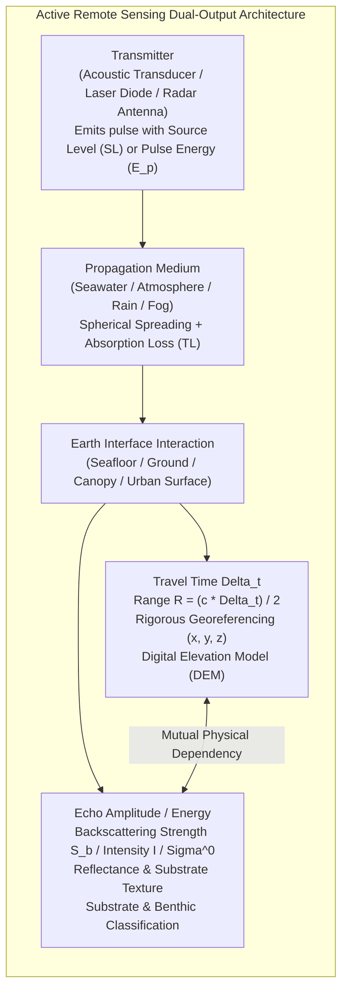

# Chapter 28: Acoustic Backscatter, LiDAR Intensity, and Substrate/Benthic Co-Products

*Why elevation and depth sensors never measure geometry alone—and how co-registered return amplitude disambiguates terrain surfaces and hazards.*

---

## 28.1 Physical Principles of Return Amplitude and Backscatter

Every active remote sensing system—whether an acoustic multibeam echosounder (MBES), an airborne topographic or bathymetric LiDAR, or a spaceborne Synthetic Aperture Radar (SAR)—transmits a calibrated pulse of wave energy toward the Earth and records the returning echo. While geospatial software has historically focused almost exclusively on the **two-way travel time** (extracting coordinates $x, y, z$ to construct a digital elevation model), the sensor simultaneously records the **amplitude, energy, and waveform shape** of the returning pulse.

This return amplitude—known as **acoustic backscatter**, **LiDAR intensity**, or **radar cross-section**—is not an auxiliary bonus; it is the physical companion of elevation. Elevation tells the analyst *where* the surface is; backscatter and intensity tell the analyst *what* that surface is composed of. Furthermore, without an accurate 3D DEM, backscatter cannot be radiometrically calibrated; and without backscatter, a DEM cannot be forensically vetted against false shoals, vegetation blunders, or floating artifacts.



---

### 28.1.1 The Modalities of Return Energy: Sonar, LiDAR, and Radar

The physical mechanism of backscattering differs according to the wave nature (mechanical vs. electromagnetic) and the sensing medium:

#### 1. Acoustic Seafloor Backscatter ($S_b$)
In marine acoustics, sound pressure waves propagate through the water column and interact with the seafloor.
* **Target Strength and Backscattering Strength:** The ratio of backscattered acoustic intensity at $1\text{ meter}$ from the target to incident acoustic intensity is the **Bottom Backscattering Strength ($S_b(\theta)$ or $BS$)**, expressed in decibels ($\text{dB}$ re $1\text{ m}^2/\text{m}^2$):
  $$S_b(\theta) = 10 \log_{10}\left( \frac{I_{\text{scat}}(1\text{m})}{I_{\text{inc}}} \right)$$
* **Physical Controls:** Acoustic backscatter is governed by the contrast in **acoustic impedance** ($Z = \rho \cdot c$, where $\rho$ is bulk density and $c$ is sound speed) across the water-sediment interface, combined with interface roughness and volumetric inhomogeneities. Hard crystalline granite or exposed bedrock reflects strong acoustic energy ($-10\text{ dB to }-15\text{ dB}$); fine silt and uncompacted fluid mud absorb sound and scatter weakly ($-35\text{ dB to }-50\text{ dB}$).

#### 2. LiDAR Radiometric Intensity ($I$)
In airborne laser scanning, a pulsed laser (typically $1064\text{ nm}$ near-infrared for terrestrial topography, or $532\text{ nm}$ green for coastal bathymetry) strikes the surface:
* **Raw Intensity:** In standard LAS/LAZ files, intensity is recorded as a quantized integer Digital Number ($\text{DN}$, typically 8-bit $[0, 255]$ or 16-bit $[0, 65535]$) representing the peak amplitude or integrated area of the returning optical detector waveform.
* **Calibrated Surface Reflectance ($\rho_\lambda$):** Physical reflectance represents the dimensionless ratio of reflected optical power to incident optical power. Asphalt road surfaces and wet marsh soils absorb near-infrared light, exhibiting low intensity ($\rho_{1064} \approx 0.05\text{–}0.15$); dry concrete, light sand, and living photosynthetic foliage strongly reflect near-infrared photons ($\rho_{1064} \approx 0.40\text{–}0.70$).

#### 3. Radar Backscatter: Sigma-Naught ($\sigma^0$) and Gamma-Naught ($\gamma^0$)
In spaceborne Synthetic Aperture Radar (SAR), microwave pulses (X-band, C-band, L-band) interact with the terrain:
* **$\sigma^0$ (Sigma-Naught):** The normalized radar cross-section per unit ground area (in $\text{dB}$).
* **$\gamma^0$ (Gamma-Naught):** The radar cross-section normalized per unit area perpendicular to the radar line of sight:
  $$\gamma^0 = \frac{\sigma^0}{\cos\theta_i}$$
  where $\theta_i$ is the local incidence angle. InSAR DEM processing relies on radar coherence ($\gamma$), which is directly modulated by the stability of backscatter amplitude across repeat satellite passes.

---

### 28.1.2 Surface Scattering vs. Volume Scattering

When a wave packet reaches the boundary of an elevation model, the returning echo is generated by two distinct physical regimes: **surface scattering** and **volume scattering**.

```mermaid
flowchart LR
    Incoming["Incident Wave Packet\n(Acoustic or Optical Wavefront)"] --> Interface["Boundary Interface (z = f(x, y))\nAcoustic Impedance Delta_Z or Optical Refractive Index Delta_n"]
    
    Interface -->|Impedance Mismatch| SurfaceScat["Surface Scattering\nGoverned by micro-roughness sigma_h relative to wavelength lambda\nSpecular return at nadir; diffuse scattering at oblique angles"]
    
    Interface -->|Transmitted Energy (1 - R)| Penetration["Wave Penetration into Subsurface"]
    Penetration --> VolumeScat["Volume Scattering\nInternal heterogeneities:\n- Sub-bottom shells, pebbles, gas bubbles\n- Forest canopy leaves, branches, twigs\n- Firn / snow ice grain boundaries"]
```

#### 1. Surface Scattering and the Rayleigh Criterion
Surface scattering occurs strictly at the 2D discontinuity interface separating the two media. Its angular behavior depends on the relationship between surface vertical micro-roughness $\sigma_h$ (the standard deviation of surface elevation variations) and wave wavelength $\lambda$:

The phase difference $\Delta \Phi$ between two rays reflected from adjacent surface heights differing by $\Delta h$ is:
$$\Delta \Phi = \frac{4\pi \sigma_h}{\lambda} \cos\theta_i$$
where $\theta_i$ is the angle of incidence relative to the surface normal.

* **The Rayleigh Roughness Criterion:**
  * If $\Delta \Phi < \frac{\pi}{2}$ (i.e., $\sigma_h < \frac{\lambda}{8 \cos\theta_i}$), the surface is **acoustically or optically smooth**. The reflected wave remains coherent, producing strong specular reflection at nadir ($\theta_i \approx 0^\circ$) and vanishingly weak backscatter at oblique grazing angles.
  * If $\Delta \Phi \ge \frac{\pi}{2}$, the surface is **rough**. The wavefront is broken into incoherent diffuse scattering distributed across all angles.
* *Wavelength Sensitivity:* A sandy seafloor with $2\text{-cm}$ ripple crests is rough to a $300\text{-kHz}$ multibeam sonar ($\lambda = 5\text{ mm}$), scattering sound back to the transducer across wide swaths. To a $12\text{-kHz}$ deep-ocean sonar ($\lambda = 12.5\text{ cm}$), that same sand ripple is acoustically smooth, behaving like a mirror that reflects energy away from outer beams.

#### 2. Volume Scattering
Volume scattering occurs when energy penetrates beyond the immediate interface and scatters off internal inhomogeneities within the underlying medium:
* **Marine Sediments:** In soft unconsolidated clays and muddy silts, acoustic waves penetrate several decimeters to meters beneath the apparent seabed. Sound scatters off buried shell fragments, burrows excavated by benthic fauna, coarse sand lenses, and biogenic methane gas bubbles. In muds, volume scattering often dominates over surface scattering at oblique grazing angles ($>30^\circ$).
* **Forest Canopies in LiDAR:** In airborne LiDAR, the laser pulse does not encounter a single flat surface; it propagates through a $30\text{-meter}$ deep volume of leaves, twigs, and branches. Multiple discrete returns or full-waveform digitization capture volume scattering throughout the vertical canopy profile before a final return strikes the bare earth.
* **Dry Snow and Glacial Ice in Radar:** In X-band and C-band SAR altimetry (SRTM, TanDEM-X), microwaves penetrate several meters into dry polar firn, scattering off internal ice grain boundaries and refrozen ice lenses. If the volume scattering phase center is not corrected, the resulting DEM measures an elevation $1\text{–}5\text{ meters}$ below the true snow surface!
