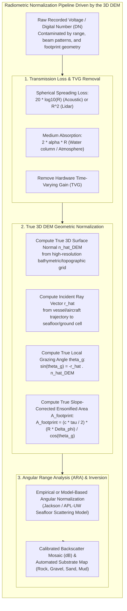
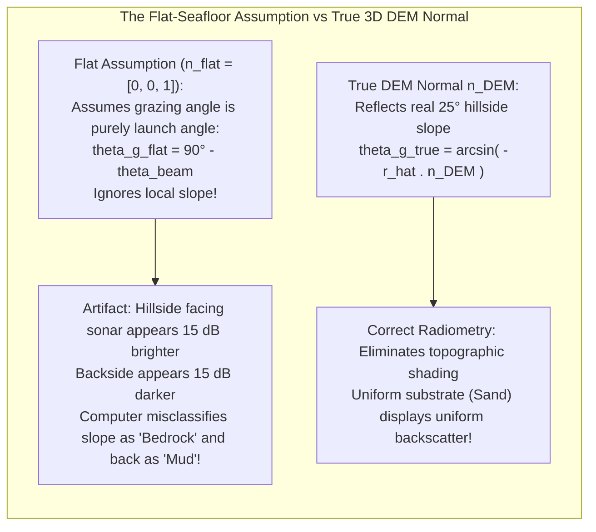
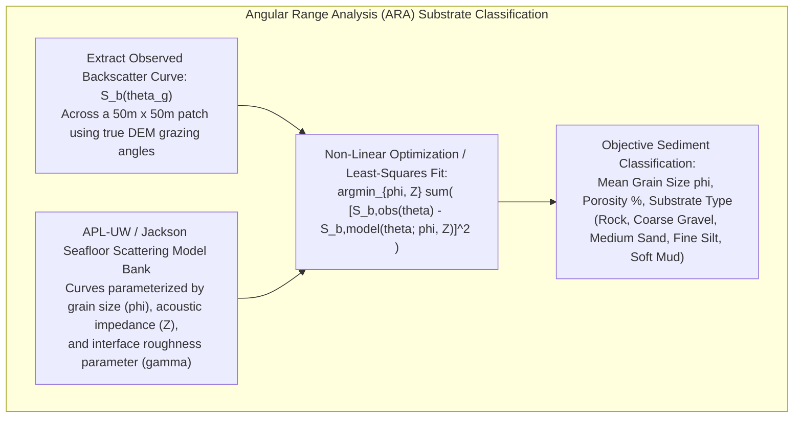

# Chapter 28: Acoustic Backscatter, LiDAR Intensity, and Substrate/Benthic Co-Products

*Why elevation and depth sensors never measure geometry alone—and how co-registered return amplitude disambiguates terrain surfaces and hazards.*

---

## 28.2 Radiometric and Geometric Correction Using the DEM

A raw backscatter image from a multibeam sonar or an uncorrected LiDAR intensity raster is physically uninterpretable. Raw amplitude is overwhelmingly dominated by geometric artifacts: spherical spreading losses, atmospheric or water-column attenuation, transducer beam pattern lobes, and the geometric stretching of the beam footprint across sloping ground.

To transform raw instrument voltages into an intrinsic physical property of the Earth's surface—such as acoustic backscattering strength ($S_b$) or calibrated optical reflectance ($\rho$)—one must execute a rigorous radiometric and geometric normalization pipeline. Crucially, **this normalization cannot be performed without the high-resolution 3D Digital Elevation Model itself**.

---

### 28.2.1 Transmission Loss and Sensor Radiometry

As a pulse propagates from the transducer to the target and back, wave energy decays exponentially due to two physical processes:

#### 1. Geometrical Spreading Loss
For an acoustic wavefront expanding spherically into the water column, acoustic intensity decays with the square of range ($1/R^2$). Over the two-way path length $2R$, the two-way transmission loss due to geometrical spreading is:
$$\text{TL}_{\text{spread}} = 20 \log_{10}(R) + 20 \log_{10}(R) = 40 \log_{10}(R) \quad (\text{point target})$$
However, when ensonifying a continuous distributed surface (where the ensonified area grows proportionally with range $A \propto R$), the effective spreading loss for a distributed area target simplifies to:
$$\text{TL}_{\text{spread, area}} = 20 \log_{10}(R) + 10 \log_{10}(R) = 30 \log_{10}(R) \quad \text{to } 20 \log_{10}(R)$$

In terrestrial airborne LiDAR, where the laser beam illuminates a finite spot footprint whose target reflects back to a telescope collector of fixed aperture area $A_{\text{rx}}$, power decays with the square of slant range:
$$P_{\text{rx}} \propto \frac{P_{\text{tx}} \cdot \rho}{R^2}$$

#### 2. Medium Absorption Loss
Energy is continuously converted into heat through molecular relaxation and viscous dissipation:
$$\text{TL}_{\text{absorb}} = 2 \cdot \alpha(f, T, S, P) \cdot R$$
where $\alpha$ is the absorption coefficient in $\text{dB/m}$ (computed via the Francois-Garrison or Ainslie-McColm equations in seawater, or atmospheric molecular absorption models in air). At $300\text{ kHz}$ in ocean water, $\alpha \approx 0.07\text{ dB/m}$; over a $100\text{-meter}$ round-trip, absorption strips $14\text{ dB}$ of signal power!

#### 3. Time-Varying Gain (TVG) Removal
To prevent analog-to-digital converters from saturating on strong near-nadir returns while starving on weak outer-beam returns, sonars apply an internal hardware **Time-Varying Gain (TVG)**:
$$\text{TVG}(t) = X \log_{10}(R(t)) + 2 \alpha R(t)$$
*The Catch:* Sonar manufacturers frequently hardcode estimated values of $X$ (e.g., $X = 30$ or $40$) and static sound absorption $\alpha_0$. Post-processing software must mathematically subtract the hardware TVG curve and re-apply true physical transmission loss based on actual CTD sound speed and salinity casts.

---

### 28.2.2 The Critical Role of the 3D DEM in Geometric Normalization

The most common failure in backscatter processing is treating the seafloor or ground as a flat horizontal plane ($z = \text{constant}$). When terrain is sloping, assuming a flat plane introduces catastrophic radiometric errors.

#### 1. True Local Grazing and Incidence Angles
Backscatter strength is an explicit function of the **local grazing angle $\theta_g$** (or incidence angle $\theta_i = 90^\circ - \theta_g$) at which the wavefront strikes the micro-topography:

Let $\hat{\mathbf{r}}$ be the unit vector along the incident ray from the sensor to the ground point $\mathbf{x}$, and let $\hat{\mathbf{n}}_{\text{DEM}}$ be the true outward unit surface normal derived directly from the high-resolution DEM at $\mathbf{x}$:

$$\cos\theta_i = -\hat{\mathbf{r}} \cdot \hat{\mathbf{n}}_{\text{DEM}}$$
$$\sin\theta_g = -\hat{\mathbf{r}} \cdot \hat{\mathbf{n}}_{\text{DEM}}$$

* **The Topographic Shading Blunder:**
  If a seabed made of uniform medium sand slopes $20^\circ$ toward the survey vessel:
  * The physical grazing angle becomes steep ($\theta_g \approx 65^\circ$).
  * If the software assumes a flat horizontal seabed, it calculates an apparent grazing angle of $\theta_{g, \text{flat}} \approx 45^\circ$.
  * Because backscatter increases steeply toward normal incidence, the upslope side reflects significantly more energy. 
  * If uncorrected by the true DEM normal, the software mistakes this geometric orientation for a change in sediment type, falsely classifying the sandy hillside as solid granite bedrock!

#### 2. True Ensonified Footprint Area ($A_{\text{footprint}}$)
The measured echo level represents the integrated acoustic energy scattered from the entire instantaneous area of the seafloor ensonified by the pulse. Normalizing to unit backscattering strength requires dividing by the exact **ensonified footprint area $A_{\text{footprint}}$**:

In the pulse-length-limited regime (oblique beams), the across-track ensonified ground length depends on the pulse duration $\tau$, sound speed $c$, and local grazing angle $\theta_g$:
$$L_{\text{across}} = \frac{c \tau}{2 \cos\theta_g}$$

The along-track ensonified width depends on the across-track slant range $R$ and the along-track beamwidth $\phi_{\text{along}}$:
$$L_{\text{along}} = R \cdot \phi_{\text{along}}$$

The total footprint area is:
$$A_{\text{footprint}} = L_{\text{across}} \cdot L_{\text{along}} = \frac{c \tau R \phi_{\text{along}}}{2 \cos\theta_g}$$

Notice the factor $\cos\theta_g$ in the denominator: as the local grazing angle $\theta_g$ approaches $90^\circ$ (normal incidence), the pulse transitions to the beam-aperture-limited regime. Without extracting $\theta_g$ from the local 3D DEM, the footprint area calculation diverges, creating severe radiometric banding along the nadir track.

---

### 28.2.3 Angular Range Analysis (ARA) and Substrate Inversion

Seafloor acoustic backscattering strength $S_b(\theta)$ varies by over **$20\text{ to }30\text{ dB}$** across the swath purely as a function of grazing angle $\theta_g$:
* Near nadir ($\theta_g \to 90^\circ$), coherent specular reflection generates a massive, sharp amplitude peak.
* At intermediate grazing angles ($30^\circ\text{–}60^\circ$), diffuse surface roughness dominates.
* At shallow grazing angles ($\theta_g < 20^\circ$), backscatter decays rapidly.

#### 1. The Jackson / APL-UW Model
Pioneered by Darrell Jackson at the University of Washington Applied Physics Laboratory (APL-UW), the Jackson model decomposes seafloor backscatter into a physical sum of surface roughness scattering and volume scattering:
$$S_b(\theta_g) = S_{\text{surface}}(\theta_g; \, \gamma, w_2) + S_{\text{volume}}(\theta_g; \, \sigma_v, \epsilon)$$
where:
* $\gamma$: Spectral roughness exponent.
* $w_2$: Spectral roughness strength at $1\text{ cm}^{-1}$.
* $\sigma_v$: Volume scattering parameter.
* $\epsilon$: Ratio of sediment acoustic impedance to seawater acoustic impedance.

#### 2. Angular Range Analysis (ARA) Inversion
By extracting the observed angular response curve $S_b(\theta_g)$ across an acoustic patch (typically $30\text{–}50$ pings) and fitting it to the Jackson model bank via non-linear optimization, software packages (such as QPS FMGT) objectively estimate the **mean sediment grain size** ($\phi = -\log_2(d_{\text{grain}}\text{ in mm})$) and sediment bulk density. This transforms qualitative sonar shading into a quantitative, georeferenced benthic habitat map.

---

### 28.2.4 Multi-Spectral LiDAR and Multi-Frequency Sonar

The latest frontier in terrain radiometry is **multi-spectral active sensing**:

1. **Multi-Spectral Airborne LiDAR (e.g., Teledyne Optech Titan):**
   * Transmits three distinct laser wavelengths simultaneously: Channel 1 ($1550\text{ nm}$, shortwave infrared), Channel 2 ($1064\text{ nm}$, near-infrared), and Channel 3 ($532\text{ nm}$, green).
   * Generates a 3D point cloud where every point has three calibrated intensity values $(I_{1550}, I_{1064}, I_{532})$.
   * Allows computation of active vegetation indices (e.g., **LiDAR NDVI**):
     $$\text{NDVI}_{\text{LiDAR}} = \frac{I_{1064} - I_{532}}{I_{1064} + I_{532}}$$
     completely independent of external solar shadows or daylight illumination!
2. **Multi-Frequency Multibeam Sonar (e.g., Kongsberg EM2040):**
   * Cycles acoustic frequencies ping-by-ping ($200\text{ kHz}, 300\text{ kHz}, 400\text{ kHz}$).
   * Because high frequencies scatter off fine sand grains while lower frequencies penetrate into subsurface mud layers, multi-frequency backscatter provides spectral signatures that distinguish living seagrass beds from bare sand bars.
