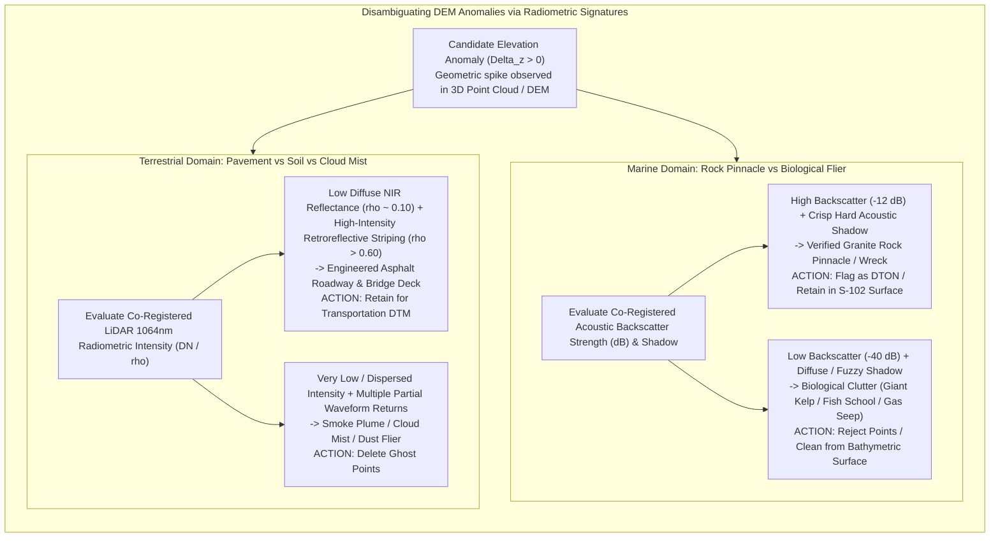

# Chapter 28: Acoustic Backscatter, LiDAR Intensity, and Substrate/Benthic Co-Products

*Why elevation and depth sensors never measure geometry alone—and how co-registered return amplitude disambiguates terrain surfaces and hazards.*

---

## 28.3 Disambiguating DEM Anomalies with Backscatter and Intensity

A common blind spot in elevation modeling is assuming that every geometric point $(x, y, z)$ returned by a sensor represents the true, solid surface of the Earth. In reality, sound and light scatter off biological organisms, rising gas flares, atmospheric water droplets, and transient obstacles.

When an analyst examines a raw point cloud or unverified DEM grid, geometry alone is ambiguous: a $3\text{-meter}$ vertical mound rising from the seafloor could be a lethal granite navigation pinnacle, or it could be a transient clump of giant bull kelp floating in the current. On land, a flat, level corridor could be an engineered asphalt highway, or it could be a smooth, unvegetated mudflat. **Co-registered backscatter and radiometric intensity provide the decisive physical evidence required to disambiguate true terrain from environmental artifacts.**

---

### 28.3.1 Marine Hydrography: Rock Pinnacles vs. Kelp, Fish, and Gas Plumes

In shallow coastal waters, automatic multibeam bottom-detection algorithms (whether amplitude peak detection or phase zero-crossing) frequently trigger on targets suspended in the water column:

#### 1. The Granite Pinnacle vs. Bull Kelp Bed Trap
* **The Geometric Dilemma:** In the coastal waters of the Pacific Northwest, Northern California, or New England, giant kelp (*Macrocystis pyrifera*) forms dense submarine forests anchored to the seabed. Gas-filled pneumatocysts cause kelp frills to float upward, forming dense organic mounds $2\text{–}10\text{ meters}$ above the seabed. To an automated gridding algorithm (such as CUBE or minimum-curvature splines), a kelp patch produces identical geometric sounding clusters to a sharp granite rock pinnacle.
* **The Backscatter Disambiguation:**
  * **Granite Rock:** Solid rock has an enormous acoustic impedance contrast against seawater ($Z_{\text{rock}} \approx 8.0 \times 10^6\text{ kg}\cdot\text{m}^{-2}\cdot\text{s}^{-1}$ vs. $Z_{\text{water}} \approx 1.5 \times 10^6$). At $300\text{ kHz}$, rock reflects an intense acoustic backscatter return of **$-10\text{ dB to }-15\text{ dB}$**, casting a sharp, pitch-black acoustic shadow across the seafloor directly behind it.
  * **Kelp Canopy:** Kelp tissue consists of over $90\%$ water, yielding an acoustic impedance nearly identical to seawater ($Z_{\text{kelp}} \approx 1.55 \times 10^6$). The return energy is extremely weak and diffuse (**$-35\text{ dB to }-50\text{ dB}$**), and the acoustic shadow behind the canopy is fuzzy, pale, and incomplete.
* *Operational Action:* If a hydrographer mistakenly flags a kelp bed as a rock, dredging funds are wasted attempting to blast non-existent bedrock. Conversely, if an automated filter deletes a real rock thinking it is kelp, a commercial vessel will ground. Co-registered backscatter analysis ensures verified hazards are preserved as IHO S-102 designated soundings while biological clutter is excised.

#### 2. Methane Gas Plumes and Hydrothermal Vents
In hydrocarbon-bearing basins and active volcanic margins, biogenic or thermogenic methane bubbles seep from the seabed:
* **The Acoustic Anomaly:** Rising bubble flares produce intense acoustic backscatter in the water column because the impedance contrast between gas and seawater is nearly $100\%$.
* **Geometric Corruption:** Multibeam bottom-detection algorithms lock onto the acoustic flare, generating false "chimneys" or "spires" in the bathymetry that appear to rise $50\text{ meters}$ above the seafloor.
* **Disambiguation:** Inspecting the raw **Water Column Imaging (WCI)** data and multi-frequency acoustic backscatter reveals that the feature lacks a solid base, has high phase variance across successive pings, and drifts horizontally with ocean currents. The bathymetric grid can be edited to restore the true flat seabed beneath the plume.

---

### 28.3.2 Terrestrial Remote Sensing: Pavement, Soil, and Atmospheric Ghost Points

In airborne and terrestrial LiDAR, radiometric intensity serves as an essential feature for automated bare-earth point classification and transportation asset extraction.

#### 1. Disambiguating Transportation Infrastructure from Bare Soil
* **The Feature Extraction Challenge:** Autonomous driving systems and municipal GIS programs need to extract curb lines, road edges, bridge decks, and pedestrian crossings directly from airborne LiDAR point clouds.
* **The Intensity Signature:**
  * **Asphalt Pavement:** Composed of bitumen and aggregate, asphalt strongly absorbs near-infrared radiation ($1064\text{ nm}$), exhibiting low normalized intensity ($\rho_{1064} \approx 0.08\text{–}0.12$).
  * **Thermoplastic Road Striping:** Highway paint contains retroreflective glass beads, generating blindingly high intensity returns ($\rho_{1064} > 0.60\text{–}0.85$).
  * **Bare Soil and Turf:** Agricultural loam and dry grass reflect moderate near-infrared energy ($\rho_{1064} \approx 0.25\text{–}0.40$).
* *The Result:* By thresholding points based on co-registered intensity, automated machine-learning classifiers (such as Random Forests or PointNet++) trace high-speed highway lane networks and detect asphalt degradation cracks directly from 3D geometry without requiring external optical photography.

#### 2. Filtering Atmospheric "Ghost Points" (Steam, Dust, and Cloud Fog)
* **The Geometric Pitfall:** When an airborne LiDAR flies over an industrial refinery cooling tower, an agricultural field being tilled, or low-lying morning ground fog, laser pulses reflect off suspended water droplets or dust particulates. These reflections appear in the raw point cloud as dense, chaotic clusters of points floating $10\text{–}100\text{ meters}$ above the ground ("ghost points").
* **Radiometric Disambiguation:**
  * Solid terrain returns high pulse energy concentrated in a single, narrow return waveform.
  * Water mist and dust plumes reflect tiny fractions of laser energy spread across wide, temporally dispersed waveforms, returning raw intensity values near the detector's minimum noise floor ($\text{DN} < 5$).
  * Automated pre-filtering pipelines discard low-intensity floating points before executing bare-earth TIN densification, preventing synthetic "flying hills" from corrupting the final bare-earth DTM.
