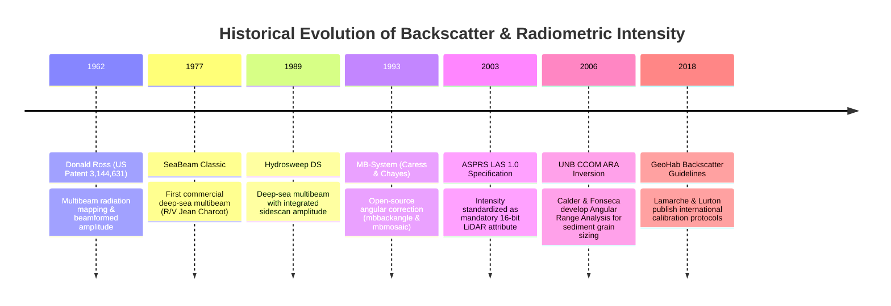

# Chapter 28: Acoustic Backscatter, LiDAR Intensity, and Substrate/Benthic Co-Products

*Why elevation and depth sensors never measure geometry alone—and how co-registered return amplitude disambiguates terrain surfaces and hazards.*

---

## 28.4 Historical Evolution: From Analog Echograms to Calibrated Radiometry

The co-registration of elevation geometry with return amplitude is the product of a six-decade evolution in sonar physics, marine geophysics, and laser altimetry. Initially treated as an uncalibrated qualitative byproduct ("sidescan-like shading"), backscatter and intensity have matured into calibrated, quantitative radiometric measurements governed by rigorous international standards.

---

### 28.4.1 The Genesis of Multibeam Amplitude: 1962 to 1977

#### 1962: US Patent 3,144,631 (Donald Ross and General Instrument Corp.)
On August 11, 1964, the US Patent Office granted Patent US3144631A (filed December 1962 by Donald G. Ross, assigned to General Instrument Corporation) for a "Multibeam Radiation Mapping System."
* Ross's design detailed the cross-fan Mills Cross acoustic array that forms narrow directional beams across a wide swath.
* Crucially, the patent recognized that by sampling the peak envelope voltage of each receive beam across time, the system could simultaneously record depth coordinates and seafloor acoustic reflectivity, establishing the theoretical birth of swath bathymetric backscatter.

#### 1977: The SeaBeam Classic Breakthrough
Developed by General Instrument Corporation for the US Navy and French oceanographic agencies, the **SeaBeam Classic** ($12\text{ kHz}$, 16 beams spanning a $45^\circ$ swath) was installed aboard the French research vessel *Jean Charcot* in 1977 and the Scripps Institution of Oceanography ship R/V *Thomas Washington* in 1981.
* While SeaBeam was initially deployed to draw real-time bathymetric contour charts, marine geophysicists noticed that recording the raw beam voltages revealed basaltic lava flows, sediment ponds, and manganese nodule pavements on the East Pacific Rise that were invisible in the depth contours alone.

---

### 28.4.2 The Open-Source Software Revolution: 1993 MB-System

In the early 1990s, deep-sea research was restricted by proprietary, closed-source manufacturer software that discarded raw amplitude records.

#### 1993: MB-System (David Caress and Dale Chayes)
At Lamont-Doherty Earth Observatory (and later MBARI), David W. Caress and Dale N. Chayes released **MB-System**:
* Operating on open Unix workstations, MB-System provided the oceanographic community with the first public toolchain for co-processing multibeam bathymetry and backscatter.
* **`mbbackangle`:** Analyzed the empirical angular response curve of the seabed across grazing angles, fitting regional normalization tables to eliminate the blinding specular peak at nadir.
* **`mbmosaic`:** Pioneered spatial gridding that projected angular-corrected acoustic backscatter into seamless, georeferenced GeoTIFF mosaics co-registered with swath bathymetry. For three decades, MB-System has served as the open-source backbone of academic ocean floor exploration.

---

### 28.4.3 Standardization in Terrestrial LiDAR: 2003 ASPRS LAS 1.0

Prior to 2003, commercial airborne LiDAR manufacturers (Optech, Leica, Riegl) stored point clouds in proprietary binary formats with non-standardized amplitude scales (some 8-bit, some 12-bit, some floating-point).

#### 2003: The ASPRS LAS 1.0 Standard
The American Society for Photogrammetry and Remote Sensing (ASPRS) released the **LAS 1.0 Specification**:
* Established a standardized, cross-platform binary format for 3D point records.
* Formally codified the **`Intensity` attribute** as a mandatory **16-bit unsigned integer ($[0, 65535]$)** field for every laser pulse return.
* By guaranteeing that every point cloud carried integer return amplitude alongside spatial coordinates $(x, y, z)$, LAS 1.0 enabled the rapid development of automated machine-learning algorithms for bare-earth filtering, tree canopy segmentation, and pavement classification.

---

### 28.4.4 Quantitative Acoustic Inversion: 2006 to 2018

For decades, backscatter was processed as a visual picture ("sidescan imagery") using ad-hoc contrast adjustments, preventing quantitative comparison between different survey ships or sonar models.

#### 2006: Angular Range Analysis (ARA) at UNB CCOM
At the Center for Coastal and Ocean Mapping (CCOM/JHC) at the University of New Hampshire, Luciano Fonseca and Brian Calder developed **Angular Range Analysis (ARA)**:
* Rather than flattening angular variations as unwanted noise, ARA treated the angular response curve as a rich physical signal.
* Inverting observed curves against the Jackson acoustic scattering model, ARA automated the quantitative extraction of mean sediment grain size ($\phi$), porosity, and seafloor roughness, leading directly to commercial tools like QPS FMGT (Fledermaus Geocoder Toolbox).

#### 2018: The GeoHab Backscatter Working Group Guidelines
Under the international Marine Geological and Biological Habitat Mapping (GeoHab) consortium, an international committee of oceanographers and acousticians led by Geoffroy Lamarche and Xavier Lurton published:
* *Recommendations for Improved and Coherent Acquisition and Processing of Backscatter Data from Seafloor-Mapping Sonars* (Lamarche & Lurton 2018).
* Codified global calibration protocols: documenting transducer source levels, measuring receiver gains, accounting for seawater absorption profiles, and standardizing the mathematical removal of DEM-derived slope footprint distortions. The GeoHab guidelines transitioned acoustic backscatter from subjective art into a metrically calibrated geophysical science.
