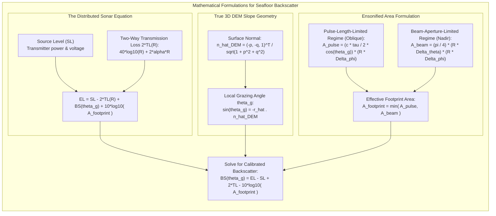

# Chapter 28: Acoustic Backscatter, LiDAR Intensity, and Substrate/Benthic Co-Products

*Why elevation and depth sensors never measure geometry alone—and how co-registered return amplitude disambiguates terrain surfaces and hazards.*

---

## 28.5 Mathematical Foundations of Acoustic Backscatter and Radiometric Correction

Transforming raw acoustic receiver voltages into physical seafloor backscattering strength requires solving the sonar equation for distributed surface targets. This section derives the complete mathematical formulation linking sensor voltage, spherical wave transmission loss, true 3D DEM grazing angles, and slope-projected footprint areas.

---

### 28.5.1 The Active Sonar Equation for Distributed Targets

For a continuous, distributed interface like the seafloor, acoustic scattering is distributed across an extended surface patch rather than concentrated in a discrete point reflector.

The acoustic power received at the transducer array (expressed as **Echo Level $\text{EL}$** in $\text{dB re } 1\,\mu\text{Pa}$) is governed by the active sonar equation:

$$\text{EL} = \text{SL} - 2\text{TL}(R) + \text{TS}_{\text{area}}$$
where:
* $\text{SL}$: Transmit Source Level ($\text{dB re } 1\,\mu\text{Pa at } 1\text{ meter}$).
* $\text{TL}(R)$: One-way transmission loss over slant range $R$ ($\text{dB}$).
* $\text{TS}_{\text{area}}$: Target Strength of the distributed ensonified area.

#### 1. Target Strength Decomposition
For a distributed surface, target strength is the product of the intrinsic **Bottom Backscattering Strength per unit area ($S_b$ or $BS$)** and the physical **ensonified footprint area ($A_{\text{footprint}}$)**:

$$\text{TS}_{\text{area}} = 10 \log_{10}\left( \int_{A_{\text{footprint}}} \sigma_b \, dA \right) \approx BS(\theta_g) + 10 \log_{10} A_{\text{footprint}}(\theta_g, R)$$
where $\sigma_b$ is the dimensionless differential scattering cross-section per unit solid angle per unit area, and $BS(\theta_g) = 10\log_{10}\sigma_b$ (expressed in $\text{dB re } 1\text{ m}^2/\text{m}^2$).

#### 2. Two-Way Transmission Loss
Accounting for spherical wave spreading and seawater absorption over two-way slant range $2R$:
$$2\text{TL}(R) = 40 \log_{10}(R) + 2 \cdot \alpha(f, T, S, P) \cdot R$$
where $\alpha$ is the absorption coefficient in $\text{dB/meter}$.

Substituting into the sonar equation yields:
$$\text{EL} = \text{SL} - \big( 40 \log_{10} R + 2 \alpha R \big) + BS(\theta_g) + 10 \log_{10} A_{\text{footprint}}(\theta_g, R)$$

---

### 28.5.2 Deriving the True Local Grazing Angle from the 3D DEM

Backscatter strength $BS(\theta_g)$ depends heavily on the angle between the incoming acoustic ray and the tangent plane of the seabed.

#### 1. Coordinate Definitions and Surface Normal
Let the seafloor elevation model be defined on a grid $z = f(x, y)$ in a Cartesian coordinate system where $+z$ points Upward.

The spatial surface gradients are:
$$p = \frac{\partial z}{\partial x}, \quad q = \frac{\partial z}{\partial y}$$

The outward-pointing unit normal vector derived directly from the DEM is:
$$\hat{\mathbf{n}}_{\text{DEM}} = \frac{1}{\sqrt{1 + p^2 + q^2}} \begin{pmatrix} -p \\ -q \\ 1 \end{pmatrix}$$

#### 2. Ray Vector and Grazing Angle Calculation
Let $\mathbf{x}_{\text{sensor}} = (x_s, y_s, z_s)^T$ be the physical 3D coordinate of the sonar transducer at ping transmission, and let $\mathbf{x}_{\text{seafloor}} = (x_b, y_b, z_b)^T$ be the sounding position on the seafloor.

The slant range vector is:
$$\mathbf{r} = \mathbf{x}_{\text{seafloor}} - \mathbf{x}_{\text{sensor}}, \quad R = \|\mathbf{r}\|$$
The incident ray unit vector pointing *toward* the seafloor is:
$$\hat{\mathbf{r}} = \frac{\mathbf{r}}{R}$$

The angle of incidence $\theta_i$ is the angle between the incoming ray and the inward surface normal ($-\hat{\mathbf{n}}_{\text{DEM}}$):
$$\cos\theta_i = -\hat{\mathbf{r}} \cdot \hat{\mathbf{n}}_{\text{DEM}}$$

The **local grazing angle $\theta_g$** is the complementary angle measured upward from the tangent plane to the ray:
$$\theta_g = 90^\circ - \theta_i \implies \sin\theta_g = \cos\theta_i = -\hat{\mathbf{r}} \cdot \hat{\mathbf{n}}_{\text{DEM}}$$

$$\theta_g = \arcsin\left( -\hat{\mathbf{r}} \cdot \hat{\mathbf{n}}_{\text{DEM}} \right)$$

*If the seafloor is assumed horizontal ($\hat{\mathbf{n}} = (0, 0, 1)^T$), then $\sin\theta_g = -r_z/R = \cos\phi_{\text{launch}}$. Any local slope angle $\beta$ shifts the true grazing angle by $\Delta \theta_g = \beta$, inducing errors exceeding $15\text{ dB}$ in backscatter strength if uncorrected!*

---

### 28.5.3 Ensonified Footprint Area ($A_{\text{footprint}}$)

The physical area of the seafloor contributing acoustic energy to a single time sample depends on whether the echo is bounded by the acoustic pulse duration or by the beamwidth aperture.

#### 1. Pulse-Length-Limited Regime (Oblique Angles)
At oblique angles ($\theta_g \ll 90^\circ$), the transmit pulse of duration $\tau$ ($seconds$) projects across the seabed. The instantaneous radial length ensonified on the slope is:
$$L_{\text{across}} = \frac{c \tau}{2 \cos\theta_g}$$
where $c$ is the sound speed at the seabed.

The along-track width of the footprint is governed by the two-way along-track beamwidth $\Delta \phi_{\text{along}}$ ($\text{radians}$):
$$L_{\text{along}} = R \cdot \Delta \phi_{\text{along}}$$

The ensonified area in the pulse-length-limited regime is:
$$A_{\text{pulse}}(\theta_g, R) = L_{\text{across}} \cdot L_{\text{along}} = \frac{c \tau R \Delta \phi_{\text{along}}}{2 \cos\theta_g}$$

#### 2. Beam-Aperture-Limited Regime (Near Nadir)
As the ray approaches normal incidence ($\theta_g \to 90^\circ$), $\cos\theta_g \to 0$, causing $A_{\text{pulse}}$ to diverge toward infinity. In reality, the footprint cannot exceed the geometric ellipse bounded by the beamwidth apertures:
$$L_{\text{across, beam}} = R \cdot \Delta \theta_{\text{across}}$$
$$L_{\text{along, beam}} = R \cdot \Delta \phi_{\text{along}}$$

The beam-limited footprint area is an ellipse:
$$A_{\text{beam}}(R) = \frac{\pi}{4} \big( R \cdot \Delta \theta_{\text{across}} \big) \big( R \cdot \Delta \phi_{\text{along}} \big)$$

#### 3. Continuous Effective Area Formulation
In robust processing algorithms (such as the Lurton & Lamarche 2015 formulation), the effective footprint area is evaluated as the harmonic combination:

$$A_{\text{footprint}}(\theta_g, R) = \frac{A_{\text{pulse}} \cdot A_{\text{beam}}}{\sqrt{A_{\text{pulse}}^2 + A_{\text{beam}}^2}} = \frac{\frac{c \tau R \Delta \phi}{2\cos\theta_g}}{\sqrt{1 + \left( \frac{2 R \Delta \theta \cos\theta_g}{\pi c \tau} \right)^2}}$$
This closed-form formulation transitions smoothly from the beam-limited specular disk at nadir to the pulse-limited strip at outer beams without numerical singularities.

---

### 28.5.4 Inverting for Calibrated Seafloor Backscattering Strength

Solving the active sonar equation for the true bottom backscattering strength $BS(\theta_g)$:

$$BS(\theta_g) = \text{EL} - \text{SL} + 40 \log_{10}(R) + 2 \alpha R - 10 \log_{10} A_{\text{footprint}}(\theta_g, R)$$

By explicitly evaluating $R$, $\hat{\mathbf{r}}$, $\hat{\mathbf{n}}_{\text{DEM}}$, and $\theta_g$ at every point on the seabed using the co-registered 3D DEM, all sensor transmission losses, footprint geometry distortions, and topographic slope shadings are eliminated. The resulting $BS(\theta_g)$ surface represents an intrinsic acoustic property of the seabed substrate, suitable for objective geoscientific and biological habitat classification.
