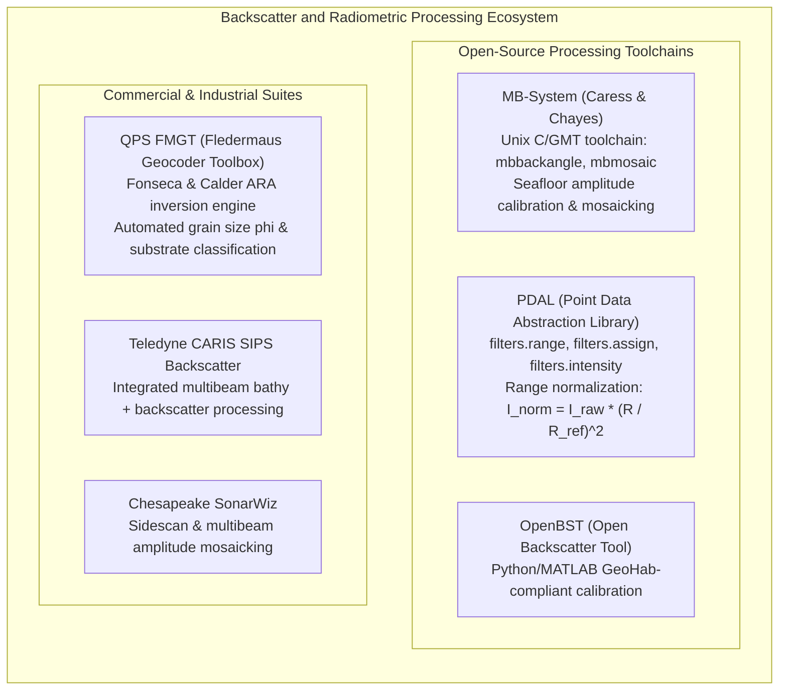

# Chapter 28: Acoustic Backscatter, LiDAR Intensity, and Substrate/Benthic Co-Products

*Why elevation and depth sensors never measure geometry alone—and how co-registered return amplitude disambiguates terrain surfaces and hazards.*

---

## 28.6 Software Ecosystem

Processing, calibrating, and inverting co-registered backscatter and radiometric intensity requires specialized software pipelines that integrate the 3D surface model directly into the radiometric signal path. This section reviews the open-source and commercial toolchains used in hydrographic acoustics and laser scanning.



---

### 28.6.1 Open-Source Processing Toolchains

#### 1. MB-System (`mbbackangle` and `mbmosaic`)
Developed by David Caress and Dale Chayes, **MB-System** is the primary open-source toolchain for academic marine geophysics:
* **`mbbackangle`:** Ingests raw multibeam sonar files (e.g., Kongsberg `.all`/`.kmall`, Reson `.s7k`, GSF), pairs depth soundings with beam amplitude, and extracts the empirical average backscatter as a function of grazing angle $\theta_g$. It fits an angular compensation curve to flatten the specular nadir peak.
* **`mbmosaic`:** Projects the angular-corrected beam amplitudes into a regular geographic grid, applying priority weighting and footprint-size antialiasing.

```bash
#!/usr/bin/env bash
# MB-System Command-Line Sequence: Processing Multibeam Backscatter
set -euo pipefail

SWATH_LIST="survey_files.datalist"

# 1. Compute empirical backscatter vs. grazing angle table across all lines
mbbackangle -I ${SWATH_LIST} -O backscatter_table.ang -V

# 2. Compile seamless, angular-corrected backscatter mosaic at 2m resolution
# -R: Bounding box (West/East/South/North)
# -E: Grid cell resolution (2.0 meters)
# -A: Apply angular correction table
# -G: Output NetCDF/GeoTIFF format
mbmosaic -I ${SWATH_LIST} \
         -O calibrated_backscatter_mosaic \
         -R -122.50/-122.35/37.75/37.85 \
         -E 2.0/2.0 \
         -A backscatter_table.ang \
         -G 1 \
         -V
```

#### 2. PDAL (Point Data Abstraction Library): Radiometric Normalization
In terrestrial LiDAR, raw intensity decays with the square of slant range $R$. If an aircraft changes flight altitude from $1,000\text{ m}$ to $1,500\text{ m}$, the same asphalt road appears less than half as bright. 

**PDAL** provides pipeline filters to normalize raw intensity to a standard reference range $R_{\text{ref}}$:
$$I_{\text{normalized}} = I_{\text{raw}} \cdot \left( \frac{R}{R_{\text{ref}}} \right)^2$$

```json
{
  "pipeline": [
    "input_raw_flightline.laz",
    {
      "type": "filters.range",
      "limits": "Classification![7:7]"
    },
    {
      "type": "filters.python",
      "script": "normalize_intensity.py",
      "function": "apply_range_correction",
      "module": "pdal_radiometry"
    },
    {
      "type": "writers.las",
      "filename": "output_normalized_intensity.laz",
      "forward": "all"
    }
  ]
}
```

```python
# normalize_intensity.py (PDAL Python Filter)
import numpy as np

def apply_range_correction(ins, outs):
    """
    Normalizes LiDAR intensity using sensor trajectory slant range.
    I_norm = I_raw * (R / R_ref)^2
    """
    R_ref = 1000.0  # Reference flight altitude in meters
    
    # Extract coordinates and raw intensity
    z = ins['Z']
    raw_intensity = ins['Intensity']
    
    # Estimate slant range assuming flight ceiling at H = 1500m
    H_aircraft = 1500.0
    slant_range = H_aircraft - z
    
    # Apply square-law range normalization
    norm_factor = (slant_range / R_ref) ** 2
    corrected_intensity = raw_intensity * norm_factor
    
    # Clip to 16-bit integer range [0, 65535]
    outs['Intensity'] = np.clip(corrected_intensity, 0, 65535).astype(np.uint16)
    return True
```

#### 3. OpenBST (Open Backscatter Tool)
Maintained by marine research consortia (IFREMER, NIWA), **OpenBST** implements the GeoHab 2018 calibration standards in Python and MATLAB. It explicitly extracts local 3D surface normals from a companion bathymetric DEM to compute true slope-corrected footprint areas and Jackson scattering model inversions.

---

### 28.6.2 Commercial Suites: FMGT and CARIS SIPS

#### 1. QPS FMGT (Fledermaus Geocoder Toolbox)
The gold standard commercial software for acoustic backscatter processing, built upon the **Geocoder (ARA)** technology developed by Luciano Fonseca and Brian Calder at UNB CCOM:
* Automatically extracts vessel trajectory and sensor beam geometry from raw sonar vendor formats.
* Ingests the co-registered Bathymetric Attributed Grid (BAG) or CUBE surface to calculate the true 3D surface normal $\hat{\mathbf{n}}_{\text{DEM}}$ for every acoustic sounding.
* Computes **Angular Range Analysis (ARA)** windows, fitting observed angular response curves to the Jackson seafloor model to automatically output georeferenced GeoTIFFs of **Mean Grain Size ($\phi$)**, **Acoustic Impedance ($Z$)**, and **Benthic Habitat Classification**.

#### 2. Teledyne CARIS SIPS Backscatter
Integrated directly within the CARIS HIPS and SIPS hydrographic processing platform:
* Provides seamless switching between bathymetric point-cloud cleaning and acoustic backscatter mosaicking.
* Implements the **SIPS Engine** and **BathyDataBASE** modules to ensure that designated sounding overrides (identifying hazardous rock pinnacles) immediately cross-reference corresponding high-backscatter anomalies in the amplitude mosaic.
