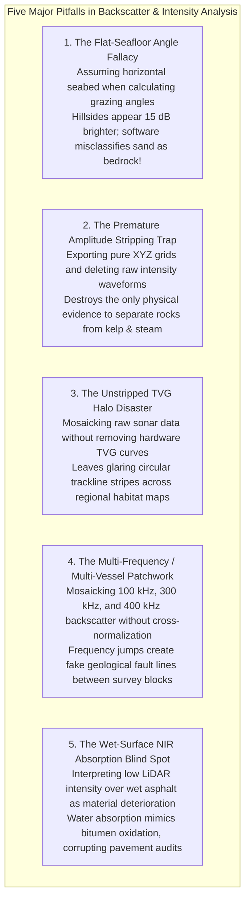

# Chapter 28: Acoustic Backscatter, LiDAR Intensity, and Substrate/Benthic Co-Products

*Why elevation and depth sensors never measure geometry alone—and how co-registered return amplitude disambiguates terrain surfaces and hazards.*

---

## 28.7 Common Pitfalls and Key Takeaways

Co-processing 3D geometric elevation with 2D radiometric backscatter requires continuous physical rigor. When analysts treat backscatter as an isolated image or process elevation without consulting amplitude, they introduce false topographic shading, confuse biological clutter with navigation hazards, and misclassify geological substrates.

---

### 28.7.1 Common Pitfalls in Backscatter and Intensity Processing

#### 1. The Flat-Seafloor Grazing Angle Fallacy
* **The Failure Mode:** A hydrographic processor runs automated backscatter normalization software, leaving the option "Use Bathymetry for Slope Correction" unchecked (defaulting to a flat horizontal seafloor assumption $\hat{\mathbf{n}} = (0, 0, 1)^T$).
* **Physical Reality:** Backscatter strength is an exponential function of local grazing angle $\theta_g$. When a seafloor feature slopes toward the incoming acoustic ray, the physical grazing angle is steepened:
  $$\sin\theta_g = -\hat{\mathbf{r}} \cdot \hat{\mathbf{n}}_{\text{DEM}}$$
* **Forensic Consequence:** The upslope flank reflects significantly more acoustic energy than an equivalent flat seafloor. Because the software assumes the seabed is flat, it fails to normalize for this slope effect. The hillside appears **$+10\text{ to }+18\text{ dB}$ brighter** in the final mosaic, while the backside slope appears dark and shadowed. An automated habitat classifier identifies the bright hillside as solid granite bedrock and the dark back-slope as fine mud, even though the entire hill is composed of uniform medium sand.
* **Remedy:** Always couple backscatter processing directly to the high-resolution 3D bathymetric DEM. Never normalize backscatter using flat-seafloor approximations in rugged terrain.

#### 2. The Premature Amplitude Stripping Trap
* **The Failure Mode:** To save cloud storage or simplify database schemas, a GIS technician exports a multi-terabyte LiDAR or multibeam survey as a lightweight ASCII `.xyz` point file or single-band elevation raster, permanently deleting raw LAS intensity attributes and acoustic snippet waveforms.
* **Forensic Consequence:** Months later, during quality control or dredging planning, a reviewer spots an isolated $3.5\text{-meter}$ elevation pinnacle in a commercial harbor channel. Without co-registered backscatter amplitude or waveform data, it is impossible to determine whether the spike is an authentic, hazardous granite rock (requiring immediate navigation warnings and millions in blast dredging) or a transient clump of floating bull kelp or fish schools. The survey ship must be re-mobilized at immense taxpayer expense to re-survey the target.
* **Remedy:** Treat backscatter and intensity as permanent, non-negotiable co-products. Always archive raw formats (LAS/LAZ with 16-bit Intensity; Kongsberg `.kmall` or GSF with full snippet backscatter) alongside derived elevation models.

#### 3. The Unstripped Hardware TVG Halo Disaster
* **The Failure Mode:** An ocean mapping team mosaics backscatter lines collected over deep water without mathematically stripping the sonar's internal hardware Time-Varying Gain (TVG) curve.
* **Physical Reality:** Modern multibeam sonars apply an analog or digital TVG curve ($X \log R + 2\alpha R$) in real time to prevent receiver saturation. However, the manufacturer's firmware typically uses hardcoded, static estimates of sound absorption $\alpha_0$ and spreading factor $X = 30$ or $40$.
* **Forensic Consequence:** If the real ocean environment has different salinity or temperature profiles, the hardware TVG under-compensates or over-compensates as a function of range. When consecutive survey tracks are mosaicked, prominent circular "halo" stripes appear centered under every ship trackline. Geologists routinely misinterpret these trackline artifacts as circular sedimentary bedforms or volcanic calderas.
* **Remedy:** Invert and subtract the manufacturer's exact hardware TVG curve before re-applying true physical transmission loss based on calibrated CTD sound speed and absorption profiles.

#### 4. The Multi-Frequency / Multi-Vessel Patchwork Seam
* **The Failure Mode:** A regional marine habitat mapping consortium compiles a multi-survey backscatter mosaic across an estuary, merging data collected by three different research vessels operating at $100\text{ kHz}$, $300\text{ kHz}$, and $400\text{ kHz}$.
* **Physical Reality:** Acoustic backscattering strength is strongly frequency-dependent. A medium sand substrate exhibits significantly higher backscatter at $400\text{ kHz}$ (where sand grains approach the acoustic wavelength) than at $100\text{ kHz}$.
* **Forensic Consequence:** At the boundary between two survey blocks, the backscatter intensity jumps abruptly by $6\text{–}10\text{ dB}$. The mosaic displays sharp, linear boundaries that look identical to active structural faults or major sediment facies changes.
* **Remedy:** When combining multi-frequency or multi-vessel backscatter, perform inter-frequency cross-calibration using overlapping survey lines over homogeneous reference seabeds, or map each acoustic frequency into a distinct spectral band.

#### 5. The Wet-Surface NIR Absorption Blind Spot
* **The Failure Mode:** A municipal civil engineering department runs automated pavement condition assessments using airborne LiDAR intensity, flagging all road segments with abnormally low near-infrared ($1064\text{ nm}$) intensity as "severely oxidized and degraded asphalt."
* **Physical Reality:** Liquid water possesses strong absorption bands in the near-infrared spectrum. A thin film of standing water or recent rain on fresh, high-quality asphalt absorbs almost $100\%$ of incident $1064\text{-nm}$ photons, dropping reflected intensity to near zero.
* **Forensic Consequence:** Perfectly sound roads that were slightly damp during the morning LiDAR flight are falsely flagged for emergency resurfacing, misallocating millions in municipal highway maintenance budgets.
* **Remedy:** Cross-reference LiDAR intensity with flight-day weather logs, road weather information stations (RWIS), and multi-spectral infrared bands to separate surface water film absorption from true asphalt bitumen degradation.

---

### 28.7.2 Key Takeaways for Practitioners

1. **Geometry and Radiometry Are Inseparable:** You cannot calibrate backscatter without the 3D DEM (for grazing angle and slope-corrected footprint area), and you cannot reliably audit a DEM without backscatter (for material verification).
2. **Always Use 3D Surface Normals for Radiometric Correction:** Never calculate grazing angles or footprint areas assuming a flat horizontal seabed; true DEM surface normals are mandatory to prevent false topographic shading.
3. **Backscatter Disambiguates True Hazards from Clutter:** Solid rock hazards produce intense returns ($-10\text{ to }-15\text{ dB}$) with hard acoustic shadows; kelp beds, fish schools, and gas flares produce weak, diffuse returns ($-35\text{ to }-50\text{ dB}$) with fuzzy shadows.
4. **Never Discard Raw Amplitude:** Archive 16-bit LiDAR intensity and sonar snippet waveforms alongside final spatial grids; stripping amplitude destroys the data's long-term forensic and environmental value.
5. **Calibrate Against Physical Models:** Transition from subjective "sidescan pictures" to quantitative substrate mapping by inverting angular response curves (ARA) against the Jackson / APL-UW seafloor scattering model.
