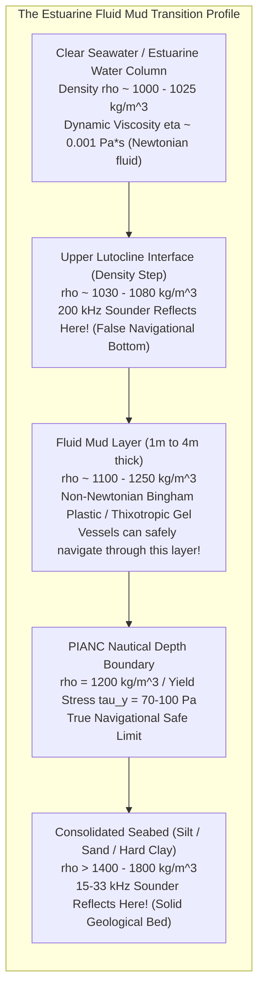
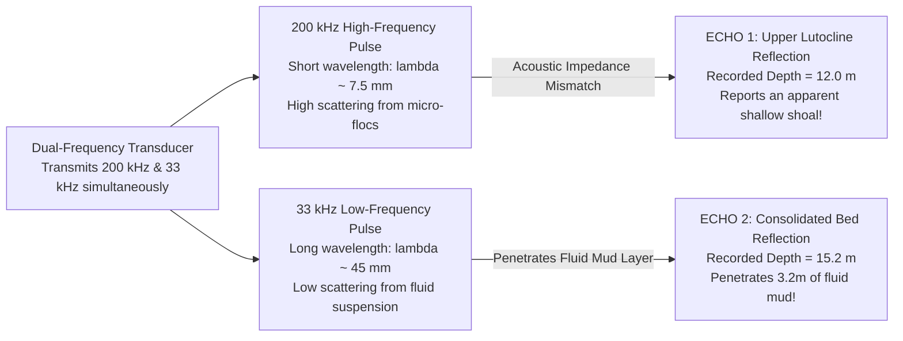

# Chapter 29: Fluid Mud, "Nautical Depth," and Multi-Horizon Subsurface DEMs

*When the seabed or ground surface is not a sharp boundary: modeling rheologic transitions, fluid mud, and stacked subsurface horizons.*

---

## 29.1 The Fluid Mud Problem and Dual-Frequency Echosounding

Almost all digital elevation models rest upon an unstated mathematical axiom: that the surface of the Earth is a discrete, two-dimensional geometric boundary separating two distinct states of matter (air above soil, or water above rock). In the real world, this axiom breaks down. Across the world's major ports, estuaries, and deltaic rivers, the boundary between water and earth is not a surface; it is a **continuous, multi-meter vertical transition zone of fluid mud**.

When a survey vessel deploys a standard single-frequency echosounder over fluid mud, the recorded elevation is an artifact of the acoustic frequency chosen by the surveyor. A high-frequency sonar reports an impassable shallow shoal, while a low-frequency sonar reports a deep, safe navigation channel. Understanding the physics of dual-frequency sounding is essential to prevent tens of millions of dollars in unnecessary maintenance dredging.

---

### 29.1.1 The Genesis of Estuarine Fluid Mud

In high-turbidity coastal environments—such as the Port of Rotterdam (Europort), the Mississippi River Southwest Pass, the Amazon mouth, the Yangtze estuary, the Scheldt, the Loire, and the Guiana coastline—fine cohesive clay minerals (illite, kaolinite, smectite) interact with saltwater electrolytes.

#### 1. Cohesive Flocculation and Estuarine Turbidity Maxima (ETM)
As freshwater river plumes carrying suspended sediment enter the saline estuary, the high ionic strength of seawater collapses the repulsive electrostatic double layer surrounding clay platelets. The platelets aggregate into porous, low-density clumps called **flocs**. 

In the Estuarine Turbidity Maximum (ETM)—where the landward-flowing saline density wedge meets the seaward river discharge—flocs settle rapidly at slack tide, accumulating in dredged harbor basins at rates exceeding $0.5\text{–}1.0\text{ meters per month}$.

#### 2. The Multi-Layer Density Profile
The resulting water column does not terminate abruptly at a solid bed; instead, it forms a continuous vertical density gradient $\rho(z)$:
1. **The Water Column ($\rho \approx 1000\text{–}1025\text{ kg/m}^3$):** Clear or moderately turbid water with standard Newtonian fluid viscosity ($\mu \approx 10^{-3}\text{ Pa}\cdot\text{s}$).
2. **The Upper Lutocline ($\rho \approx 1030\text{–}1080\text{ kg/m}^3$):** A sharp vertical gradient in suspended sediment concentration (from milligrams per liter to tens of grams per liter).
3. **Fluid Mud ($\rho \approx 1100\text{–}1300\text{ kg/m}^3$):** A concentrated suspension of flocs. At this concentration, the flocs form a continuous, space-filling structural network exhibiting **non-Newtonian, thixotropic, and Bingham plastic behavior**. Under low shear, it behaves like a weak gelatinous solid; under high shear (such as a ship's propeller or hull passage), it liquefies and flows like a viscous liquid.
4. **Consolidated Bed ($\rho > 1400\text{–}1800\text{ kg/m}^3$):** Dewatered, mechanically consolidated clay, silt, or sand possessing true geotechnical shear strength.

---

### 29.1.2 Dual-Frequency Echosounding: The Frequency-Depth Split

To map bathymetry in fluid mud ports, hydrographers historically deployed dual-frequency single-beam echosounders (typically transmitting $200\text{–}210\text{ kHz}$ and $15\text{–}33\text{ kHz}$ simultaneously through a single transducer).

#### 1. High-Frequency Acoustics ($200\text{–}210\text{ kHz}$)
* At $200\text{ kHz}$, the acoustic wavelength in water is very short:
  $$\lambda = \frac{c}{f} = \frac{1500\text{ m/s}}{200,000\text{ Hz}} = 7.5\text{ millimeters}$$
* Because the wavelength is comparable to the size of large aggregated sediment flocs and the sharp density jump at the upper lutocline creates a sudden step in bulk density ($\Delta \rho \approx 50\text{ kg/m}^3$), the acoustic impedance contrast ($Z = \rho c$) is sufficient to generate a coherent reflection.
* The $200\text{-kHz}$ sounder detects the **top of the fluid mud (the lutocline)**, recording a depth of, for example, **$12.0\text{ meters}$**.

#### 2. Low-Frequency Acoustics ($15\text{–}33\text{ kHz}$)
* At $33\text{ kHz}$, the acoustic wavelength is six times longer:
  $$\lambda = \frac{1500\text{ m/s}}{33,000\text{ Hz}} \approx 45.5\text{ millimeters}$$
* The long wavelength passes straight through the diffuse flocculated suspension with negligible scattering or attenuation. The wave propagates through the fluid mud layer until it encounters the consolidated seabed ($\rho > 1400\text{ kg/m}^3$), where a massive acoustic impedance step reflects the pulse.
* The $33\text{-kHz}$ sounder detects the **hard, consolidated bed**, recording a depth of, for example, **$15.2\text{ meters}$**.

---

### 29.1.3 The Economic Dilemma: Millions Wasted in Unnecessary Dredging

The $3.2\text{-meter}$ discrepancy between the $200\text{-kHz}$ and $33\text{-kHz}$ acoustic horizons creates an immense regulatory and economic crisis:

* **The Traditional Charting Trap:** Under legacy hydrographic guidelines, if a national hydrographic office charts the $200\text{-kHz}$ return, the nautical chart indicates a depth of only $12.0\text{ meters}$. A deep-draft container ship drawing $13.5\text{ meters}$ of draft is legally barred from entering the port.
* **The Unnecessary Dredging Cost:** To restore the charted depth to $14\text{ meters}$, port authorities contract suction dredgers to pump out millions of cubic meters of fluid mud at costs of $\$5\text{–}\$20\text{ per cubic meter}$. Within weeks of dredging, estuarine tidal currents re-deposit fluid mud back to its equilibrium thickness, creating an endless, multimillion-dollar dredging treadmill.
* **The Maritime Engineering Reality:** Extensive full-scale vessel trials in Rotterdam, Antwerp, and Zeebrugge demonstrated that **large commercial vessels can safely sail through low-density fluid mud**! Because fluid mud has negligible shear strength, a ship's steel hull easily shears through the fluid mud layer with only minor, manageable changes in rudder response and propeller RPM.

This physical reality forced the international maritime community to redefine the concept of the seafloor, abandoning pure acoustic reflection in favor of **rheological "Nautical Depth"**.
