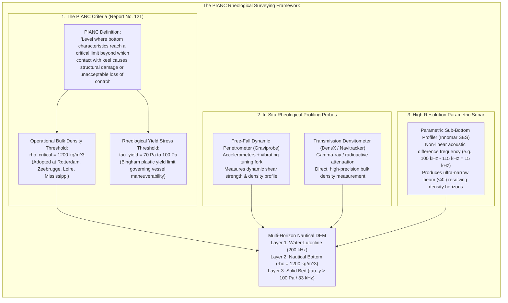

# Chapter 29: Fluid Mud, "Nautical Depth," and Multi-Horizon Subsurface DEMs

*When the seabed or ground surface is not a sharp boundary: modeling rheologic transitions, fluid mud, and stacked subsurface horizons.*

---

## 29.2 PIANC "Nautical Depth" and Rheological Surveying

Because acoustic echosounders reflect off density steps that bear no correlation to structural navigation hazards, the global maritime industry abandoned pure acoustic bathymetry in fluid mud ports. Under the auspices of the World Association for Waterborne Transport Infrastructure (PIANC), port authorities adopted the concept of **Nautical Depth**.

Nautical Depth shifts the definition of the seafloor from an acoustic reflection horizon to a **rheological property of the sediment**. Mapping this navigable boundary requires specialized in-situ penetrometers, nuclear and resonant densitometers, and non-linear parametric sub-bottom acoustic profilers.

---

### 29.2.1 The PIANC Definition and Physical Criteria

In 1997, a joint working group of PIANC and the International Association of Ports and Harbors (IAPH)—later refined in **PIANC Report No. 121 (2014)**, *Harbour Approach Channels: Design Guidelines*—formally codified the definition of **Nautical Depth**:

> *"The nautical depth is the level where physical characteristics of the bottom reach a critical limit beyond which contact with a ship's keel causes either damage or unacceptable effects on controllability and maneuverability."*

#### 1. The Bulk Density Criterion ($\rho_{\text{critical}}$)
Because measuring fluid mud viscosity from a moving survey boat was historically difficult, port authorities adopted **bulk density** ($\rho$) as an operational proxy for nautical depth:
* Extensive naval hydrodynamic tow-tank tests (conducted at Flanders Hydraulics Research and MARIN) demonstrated that when bulk density is below **$\rho = 1200\text{ kg/m}^3$** (specific gravity $1.20$), the sediment exhibits negligible yield strength.
* A ship's hull sailing through mud with $\rho \le 1200\text{ kg/m}^3$ experiences a slight increase in hydrodynamic resistance (requiring $5\text{–}10\%$ more propeller torque) and a minor squat alteration, but suffers **zero structural damage** and retains full steering maneuverability.
* Consequently, major estuarine ports (including Rotterdam, Zeebrugge, Antwerp, Dunkirk, and Bordeaux) legally defined their official nautical charts and channel maintenance boundaries at the **$\rho = 1200\text{ kg/m}^3$ isopycnic (equal-density) horizon**.

#### 2. The Rheological Yield Stress Criterion ($\tau_y$)
While density is a convenient proxy, the true physical resistance experienced by a vessel's hull is governed by sediment **rheology** (fluid mechanics and deformation):
* Fluid mud behaves as a **Bingham plastic** or **Herschel-Bulkley fluid**:
  $$\tau = \tau_y + \mu_p \left( \frac{du}{dz} \right)^n$$
  where $\tau_y$ is the **initial yield stress**, $\mu_p$ is plastic viscosity, and $\frac{du}{dz}$ is the shear strain rate induced by the moving hull.
* If shear stress applied by the hull is less than $\tau_y$, the mud behaves as a deformable solid gel. Once shear stress exceeds $\tau_y$, the gel's internal flocculated network breaks down (**thixotropy**), and it flows like a viscous liquid.
* PIANC studies established that the true operational limit of nautical navigability occurs at a **critical yield stress of $\tau_y \approx 70\text{ to }100\text{ Pascals}$**. Below $100\text{ Pa}$, the mud provides negligible resistance to a moving ship.

---

### 29.2.2 Rheological and Density Survey Instruments

Mapping the $\rho = 1200\text{ kg/m}^3$ isopycnic horizon cannot be achieved with traditional echosounders alone. It requires specialized survey instruments:

#### 1. Dynamic Free-Fall Penetrometers (The Graviprobe)
Developed by dotOcean, the **Graviprobe** is a free-fall, streamlined probe deployed from a moving survey vessel:
* Dropped into the water column, it free-falls through clear water and plunges through the fluid mud layer under its own weight.
* Onboard accelerometers record high-frequency deceleration rates ($\frac{d^2 z}{dt^2}$).
* A vibrating piezo-electric tuning fork mounted in the tip measures the fluid's dynamic shear resistance and viscosity as it penetrates.
* By integrating the deceleration profile and tip resistance, the probe's software reconstructs the continuous vertical profiles of bulk density $\rho(z)$ and undrained shear strength $\tau_u(z)$ with millimeter resolution down to the consolidated hard bed.

#### 2. Nuclear and Optical Transmission Densitometers (DensX / Navitracker)
* **The DensX System:** A towed or vertical-profiling probe equipped with an isotopic gamma-ray transmission source (Cesium-137 or low-activity Americium-241) and a scintillation counter detector separated by a narrow physical measurement gap ($10\text{–}20\text{ cm}$).
* **Physics:** Gamma-ray photon attenuation follows the Beer-Lambert law, which depends directly on the electron density (and therefore bulk mass density $\rho$) of the sediment slurry:
  $$I = I_0 e^{-\mu_m \rho x}$$
* Nuclear densitometers deliver density measurements accurate to within **$\pm 0.005\text{ g/cm}^3$** ($\pm 5\text{ kg/m}^3$), providing the legal calibration standard against which all acoustic models are verified.

#### 3. Parametric Non-Linear Sub-Bottom Profilers (Innomar SES)
While physical probe drops provide exact 1D vertical density profiles, they cannot ensonify wide 2D swaths continuously. To bridge this gap, modern hydrography deploys **Parametric Sub-Bottom Profilers** (such as the Innomar SES-2000 series):
* **Non-Linear Acoustic Principle:** The transducer simultaneously transmits two high acoustic primary frequencies ($f_1 \approx 100\text{ kHz}$ and $f_2 \approx 115\text{ kHz}$) at high sound pressure levels.
* Due to the non-linear elasticity of seawater, the acoustic wave self-demodulates during propagation, generating a secondary **difference frequency ($f_{\text{diff}} = f_2 - f_1 \approx 15\text{ kHz}$)**.
* **The Breakthrough:** While a standard $15\text{-kHz}$ transducer requires an enormous array diameter to achieve a narrow beam, a parametric profiler inherits the **ultra-narrow beamwidth ($<3.5^\circ\text{–}4.0^\circ$)** of the high-frequency primary array, with zero side-lobe energy!
* *Result:* The parametric echo penetrates fluid mud with razor-sharp horizontal resolution, mapping the upper lutocline, the internal density stratification, the nautical bottom, and the consolidated bedrock without side-lobe ringing.

---

### 29.2.3 Constructing Multi-Horizon Nautical Elevation Surfaces

In ports governed by the nautical depth standard, a single 2D raster DEM is legally and operationally inadequate. Digital bathymetric products are delivered as **Multi-Horizon Surfaces**:

$$\text{Horizon 1: Top of Fluid Mud (Lutocline) } \quad z_{\text{lutocline}}(x, y) \quad (\text{detected by } 200\text{ kHz MBES})$$
$$\text{Horizon 2: Legal Nautical Depth } \quad z_{\text{nautical}}(x, y) \quad (\text{where } \rho = 1200\text{ kg/m}^3)$$
$$\text{Horizon 3: Consolidated Hard Bed } \quad z_{\text{bed}}(x, y) \quad (\text{detected by } 15\text{–}33\text{ kHz or } \tau_y > 100\text{ Pa})$$

The volume of fluid mud trapped in the harbor is the continuous spatial integral between Horizon 1 and Horizon 3:
$$V_{\text{fluid mud}} = \iint_{\mathcal{A}} \big( z_{\text{bed}}(x, y) - z_{\text{lutocline}}(x, y) \big) \, dx \, dy$$

By piloting vessels relative to Horizon 2 ($z_{\text{nautical}}$) and dredging only when Horizon 2 violates the channel design draft, port authorities save tens of millions of dollars annually while maximizing commercial cargo capacity.
