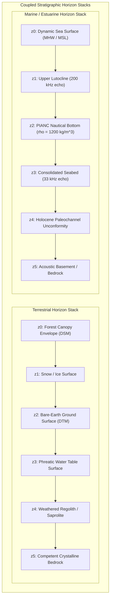
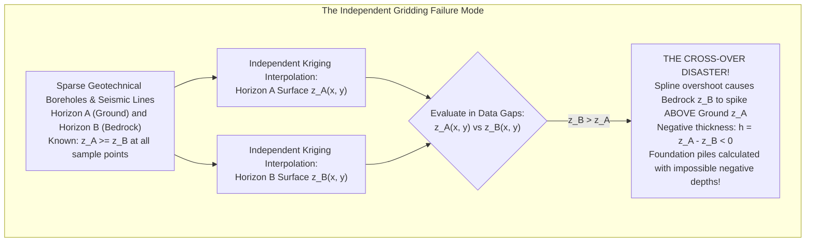

# Chapter 29: Fluid Mud, "Nautical Depth," and Multi-Horizon Subsurface DEMs

*When the seabed or ground surface is not a sharp boundary: modeling rheologic transitions, fluid mud, and stacked subsurface horizons.*

---

## 29.3 Multi-Horizon DEMs: Stacked Stratigraphic Surfaces

Geospatial software has historically treated digital elevation models as single, isolated 2.5D scalar fields $z = f(x, y)$. However, modern engineering geology, hydrogeology, coastal dredging, and offshore geotechnical engineering require modeling the Earth as a **coupled stack of continuous stratigraphic horizons**.

Whether mapping the transition from forest canopies down to bedrock on land, or from seawater down to crystalline basement offshore, elevation models must represent multi-horizon packages. Crucially, these stacked surfaces cannot be interpolated independently: they are physically bound by **non-crossing topological inequality constraints**.

---

### 29.3.1 The Physics of Stacked Stratigraphic Horizons

In physical geology and geotechnical engineering, every elevation horizon represents a specific rheological, hydrologic, or lithologic phase boundary:

#### 1. The Terrestrial Subsurface Stack
1. **Canopy Envelope ($z_0$):** Derived from first returns of airborne LiDAR or optical stereophotogrammetry. Governs solar radiation, wind friction, and microclimate modeling.
2. **Bare-Earth Ground Surface ($z_2$):** Derived from ground-classified LiDAR or bare-earth photogrammetry. Dictates surface hydrology, overland runoff, and civil site layout.
3. **Phreatic Water Table ($z_3$):** Derived from piezometric monitoring wells, electrical resistivity tomography (ERT), and unconfined groundwater models. Governs soil saturation, slope stability, and landslide liquefaction.
4. **Competent Bedrock ($z_5$):** Derived from seismic refraction, borehole core logs, and Ground-Penetrating Radar (GPR). Determines structural foundation bearing capacity and trench excavation blasting costs.

#### 2. The Marine Geotechnical Stack
1. **Upper Lutocline ($z_1$):** Boundary of cohesive flocculated suspension detected by high-frequency multibeam sonar.
2. **Nautical Depth ($z_2$):** The critical $\rho = 1200\text{ kg/m}^3$ boundary governing commercial vessel clearance.
3. **Consolidated Seabed ($z_3$):** The top of load-bearing sand or stiff clay detected by low-frequency echosounders.
4. **Pleistocene / Holocene Unconformity ($z_4$):** Buried paleochannels and gravel riverbeds mapped by chirp sub-bottom profilers, essential for routing subsea telecommunication cables and siting offshore wind turbine monopiles.

---

### 29.3.2 The "Cross-Over Blunder" in Independent Gridding

The single most disastrous malpractice in multi-horizon modeling is **independent surface gridding**: interpolating each geological horizon independently using standard unconstrained algorithms (such as Ordinary Kriging, biharmonic splines, or Inverse Distance Weighting).

#### The Mathematical Anatomy of the Blunder
Suppose a site investigation contains 50 geotechnical boreholes where both ground elevation $z_{\text{ground}}$ and depth-to-bedrock $z_{\text{bedrock}}$ are sampled. By definition of physical reality:
$$z_{\text{ground}}(\mathbf{x}_i) \ge z_{\text{bedrock}}(\mathbf{x}_i), \quad \forall i \in \{1, \dots, 50\}$$

If an analyst grids $z_{\text{ground}}$ and $z_{\text{bedrock}}$ as two independent raster surfaces:
* In large spatial gaps between boreholes, the interpolation algorithms operate with different spatial covariance structures and different minimum-curvature tension parameters.
* A spline or Kriging overshoot in the bedrock layer, combined with an interpolation sag in the ground layer, inevitably causes the surfaces to intersect:
  $$\exists \mathbf{x} \in \Omega \quad \text{such that} \quad z_{\text{bedrock}}(\mathbf{x}) > z_{\text{ground}}(\mathbf{x})$$
* **The Forensic Consequence:** The model predicts that solid granite bedrock floats in mid-air above the grass! The calculated soil thickness $h(\mathbf{x}) = z_{\text{ground}} - z_{\text{bedrock}}$ becomes **negative**. In civil engineering, feeding negative soil thicknesses into foundation piling or pipeline trenching software crashes automated structural pipelines or leads contractors to order negative steel casing lengths.

---

### 29.3.3 Enforcing Non-Crossing Topological Constraints

To maintain physical and structural validity, a multi-horizon elevation system must enforce non-crossing inequalities across all $K$ stratigraphic layers:

$$z_1(\mathbf{x}) \ge z_2(\mathbf{x}) \ge z_3(\mathbf{x}) \ge \dots \ge z_K(\mathbf{x}), \quad \forall \mathbf{x} \in \Omega$$

To guarantee this topological ordering, geospatial software utilizes three primary mathematical architectures:

#### 1. Direct Thickness (Isochore) Gridding
Instead of gridding absolute elevations for subsurface horizons, the model grids the **layer thickness (isochore)**:
1. Grid the reference surface $z_1(\mathbf{x})$ (e.g., bare-earth DTM or sea surface).
2. For each successive subsurface horizon $k \in \{2, \dots, K\}$, compute the observed thickness at sample points:
   $$\Delta h_k(\mathbf{x}_i) = z_{k-1}(\mathbf{x}_i) - z_k(\mathbf{x}_i) \ge 0$$
3. Grid the thickness field $\Delta h_k(\mathbf{x})$ using non-negative constraints (e.g., logarithmic transformation or constrained splines such that $\Delta h_k(\mathbf{x}) \ge 0$).
4. Reconstruct the elevation of horizon $k$ via downward cumulative subtraction:
   $$z_k(\mathbf{x}) = z_{k-1}(\mathbf{x}) - \Delta h_k(\mathbf{x})$$
*Advantage:* Because every layer thickness is guaranteed to be non-negative ($\Delta h_k \ge 0$), horizons can touch (zero thickness pinch-outs), but they can **never cross**.

#### 2. Inequality-Constrained Dual Kriging
In geostatistics, horizons are interpolated simultaneously within a **Constrained Quadratic Programming (QP)** framework:
$$\min_{\mathbf{w}} \frac{1}{2} \mathbf{w}^T \mathbf{C} \mathbf{w} - \mathbf{b}^T \mathbf{w} \quad \text{subject to } \mathbf{A} \mathbf{w} \le \mathbf{c}$$
where the linear constraints $\mathbf{A} \mathbf{w} \le \mathbf{c}$ explicitly enforce $z_{k+1}(\mathbf{x}_g) \le z_k(\mathbf{x}_g)$ at every node $\mathbf{x}_g$ on the output grid.

#### 3. Geological Pinch-Outs and Structural Truncation
When a younger sedimentary layer pinches out against an older erosional unconformity (such as an ancient paleochannel carving into bedrock):
* The layer thickness drops to exactly zero: $\Delta h(\mathbf{x}) = 0$.
* The two horizons merge: $z_{k+1}(\mathbf{x}) = z_k(\mathbf{x})$.
* Advanced implicit modeling engines (such as GemPy) represent horizons as continuous scalar potential fields $\Phi(\mathbf{x})$, using fault and unconformity topological rules to naturally terminate layers without cross-over blunders.
