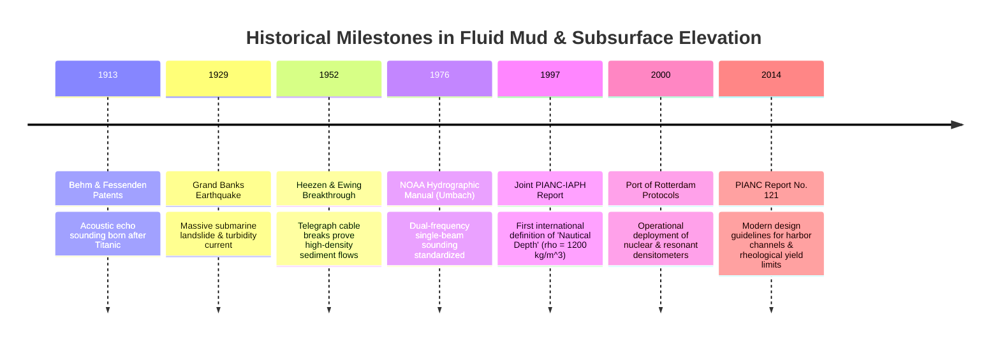

# Chapter 29: Fluid Mud, "Nautical Depth," and Multi-Horizon Subsurface DEMs

*When the seabed or ground surface is not a sharp boundary: modeling rheologic transitions, fluid mud, and stacked subsurface horizons.*

---

## 29.4 Historical Evolution: From Telegraph Cables to Rheological Depth

Understanding how fluid mud and subsurface stratigraphy entered digital elevation modeling requires tracing the history of marine acoustics, submarine geological hazards, and international port engineering. The milestones below, anchored in the `schwehr/gis-history` repository, illustrate how oceanographers and civil engineers dismantled the naive assumption of a single, solid seafloor.

---

### 29.4.1 The Birth of Acoustic Sounding and Turbidity Physics: 1913 to 1952

#### 1913: Alexander Behm and Reginald Fessenden Patents
Following the sinking of the *Titanic* in 1912, inventors sought acoustic techniques to detect underwater hazards:
* In Germany, Alexander Behm obtained German Patent 282,009 (1913) for an echo sounder measuring sound reflection time from the seabed.
* In the United States, Reginald A. Fessenden developed the 540-Hz electro-acoustic oscillator, performing the first successful acoustic depth sounding from the US Coast Guard Cutter *Miami* in 1914.
* *The Historical Consequence:* Early acoustic sounders assumed a sharp, solid reflecting boundary. When sounders operated in muddy river mouths, paper drum recorders recorded smeared, broad "fuzzy bottoms," baffling early hydrographers.

#### 1929–1952: The Grand Banks Earthquake and Turbidity Currents
On November 18, 1929, a magnitude 7.2 earthquake struck the continental slope south of Newfoundland:
* Twelve trans-Atlantic submarine telegraph cables snapped sequentially from north to south over a 13-hour period across a distance of $500\text{ kilometers}$.
* In 1952, oceanographers Bruce Heezen and Maurice Ewing at Columbia University's Lamont Geological Observatory solved the mystery: the earthquake triggered an enormous **submarine turbidity current**—a catastrophic sediment-gravity flow traveling at speeds up to $70\text{ km/h}$.
* Heezen and Ewing proved that fluid sediment suspensions can behave as coherent, dense hydrodynamic bodies that reshape continental margins. This established the sedimentological foundation for understanding estuarine fluid mud and hyperpycnal flows.

---

### 29.4.2 The Analog Hydrographic Manual Era: 1976 Umbach

#### 1976: Captain Melvin J. Umbach's *Hydrographic Manual* (NOAA 4th Edition)
In the 1970s, as commercial container ships dramatically increased in draft, estuarine shoaling became a critical issue for NOAA's National Ocean Survey. Umbach codified operational procedures for analog dual-frequency single-beam echosounders (Raytheon DE-723 and Ross Fineline):
* **Dual-Trace Recording:** Hydrographers were instructed to observe both the high-frequency ($200\text{ kHz}$) and low-frequency ($15\text{–}33\text{ kHz}$) pen traces on electrosensitive paper rolls.
* **Lead-Line Ground-Truthing:** In muddy fairways where the two acoustic traces separated by more than $1\text{ foot}$ ($0.3\text{ m}$), Umbach mandated lowering a brass-disk lead-line or sounding bar to physically feel where the weight ceased to sink under its own gravity.
* *Limitation:* Manual lead-line drops were subjective, dependent on the operator's physical touch, and could not be scaled across large commercial ports.

---

### 29.4.3 The International PIANC Consensus: 1997 to 2014

As the Port of Rotterdam (the world's busiest seaport at the time) faced prohibitive dredging budgets in the Europoort channel, Dutch and Belgian engineers conducted full-scale sea trials with deep-draft crude oil tankers (VLCCs):

#### 1997: The Joint PIANC-IAPH Working Group Report
In 1997, a joint commission of PIANC and the International Association of Ports and Harbors published the first formal international standard for **Nautical Depth**:
* Established that ships drawing draft within the fluid mud layer retain steerability provided bulk density does not exceed **$\rho = 1200\text{ kg/m}^3$**.
* Shifted European hydrographic surveys from acoustic-only charting to hybrid density profiling (using towed gamma-ray densitometers and resonant penetrometers).

#### 2014: PIANC Report No. 121 (*Harbour Approach Channels: Design Guidelines*)
PIANC Working Group 121 published the definitive modern engineering handbook for channel design:
* Integrated non-Newtonian fluid rheology into port hydrography.
* Formalized the distinction between **isopycnic horizons** (constant density) and **yield stress horizons** ($\tau_y = 70\text{–}100\text{ Pa}$).
* Codified multi-horizon digital elevation deliverables for modern electronic chart display systems (ECDIS) and port traffic management centers, establishing the standard currently implemented in major deep-water ports across Europe, Asia, and the Americas.
