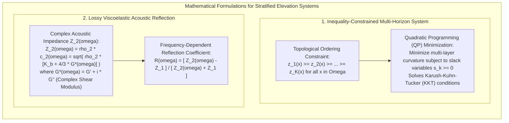

# Chapter 29: Fluid Mud, "Nautical Depth," and Multi-Horizon Subsurface DEMs

*When the seabed or ground surface is not a sharp boundary: modeling rheologic transitions, fluid mud, and stacked subsurface horizons.*

---

## 29.5 Mathematical Foundations of Multi-Horizon Systems and Viscoelastic Acoustics

Modeling complex stratified media requires two mathematical pillars:
1. **Inequality-constrained optimization** that mathematically prevents geological horizons from crossing in spatial data gaps.
2. **Viscoelastic wave propagation** that explains why acoustic reflection coefficients vary continuously across frequency as a function of sediment bulk density and dynamic shear modulus.

---

### 29.5.1 The Non-Crossing Inequality-Constrained Horizon System

Let a spatial domain $\Omega \subset \mathbb{R}^2$ contain $K$ ordered stratigraphic elevation surfaces $z_k(\mathbf{x})$, where $k \in \{1, \dots, K\}$ indexes horizons from top to bottom (e.g., $k=1$ is ground/water surface, $k=K$ is bedrock).

#### 1. The Continuous Topological Constraint
In physical geology and engineering mechanics, younger strata cannot penetrate older underlying strata. The surfaces must satisfy the continuous non-crossing inequality:

$$z_1(\mathbf{x}) \ge z_2(\mathbf{x}) \ge z_3(\mathbf{x}) \ge \dots \ge z_K(\mathbf{x}), \quad \forall \mathbf{x} \in \Omega$$

This is equivalent to requiring that all **isochore layer thicknesses** remain strictly non-negative:
$$h_k(\mathbf{x}) = z_k(\mathbf{x}) - z_{k+1}(\mathbf{x}) \ge 0, \quad \forall k \in \{1, \dots, K-1\}$$

#### 2. The Constrained Biharmonic Spline Optimization
To construct smooth, minimum-curvature surfaces that honor discrete borehole or seismic soundings while respecting the topological constraint, we formulate a multi-surface variational optimization problem.

For each horizon $k$, we minimize the biharmonic thin-plate bending energy $\mathcal{E}(z_k)$:
$$\min_{z_1, \dots, z_K} \sum_{k=1}^K \iint_\Omega \left( \left(\frac{\partial^2 z_k}{\partial x^2}\right)^2 + 2\left(\frac{\partial^2 z_k}{\partial x \partial y}\right)^2 + \left(\frac{\partial^2 z_k}{\partial y^2}\right)^2 \right) dx \, dy$$

subject to:
1. **Borehole / Sounding Data Equality Constraints:**
   $$z_k(\mathbf{x}_{k, i}) = d_{k, i}, \quad \forall i \in \{1, \dots, N_k\}$$
   where $d_{k, i}$ is the observed elevation of horizon $k$ at sample point $\mathbf{x}_{k, i}$.
2. **Continuous Inter-Horizon Non-Crossing Inequality Constraints:**
   $$z_k(\mathbf{x}) - z_{k+1}(\mathbf{x}) \ge 0, \quad \forall \mathbf{x} \in \Omega, \quad \forall k \in \{1, \dots, K-1\}$$

#### 3. Discrete Quadratic Programming (QP) and Slack Variables
On a discrete computational grid with $M$ nodes $\mathbf{x}_j$ ($j = 1, \dots, M$), let $\mathbf{z}_k \in \mathbb{R}^M$ represent the elevation vector for horizon $k$.

The biharmonic curvature operator is discretized via finite differences into a sparse symmetric matrix $\mathbf{B} \in \mathbb{R}^{M \times M}$. The global objective function becomes:
$$\min_{\mathbf{z}_1, \dots, \mathbf{z}_K} \sum_{k=1}^K \mathbf{z}_k^T \mathbf{B} \mathbf{z}_k$$

The non-crossing inequality at every node $j$ is written in matrix form:
$$\mathbf{z}_k - \mathbf{z}_{k+1} \ge \mathbf{0} \implies \mathbf{z}_{k+1} - \mathbf{z}_k \le \mathbf{0}$$

We introduce non-negative slack vectors $\mathbf{s}_k \ge \mathbf{0}$:
$$\mathbf{z}_k - \mathbf{z}_{k+1} - \mathbf{s}_k = \mathbf{0}$$

This transforms the multi-horizon interpolation into a standard **Constrained Quadratic Programming (QP)** problem:
$$\min_{\mathbf{Z}} \frac{1}{2} \mathbf{Z}^T \mathbf{H} \mathbf{Z} + \mathbf{f}^T \mathbf{Z} \quad \text{subject to } \mathbf{A}_{\text{eq}} \mathbf{Z} = \mathbf{b}_{\text{eq}} \quad \text{and} \quad \mathbf{A}_{\text{ineq}} \mathbf{Z} \le \mathbf{0}$$
where $\mathbf{Z} = [\mathbf{z}_1^T, \mathbf{z}_2^T, \dots, \mathbf{z}_K^T]^T \in \mathbb{R}^{K \cdot M}$. 

Solving this system via interior-point methods guarantees that the **Karush-Kuhn-Tucker (KKT) conditions** are satisfied. The resulting stacked surfaces bend smoothly through data gaps, pinch out where layers terminate ($\Delta h = 0$), and mathematically never cross.

---

### 29.5.2 Acoustic Reflection at a Lossy Viscoelastic Fluid Mud Interface

Why does a $200\text{-kHz}$ sounder reflect off the lutocline while a $33\text{-kHz}$ sounder penetrates through it? The answer lies in the **complex acoustic impedance** of viscoelastic cohesive mud.

#### 1. Complex Dynamic Moduli in Viscoelastic Mud
Unlike clear water (which possesses only a bulk modulus $K$ and zero shear strength), concentrated fluid mud possesses a non-zero, frequency-dependent **complex dynamic shear modulus $G^*(\omega)$**:

$$G^*(\omega) = G'(\omega) + i G''(\omega)$$
where:
* $G'(\omega)$: The **storage modulus** (representing elastic energy storage in the flocculated clay skeleton).
* $G''(\omega)$: The **loss modulus** (representing viscous dissipation).
* $\omega = 2\pi f$: The angular acoustic frequency ($\text{rad/s}$).

The compressional sound speed $c_2(\omega)$ in the fluid mud layer is:
$$c_2(\omega) = \sqrt{\frac{K_b + \frac{4}{3} G^*(\omega)}{\rho_2}}$$
where $K_b$ is the bulk modulus of the fluid-sediment mixture and $\rho_2$ is bulk mass density.

#### 2. Complex Acoustic Impedance
The specific acoustic impedance $Z_2(\omega)$ of the fluid mud is:
$$Z_2(\omega) = \rho_2 \cdot c_2(\omega) = \sqrt{\rho_2 \left( K_b + \frac{4}{3}\big( G'(\omega) + i G''(\omega) \big) \right)}$$

For clear seawater in the overlying water column (Medium 1, with density $\rho_1 \approx 1025\text{ kg/m}^3$ and sound speed $c_1 \approx 1500\text{ m/s}$), impedance is real:
$$Z_1 = \rho_1 \cdot c_1 \approx 1.537 \times 10^6 \text{ Pa}\cdot\text{s/m} \quad (\text{Rayls})$$

#### 3. Frequency-Dependent Reflection Coefficient
At normal incidence ($\theta_i = 0$), the acoustic pressure reflection coefficient $R(\omega)$ at the water-lutocline interface is:

$$R(\omega) = \frac{Z_2(\omega) - Z_1}{Z_2(\omega) + Z_1}$$

The reflected acoustic power in decibels is:
$$\text{Target Strength (dB)} = 20 \log_{10} |R(\omega)|$$

#### 4. The Frequency Split Mechanism
1. **At Low Frequencies ($f = 15\text{–}33\text{ kHz}$):**
   * The acoustic period ($T = 1/f \approx 30\text{–}65\,\mu\text{s}$) is much longer than the structural relaxation time of the flocculated network.
   * Under low frequencies, the weak clay network yields; the storage modulus is negligible ($G'(\omega) \to 0$).
   * Because the bulk modulus of fluid mud is dominated by pore water ($K_b \approx K_{\text{water}}$), the acoustic impedance of fluid mud matches clear seawater almost perfectly ($Z_2 \approx Z_1$).
   * Consequently, $|R(33\text{kHz})| \to 0$ (reflection is vanishingly small, $<-40\text{ dB}$). Over $99\%$ of the acoustic energy transmits directly through the fluid mud layer, traveling downward until it strikes the consolidated bed ($\rho_3 > 1500\text{ kg/m}^3$), where a massive impedance jump generates a strong echo.
2. **At High Frequencies ($f = 200\text{–}400\text{ kHz}$):**
   * The acoustic period ($T \approx 2.5\text{–}5\,\mu\text{s}$) is shorter than the relaxation time. The clay particle network does not have time to rearrange, behaving as an elastic solid ($G'(\omega)$ increases sharply).
   * Simultaneously, high-frequency sound scatters off individual clay-aggregate flocs whose diameters approach the acoustic wavelength ($\lambda \approx 3.7\text{–}7.5\text{ mm}$).
   * The impedance mismatch $|Z_2 - Z_1|$ spikes, generating a strong reflection ($|R(200\text{kHz})| \approx 0.15\text{–}0.25$, or $-12\text{ to }-16\text{ dB}$).
   * The $200\text{-kHz}$ sounder locks onto this lutocline reflection, erroneously reporting that the navigable channel has shoaled.
