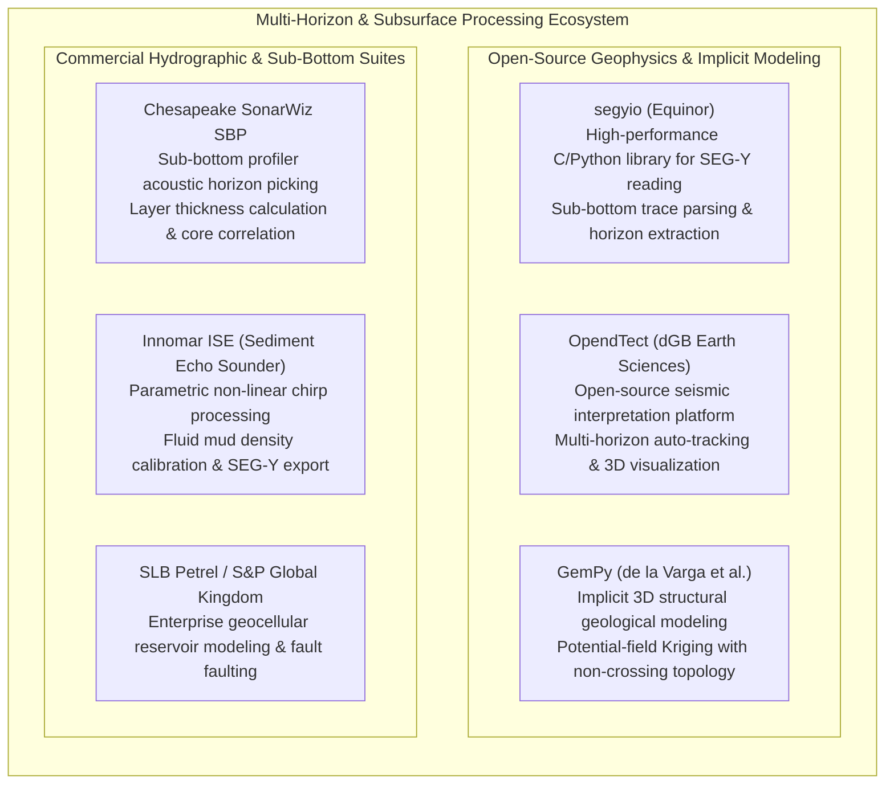

# Chapter 29: Fluid Mud, "Nautical Depth," and Multi-Horizon Subsurface DEMs

*When the seabed or ground surface is not a sharp boundary: modeling rheologic transitions, fluid mud, and stacked subsurface horizons.*

---

## 29.6 Software Ecosystem

Processing fluid mud soundings, picking sub-bottom acoustic horizons, and constructing non-crossing stratigraphic DEM stacks requires specialized tools bridging marine hydrography, reflection seismology, and structural 3D geological modeling. This section reviews the open-source libraries and enterprise software platforms used to interpret and publish multi-horizon elevation models.



---

### 29.6.1 Open-Source Seismic and Implicit Stratigraphic Tools

#### 1. `segyio`: Reading and Processing Sub-Bottom SEG-Y Data
Developed and open-sourced by Equinor, **`segyio`** is a high-performance C and Python library for interacting with SEG-Y files (the universal standard format for sub-bottom profilers and marine seismic data). It provides fast, memory-mapped access to acoustic trace headers, sample rates, and two-way travel time matrices.

```python
"""
Extract multi-horizon acoustic reflectors from a sub-bottom profiler SEG-Y file
using open-source segyio and SciPy. Demonstrates picking the upper lutocline
and consolidated bedrock horizons.
"""

import segyio
import numpy as np
from scipy.signal import hilbert

def extract_subbottom_horizons(segy_path: str) -> dict:
    """
    Parses a sub-bottom profiler SEG-Y file to extract acoustic travel times
    for the upper lutocline and consolidated bedrock.
    
    Args:
        segy_path: Path to input .sgy or .segy sub-bottom profile file.
        
    Returns:
        Dictionary containing trace coordinates, lutocline TWT, and bedrock TWT.
    """
    print(f"Opening SEG-Y profile: {segy_path}")
    with segyio.open(segy_path, ignore_geometry=True) as segy:
        n_traces = segy.tracecount
        n_samples = len(segy.samples)
        dt_us = segyio.tools.dt(segy) / 1000.0  # Sample interval in milliseconds
        
        print(f"Traces: {n_traces:,}, Samples per trace: {n_samples:,}, Sample rate: {dt_us:.3f} ms")
        
        # Read coordinates from trace headers (CDP-X, CDP-Y in arcseconds or projected meters)
        x_coords = segy.attributes(segyio.TraceField.CDP_X)[:]
        y_coords = segy.attributes(segyio.TraceField.CDP_Y)[:]
        
        # Pre-allocate picked two-way travel times (TWT in milliseconds)
        twt_lutocline_ms = np.zeros(n_traces)
        twt_bedrock_ms = np.zeros(n_traces)
        
        for i in range(n_traces):
            trace = segy.trace[i]
            # 1. Compute analytic signal envelope via Hilbert transform
            envelope = np.abs(hilbert(trace))
            
            # 2. Pick first major arrival (Upper Lutocline / Seabed)
            # Threshold above ambient water-column acoustic noise
            noise_floor = np.median(envelope[:100]) * 3.0
            lutocline_idx = np.where(envelope > noise_floor)[0]
            if len(lutocline_idx) > 0:
                twt_lutocline_ms[i] = segy.samples[lutocline_idx[0]]
            else:
                twt_lutocline_ms[i] = np.nan
                
            # 3. Pick deep consolidated reflector (Bedrock / Hard Sand)
            # Look beyond the lutocline for the highest amplitude peak
            search_start = lutocline_idx[0] + 50 if len(lutocline_idx) > 0 else 100
            if search_start < n_samples:
                bedrock_idx = search_start + np.argmax(envelope[search_start:])
                twt_bedrock_ms[i] = segy.samples[bedrock_idx]
            else:
                twt_bedrock_ms[i] = np.nan
                
    # Enforce non-crossing topological check in travel time: TWT_bedrock >= TWT_lutocline
    valid = ~np.isnan(twt_lutocline_ms) & ~np.isnan(twt_bedrock_ms)
    assert np.all(twt_bedrock_ms[valid] >= twt_lutocline_ms[valid]), "Topological error: Bedrock picked above Lutocline!"
    
    print(f"Successfully processed {n_traces:,} traces with verified non-crossing topology.")
    return {
        "x": x_coords,
        "y": y_coords,
        "twt_lutocline": twt_lutocline_ms,
        "twt_bedrock": twt_bedrock_ms
    }
```

#### 2. GemPy: Implicit 3D Structural Horizon Modeling
Developed by Miguel de la Varga et al. (RWTH Aachen University), **GemPy** is an open-source Python library for implicit 3D geological modeling:
* Represents complex geological volumes using **Potential-Field Universal Co-Kriging** (Lajaunie et al. 1997).
* Automatically enforces structural geological rules: depositional sequences, erosional unconformities, and fault displacements.
* Horizons are extracted as continuous isosurfaces of a scalar potential field $\Phi(x, y, z)$, mathematically guaranteeing that conformable stratigraphic layers **never intersect or cross in data gaps**.

#### 3. OpendTect (dGB Earth Sciences)
A free and open-source seismic interpretation system:
* Ingests 2D sub-bottom profiles and 3D seismic cubes in SEG-Y format.
* Provides automated **Horizon Auto-Tracking** based on phase correlation, amplitude tracking, and dip steering.
* Exports picked horizons as georeferenced raster grids or triangulated surface meshes.

---

### 29.6.2 Commercial Sub-Bottom and Geological Modeling Suites

#### 1. Chesapeake SonarWiz Sub-Bottom Profiler (SBP)
The leading commercial post-processing software used by hydrographic surveyors and coastal dredging engineers:
* Seamlessly integrates sub-bottom seismic profiles with sidescan sonar and multibeam bathymetric swaths.
* Features specialized **Acoustic Sediment Classification (ASC)** tools that correlate sub-bottom acoustic reflector amplitudes with physical core-log samples.
* Exports multi-horizon ASCII and GeoTIFF surfaces (top-of-mud, base-of-mud, depth-to-rock) directly into hydrographic GIS databases.

#### 2. Innomar ISE (Innomar Sediment Echo Sounder)
The specialized processing suite designed exclusively for Innomar parametric sub-bottom profilers:
* Corrects for vessel heave, pitch, and roll in real time using IMU data.
* Applies instantaneous sound velocity depth conversion across stratified sediment layers.
* Provides automated mud layer volume calculation for port maintenance dredging contracts.

#### 3. SLB Petrel and S&P Global Kingdom Suite
The enterprise standards for 3D seismic interpretation and geocellular reservoir characterization:
* Manage hundreds of intersecting 2D seismic lines and multi-terabyte 3D migration volumes.
* Utilize advanced **Structural Framework** algorithms to construct fault-bounded, non-crossing horizon grids across complex geological basins.
