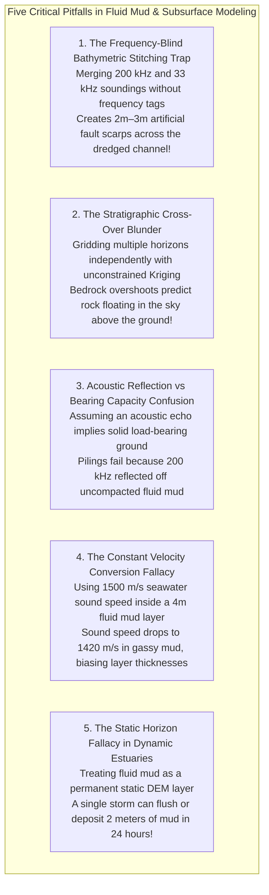

# Chapter 29: Fluid Mud, "Nautical Depth," and Multi-Horizon Subsurface DEMs

*When the seabed or ground surface is not a sharp boundary: modeling rheologic transitions, fluid mud, and stacked subsurface horizons.*

---

## 29.7 Common Pitfalls and Key Takeaways

Modeling fluid mud transitions and stacked subsurface horizons challenges the core paradigms of GIS. In stratified environments, elevation is frequency-dependent, the seabed is rheological rather than geometric, and unconstrained mathematical interpolation creates physically impossible subterranean geometry.

---

### 29.7.1 Common Pitfalls in Fluid Mud and Stratigraphic Modeling

#### 1. The Frequency-Blind Bathymetric Stitching Trap
* **The Failure Mode:** A port GIS database ingests single-beam sounding files collected by two different survey launches operating in the same estuarine channel, unaware that Launch A operated a $200\text{-kHz}$ transducer while Launch B operated a $33\text{-kHz}$ transducer.
* **Physical Reality:** In a $3\text{-meter}$ thick fluid mud layer, the $200\text{-kHz}$ sounder detects the upper lutocline ($z = -12.0\text{ m}$), while the $33\text{-kHz}$ sounder penetrates to the consolidated bed ($z = -14.8\text{ m}$).
* **Forensic Consequence:** When the soundings are gridded into a single seamless bathymetric surface, the mosaic displays violent, artificial **$2.8\text{-meter}$ vertical steps and saw-tooth terraces** running along trackline boundaries. Port pilots inspecting the chart conclude that an active geological fault has ruptured the channel, or that dredging contractors left massive trenches of unexcavated sediment.
* **Remedy:** Never store or grid bathymetric soundings without an immutable metadata attribute declaring the acoustic frequency. Process high-frequency and low-frequency returns into separate, explicitly labeled raster horizons.

#### 2. The Stratigraphic Cross-Over Blunder
* **The Failure Mode:** A geotechnical engineering team interpolates depth-to-bedrock from 40 sparse boreholes using standard Ordinary Kriging or minimum-curvature splines, while interpolating the ground surface from high-density LiDAR.
* **Mathematical Reality:** Independent interpolation algorithms operate with different spatial bandwidths and boundary conditions.
* **Forensic Consequence:** In spatial data gaps where bedrock boreholes are absent, the Kriging or spline algorithm overshoots upward while the LiDAR surface sags into a natural valley. The bedrock surface intersects and rises **above the ground surface** ($z_{\text{bedrock}} > z_{\text{ground}}$). Feeding this multi-horizon model into automated foundation engineering software causes piling depth calculations to yield negative values, crashing structural pipelines.
* **Remedy:** Never grid multi-horizon stacks independently. Enforce **isochore thickness gridding** ($\Delta h_k \ge 0$) or **inequality-constrained dual Kriging** to ensure that $z_{k+1}(\mathbf{x}) \le z_k(\mathbf{x})$ everywhere.

#### 3. Confusing Acoustic Reflection with Geotechnical Bearing Capacity
* **The Failure Mode:** A marine civil engineering contractor designing a container quay wall reviews a high-resolution multibeam bathymetric survey and assumes that the recorded surface represents solid ground capable of supporting rip-rap rock armour.
* **Physical Reality:** A high-frequency ($200\text{–}400\text{ kHz}$) multibeam sonar reflects off acoustic impedance steps as small as $\Delta Z \approx 0.05 \times 10^6\text{ Rayls}$. The upper lutocline of fluid mud reflects acoustic waves strongly, despite having a bulk density of only $\rho = 1050\text{ kg/m}^3$ and **zero yield strength ($\tau_y = 0\text{ Pa}$)**.
* **Forensic Consequence:** Heavy rock armour dumped onto the site sinks straight through $3\text{ meters}$ of fluid mud before coming to rest on the true consolidated bed. The contractor runs out of rock, the revetment collapses into the channel, and project costs overrun by millions of dollars.
* **Remedy:** Never design marine foundations or coastal structures using acoustic bathymetry alone in muddy environments. Mandate dynamic penetrometer drops (Graviprobe) or nuclear densitometer profiles to identify the load-bearing horizon ($\tau_y > 100\text{ Pa}$).

#### 4. The Constant Sound Speed Fallacy in Mud
* **The Failure Mode:** A geophysicist converts sub-bottom two-way travel time (TWT) to physical depth through a thick fluid mud layer using standard seawater sound speed ($c = 1500\text{ m/s}$).
* **Physical Reality:** Highly concentrated fluid mud and gassy estuarine sediments alter the bulk modulus and density of the medium. Biogenic methane micro-bubbles (even at concentrations $<0.1\%$) drop the acoustic compressional sound speed to as low as **$1350\text{–}1420\text{ m/s}$**, while dense compacted clays increase sound speed to **$1600\text{–}1750\text{ m/s}$**.
* **Forensic Consequence:** Applying a flat $1500\text{ m/s}$ conversion introduces a $10\text{–}20\%$ vertical error in calculated sediment layer thickness. In a major capital dredging contract, a $15\%$ error over a $4\text{-meter}$ mud layer represents thousands of cubic meters of disputed sediment volumes.
* **Remedy:** Calibrate acoustic time-to-depth conversions using physical core samples, bar checks, or in-situ velocity probes within the sediment layer.

#### 5. The Static Horizon Fallacy in Dynamic Estuaries
* **The Failure Mode:** A coastal hydrodynamic modeler inputs an annual fluid mud bathymetric DEM into a 10-year estuarine siltation simulation, treating the mud surface as an immutable boundary.
* **Physical Reality:** Unlike consolidated rock or gravel beds, fluid mud is an active, rheologically dynamic slurry governed by tidal spring-neap cycles, river discharge freshets, and storm wave liquefaction.
* **Forensic Consequence:** A single winter storm or spring river flood can flush millions of cubic meters of fluid mud out of a harbor in 48 hours, or deposit a $1.5\text{-meter}$ layer overnight during a single tidal cycle. Assuming a static mud boundary generates completely fictional sediment transport predictions.
* **Remedy:** Model fluid mud as a dynamic, time-varying boundary layer ($\frac{\partial z_{\text{mud}}}{\partial t}$), continuously coupling hydrodynamic shear stress with settling and erosion kinetics.

---

### 29.7.2 Key Takeaways for Practitioners

1. **In Fluid Mud, Elevation Is Frequency-Dependent:** High frequencies ($200\text{ kHz}$) detect the upper lutocline; low frequencies ($15\text{–}33\text{ kHz}$) penetrate to the consolidated bed. Always document the sensor frequency.
2. **Nautical Depth Is Rheological, Not Acoustic:** True navigability is governed by bulk density ($\rho = 1200\text{ kg/m}^3$) and yield stress ($\tau_y = 70\text{–}100\text{ Pa}$). Sailing through low-density mud is safe and routine.
3. **Never Grid Multi-Horizon Surfaces Independently:** Independent interpolation inevitably causes subterranean layers to cross through each other. Enforce non-crossing topological constraints ($z_{k+1} \le z_k$) via isochore thickness gridding.
4. **Complement Sonar with In-Situ Probes:** Verify acoustic sub-bottom horizons using dynamic penetrometers (Graviprobe) or gamma-ray densitometers (DensX).
5. **Account for Viscoelastic Sound Speed Shifts:** Sound speed through gassy or concentrated mud deviates significantly from $1500\text{ m/s}$; calibrate time-to-depth conversions directly against sediment cores.
