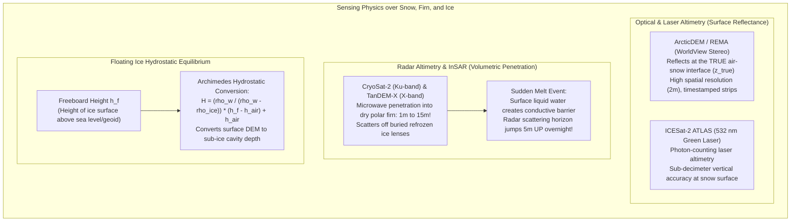
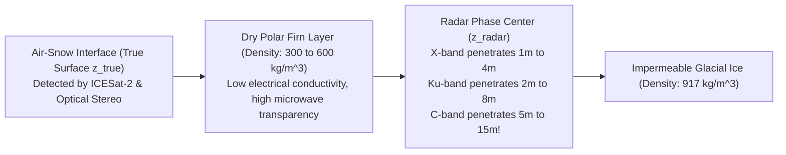
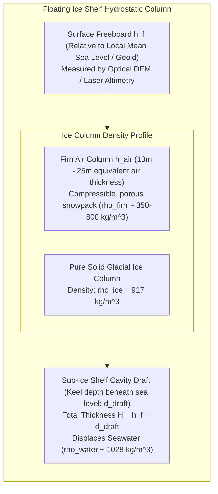

# Chapter 30: Cryospheric and Subglacial / Sub-Ice-Shelf Bed Topography

*Mapping the shifting ice surfaces of the poles and mountain glaciers—and the hidden bedrock continents beneath kilometers of ice.*

---

## 30.1 Surface DEMs of Ice Sheets, Glaciers, and Sea Ice

The cryosphere represents the most dynamic, extreme, and climatically sensitive elevation regime on Earth. Over the Greenland and Antarctic ice sheets, mountain glaciers, and polar sea ice, elevation models are not static topographies; they are time-varying surfaces ($\frac{\partial z}{\partial t}$) that record ice-sheet mass balance, glacial acceleration, and sea-level rise.

However, constructing surface DEMs over snow and ice exposes fundamental sensor physics limitations. A radar altimeter penetrates meters into dry snow, scattering off buried ice layers; an optical stereo sensor suffers from low contrast and saturation over featureless white snowfields; and floating ice shelves require complex hydrostatic buoyancy equations to convert surface elevation into total ice thickness.

---

### 30.1.1 Sensor Modalities over Cryospheric Surfaces

Mapping ice sheets requires integrating spaceborne optical stereophotogrammetry, orbital laser altimetry, and interferometric radar:

#### 1. High-Resolution Optical Stereo: ArcticDEM and REMA
Developed by the Polar Geospatial Center (PGC) using sub-meter WorldView-1, WorldView-2, and WorldView-3 in-track stereo imagery:
* **The SETSM Algorithm:** Surface Extraction from TIN-based Search-space Minimization (Noh & Howat 2015) automatically correlates image pairs over low-contrast snow without manual ground control.
* **Timestamped Strip DEMs ($2\text{-m}$ resolution):** Individual strips retain absolute satellite acquisition timestamps ($\pm 1\text{ second}$). By differencing strips acquired years or months apart, glaciologists directly measure ice velocity, crevasse propagation, glacier thinning ($\Delta z$), and retrogressive permafrost thaw slumps.
* **Limitations:** Optical sensors cannot image through winter polar night darkness, cloud cover, or heavy blizzards.

#### 2. Spaceborne Laser Altimetry: ICESat-2 (ATLAS)
NASA's **ICESat-2** carries the Advanced Topographic Laser Altimeter System (ATLAS), operating at $532\text{ nm}$ (green):
* Firing $10,000$ pulses per second across six beams arranged in three pairs, ATLAS records individual photon returns every $0.7\text{ meters}$ along track.
* Because green laser light reflects directly off the optical air-snow interface with minimal penetration in cold snow, ICESat-2 provides the sub-decimeter geodetic ground truth used to co-register and calibrate regional DEM mosaics.

#### 3. Radar Altimetry and InSAR: CryoSat-2 and TanDEM-X
* **CryoSat-2 SIRAL (Ku-band, $13.575\text{ GHz}$, $\lambda \approx 2.2\text{ cm}$):** Operates in SAR Interferometric (SARIn) mode across steep ice-sheet margins, using dual antennas to locate the across-track point of closest approach (POCA).
* **TanDEM-X (X-band, $9.6\text{ GHz}$, $\lambda \approx 3.1\text{ cm}$):** Bistatic single-pass InSAR providing complete elevation coverage of polar ice sheets independent of cloud cover or polar night.

---

### 30.1.2 The Radar Firn Penetration Bias

The single greatest source of error in cryospheric elevation differencing is **radar penetration into dry polar firn**.

#### 1. The Physics of Dielectric Penetration
Dry polar snow and firn are composed of air and sintered ice crystals, forming a low-loss dielectric medium:
* At temperatures below freezing ($T < 0^\circ\text{C}$), the imaginary (lossy) part of the dielectric permittivity is extremely small ($\epsilon'' \approx 10^{-4}\text{ to }10^{-3}$).
* Radar waves penetrate deeply through the surface snowpack. Scattering occurs volumetrically from individual snow grains, density stratification boundaries, and buried refrozen ice lenses.
* The effective radar elevation $z_{\text{radar}}$ recorded by an InSAR DEM or radar altimeter is the **interferometric phase center of the volume scattering distribution**, which sits significantly below the physical air-snow interface:
  $$\Delta z_{\text{penetration}} = z_{\text{true}} - z_{\text{radar}} \approx \begin{cases} 1\text{–}4\text{ meters} & \text{(X-band, TanDEM-X)} \\ 2\text{–}8\text{ meters} & \text{(Ku-band, CryoSat-2)} \\ 5\text{–}15\text{ meters} & \text{(C-band, SRTM/Sentinel-1)} \end{cases}$$

#### 2. The Summer Melt Spike Fallacy
The penetration depth is hypersensitive to liquid water content:
* When summer temperatures rise above $0^\circ\text{C}$, the formation of even a microscopic liquid water film ($0.5\%$ liquid water content by volume) spikes dielectric permittivity: $\epsilon'$ jumps from $1.5$ to $>5$, and $\epsilon''$ jumps by three orders of magnitude.
* The wet snowpack becomes opaque to microwaves; radar scattering transitions instantaneously from volume scattering to pure surface scattering.
* *The Glaciological Trap:* A glaciologist differencing a winter TanDEM-X radar DEM from a summer TanDEM-X radar DEM will observe an apparent **elevation gain of $+4.0\text{ meters}$**. If interpreted as mass change, the researcher concludes that the glacier accumulated massive ice during the summer! In reality, the physical surface may have lowered due to melt, while the radar phase center jumped $5\text{ meters}$ upward to the wet surface.

---

### 30.1.3 Floating Ice Shelves: Converting Freeboard to Total Thickness

Approximately $75\%$ of the Antarctic ice sheet discharges into floating ice shelves (e.g., Ross, Ronne-Filchner, Amery, Thwaites). Because radar and satellite lasers measure only the **freeboard height** of the ice above sea level, glaciologists must convert surface elevation into total ice thickness using hydrostatic buoyancy equilibrium.

#### 1. Archimedes Hydrostatic Buoyancy
Let a floating ice shelf have total thickness $H$, with surface freeboard height $h_f$ above local sea level (the geoid adjusted for ocean dynamic topography and tides).
The total mass of the ice column must equal the mass of displaced seawater:

$$\int_{-d_{\text{draft}}}^{h_f} \rho(z) \, dz = \rho_w \cdot d_{\text{draft}}$$
where $\rho_w \approx 1028\text{ kg/m}^3$ is seawater density, and $d_{\text{draft}} = H - h_f$ is the submerged draft of the ice shelf keel.

#### 2. The Firn Air Correction ($h_{\text{air}}$)
The upper $50\text{–}100\text{ meters}$ of an ice shelf consists of porous firn whose density increases gradually from $\rho_{\text{surface}} \approx 350\text{ kg/m}^3$ to pure solid bubble-free ice $\rho_{\text{ice}} \approx 917\text{ kg/m}^3$. 

To account for this air-filled pore space, glaciologists define the **Firn Air Content ($h_{\text{air}}$)**:
$$h_{\text{air}} = \int_{0}^{z_{\text{pore-close}}} \left( 1 - \frac{\rho(z)}{\rho_{\text{ice}}} \right) dz$$
$h_{\text{air}}$ represents the total vertical thickness of pure air contained within the firn column (typically $10\text{–}20\text{ meters}$ on cold Antarctic shelves).

The effective mass of the ice column is:
$$M_{\text{ice}} = \rho_{\text{ice}} \big( H - h_{\text{air}} \big)$$

Equating ice mass to displaced seawater mass:
$$\rho_{\text{ice}} \big( H - h_{\text{air}} \big) = \rho_w \cdot d_{\text{draft}} = \rho_w \big( H - h_f \big)$$

Expanding and solving for total ice shelf thickness $H$:
$$\rho_{\text{ice}} H - \rho_{\text{ice}} h_{\text{air}} = \rho_w H - \rho_w h_f$$
$$(\rho_w - \rho_{\text{ice}}) H = \rho_w h_f - \rho_{\text{ice}} h_{\text{air}} = \rho_w (h_f - h_{\text{air}}) + (\rho_w - \rho_{\text{ice}}) h_{\text{air}}$$

$$H = \frac{\rho_w}{\rho_w - \rho_{\text{ice}}} \big( h_f - h_{\text{air}} \big) + h_{\text{air}}$$

*Operational Example:*
Let $\rho_w = 1028\text{ kg/m}^3$, $\rho_{\text{ice}} = 917\text{ kg/m}^3$ (buoyancy ratio $\frac{\rho_w}{\rho_w - \rho_{\text{ice}}} \approx 9.261$).
If a satellite laser altimeter measures a freeboard $h_f = 65.0\text{ meters}$ and regional firn modeling indicates $h_{\text{air}} = 15.0\text{ meters}$:
$$H = 9.261 \times (65.0 - 15.0) + 15.0 = (9.261 \times 50.0) + 15.0 = 463.05 + 15.0 = 478.05\text{ meters}$$
The submerged ice draft is $d_{\text{draft}} = H - h_f = 478.05 - 65.0 = 413.05\text{ meters}$ beneath sea level. 
A $1.0\text{-meter}$ error in measuring surface freeboard or modeling firn air content translates into a **$\sim 9.3\text{-meter}$ error in calculated ice shelf thickness**, drastically biasing ocean-driven basal melt rate simulations!
