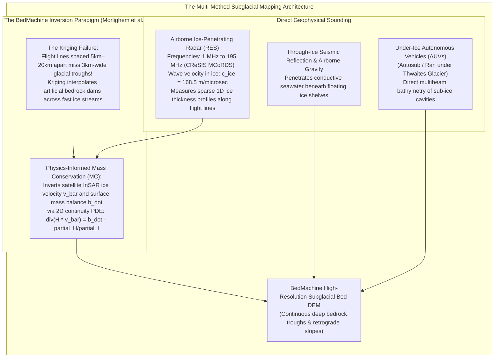
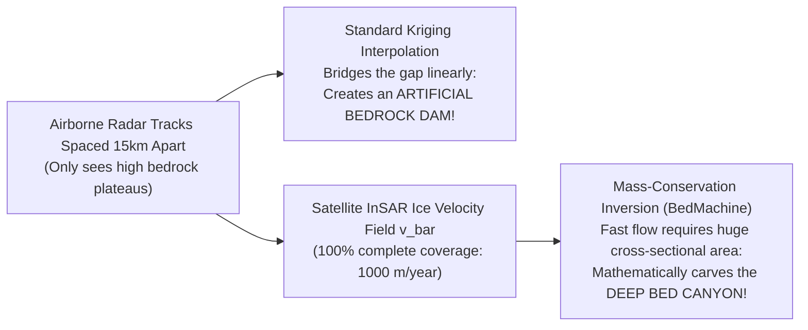

# Chapter 30: Cryospheric and Subglacial / Sub-Ice-Shelf Bed Topography

*Mapping the shifting ice surfaces of the poles and mountain glaciers—and the hidden bedrock continents beneath kilometers of ice.*

---

## 30.2 Mapping Subglacial Bed Topography: From Ice Radar to BedMachine

Beneath the kilometers-thick ice sheets of Antarctica and Greenland lies a hidden continent of mountain ranges, tectonic rifts, deep canyons, and vast subglacial lakes. Mapping this hidden bedrock topography is one of the most critical challenges in modern geophysics: the geometry of the subglacial bed—particularly whether it slopes downward inland below sea level (a retrograde bed slope)—dictates whether an ice sheet will suffer runaway **Marine Ice Sheet Instability (MISI)** under global warming.

However, subglacial topography cannot be mapped by satellites. It requires airborne **Radio-Echo Sounding (RES)**, sub-ice seismic reflection, and a revolutionary geophysical inversion paradigm: **Mass-Conservation Bed Inversion (BedMachine)**.

---

### 30.2.1 Radio-Echo Sounding (RES) and Wave Speed in Ice

Airborne Ice-Penetrating Radar—known in glaciology as **Radio-Echo Sounding (RES)**—transmits VHF/UHF electromagnetic pulses from aircraft wings (e.g., NASA Operation IceBridge, CReSIS, British Antarctic Survey):

#### 1. Wavelength and Penetration Physics
* To minimize dielectric absorption in cold ice, RES systems operate at low carrier frequencies between **$1\text{ MHz}$ and $195\text{ MHz}$** (e.g., CReSIS Multi-Channel Coherent Radar Depth Sounder - MCoRDS at $195\text{ MHz}$, BAS PASIN at $150\text{ MHz}$, and deep-sounding radars at $1\text{–}15\text{ MHz}$).
* Higher radar frequencies ($>500\text{ MHz}$) attenuate too rapidly in warm, deep ice, while lower frequencies ($<1\text{ MHz}$) require impractically large antenna arrays that cannot be mounted on aircraft.

#### 2. Electromagnetic Wave Velocity in Ice ($c_{\text{ice}}$)
The velocity of electromagnetic waves in solid bubble-free glacial ice depends on its relative dielectric permittivity $\epsilon_{\text{ice}}$:
$$\epsilon_{\text{ice}} \approx 3.17 \pm 0.05 \quad (\text{at temperatures } -10^\circ\text{C to } -30^\circ\text{C})$$

The propagation speed in pure ice is:
$$c_{\text{ice}} = \frac{c_0}{\sqrt{\epsilon_{\text{ice}}}} \approx \frac{2.9979 \times 10^8\text{ m/s}}{\sqrt{3.17}} \approx 1.6838 \times 10^8\text{ m/s} \approx 168.4\text{ m/\mu s}$$

* **The Firn Correction:** Near the surface, the wave travels through low-density, air-filled firn ($\rho \approx 350\text{–}800\text{ kg/m}^3$) where $\epsilon$ is lower ($\epsilon \approx 1.5\text{–}2.5$), causing the wave to travel faster ($c_{\text{firn}} \approx 190\text{–}240\text{ m/\mu s}$). Radar processing software applies a standard firn delay correction (subtracting $\sim 10\text{ meters}$ from calculated travel time) to avoid overestimating total ice thickness.
* **Hyperbolic Migration:** Because the radar beam has a broad beamwidth ($30^\circ\text{–}60^\circ$), steep subglacial peaks reflect energy before the aircraft passes directly overhead, generating hyperbolic diffraction patterns in raw echograms. 2D/3D Synthetic Aperture Radar (SAR) **focusing and migration algorithms** collapse these hyperbolas back to their true spatial origins.

---

### 30.2.2 The BedMachine Breakthrough: Mass-Conservation Inversion

For decades, national subglacial bed models (such as Bedmap1 and early Greenland grids) were compiled by interpolating airborne radar sounding tracks using standard geostatistical Kriging or splines. This approach had a fatal flaw.

#### 1. Why Standard Kriging Fails Catastrophically
Airborne radar flight lines are expensive and logistically grueling: tracks are typically spaced **$5\text{ to }20\text{ kilometers}$ apart**:
* Fast-flowing outlet glaciers (e.g., Jakobshavn Isbræ in Greenland, Pine Island and Thwaites in Antarctica) flow through steep, deeply incised bedrock fjords and canyons that are only **$2\text{ to }5\text{ kilometers wide}$**.
* If a glacial canyon runs parallel to and between two flight lines, **radar soundings miss the canyon entirely**.
* Standard spatial interpolation (Kriging) bridges the $15\text{-km}$ gap between high bedrock ridges on either side, **interpolating an artificial bedrock wall or dam** across the glacier fairway!
* When glaciologists fed these Kriged bed DEMs into computer climate models, the simulated glaciers could not flow; the artificial bedrock dams physically blocked simulated ice discharge, preventing accurate predictions of global sea-level rise.

#### 2. The Mass-Conservation (MC) Inversion Paradigm
Pioneered by Mathieu Morlighem, Eric Rignot, and colleagues at UC Irvine and NASA JPL, **BedMachine** replaced pure geometric interpolation with **physics-informed mass conservation**.

In regions of fast ice flow ($|\bar{\mathbf{v}}| > 100\text{–}150\text{ m/year}$), ice deformation is dominated by basal sliding, and ice acts as an incompressible continuum. The conservation of mass in two dimensions is governed by the partial differential equation:

$$\nabla \cdot \big( H \bar{\mathbf{v}} \big) = \dot{b} - \dot{m}_b - \frac{\partial H}{\partial t}$$
where:
* $H(x, y)$: Total ice thickness ($\text{meters}$), which is unknown between radar tracks.
* $\bar{\mathbf{v}}(x, y)$: Depth-averaged horizontal ice velocity vector ($\text{m/year}$), measured with $100\%$ spatial completeness by spaceborne satellite InSAR (Sentinel-1, ALOS, TerraSAR-X).
* $\dot{b}(x, y)$: Surface mass balance accumulation/ablation rate ($\text{m/year}$ ice equivalent), derived from regional climate models (RACMO or MAR).
* $\dot{m}_b(x, y)$: Basal melt rate ($\text{m/year}$).
* $\frac{\partial H}{\partial t}$: Ice surface elevation rate of change ($\text{m/year}$), measured directly by satellite laser altimeters (ICESat and ICESat-2).

#### 3. Solving for the Bed Surface
Expanding the divergence operator:
$$\bar{\mathbf{v}} \cdot \nabla H + H \big( \nabla \cdot \bar{\mathbf{v}} \big) = \dot{b} - \dot{m}_b - \frac{\partial H}{\partial t}$$

This is a first-order hyperbolic partial differential equation for ice thickness $H$. 
* The system is constrained at radar track crossings by true measured thicknesses ($H = H_{\text{obs}}$).
* In the gaps between flight lines, the equation solves for the exact ice thickness $H(x, y)$ required to transport the observed satellite ice flux. Where satellite radar shows ice accelerating to $3,000\text{ m/year}$, mass conservation dictates that the glacier must occupy a deep, narrow canyon!
* Once thickness $H(x, y)$ is solved, the subglacial bed elevation $z_{\text{bed}}$ is computed directly from the high-resolution optical surface DEM $z_{\text{surf}}$ (ArcticDEM or REMA):
  $$z_{\text{bed}}(x, y) = z_{\text{surf}}(x, y) - H(x, y)$$

*Impact:* BedMachine revealed that major glaciers in Greenland and West Antarctica are grounded hundreds to thousands of meters deeper below sea level than previously believed, exposing vast retrograde slopes that unlocked modern projections of irreversible ice-sheet collapse.

---

### 30.2.3 Mapping Sub-Ice-Shelf Ocean Cavities

Where floating ice shelves meet seawater, airborne ice radar fails completely: the electrical conductivity of seawater ($\sigma \approx 3\text{–}5\text{ S/m}$) attenuates radar signals instantly ($>100\text{ dB/meter}$), making the sub-ice seafloor completely invisible to radar.

To map the bathymetry beneath floating ice shelves:
1. **Airborne Gravity Inversions:** Aircraft measure subtle variations in Earth's gravitational acceleration ($\Delta g_{\text{Bouguer}}$). Because seawater ($\rho_w \approx 1028\text{ kg/m}^3$) is less dense than crystalline crust ($\rho_c \approx 2670\text{ kg/m}^3$), gravity anomalies are inverted to infer the water column thickness beneath the floating ice shelf.
2. **Through-Ice Active Seismics:** Field expeditions detonate explosive charges or operate vibroseis trucks on top of the floating ice shelf. Seismic sound waves penetrate the ice and seawater with minimal attenuation, recording reflections from the sub-ice seabed.
3. **Autonomous Underwater Vehicles (AUVs):** The gold standard in modern sub-ice exploration. Long-range autonomous submarines (such as the UK's *Autosub* or Sweden's *Ran*) dive into the open ocean, navigate beneath the floating ice shelf for hundreds of kilometers using Bathymetric-Aided Navigation (BAN), and capture the first direct, high-resolution multibeam bathymetric swaths of sub-ice-shelf grounding lines.
