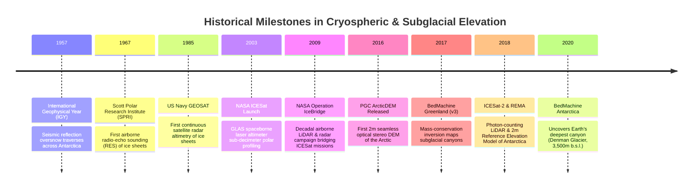

# Chapter 30: Cryospheric and Subglacial / Sub-Ice-Shelf Bed Topography

*Mapping the shifting ice surfaces of the poles and mountain glaciers—and the hidden bedrock continents beneath kilometers of ice.*

---

## 30.3 Historical Evolution: From IGY Traverses to BedMachine

Mapping polar ice sheets and subglacial continents is a journey spanning mechanical snowcat traverses, orbital radar altimeters, high-resolution optical stereopairs, and mass-conservation inversions. The milestones below, anchored in the `schwehr/gis-history` repository, trace how glaciologists transformed Antarctica and Greenland from blank white voids on the map into high-resolution, physics-constrained 3D models.

---

### 30.3.1 The Mechanical Traverse and Early Radar Era: 1957 to 1967

#### 1957: The International Geophysical Year (IGY)
During the landmark 1957–1958 International Geophysical Year, twelve nations established scientific bases across Antarctica:
* Traverses led by American, Soviet, British, French, and Australian teams navigated tracked snowcats across thousands of kilometers of uncharted crevasse fields.
* **Seismic Soundings:** Scientists detonated dynamite charges every $50\text{ kilometers}$, timing acoustic reflections from the underlying bedrock. These heroic traverses proved for the first time that Antarctica was not a series of scattered islands capped by thin ice, but a massive continental landmass buried beneath up to $4\text{ kilometers}$ of solid ice, with vast basins depressed deep below sea level by isostatic ice loading.

#### 1967: The Airborne Radio-Echo Sounding (RES) Revolution
In 1967, the Scott Polar Research Institute (SPRI) in Cambridge, UK, partnered with the US National Science Foundation (NSF) to install high-power VHF pulse radar aboard long-range LC-130 Hercules aircraft:
* Rather than stopping to drill or detonate explosives, aircraft flew thousands of line-kilometers across East and West Antarctica, recording continuous echograms of the subglacial bedrock.
* In the late 1960s and 1970s, SPRI traverses revealed the **Gamburtsev Subglacial Mountains**—a hidden mountain range the size of the European Alps buried completely beneath the central East Antarctic ice dome.

---

### 30.3.2 The Satellite Altimetry Era: 1985 to 2009

#### 1985: US Navy GEOSAT and ERS-1 (1991)
Launched in March 1985, the US Navy's **GEOSAT** radar altimeter was initially classified for submarine gravity mapping. Declassified in the late 1980s, its Ku-band altimeter provided the first continuous satellite elevation profiles over the Greenland and Antarctic ice sheets up to $72^\circ$ latitude:
* In 1991, the European Space Agency launched **ERS-1**, extending radar coverage to $81.5^\circ$ latitude.
* For the first time, glaciologists could monitor regional ice-sheet elevation change ($\frac{\partial z}{\partial t}$), revealing dynamic thinning across West Antarctica's Amundsen Sea Embayment (Pine Island and Thwaites glaciers).

#### 2003: NASA ICESat (GLAS)
In January 2003, NASA launched the **Ice, Cloud, and land Elevation Satellite (ICESat)** carrying the Geoscience Laser Altimeter System (GLAS):
* Operating with a $1064\text{-nm}$ infrared Nd:YAG laser, GLAS eliminated the multi-meter firn penetration biases that plagued radar altimeters.
* With a $60\text{-meter}$ ground footprint spaced $170\text{ meters}$ along track, ICESat measured ice sheet surface elevation with an absolute vertical accuracy of $\pm 0.05\text{–}0.15\text{ meters}$, creating the global geodetic baseline used to quantify early 21st-century polar ice loss.

#### 2009: NASA Operation IceBridge
When ICESat's lasers failed prematurely in 2009, a multi-year gap opened before ICESat-2 could launch. NASA inaugurated **Operation IceBridge**:
* Equipped research aircraft (DC-8, P-3 Orion) with the Airborne Topographic Mapper (ATM) laser scanner, the CReSIS Multi-Channel Coherent Radar Depth Sounder (MCoRDS), and snow-accumulation radar.
* For a decade ($2009\text{–}2019$), IceBridge flew annual low-altitude campaigns over Greenland and Antarctica, accumulating millions of line-kilometers of co-registered surface elevation, ice thickness, and subglacial bed soundings.

---

### 2016 to 2020: The Modern Era: ArcticDEM, REMA, and BedMachine

#### 2016–2018: ArcticDEM and REMA (Reference Elevation Model of Antarctica)
Led by Ian Howat and Paul Morin at the Polar Geospatial Center (PGC) and funded by the NSF:
* PGC paired petascale supercomputing (NCSA Blue Waters) with high-resolution optical stereo imagery from the Maxar WorldView constellation.
* In 2016, PGC released **ArcticDEM**, covering the entire circumpolar Arctic at $2\text{-meter}$ resolution.
* In September 2018, PGC released **REMA (Reference Elevation Model of Antarctica)**, providing the first high-resolution ($2\text{-m}$ and $8\text{-m}$) seamless digital surface model of the entire southern continent. Co-registered to ICESat laser tracks, REMA achieved a vertical accuracy of $<1\text{ meter}$, resolving individual snow dunes, crevasse fields, and nunataks across $14\text{ million km}^2$.

#### 2017–2020: BedMachine Greenland and BedMachine Antarctica
Between 2017 and 2020, Mathieu Morlighem and colleagues published the landmark **BedMachine** datasets:
* **2017: BedMachine Greenland (v3):** Replaced legacy Kriged maps with mass-conservation inversions constrained by satellite InSAR ice velocities. BedMachine revealed that Greenland's marine-terminating glaciers are grounded in fjords that extend hundreds of meters deeper than previously mapped, exposing them to warm Atlantic ocean currents.
* **2020: BedMachine Antarctica:** Consolidated 48 years of airborne radar soundings from 19 international institutes spanning $1.5\text{ million}$ line-kilometers. 
* *The Discovery of Earth's Deepest Land Canyon:* BedMachine Antarctica revealed that the bed beneath **Denman Glacier** in East Antarctica plunges to **$3,500\text{ meters}$ below sea level**—the deepest continental point on Earth not covered by ocean water—fundamentally redefining vulnerabilities to ocean-driven thermal melting.
