# Chapter 30: Cryospheric and Subglacial / Sub-Ice-Shelf Bed Topography

*Mapping the shifting ice surfaces of the poles and mountain glaciers—and the hidden bedrock continents beneath kilometers of ice.*

---

## 30.4 Mathematical Foundations of Cryospheric and Subglacial DEMs

Reconstructing the subglacial continent beneath kilometers of polar ice and mapping sub-ice ocean cavities requires solving non-linear boundary-value partial differential equations and hydrostatic density equilibria. This section derives the complete mathematical formulation of the **2D Ice Mass-Conservation PDE Inversion** and the **Hydrostatic Firn-Corrected Freeboard Conversion**.

```mermaid
flowchart TD
    subgraph CryoMathFramework["Mathematical Architecture of Cryospheric Modeling"]
        direction TB
        subgraph MassConservationMath["1. 2D Ice Mass-Conservation PDE (BedMachine)"]
            Continuity["2D Continuity Equation:\ndiv( H * v_bar ) = b_dot - m_dot_b - partial_H/partial_t"]
            AdvectionForm["Advection-Reaction Form:\nv_bar . grad(H) + H * div(v_bar) = M(x, y)"]
            CostFunction["Penalized Least-Squares Variational Objective:\nJ(H) = Integral( [div(H*v) - M]^2 ) + alpha * sum( (H - H_obs)^2 ) + gamma * Integral( ||grad(H)||^2 )"]
            BedExtraction["Bed Topography Extraction:\nz_bed(x, y) = z_surf(x, y) - H(x, y)"]
            Continuity --> AdvectionForm --> CostFunction --> BedExtraction
        end

        subgraph HydrostaticMath["2. Hydrostatic Buoyancy & Firn Integration"]
            Archimedes["Hydrostatic Equilibrium:\nIntegral_{-d_draft}^{h_f} rho(z) dz = rho_w * d_draft"]
            FirnAirDef["Firn Air Content Definition:\nh_air = Integral_0^{z_pore} (1 - rho(z)/rho_ice) dz"]
            ThicknessClosed["Closed-Form Total Thickness H:\nH = [ rho_w / (rho_w - rho_ice) ] * (h_f - h_air) + h_air"]
            Archimedes --> FirnAirDef --> ThicknessClosed
        end
    end
```

---

### 30.4.1 Derivation of the 2D Mass-Conservation PDE for Ice Thickness

In fast-flowing ice streams and outlet glaciers ($|\bar{\mathbf{v}}| > 100\text{ m/year}$), ice deformation is dominated by basal sliding, and vertical velocity shear is small ($\mathbf{v}(x, y, z) \approx \bar{\mathbf{v}}(x, y)$). Under the assumption of incompressibility ($\nabla \cdot \mathbf{v}_{\text{3D}} = 0$), we integrate mass conservation across the vertical ice column.

#### 1. Vertical Integration of 3D Incompressible Flow
Let the 3D velocity field be $\mathbf{v}_{\text{3D}} = (u, v, w)^T$. Incompressibility dictates:
$$\frac{\partial u}{\partial x} + \frac{\partial v}{\partial y} + \frac{\partial w}{\partial z} = 0$$

Integrating from the subglacial bed $z_b(x, y)$ to the ice surface $z_s(x, y)$:
$$\int_{z_b}^{z_s} \left( \frac{\partial u}{\partial x} + \frac{\partial v}{\partial y} \right) dz + \int_{z_b}^{z_s} \frac{\partial w}{\partial z} dz = 0$$

Evaluating the vertical velocity integral:
$$\int_{z_b}^{z_s} \frac{\partial w}{\partial z} dz = w(z_s) - w(z_b)$$

Applying Leibniz's Rule for differentiation of integrals with variable limits to the horizontal flux terms:
$$\frac{\partial}{\partial x} \int_{z_b}^{z_s} u \, dz = \int_{z_b}^{z_s} \frac{\partial u}{\partial x} dz + u(z_s)\frac{\partial z_s}{\partial x} - u(z_b)\frac{\partial z_b}{\partial x}$$
$$\frac{\partial}{\partial y} \int_{z_b}^{z_s} v \, dz = \int_{z_b}^{z_s} \frac{\partial v}{\partial y} dz + v(z_s)\frac{\partial z_s}{\partial y} - v(z_b)\frac{\partial z_b}{\partial y}$$

Summing these yields:
$$\frac{\partial}{\partial x}(H \bar{u}) + \frac{\partial}{\partial y}(H \bar{v}) - \left[ u(z_s)\frac{\partial z_s}{\partial x} + v(z_s)\frac{\partial z_s}{\partial y} - w(z_s) \right] + \left[ u(z_b)\frac{\partial z_b}{\partial x} + v(z_b)\frac{\partial z_b}{\partial y} - w(z_b) \right] = 0$$
where $H(x, y) = z_s(x, y) - z_b(x, y)$ is total ice thickness, and $\bar{\mathbf{v}} = (\bar{u}, \bar{v})^T = \frac{1}{H} \int_{z_b}^{z_s} (u, v)^T dz$ is depth-averaged horizontal velocity.

#### 2. Incorporating Boundary Conditions
The kinematic boundary conditions at the ice surface and bed are:
* **At the surface ($z = z_s$):** The material derivative equals the net surface mass balance $\dot{b}$ ($\text{m/year}$ ice equivalent):
  $$w(z_s) - \left( u(z_s)\frac{\partial z_s}{\partial x} + v(z_s)\frac{\partial z_s}{\partial y} \right) = \frac{\partial z_s}{\partial t} - \dot{b}$$
* **At the bed ($z = z_b$):** The material derivative equals the basal melt rate $\dot{m}_b$:
  $$w(z_b) - \left( u(z_b)\frac{\partial z_b}{\partial x} + v(z_b)\frac{\partial z_b}{\partial y} \right) = \frac{\partial z_b}{\partial t} + \dot{m}_b$$

Subtracting the bed condition from the surface condition and substituting into the integrated equation yields the fundamental **2D Ice Continuity Equation**:

$$\nabla \cdot \big( H \bar{\mathbf{v}} \big) = \dot{b} - \dot{m}_b - \frac{\partial H}{\partial t}$$

Let the right-hand side be denoted as the net apparent mass source:
$$\mathcal{M}(x, y) = \dot{b}(x, y) - \dot{m}_b(x, y) - \frac{\partial H(x, y)}{\partial t}$$

Expanding the divergence operator into advection-reaction form:
$$\bar{\mathbf{v}} \cdot \nabla H + H \big( \nabla \cdot \bar{\mathbf{v}} \big) = \mathcal{M}$$
$$\bar{u} \frac{\partial H}{\partial x} + \bar{v} \frac{\partial H}{\partial y} + H \left( \frac{\partial \bar{u}}{\partial x} + \frac{\partial \bar{v}}{\partial y} \right) = \mathcal{M}$$

---

### 30.4.2 Variational Least-Squares Inversion Formulation

In an operational setting, horizontal velocity $\bar{\mathbf{v}}$ is provided with $100\%$ spatial coverage by satellite InSAR, and $\mathcal{M}$ is provided by regional climate models and repeat laser altimetry ($\partial h/\partial t$). Sparse measured ice thicknesses $H_{\text{obs}}$ exist along airborne radar flight lines $\mathbf{x}_i \in \Gamma_{\text{radar}}$.

To invert for the continuous thickness field $H(x, y)$ across the entire domain $\Omega$, we formulate a **penalized least-squares optimization functional $\mathcal{J}(H)$**:

$$\mathcal{J}(H) = \frac{1}{2} \iint_{\Omega} \Big( \nabla \cdot (H \bar{\mathbf{v}}) - \mathcal{M} \Big)^2 dx \, dy + \frac{\alpha}{2} \sum_{i=1}^N \Big( H(\mathbf{x}_i) - H_{\text{obs}, i} \Big)^2 + \frac{\gamma}{2} \iint_{\Omega} \|\nabla H\|^2 dx \, dy$$
where:
* $\alpha$: Weighting parameter enforcing compliance with true radar soundings.
* $\gamma$: Tikhonov regularization parameter penalizing unphysical spatial oscillations in ice thickness.

#### 1. Finite Element Discretization
The domain $\Omega$ is discretized into unstructured triangular finite elements (typically using the Ice-sheet and Sea-level System Model - ISSM). Ice thickness is parameterized using linear Lagrange shape functions $\psi_j(\mathbf{x})$:
$$H(\mathbf{x}) = \sum_{j=1}^M H_j \psi_j(\mathbf{x})$$

Differentiating $\mathcal{J}$ with respect to nodal thickness vector $\mathbf{H} = (H_1, \dots, H_M)^T$ and setting the gradient to zero ($\nabla_{\mathbf{H}} \mathcal{J} = \mathbf{0}$) yields a sparse, symmetric positive-definite linear system:

$$\big( \mathbf{K}_{\text{flux}} + \alpha \mathbf{M}_{\text{radar}} + \gamma \mathbf{L}_{\text{smooth}} \big) \mathbf{H} = \mathbf{f}_{\text{mass}} + \alpha \mathbf{H}_{\text{obs}}$$

Solving this linear system yields the optimal, mass-conserving ice thickness field $H^*(x, y)$.

#### 2. Reconstructing Subglacial Bed Topography
The final subglacial bed elevation $z_{\text{bed}}(x, y)$ is extracted by subtracting $H^*(x, y)$ from the high-resolution optical surface DEM $z_{\text{surf}}(x, y)$ (ArcticDEM or REMA):

$$z_{\text{bed}}(x, y) = z_{\text{surf}}(x, y) - H^*(x, y)$$

Because the inversion enforces the flux divergence $\nabla \cdot (H \bar{\mathbf{v}})$, wherever satellite InSAR observes ice accelerating through a narrow valley, the mathematical inversion carves a deep, continuous bedrock canyon, completely eliminating the artificial bedrock dams that plagued legacy Kriging models.

---

### 30.4.3 Hydrostatic Buoyancy and Firn-Corrected Freeboard

For a freely floating ice shelf, total thickness $H$ and basal ice draft $d_{\text{draft}}$ are governed by Archimedes' principle.

#### 1. Density Stratification and Firn Air Content
The vertical density profile $\rho(z)$ of an ice shelf increases from surface snow $\rho_{\text{surf}} \approx 300\text{–}400\text{ kg/m}^3$ to pure solid bubbly ice $\rho_{\text{ice}} \approx 917\text{ kg/m}^3$ at pore close-off depth $z_{\text{pore}}$ (typically $50\text{–}70\text{ meters}$ deep).

The total mass of the column per unit area is:
$$M_{\text{col}} = \int_{-d_{\text{draft}}}^{h_f} \rho(z) \, dz$$

We define the **Firn Air Content ($h_{\text{air}}$)** as the equivalent thickness of pure air in the column:
$$h_{\text{air}} = \int_{-d_{\text{draft}}}^{h_f} \left( 1 - \frac{\rho(z)}{\rho_{\text{ice}}} \right) dz \approx \int_{0}^{z_{\text{pore}}} \left( 1 - \frac{\rho(z)}{\rho_{\text{ice}}} \right) dz$$

Multiplying through by $\rho_{\text{ice}}$:
$$\rho_{\text{ice}} h_{\text{air}} = \int_{-d_{\text{draft}}}^{h_f} \rho_{\text{ice}} \, dz - \int_{-d_{\text{draft}}}^{h_f} \rho(z) \, dz = \rho_{\text{ice}} H - M_{\text{col}}$$

Therefore, total column mass is expressed cleanly as:
$$M_{\text{col}} = \rho_{\text{ice}} \big( H - h_{\text{air}} \big)$$

#### 2. Hydrostatic Equilibrium
The upward buoyant force equals the weight of displaced seawater (density $\rho_w \approx 1028\text{ kg/m}^3$) across submerged draft $d_{\text{draft}} = H - h_f$:
$$M_{\text{col}} = \rho_w \cdot d_{\text{draft}} = \rho_w \big( H - h_f \big)$$

Equating the two mass formulations:
$$\rho_{\text{ice}} \big( H - h_{\text{air}} \big) = \rho_w \big( H - h_f \big)$$
$$\rho_{\text{ice}} H - \rho_{\text{ice}} h_{\text{air}} = \rho_w H - \rho_w h_f$$
$$(\rho_w - \rho_{\text{ice}}) H = \rho_w h_f - \rho_{\text{ice}} h_{\text{air}}$$

Adding and subtracting $\rho_w h_{\text{air}}$ on the right:
$$(\rho_w - \rho_{\text{ice}}) H = \rho_w (h_f - h_{\text{air}}) + (\rho_w - \rho_{\text{ice}}) h_{\text{air}}$$

Dividing both sides by $(\rho_w - \rho_{\text{ice}})$ yields the closed-form **Firn-Corrected Hydrostatic Thickness Equation**:

$$H = \left( \frac{\rho_w}{\rho_w - \rho_{\text{ice}}} \right) \big( h_f - h_{\text{air}} \big) + h_{\text{air}}$$

#### 3. Deriving Basal Draft and Sub-Ice Cavity Seafloor
The elevation of the bottom of the floating ice shelf (the ice shelf base / keel) relative to sea level is:
$$z_{\text{base}}(x, y) = -d_{\text{draft}} = h_f - H = -\left( \frac{\rho_{\text{ice}}}{\rho_w - \rho_{\text{ice}}} \right) \big( h_f - h_{\text{air}} \big)$$

If the bathymetric seafloor beneath the cavity sits at elevation $z_{\text{bed}}(x, y)$, the vertical thickness of the **ocean cavity** through which warm seawater circulates beneath the ice shelf is:
$$H_{\text{cavity}}(x, y) = z_{\text{base}}(x, y) - z_{\text{bed}}(x, y) = -\left( \frac{\rho_{\text{ice}}}{\rho_w - \rho_{\text{ice}}} \right) \big( h_f - h_{\text{air}} \big) - z_{\text{bed}}(x, y)$$

This exact mathematical formulation links satellite laser altimetry ($h_f$) directly to sub-ice cavity ocean circulation models, providing the physical foundation for simulated Antarctic grounding line retreat.
