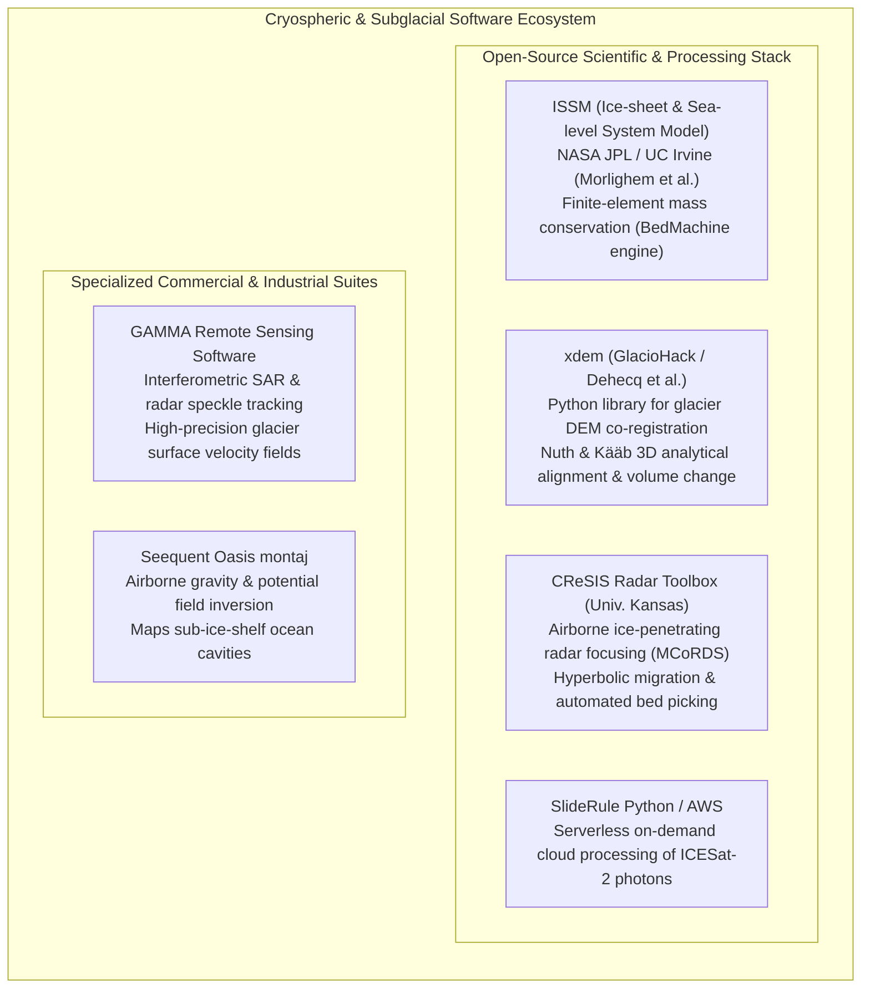

# Chapter 30: Cryospheric and Subglacial / Sub-Ice-Shelf Bed Topography

*Mapping the shifting ice surfaces of the poles and mountain glaciers—and the hidden bedrock continents beneath kilometers of ice.*

---

## 30.5 Software Ecosystem

Processing cryospheric elevation models, inverting subglacial bedrock topography, and analyzing multi-temporal glacier thinning requires software capable of handling petabyte-scale orbital altimetry, specialized radar signal processing, and non-linear finite element continuum mechanics. This section reviews the primary open-source scientific tools and specialized commercial platforms in polar geomatics.



---

### 30.5.1 Open-Source Cryospheric and Geodetic Software

#### 1. ISSM (Ice-sheet and Sea-level System Model): The BedMachine Engine
Developed collaboratively by NASA's Jet Propulsion Laboratory (JPL) and the University of California, Irvine, **ISSM** is a massively parallelized, multi-physics finite element framework:
* **The Mass-Conservation (MC) Module:** Houses the official open-source implementation of the BedMachine algorithm.
* Solves the anisotropic 2D mass conservation PDE on adaptive triangular meshes, optimizing ice thickness against satellite InSAR velocities and airborne radar tracks.
* Coupled to higher-order Stokes ice-flow engines, grounding-line migration modules, and subglacial hydrology solvers.

#### 2. `xdem`: Modern Glaciological DEM Differencing and Co-Registration
Maintained by the GlacioHack open-source community (Amaury Dehecq, Romain Hugonnet, et al.), **`xdem`** is a specialized Python library built on top of `geoutils` and `rasterio`:
* Implements the **Nuth and Kääb (2011)** 3D analytical co-registration algorithm, iteratively solving for horizontal sub-pixel shifts and vertical biases by correlating elevation differences ($\Delta z$) against slope and aspect strictly over **stable, non-glaciated bedrock terrain**.
* Automatically masks out dynamic glacier ice, snowfields, and waterbodies to prevent glacier thinning from corrupting geodetic alignment.
* Computes spatial variograms to model spatial autocorrelation in DEM errors, propagating correlated uncertainties into defensible glacier-wide volumetric mass loss estimates ($\text{Gt/year}$).

```python
"""
Co-register two multi-temporal glacier DEMs and calculate ice elevation change
using open-source xdem and geoutils.
"""

import xdem
import geoutils as gu
import numpy as np

def compute_glacier_thinning(ref_dem_path: str, t2_dem_path: str, glacier_mask_path: str, delta_t_years: float):
    """
    Co-registers two DEMs over stable terrain and computes annual ice thinning rate.
    
    Args:
        ref_dem_path: Baseline DEM GeoTIFF (e.g., ArcticDEM strip from 2012).
        t2_dem_path: Later DEM GeoTIFF (e.g., ArcticDEM strip from 2022).
        glacier_mask_path: Vector shapefile/GeoPackage of glacier outlines (RGI).
        delta_t_years: Elapsed time in decimal years (e.g., 10.0).
    """
    print("Loading multi-temporal elevation rasters...")
    ref_dem = xdem.DEM(ref_dem_path)
    t2_dem = xdem.DEM(t2_dem_path)
    glaciers = gu.Vector(glacier_mask_path)
    
    # Reproject t2_dem to match reference DEM grid exactly
    t2_aligned = t2_dem.reproject(ref_dem)
    
    # Create mask of stable terrain (True where NOT a glacier)
    glacier_mask = glaciers.create_mask(ref_dem)
    stable_mask = ~glacier_mask
    
    print(f"Executing Nuth & Kääb (2011) 3D co-registration over stable terrain...")
    # Nuth & Kääb coregistration solves for horizontal (dx, dy) and vertical (dz) shifts
    nuth_kaab = xdem.coreg.NuthKaab()
    nuth_kaab.fit(ref_dem, t2_aligned, inlier_mask=stable_mask)
    
    print(f"Estimated geodetic offsets: dx={nuth_kaab.meta['offset_east']:.2f}m, "
          f"dy={nuth_kaab.meta['offset_north']:.2f}m, dz={nuth_kaab.meta['bias']:.2f}m")
    
    # Apply transformation to align the second DEM
    t2_coreg = nuth_kaab.apply(t2_aligned)
    
    # Calculate elevation change: dZ = Later - Earlier
    dz = t2_coreg - ref_dem
    
    # Compute annual thinning rate (m/year) strictly across the glacier surface
    glacier_thinning_rate = dz.data[glacier_mask] / delta_t_years
    
    mean_thinning = np.nanmean(glacier_thinning_rate)
    max_thinning = np.nanmin(glacier_thinning_rate) # Minimum dZ represents greatest thinning
    
    print(f"--- Glacier Mass Balance Results ---")
    print(f"Mean Thinning Rate: {mean_thinning:.2f} m/year")
    print(f"Maximum Terminus Drawdown: {max_thinning:.2f} m/year")
    
    return dz
```

#### 3. CReSIS Radar Toolbox
Developed by the Center for Remote Sensing and Integrated Systems at the University of Kansas:
* Parses raw high-bandwidth radio-echo sounding chirps from the **MCoRDS** (Multi-Channel Coherent Radar Depth Sounder) system.
* Executes frequency-wavenumber ($f\text{-}k$) and Synthetic Aperture Radar (SAR) time-domain backprojection to collapse hyperbolic clutter.
* Implements automated Viterbi and level-set algorithms to trace the continuous subglacial bedrock echo beneath deep ice.

#### 4. SlideRule
An open-source serverless platform developed by the University of Washington and NASA:
* Executes high-throughput Python queries directly against NASA's cloud-hosted ICESat-2 **ATL03 (geolocated photons)** and **ATL06 (land ice elevations)** repositories on AWS.
* Enables researchers to extract millions of photon-counting surface profiles across polar ice streams in seconds without downloading multi-gigabyte HDF5 archives.

---

### 29.5.2 Commercial Remote Sensing Suites

#### 1. GAMMA Remote Sensing Software
The global gold standard for commercial and defense radar interferometry:
* **Speckle Tracking Module:** Cross-correlates multi-temporal SAR intensity speckle patterns (from Sentinel-1, TerraSAR-X, or ALOS PALSAR) to calculate precise horizontal ice displacement vectors ($\bar{\mathbf{v}}$) in fast-flowing glaciers where phase coherence is lost.
* Generates the $100\%$-complete surface velocity matrices required as input to BedMachine mass-conservation inversions.

#### 2. Seequent Oasis montaj
The standard software package for processing airborne potential field geophysics:
* Used in polar expeditions to process airborne gravimeter data collected over floating ice shelves.
* Solves 3D Bouguer gravity inversions to infer the thickness of the seawater cavity ($H_{\text{cavity}}$) beneath floating ice shelves where radar fails.
