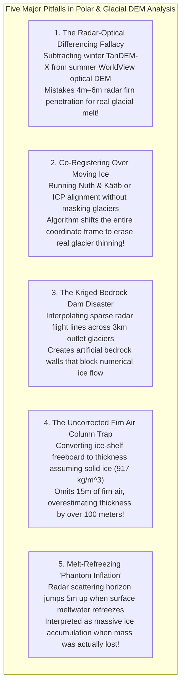

# Chapter 30: Cryospheric and Subglacial / Sub-Ice-Shelf Bed Topography

*Mapping the shifting ice surfaces of the poles and mountain glaciers—and the hidden bedrock continents beneath kilometers of ice.*

---

## 30.6 Common Pitfalls and Key Takeaways

The cryosphere is an unforgiving environment for digital elevation modeling. Volumetric microwave penetration into dry snow, rapid glacial movement, dynamic firn compaction, and the physical breakdown of geometric interpolation between sparse radar tracks create dangerous traps for researchers and climate modelers.

---

### 30.6.1 Common Pitfalls in Cryospheric and Subglacial Modeling

#### 1. The Radar-Optical Cryospheric Differencing Fallacy
* **The Failure Mode:** A glaciologist measures 10-year ice sheet thinning by differencing a 2012 winter TanDEM-X InSAR DEM from a 2022 summer ArcticDEM optical stereopair:
  $$\Delta z = z_{\text{ArcticDEM}}(2022) - z_{\text{TanDEM-X}}(2012)$$
* **Physical Reality:** In dry polar snow, X-band microwaves penetrate **$2.0\text{ to }5.0\text{ meters}$** into the cold firn pack before reflecting from subsurface ice lenses, whereas optical photogrammetry reflects strictly off the upper air-snow interface ($z_{\text{true}}$).
* **Forensic Consequence:** The differencing calculation contains a persistent **$+3.5\text{-meter}$ systematic bias**. In high-altitude interior ice domes where actual elevation changes are only a few centimeters per year, the researcher publishes a headline-grabbing paper claiming the ice sheet is thickening rapidly, when in physical reality it is slowly thinning!
* **Remedy:** Never difference radar and optical DEMs over snow and firn without applying a verified **firn density and microwave penetration model**, or co-registering against multi-temporal spaceborne laser altimetry (ICESat-2).

#### 2. Co-Registering Over Moving Ice Surfaces
* **The Failure Mode:** A GIS analyst aligns two multi-temporal glacier DEMs using standard 3D analytical co-registration (such as Nuth & Kääb or Iterative Closest Point - ICP), running the optimization across the entire bounding box.
* **Geodetic Reality:** Glaciers are active, non-rigid dynamic bodies flowing downhill at speeds of tens to thousands of meters per year, with surfaces actively melting or accumulating snow.
* **Forensic Consequence:** The optimization algorithm attempts to minimize root-mean-square elevation differences across the entire scene. In doing so, it interprets real glacial thinning ($\Delta z < 0$) and horizontal ice flow as geodetic alignment errors, warping the secondary DEM to cancel out the real glaciological change! Surrounding stable bedrock mountains are corrupted by synthetic horizontal and vertical shifts.
* **Remedy:** Always apply a strict **stable terrain mask** (e.g., using the Randolph Glacier Inventory - RGI). Run co-registration algorithms **strictly over stable, non-glaciated bedrock outcrops and nunataks**.

#### 3. The Kriged Bedrock Dam Disaster
* **The Failure Mode:** A polar research institute compiles a national subglacial bedrock DEM by interpolating airborne radar sounding flight lines spaced $15\text{ kilometers}$ apart using standard geostatistical Ordinary Kriging or tension splines.
* **Morphological Reality:** Fast outlet glaciers flow through narrow, deeply incised subglacial bedrock troughs that are only $2\text{ to }4\text{ kilometers}$ wide.
* **Forensic Consequence:** Because the narrow trough runs between the parallel flight lines, the radar lines only capture the high bedrock shoulders on either side. Kriging smoothly bridges the gap between the two high shoulders, **creating an artificial bedrock wall or dam** spanning the canyon. When glaciologists feed this Kriged bed into an ice sheet model, the simulated glacier freezes against the synthetic dam and cannot flow, severely underestimating 21st-century sea-level rise projections.
* **Remedy:** Abandon pure geometric interpolation in regions of fast ice flow. Mandate **Mass-Conservation Bed Inversion (BedMachine)**, which uses satellite InSAR ice velocities to mathematically carve deep subglacial troughs between flight lines.

#### 4. The Uncorrected Firn Air Column Trap
* **The Failure Mode:** An ocean modeler converts satellite laser altimeter freeboard $h_f$ into total ice shelf thickness $H$ using the standard Archimedes equation, assuming the entire column consists of solid bubble-free ice ($\rho_{\text{ice}} = 917\text{ kg/m}^3$).
* **Physical Reality:** The upper $40\text{–}80\text{ meters}$ of an Antarctic ice shelf consists of porous, low-density firn containing an equivalent thickness of **$10\text{ to }25\text{ meters}$ of pure air pore space ($h_{\text{air}}$)**.
* **Forensic Consequence:** Because solid ice density overestimates the mass of the porous firn layer, the uncorrected buoyancy equation:
  $$H_{\text{erroneous}} = \left( \frac{\rho_w}{\rho_w - \rho_{\text{ice}}} \right) h_f \approx 9.26 \cdot h_f$$
  amplifies the missing firn air term by a factor of 9.26! For an ice shelf with $h_f = 60\text{ m}$ and $h_{\text{air}} = 15\text{ m}$, the uncorrected formula predicts a thickness of **$555\text{ meters}$**, whereas the true firn-corrected thickness is **$432\text{ meters}$**—an error of **$123\text{ meters}$ ($28\%$)**! The calculated sub-ice water cavity thickness is crushed, starving simulated sub-ice ocean currents of circulating warm water.
* **Remedy:** Always incorporate regional firn air content ($h_{\text{air}}$) derived from calibrated firn densification models (e.g., FDM) when converting ice-shelf freeboard to total thickness.

#### 5. Melt-Refreezing "Phantom Inflation"
* **The Failure Mode:** An automated satellite radar altimetry pipeline tracks elevation across an interior polar plateau, recording a sudden $+4.0\text{-meter}$ elevation rise over a two-week period.
* **Physical Reality:** During an unseasonable summer heatwave, surface snow melted. When cold weather returned, the percolating meltwater refroze into a continuous, dense, impermeable ice layer just centimeters below the surface.
* **Forensic Consequence:** Prior to the melt, the radar wave penetrated $4\text{–}6\text{ meters}$ into dry firn. Once the refrozen ice lens formed, it acted as a specular reflector, forcing the radar scattering horizon to jump $4.0\text{ meters}$ upward to the surface. The pipeline flagged this as a massive, impossible snowfall event, when in physical reality the ice sheet lost mass to runoff.
* **Remedy:** Cross-reference radar altimetry elevation jumps against spaceborne thermal infrared and microwave radiometer melt-detection flags (e.g., SSM/I or AMSR2 brightness temperature drops).

---

### 30.6.2 Key Takeaways for Practitioners

1. **Radar Does Not Measure the Snow Surface:** In dry polar firn, microwave radar (Ku, X, C-band) penetrates $1\text{ to }15\text{ meters}$ into the snowpack. Never difference radar and optical DEMs without firn penetration modeling.
2. **Never Co-Register Over Moving Glaciers:** Always mask out active glaciers, ice streams, and snowfields; 3D geodetic co-registration must be executed strictly over stable, exposed bedrock outcrops.
3. **Mass Conservation Replaces Kriging for Subglacial Beds:** Standard Kriging creates artificial bedrock dams across narrow outlet glaciers. Physics-informed mass conservation (BedMachine) is mandatory to reconstruct deep subglacial troughs.
4. **Firn Air Dominates Ice Shelf Hydrostatics:** A $1\text{-meter}$ error in firn air content translates into a $\sim 9.3\text{-meter}$ error in ice-shelf thickness and sub-ice cavity depth.
5. **Timestamped DEM Strips Track Dynamics:** Utilize timestamped $2\text{-meter}$ optical stereo strips (ArcticDEM, REMA) to isolate dynamic ice thinning ($\Delta z / \Delta t$) and crevasse propagation across seasonal and decadal baselines.
