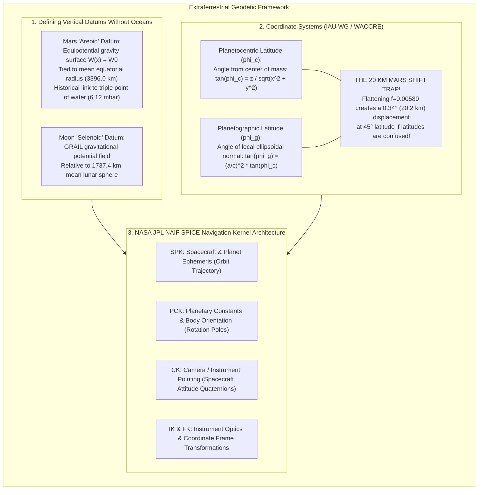
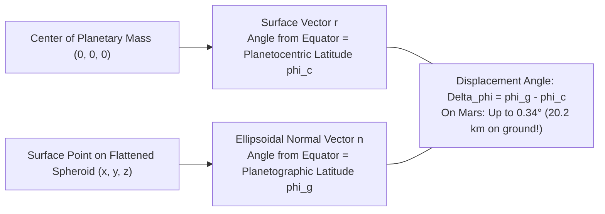
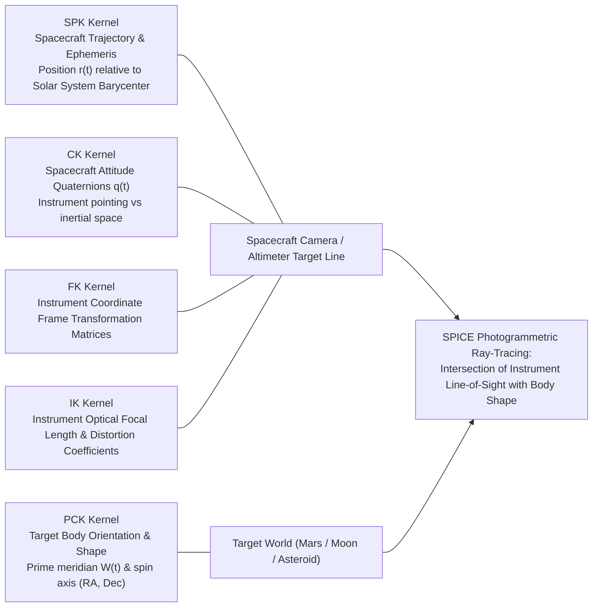

# Chapter 31: Planetary and Extraterrestrial DEMs (Moon, Mars, Asteroids, and Ocean Worlds)

*How mapping worlds without oceans, without GNSS, and sometimes without spherical symmetry forged modern photogrammetry and laser altimetry.*

---

## 31.1 Planetary Geodesy and Vertical Datums Without Oceans

On Earth, all vertical elevations are anchored to an intuitive physical concept: Mean Sea Level. Earth's geoid ($W(\mathbf{x}) = W_0$) is the gravitational equipotential surface that coincides with the undisturbed global ocean surface. 

When mapping the Moon, Mars, Venus, or outer solar system moons, this oceanic baseline disappears. There are no global liquid water oceans to define a zero elevation. Furthermore, extraterrestrial exploration proceeds without Global Navigation Satellite Systems (GNSS): spacecraft have no GPS receivers to fix orbital trajectories, and ground control points (GCPs) cannot be occupied by human surveyors with tripods and prism poles.

Planetary elevation models must be built from first principles of orbital mechanics, Doppler spacecraft radio tracking, spherical harmonic gravitational fields, and the NASA/JPL SPICE navigation kernel architecture.

---

### 31.1.1 Defining Vertical Datums Without Oceans: The Areoid and Selenoid

To define elevation $h$ on an extraterrestrial body, planetary geodesists must define both a geometric reference figure (sphere or triaxial ellipsoid) and a physical equipotential gravity surface.

#### 1. The Mars "Areoid"
On Mars, elevation is referenced to the **Areoid** (analogous to Earth's geoid):
* **Historical Datum (Atmospheric Pressure):** Prior to the 1990s, the zero-elevation level on Mars was arbitrarily defined as the elevation where average atmospheric pressure equaled the **triple point of water ($6.1173\text{ mbar}$ / $611.73\text{ Pa}$)**—the minimum pressure required for liquid water to exist in thermodynamic equilibrium.
* **Modern Geodetic Datum (MOLA Areoid):** Spacecraft Doppler tracking from Mars Global Surveyor (MGS) revealed that Martian atmospheric pressure fluctuates by up to $30\%$ seasonally as carbon dioxide freezes out at the polar ice caps, making an atmospheric datum unusable.
* The modern Martian vertical datum—established by David E. Smith and the MOLA Science Team—is an **equipotential surface of the Martian gravity potential ($W(\mathbf{x}) = W_0$)**:
  $$W_0 = 12,680,000 \text{ m}^2/\text{s}^2$$
  This specific potential value was chosen because its mean radius at the equator coincides exactly with the reference equatorial radius of Mars:
  $$R_{\text{equator}} = 3396.0\text{ kilometers}$$
  Elevations on Mars are reported either as **areocentric radius** ($r$ in meters from the center of mass) or as **areoid elevation** ($H = r - r_{\text{areoid}}$). Mount Olympus rises to $+21,229\text{ meters}$ above the Areoid, while the floor of the Hellas impact basin plunges to $-8,200\text{ meters}$ below the Areoid.

#### 2. The Lunar Reference Frame: The "Selenoid"
The Moon has no atmosphere and negligible rotation-induced flattening ($f \approx 0$).
* **The Lunar Geometric Sphere:** The primary reference figure defined by the International Astronomical Union (IAU) is a sphere of fixed radius:
  $$R_{\text{Moon}} = 1737.4\text{ kilometers}$$
* **The Selenoid:** Using ultra-high-resolution dual-spacecraft inter-satellite tracking from NASA's **GRAIL (Gravity Recovery and Interior Laboratory)** mission, geodesists mapped the Moon's gravity field to spherical harmonic degree and order 1200. The **Selenoid** is the resulting equipotential gravity surface. Because the Moon possesses massive subterranean mass concentrations ("mascons") in its ancient impact basins, the Selenoid undulates by hundreds of meters relative to the mean sphere.

---

### 31.1.2 Planetary Coordinate Conventions: The 20-Kilometer Latitude Trap

Terrestrial geodesists take latitude and longitude conventions for granted. In planetary mapping, coordinate definitions are governed by the **IAU Working Group on Cartographic Coordinates and Rotational Elements (WACCRE)**, which establishes strict geometric distinctions between **planetocentric** and **planetographic** coordinates.

#### 1. Planetocentric vs. Planetographic Latitude
* **Planetocentric Latitude ($\phi_c$):** The angle between the planetary equatorial plane and a straight vector drawn from the planetary center of mass to the surface point:
  $$\tan\phi_c = \frac{z}{\sqrt{x^2 + y^2}}$$
* **Planetographic Latitude ($\phi_g$):** The angle between the equatorial plane and the **local surface normal vector** to the reference oblate spheroid ($a, c$):
  $$\tan\phi_g = \left( \frac{a}{c} \right)^2 \tan\phi_c = \frac{1}{(1 - f)^2} \tan\phi_c$$
  where $a$ is the equatorial radius, $c$ is the polar radius, and $f = \frac{a - c}{a}$ is flattening.

#### 2. The 20-Kilometer Mars Shift Blunder
Because Mars is an oblate planet ($a = 3396.19\text{ km}, c = 3376.20\text{ km}$, flattening $f \approx 0.00589$):
$$\tan\phi_g = \frac{1}{(1 - 0.00589)^2} \tan\phi_c \approx 1.01189 \cdot \tan\phi_c$$

The angular difference $\Delta \phi = \phi_g - \phi_c$ reaches its maximum at $45^\circ$ latitude:
$$\Delta \phi_{\max} \approx f \sin(2\phi) \text{ radians} \approx 0.00589 \times \sin(90^\circ) \text{ rad} \approx 0.00589 \text{ rad} \approx 0.3375^\circ \approx 20.25'$$

Multiplying by the Martian radius ($R \approx 3386\text{ km}$):
$$\Delta s = R \cdot \Delta \phi \approx 3386\text{ km} \times 0.00589\text{ rad} \approx \mathbf{19.95\text{ kilometers}}$$

* **The Forensic Disaster:** If an engineer programming an entry, descent, and landing (EDL) sequence for a Mars rover (such as *Curiosity* or *Perseverance*) downloads a high-resolution HiRISE DEM generated in **planetocentric coordinates** and feeds it into an navigation computer expecting **planetographic coordinates**, the spacecraft targets a landing point **$20\text{ kilometers}$ away**, slamming into a crater rim or boulder field.

#### 3. Longitude Conventions: East vs. West Positive
Under IAU rules:
* For bodies with direct (prograde) rotation (Mars, Moon, Mercury), longitude increases **Eastward from $0^\circ$ to $360^\circ$**.
* However, historical Mars maps (USGS Mariner 9 and Viking series) used **West-positive longitude ($0^\circ\text{–}360^\circ\text{ W}$)**. Ingesting historical datasets into modern GIS without checking longitude orientation flips the digital elevation model backwards across the central meridian!

---

### 31.1.3 The NASA JPL SPICE Observation Geometry Architecture

Planetary elevation modeling cannot rely on post-processed kinematic GPS trajectories. Every photogrammetric ray, laser altimeter bounce, and radar echo must be reconstructed using NASA's **SPICE** system, maintained by JPL's Navigation and Ancillary Information Facility (NAIF):

* **SPK (Spacecraft and Planet Ephemeris):** Contains position vectors $\mathbf{r}(t)$ and velocity vectors $\mathbf{v}(t)$ of the spacecraft, planets, and moons relative to the Solar System Barycenter (J2000 inertial frame).
* **PCK (Planetary Constants Kernel):** Defines the size, triaxial shape, and time-dependent rotational orientation (Right Ascension $\alpha_0$, Declination $\delta_0$, and prime meridian angle $W(t)$) of the target planet or moon.
* **CK (C-matrix Kernel):** High-frequency orientation records containing telemetry quaternions $\mathbf{q}(t)$ from star trackers and IMUs, defining how the spacecraft body was pointed at the microsecond the camera shutter opened.
* **IK (Instrument Kernel):** Optical geometry parameters: focal lengths, pixel pitches, optical distortion polynomials, and detector boresight alignments.
* **FK (Frame Kernel):** Transformation matrices linking the spacecraft coordinate frame, instrument frame, and planet-fixed reference frames.

By querying the SPICE library (via C, Fortran, or Python `SpiceyPy`), planetary processing toolchains (USGS ISIS3, NASA Ames Stereo Pipeline) reconstruct the exact 3D ray trajectory of every laser pulse and image pixel without requiring terrestrial ground control stations.
