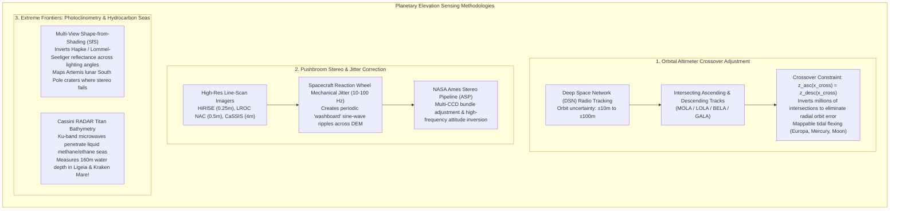
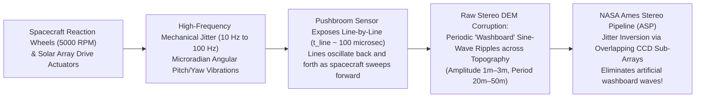
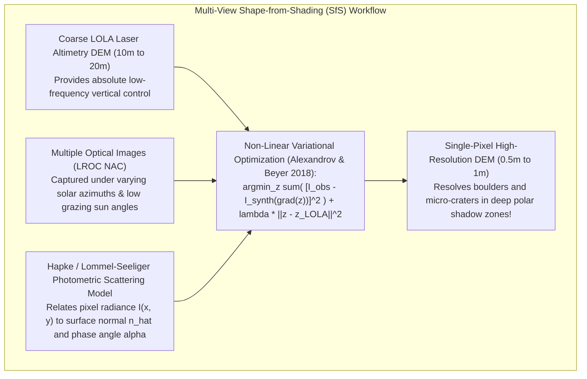
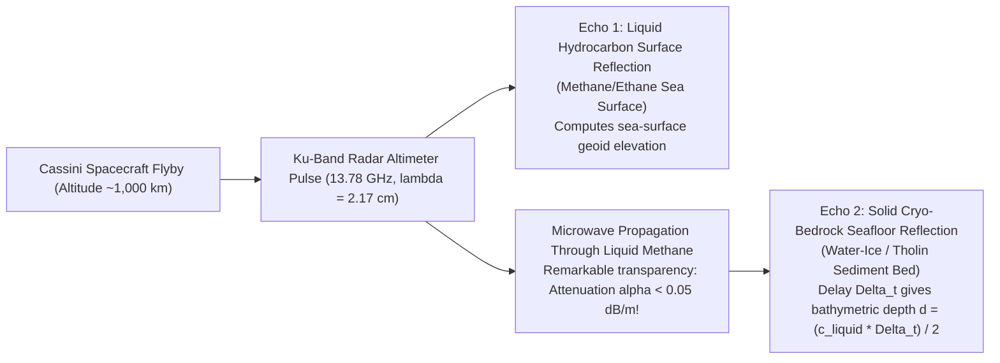

# Chapter 31: Planetary and Extraterrestrial DEMs (Moon, Mars, Asteroids, and Ocean Worlds)

*How mapping worlds without oceans, without GNSS, and sometimes without spherical symmetry forged modern photogrammetry and laser altimetry.*

---

## 31.2 Planetary Laser Altimetry, Stereo Photogrammetry, and Photoclinometry

Mapping alien worlds requires overcoming severe observational constraints: spacecraft operate hundreds of millions of kilometers from Earth without GPS, orbital pushbroom cameras shake under spacecraft reaction-wheel vibrations, lunar polar craters lurk in eternal shadow, and on Saturn's moon Titan, oceans are made of liquid methane.

To build rigorous elevation models under these conditions, planetary scientists developed pioneering geodetic and computer vision techniques: **altimeter orbit crossover adjustments**, **sub-pixel pushbroom jitter modeling**, **multi-view photoclinometry (Shape-from-Shading)**, and **radar bathymetry through cryogenic hydrocarbon seas**.

---

### 31.2.1 Orbit Crossover Adjustment: Self-Consistent Planetary Geodesy

When NASA's Mars Global Surveyor (MGS) launched with the Mars Orbiter Laser Altimeter (MOLA) or Lunar Reconnaissance Orbiter (LRO) launched with the Lunar Orbiter Laser Altimeter (LOLA), spacecraft trajectory was estimated solely from Earth-based Deep Space Network (DSN) Doppler radio tracking:
* Due to unmodeled planetary gravitational anomalies and solar radiation pressure, initial orbital position uncertainty was **$\pm 10\text{ to }\pm 50\text{ meters}$ radially**.
* If raw laser altimeter tracks were simply projected onto a grid, the resulting DEM was crisscrossed by artificial elevation steps between adjacent orbits.

#### The Crossover Mathematical Solution
Because orbital planes precess over an oblate rotating body, polar-orbiting satellites create a dense, diamond-shaped lattice of intersecting tracks:
* Let orbit $i$ (an ascending track) and orbit $j$ (a descending track) intersect at geographic coordinate $\mathbf{x}_{ij}$.
* Under the assumption that the planetary surface is static, the true surface elevation at the intersection point must be identical:
  $$z_{\text{true}}(\mathbf{x}_{ij}) = z_i(\mathbf{x}_{ij}) - \Delta r_i(t) = z_j(\mathbf{x}_{ij}) - \Delta r_j(t)$$
* The **crossover residual** is:
  $$\Delta z_{ij} = z_i(\mathbf{x}_{ij}) - z_j(\mathbf{x}_{ij})$$
* Over an entire mission, MOLA recorded over **$800,000$ crossover points**; LOLA recorded over **$20\text{ million}$ crossovers**.
* Formulating a global least-squares inversion, geodesists solve for a continuous, time-dependent radial orbit correction polynomial $\Delta r(t)$ for every orbit pass.
* *Result:* Orbit crossover adjustment reduced MOLA's radial orbit error from $\pm 30\text{ meters}$ to **$<30\text{ centimeters}$**, creating a rigid, global geodetic elevation framework for Mars that serves as the ground truth for all subsequent rover missions.
* *Tidal Flexing Detection:* On tidally distorted bodies (such as Mercury with MESSENGER/BELA, or Jupiter's icy moon Ganymede with ESA JUICE/GALA), crossover residuals do not sum to zero; instead, they oscillate periodically with orbital true anomaly, allowing geodesists to directly measure the **Love number $h_2$** and determine whether a subsurface liquid water ocean decouples the crust from the core!

---

### 31.2.2 Pushbroom Stereophotogrammetry and Spacecraft Jitter

High-resolution planetary cameras (such as the High Resolution Imaging Science Experiment - HiRISE on MRO at $0.25\text{ m/pixel}$, or the Lunar Reconnaissance Orbiter Camera - LROC NAC at $0.5\text{ m/pixel}$) are not framing cameras; they are **pushbroom line-scan sensors**.

#### 1. The Spacecraft Jitter Mechanism
A pushbroom camera exposes one linear row of pixels at a time (exposure time $t_{\text{line}} \approx 100\,\mu\text{s}$) as the spacecraft sweeps forward along its orbital track.
* Spacecraft orientation is stabilized by high-speed **reaction wheels** spinning at thousands of RPM. Minor mechanical imbalances in the wheel bearings, combined with solar array stepper motors and cryo-cooler Stirling cycles, transmit high-frequency micro-vibrations (**jitter**, $10\text{–}100\text{ Hz}$) through the spacecraft bus.
* As the line-scan sensor sweeps forward, an angular pitch vibration of only **$5\text{ microradians}$** shifts the line on the ground by $1.5\text{ meters}$ for a spacecraft orbiting at $300\text{ km}$ altitude.
* When two jitter-affected images are processed through standard stereophotogrammetric block correlation, the resulting DEM displays pervasive, periodic sine-wave ripples across the terrain—the notorious **"washboard effect"**. Real geological craters and sand dunes are overlaid by artificial $1\text{–}3\text{ meter}$ corrugations.

#### 2. Jitter Inversion in the NASA Ames Stereo Pipeline (ASP)
The **NASA Ames Stereo Pipeline (ASP)** (Beyer et al. 2018) solves for jitter by exploiting multi-CCD detector architecture:
* High-resolution cameras (like HiRISE) feature multiple overlapping linear CCD chips staggered across the focal plane.
* Features in the overlap zone are imaged twice, separated by a fraction of a millisecond.
* ASP executes cross-correlation between overlapping CCD channels, measuring high-frequency disparity shifts and directly inverting for the continuous time-series of spacecraft attitude jitter $\Delta \mathbf{q}(t)$.
* Correcting the SPICE camera pointing kernel with this inverted jitter function flattens the washboard ripples, yielding pristine, sub-meter bare-ground DEMs used to certify Mars rover landing ellipses.

---

### 31.2.3 Shape-from-Shading (Photoclinometry) in Lunar Polar Craters

At the lunar South Pole—the target of the NASA Artemis human exploration program and international robotic landers—the Moon's spin axis is tilted by only $1.54^\circ$ relative to the ecliptic:
* Sunlight strikes the polar terrain at grazing angles ($<1.5^\circ$), casting long, pitch-black shadows across impact craters.
* Deep crater interiors (such as Shackleton, Faustini, and Shoemaker) receive zero direct sunlight, forming **Permanently Shadowed Regions (PSRs)** that act as cold traps for volatile water ice at temperatures below $40\text{ Kelvin}$.
* **The Stereo Failure:** Standard photogrammetric stereo matching requires high-contrast surface texture visible in both images. In lunar polar terrain, severe shadows create vast black voids where stereo correlation fails completely ($0\%$ matching).

#### The Multi-View Shape-from-Shading (SfS) Solution
Pioneered by Oleg Alexandrov and Ross Beyer at NASA Ames, **Multi-View Shape-from-Shading (Photoclinometry)** reconstructs elevation directly from pixel brightness gradients:
* Under the **Lommel-Seeliger** or **Hapke** photometric scattering law, the radiance $I$ reflected by lunar regolith is a known non-linear function of the surface normal $\hat{\mathbf{n}} = \frac{(-p, -q, 1)^T}{\sqrt{1 + p^2 + q^2}}$, the illumination vector $\hat{\mathbf{s}}$, and the viewing vector $\hat{\mathbf{v}}$:
  $$I_{\text{synth}}(\mathbf{x}) = \mathcal{R}\left( \frac{\partial z}{\partial x}, \, \frac{\partial z}{\partial y}, \, \hat{\mathbf{s}}, \, \hat{\mathbf{v}} \right)$$
* By capturing images of the same crater illuminated at different solar azimuths throughout the lunar year, the system solves a non-linear PDE constrained by sparse LOLA laser altimeter profiles:
  $$\min_z \iint \sum_{k=1}^K \Big( I_{\text{obs}, k}(\mathbf{x}) - I_{\text{synth}, k}(\nabla z) \Big)^2 dx \, dy + \lambda \sum_{i} \big( z(\mathbf{x}_i) - z_{\text{LOLA}, i} \big)^2$$
* *Result:* Photoclinometry enhances coarse $20\text{-meter}$ LOLA altimetry into **$0.5\text{-meter}$ resolved 3D elevation models**, revealing subtle crater slopes and meter-scale boulder hazards within Artemis landing sites.

---

### 31.2.4 Radar Altimetry Through Cryogenic Hydrocarbon Seas: Titan

One of the most extraordinary bathymetric achievements in planetary science occurred during NASA's Cassini mission to Saturn's giant moon **Titan**:
* Titan is the only body in the solar system besides Earth with liquid seas on its surface. However, at surface temperatures of $94\text{ Kelvin}$ ($-179^\circ\text{C}$), these seas—**Ligeia Mare**, **Kraken Mare**, and **Punga Mare**—are composed of liquid methane ($CH_4$), liquid ethane ($C_2H_6$), and dissolved nitrogen ($N_2$).

#### The Physics of Liquid Methane Bathymetry
* In Earth's salty oceans, radar waves attenuate within centimeters. But pure non-polar liquid hydrocarbons ($CH_4$ and $C_2H_6$) have an exceptionally low dielectric loss tangent:
  $$\tan\delta = \frac{\epsilon''}{\epsilon'} \approx 10^{-5} \text{ to } 10^{-4}$$
* Liquid methane is **optically and electrodynamically transparent** to Cassini's Ku-band ($13.78\text{ GHz}$) radar altimeter!
* During the T91 and T104 flybys over Ligeia Mare, Cassini's radar altimeter fired pulses into the sea:
  1. The detector recorded a sharp, specular reflection from the **liquid sea surface**.
  2. The wave propagated through the cryogenic liquid with minimal attenuation ($\alpha < 0.05\text{ dB/m}$).
  3. A distinct secondary reflection arrived milliseconds later, reflecting off the **solid seabed beneath the sea**!
* By measuring the two-way travel time delay $\Delta t$ and computing the speed of light in liquid methane ($c_{\text{liquid}} = \frac{c_0}{\sqrt{\epsilon_{\text{liquid}}}} \approx \frac{3 \times 10^8}{\sqrt{1.72}} \approx 228,800\text{ km/s}$), planetary scientists directly measured the **bathymetry of an extraterrestrial ocean**, proving that *Ligeia Mare* reaches depths of **$160\text{ to }200\text{ meters}$**.
