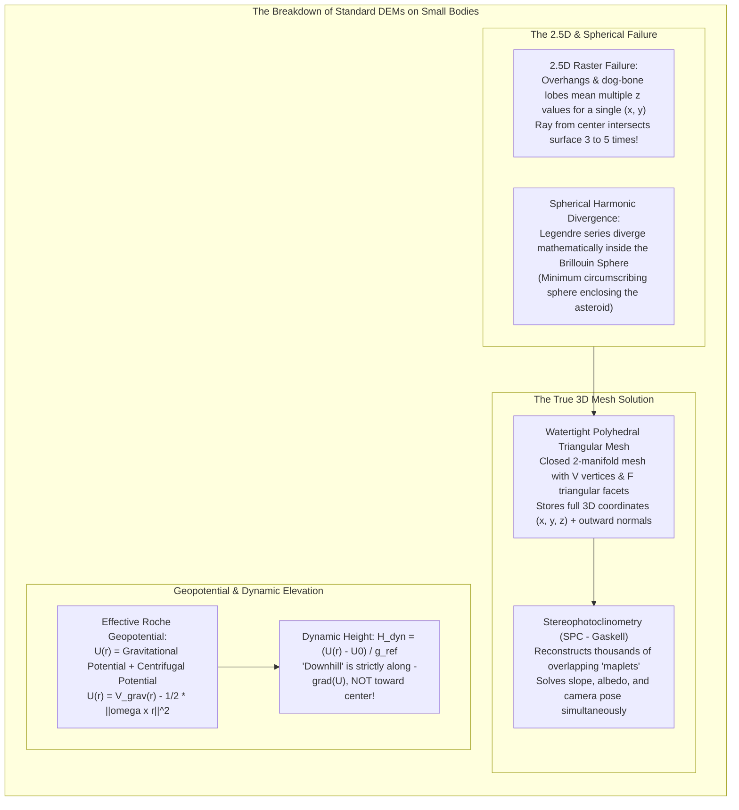
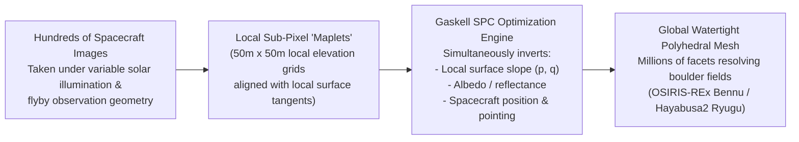

# Chapter 31: Planetary and Extraterrestrial DEMs (Moon, Mars, Asteroids, and Ocean Worlds)

*How mapping worlds without oceans, without GNSS, and sometimes without spherical symmetry forged modern photogrammetry and laser altimetry.*

---

## 31.3 Non-Spherical Small Bodies: Asteroids and Comets

On planets and large moons (Earth, Mars, the Moon), gravity is strong enough to force the body into hydrostatic equilibrium, creating a near-spherical oblate spheroid. On small solar system bodies—asteroids, comets, and small moons—self-gravity is too weak to overcome material shear strength. 

Bodies like comet **67P/Churyumov-Gerasimenko**, asteroid **Eros**, asteroid **Itokawa**, and rubble-piles like **Bennu** and **Ryugu** exhibit bifurcated lobes, vast overhangs, and extreme irregular geometry. In these environments, **all standard GIS conventions collapse**: 2.5D raster grids cannot represent the multi-valued surface, spherical harmonic series diverge mathematically, and "downhill" is governed by a complex, rotating Roche geopotential where boulders can roll outward away from the center of mass.

---

### 31.3.1 The Breakdown of 2.5D Grids and the Brillouin Sphere

Attempting to represent a small body (such as asteroid 433 Eros or comet 67P) using a standard digital elevation raster $z = f(x, y)$ or a spherical coordinate radius grid $r = f(\lambda, \phi)$ fails due to fundamental geometry:

#### 1. Multi-Valued Surfaces and Overhangs
On a contact binary or "dog-bone" body (e.g., Comet 67P with its two distinct lobes connected by a narrow neck):
* A single radial vector originating from the center of mass $(0, 0, 0)$ can penetrate through the "head," exit into empty space, enter the "neck," exit again, and enter the "body."
* The surface radius $r(\lambda, \phi)$ has multiple values along the same line of sight. A standard 2.5D raster grid cannot store more than one height per coordinate, completely erasing undercuts, caves, and overhangs.

#### 2. The Brillouin Sphere Divergence
In global geodesy, planetary shapes and gravity fields are modeled using **spherical harmonic expansions**:
$$V(r, \theta, \phi) = \frac{GM}{r} \sum_{n=0}^\infty \sum_{m=0}^n \left( \frac{R_{\text{ref}}}{r} \right)^n P_{nm}(\cos\theta) \big( C_{nm}\cos m\phi + S_{nm}\sin m\phi \big)$$

* **The Mathematical Catastrophe:** In potential theory, a spherical harmonic series is guaranteed to converge **if and only if** the evaluation point lies outside the **Brillouin Sphere** (the minimum sphere circumscribed about the body's center of mass that encloses all mass elements).
* For an elongated asteroid like Eros ($34\text{ km} \times 11\text{ km} \times 11\text{ km}$), the Brillouin sphere has a radius of $17\text{ km}$.
* Any point in the asteroid's equatorial waist sits at $r \approx 5.5\text{ km}$—far *inside* the Brillouin sphere!
* Evaluating spherical harmonics inside the Brillouin sphere causes the Legendre series to diverge uncontrollably toward infinity, producing wild oscillations of millions of meters. Spherical harmonics are mathematically invalid for irregular small bodies.

---

### 31.3.2 3D Polyhedral Models and Stereophotoclinometry (SPC)

To map irregular asteroids, geodesists represent the surface as an explicit **Watertight Polyhedral Triangular Mesh**:
* A closed, oriented topological 2-manifold surface composed of $V$ vertices $\mathbf{v}_i \in \mathbb{R}^3$ connected by $F$ planar triangular facets $f_j = (v_{j, 1}, v_{j, 2}, v_{j, 3})$.
* Every facet has an explicit unit normal vector $\hat{\mathbf{n}}_j$ and surface area $A_j$.

#### Stereophotoclinometry (SPC - Robert Gaskell)
The operational gold standard for small-body reconstruction—used by NASA's OSIRIS-REx mission at asteroid Bennu, JAXA's Hayabusa2 at Ryugu, and NASA's Dawn at Vesta and Ceres—is **Stereophotoclinometry (SPC)**, developed by Robert Gaskell at JPL:
1. **Maplet Architecture:** The asteroid is tiled into thousands of overlapping square surface patches called **maplets** (typically $99\times 99$ or $199\times 199$ elevation nodes aligned with the local surface tangent plane).
2. **Joint Inversion:** Instead of separating stereo matching from photoclinometry, SPC inverts hundreds of spacecraft images taken under different sun angles simultaneously. The algorithm solves for the local slope $(p, q)$, the physical surface albedo, and the precise spacecraft camera pointing vectors in a single least-squares optimization.
3. **Global Assembly:** The individual overlapping maplets are merged into a unified, seamless 3D polyhedral mesh, achieving sub-decimeter surface resolution capable of resolving individual centimeter-scale gravel stones on rubble-pile asteroids.

---

### 31.3.3 Dynamic Elevation and the Effective Roche Geopotential

On Earth, water flows downhill, and "elevation" corresponds closely to geometric height above a sphere because Earth rotates slowly ($\omega \approx 7.29 \times 10^{-5}\text{ rad/s}$) and gravity is strong ($g \approx 9.81\text{ m/s}^2$).

On small, rapidly rotating asteroids (such as Bennu, rotating every $4.3\text{ hours}$, or Ryugu, rotating every $7.6\text{ hours}$):
* Gravity is miniscule ($g \approx 10^{-5}\text{ to }10^{-4}\text{ m/s}^2$).
* Centrifugal acceleration $\mathbf{a}_{\text{cent}} = \boldsymbol{\omega} \times (\boldsymbol{\omega} \times \mathbf{r})$ is comparable in magnitude to gravitational attraction.
* **The Perceptual Paradox:** The geometric summit of an asteroid (the point with the greatest distance $r$ from the center of mass) is frequently a **gravitational depression**! Loose gravel and boulders roll *away* from the center of mass toward the equator.

#### 1. The Effective Roche Potential
In a body-fixed rotating coordinate frame, the total acceleration acting on a particle on the surface is the gradient of the **Effective Geopotential $U(\mathbf{r})$**:

$$U(\mathbf{r}) = V_{\text{grav}}(\mathbf{r}) + \Phi_{\text{centrifugal}}(\mathbf{r})$$

$$U(\mathbf{r}) = -G \iiint_{\mathcal{B}} \frac{\rho(\mathbf{r}')}{\|\mathbf{r} - \mathbf{r}'\|} \, dV' - \frac{1}{2} \|\boldsymbol{\omega} \times \mathbf{r}\|^2$$
where:
* $G$: Universal gravitational constant ($6.6743 \times 10^{-11}\text{ m}^3\text{kg}^{-1}\text{s}^{-2}$).
* $\rho(\mathbf{r}')$: Bulk density distribution inside the asteroid volume $\mathcal{B}$.
* $\boldsymbol{\omega}$: Planetary angular rotation vector ($\text{rad/s}$).

The effective gravity vector (the direction of a plumb line on the asteroid) is:
$$\mathbf{g}_{\text{eff}}(\mathbf{r}) = -\nabla U(\mathbf{r})$$

#### 2. Defining "Dynamic Height" (Geopotential Elevation)
On an asteroid, **geometrical distance from the center of mass is irrelevant to physics**. A boulder rolls, dust migrates, and a landing spacecraft settles strictly according to the **Effective Geopotential**:

Let $U_0$ be a reference geopotential level (e.g., the potential of the minimum-energy point or mean equatorial surface), and let $g_{\text{ref}}$ be a nominal reference surface gravity. The **Dynamic Elevation (Dynamic Height)** is defined as:

$$H_{\text{dynamic}}(\mathbf{r}) = \frac{U(\mathbf{r}) - U_0}{g_{\text{ref}}}$$

* **Physical Behavior:**
  * Water, dust, and boulders always flow strictly from **high dynamic elevation to low dynamic elevation** ($-\nabla U$).
  * On "top-shaped" rubble-pile asteroids like Bennu and Ryugu, centrifugal acceleration at the equator counteracts gravity so strongly that the elevated equatorial ridge represents the **lowest geopotential energy state**. Boulders roll "uphill" geometrically from the mid-latitudes toward the equator!
  * Mapping an asteroid for spacecraft landing (such as OSIRIS-REx's *Nightingale* sample collection site) requires rendering the surface not in meters of radius, but in **geopotential slope angle $\theta_{\text{slope}} = \arccos\left( \frac{-\mathbf{g}_{\text{eff}} \cdot \hat{\mathbf{n}}}{\|\mathbf{g}_{\text{eff}}\|} \right)$** and **dynamic elevation**, ensuring the lander does not touch down on a slope that causes it to slide into space.
