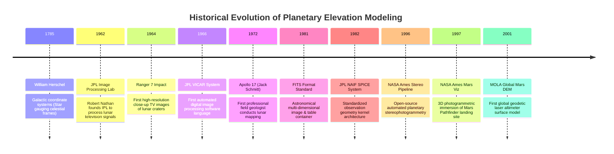

# Chapter 31: Planetary and Extraterrestrial DEMs (Moon, Mars, Asteroids, and Ocean Worlds)

*How mapping worlds without oceans, without GNSS, and sometimes without spherical symmetry forged modern photogrammetry and laser altimetry.*

---

## 31.4 Historical Evolution: From Ranger 7 to the Ames Stereo Pipeline

The methods used to process planetary digital elevation models did not originate in civilian commercial GIS; they were forged inside NASA, the Jet Propulsion Laboratory (JPL), and the US Geological Survey Astrogeology Science Center during the early space race. The milestones below, anchored in the `schwehr/gis-history` repository, trace the technical evolution of extraterrestrial elevation modeling from 1960s analog vidicon tubes to petascale automated stereopipelines.

---

### 31.4.1 The Lunar Space Race and Digital Image Processing: 1962 to 1972

#### 1962: Foundation of the JPL Image Processing Laboratory (IPL)
In 1962, Dr. Robert Nathan at the Jet Propulsion Laboratory founded the **Image Processing Laboratory (IPL)**. Tasked with handling incoming telemetry from the Ranger, Surveyor, and Mariner spacecraft, Nathan recognized that analog television signals transmitted across space suffered from geometric distortion, vidicon camera non-linearities, and telemetry noise. The IPL invented fundamental computer vision operations—digital filtering, contrast enhancement, geometric re-sampling, and photometric calibration—that laid the foundation for modern digital remote sensing.

#### 1964: Ranger 7 Lunar Impact
On July 31, 1964, **Ranger 7** transmitted $4,308$ television photographs during the final 17 minutes of its descent before crashing into Mare Cognitum. The images revealed meter-scale craters, confirming that the lunar surface was firm enough to support the landing gear of the Apollo Lunar Module, disproving theories that spacecraft would sink into meters of loose dust.

#### 1966: The VICAR Processing Language
JPL developed **VICAR (Video Image Communication and Retrieval)**:
* Operating on IBM 360/370 mainframes, VICAR was the world's first domain-specific language designed specifically for digital image processing and planetary cartography.
* VICAR introduced image label headers storing camera focal lengths, geometric reseau mark positions, and photometric flat-field corrections, establishing the architectural paradigm later inherited by the USGS ISIS (Integrated Software for Imagers and Spectrometers) system.

#### 1972: Apollo 17 and Field Geodesy at Taurus-Littrow
In December 1972, Apollo 17 landed in the Taurus-Littrow valley. Crew member Dr. Harrison "Jack" Schmitt—the only professional geologist to fly to the Moon—conducted intensive field geodetic mapping:
* Using hand-held gnomons with calibrated color scales and metric stadia rods, Schmitt documented micro-relief, boulder distributions, and pyroclastic orange volcanic soils.
* The Apollo 17 Metric and Panoramic cameras captured mapping photography that the USGS Astrogeology Science Center used on optical stereoplotters to produce the first high-precision $1:25,000$ contour maps of an alien world.

---

### 31.4.2 Standards and Planetary Observation Geometry: 1981 to 1982

#### 1981: The FITS Format
Astronomers standardized the **Flexible Image Transport System (FITS)**, sponsored by the IAU and NASA. FITS provided an open, non-proprietary format incorporating multi-dimensional arrays (cubes) and self-describing ASCII header keywords, enabling international exchange of extraterrestrial imagery and spectral cubes.

#### 1982: The JPL NAIF SPICE System
As interplanetary missions expanded across the solar system (Voyager, Galileo, Magellan), navigation engineers faced a chaotic mess of custom coordinate systems and proprietary ephemeris files. In 1982, NASA established the **Navigation and Ancillary Information Facility (NAIF)** at JPL under Charles Acton:
* Acton created the **SPICE system**: a modular suite of binary kernels (`SPK`, `PCK`, `CK`, `IK`, `FK`) paired with a multi-language library (SPICELIB, CSPICE, SpiceyPy).
* SPICE provided a universal mathematical API to compute spacecraft trajectories, camera pointing angles, target planet rotations, and photogrammetric line-of-sight ray intersections relative to the Solar System Barycenter at any microsecond in history. Today, no planetary digital elevation model can be constructed without SPICE.

---

### 31.4.3 The Automated Pipeline and Virtual Reality Era: 1996 to 2001

#### 1996: The NASA Ames Stereo Pipeline (ASP)
At NASA Ames Research Center in Mountain View, California, computer scientists and planetary geologists developed the **Ames Stereo Pipeline (ASP)** (Moratto, Broxton, Beyer, Alexandrov):
* Abandoned manual stereoplotters in favor of fully automated, open-source multi-view stereophotogrammetry.
* Implemented **epipolar line-scan rectification** and **hierarchical sub-pixel cross-correlation**, allowing scientists to process raw pushbroom images from Mars (HiRISE, CTX), the Moon (LROC NAC), and Mercury (MDIS) into metric DEMs on Linux clusters.
* Introduced continuous spacecraft attitude jitter solving and multi-view shape-from-shading.

#### 1997: NASA Ames Virtual Reality (Viz) and Mars Pathfinder
In July 1997, Mars Pathfinder landed at Ares Vallis. The NASA Ames Intelligent Mechanisms Group used automated stereo photogrammetry from the lander's IMP (Imager for Mars Pathfinder) dual cameras to reconstruct the first textured 3D digital elevation model of a planetary landing site. Using head-mounted displays and SGI Onyx supercomputers, scientists walked through a virtual-reality simulation of the Martian surface, selecting science targets for the *Sojourner* rover.

#### 2001: MOLA and the Global Topography of Mars
In 2001, David E. Smith, Maria Zuber, and the MOLA Science Team published the definitive global topographic map of Mars derived from over **670 million laser altimeter pulses** collected by Mars Global Surveyor. With orbital crossover corrections reducing vertical uncertainties to $<30\text{ cm}$, MOLA revealed the giant crustal dichotomy between the rugged Southern Highlands and the smooth Northern Lowlands, discovering ancient buried river networks and establishing the geodetic reference surface for all modern Martian cartography.
