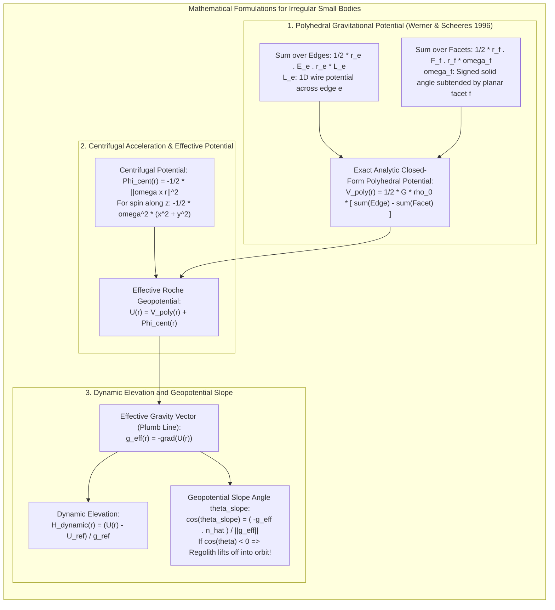

# Chapter 31: Planetary and Extraterrestrial DEMs (Moon, Mars, Asteroids, and Ocean Worlds)

*How mapping worlds without oceans, without GNSS, and sometimes without spherical symmetry forged modern photogrammetry and laser altimetry.*

---

## 31.5 Mathematical Foundations of Small-Body Geopotential and Polyhedral Elevation

On irregular, rapidly rotating asteroids and comets, geometric radius ($r$) bears no physical relationship to the flow of loose regolith or the stability of landing spacecraft. Defining elevation on an asteroid requires solving the **Werner-Scheeres polyhedral gravitational potential** and combining it with the centrifugal acceleration to evaluate the **Effective Roche Geopotential** and **Dynamic Elevation**.

---

### 31.5.1 The Werner-Scheeres Polyhedral Gravitational Formulation

In classical geodesy, gravitational potential is computed using point-mass approximations or spherical harmonics. But inside the Brillouin sphere of an irregular body, spherical harmonics diverge. 

In a landmark paper, Robert A. Werner and Daniel J. Scheeres (1996) derived the exact, closed-form analytic solution for the gravitational potential $V(\mathbf{r})$ of an arbitrary homogeneous polyhedral solid bounded by planar triangular facets.

#### 1. Geometric Mesh Definitions
Let the asteroid volume $\mathcal{B}$ be bounded by a watertight polyhedral surface consisting of:
* $V$ vertices $\mathbf{v}_i \in \mathbb{R}^3$.
* $E$ edges $e$, each characterized by a vector $\mathbf{r}_e$ from field point $\mathbf{r}$ to an edge point.
* $F$ triangular facets $f$, each defined by an outward unit normal vector $\hat{\mathbf{n}}_f$ and plane offset vector $\mathbf{r}_f = \mathbf{x}_f - \mathbf{r}$.

#### 2. The Analytic Potential Equation
Under constant bulk density $\rho_0$, the exact Newtonian gravitational potential at field point $\mathbf{r}$ is:

$$V_{\text{poly}}(\mathbf{r}) = \frac{1}{2} G \rho_0 \left[ \sum_{e \in E} \big(\mathbf{r}_e \cdot \mathbf{E}_e \cdot \mathbf{r}_e\big) \cdot L_e(\mathbf{r}) - \sum_{f \in F} \big(\mathbf{r}_f \cdot \mathbf{F}_f \cdot \mathbf{r}_f\big) \cdot \omega_f(\mathbf{r}) \right]$$
where:
* $G$: Universal gravitational constant ($6.6743 \times 10^{-11}\text{ m}^3\text{kg}^{-1}\text{s}^{-2}$).
* $\mathbf{F}_f = \hat{\mathbf{n}}_f \hat{\mathbf{n}}_f^T$: The facet normal projection dyad ($3\times 3$ outer product matrix).
* $\mathbf{E}_e = \hat{\mathbf{n}}_{f1} \hat{\mathbf{n}}_{e, f1}^T + \hat{\mathbf{n}}_{f2} \hat{\mathbf{n}}_{e, f2}^T$: The edge dyadic matrix combining the normals of the two facets meeting at edge $e$.
* $\omega_f(\mathbf{r})$: The signed solid angle subtended by planar facet $f$ as viewed from point $\mathbf{r}$.
* $L_e(\mathbf{r})$: The 1D line-potential of edge $e$ of length $l_e$ between endpoints $\mathbf{p}_1$ and $\mathbf{p}_2$:
  $$L_e(\mathbf{r}) = \ln\left( \frac{r_1 + r_2 + l_e}{r_1 + r_2 - l_e} \right)$$
  where $r_1 = \|\mathbf{p}_1 - \mathbf{r}\|$ and $r_2 = \|\mathbf{p}_2 - \mathbf{r}\|$.

#### 3. Gravitational Acceleration Vector
Differentiating the potential yields the exact gravitational acceleration vector:

$$\mathbf{g}_{\text{grav}}(\mathbf{r}) = -\nabla V_{\text{poly}}(\mathbf{r}) = -G \rho_0 \left[ \sum_{e \in E} \mathbf{E}_e \cdot \mathbf{r}_e \cdot L_e(\mathbf{r}) - \sum_{f \in F} \mathbf{F}_f \cdot \mathbf{r}_f \cdot \omega_f(\mathbf{r}) \right]$$

---

### 31.5.2 Centrifugal Potential and the Effective Roche Geopotential

Small bodies rotate rapidly. Let the body rotate with constant angular velocity vector $\boldsymbol{\omega}$ aligned with the body-fixed $+z$ principal axis of inertia:
$$\boldsymbol{\omega} = \begin{pmatrix} 0 \\ 0 \\ \omega \end{pmatrix}$$

The centrifugal acceleration acting on a unit mass at position $\mathbf{r} = (x, y, z)^T$ is:
$$\mathbf{a}_{\text{cent}}(\mathbf{r}) = -\boldsymbol{\omega} \times (\boldsymbol{\omega} \times \mathbf{r}) = \omega^2 \begin{pmatrix} x \\ y \\ 0 \end{pmatrix}$$

The corresponding **centrifugal scalar potential $\Phi_{\text{cent}}(\mathbf{r})$** is:
$$\Phi_{\text{cent}}(\mathbf{r}) = -\frac{1}{2} \|\boldsymbol{\omega} \times \mathbf{r}\|^2 = -\frac{1}{2} \omega^2 \big( x^2 + y^2 \big)$$

The **Effective Roche Geopotential $U(\mathbf{r})$** in the body-fixed frame is the sum:
$$U(\mathbf{r}) = V_{\text{poly}}(\mathbf{r}) + \Phi_{\text{cent}}(\mathbf{r})$$

$$U(\mathbf{r}) = V_{\text{poly}}(\mathbf{r}) - \frac{1}{2} \omega^2 \big( x^2 + y^2 \big)$$

The **Effective Gravity Vector $\mathbf{g}_{\text{eff}}(\mathbf{r})$** (the direction of a physical plumb line) is:
$$\mathbf{g}_{\text{eff}}(\mathbf{r}) = -\nabla U(\mathbf{r}) = \mathbf{g}_{\text{grav}}(\mathbf{r}) + \omega^2 \begin{pmatrix} x \\ y \\ 0 \end{pmatrix}$$

---

### 31.5.3 Dynamic Elevation and Surface Slope Stability

#### 1. Dynamic Elevation ($H_{\text{dynamic}}$)
Let $U_{\text{ref}}$ be a chosen reference geopotential level (typically the potential of the minimum energy surface or equatorial ridge), and let $g_{\text{ref}}$ be a nominal reference gravity value ($g_{\text{ref}} = \|\mathbf{g}_{\text{eff}}(\mathbf{r}_{\text{ref}})\|$).

The **Dynamic Elevation** of any surface facet $j$ is:

$$H_{\text{dynamic}}(\mathbf{r}_j) = \frac{U(\mathbf{r}_j) - U_{\text{ref}}}{g_{\text{ref}}}$$

* **Physical Axiom:** Regolith, dust particles, and boulders accelerate strictly along $-\nabla U$. A particle placed on the surface will always roll toward regions of **lower dynamic elevation**.

#### 2. Geopotential Slope Angle ($\theta_{\text{slope}}$)
The physical tilt of a triangular terrain facet $f$ relative to local gravity is governed by the angle between the **inward effective gravity vector ($-\mathbf{g}_{\text{eff}}$)** and the **geometric outward unit normal $\hat{\mathbf{n}}_f$**:

$$\cos\theta_{\text{slope}} = \frac{-\mathbf{g}_{\text{eff}}(\mathbf{r}_f) \cdot \hat{\mathbf{n}}_f}{\|\mathbf{g}_{\text{eff}}(\mathbf{r}_f)\|}$$

$$\theta_{\text{slope}} = \arccos\left( \frac{-\mathbf{g}_{\text{eff}}(\mathbf{r}_f) \cdot \hat{\mathbf{n}}_f}{\|\mathbf{g}_{\text{eff}}(\mathbf{r}_f)\|} \right)$$

* **The Slope Stability Regimes:**
  * **Stable Regolith ($\theta_{\text{slope}} < 30^\circ\text{–}35^\circ$):** The facet slope is below the angle of repose for loose granular material. Boulders and regolith rest stably on the facet.
  * **Avalanche Regolith ($35^\circ < \theta_{\text{slope}} < 90^\circ$):** The slope exceeds the friction angle; loose regolith avalanches down the geopotential gradient toward regional geopotential lows.
  * **Centrifugal Lofting / Mass Shedding ($\theta_{\text{slope}} > 90^\circ$):** 
    $$\cos\theta_{\text{slope}} < 0 \iff -\mathbf{g}_{\text{eff}} \cdot \hat{\mathbf{n}}_f < 0 \iff \mathbf{g}_{\text{eff}} \cdot \hat{\mathbf{n}}_f > 0$$
    Centrifugal acceleration exceeds gravitational attraction! Effective gravity points **outward into space**. Loose dust and gravel cannot rest on the surface; they detach and are launched into heliocentric or orbital trajectory (**rotational fission**).
