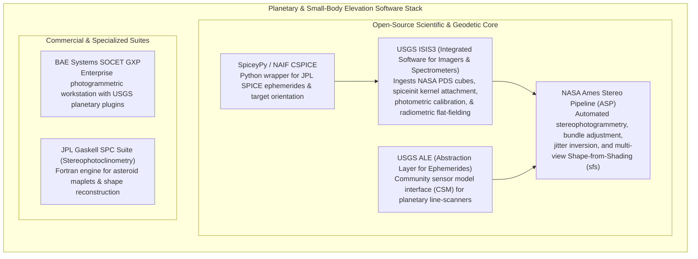

# Chapter 31: Planetary and Extraterrestrial DEMs (Moon, Mars, Asteroids, and Ocean Worlds)

*How mapping worlds without oceans, without GNSS, and sometimes without spherical symmetry forged modern photogrammetry and laser altimetry.*

---

## 31.6 Software Ecosystem

Planetary elevation modeling requires specialized software toolchains capable of interfacing with deep-space observation geometry, handling extreme line-scan camera optical distortions, and solving multi-view photoclinometry on irregular bodies. This section reviews the primary open-source engines developed by NASA and the USGS, alongside specialized commercial photogrammetric workstations.



---

### 31.6.1 Open-Source Planetary Processing Engines

#### 1. USGS ISIS3 (Integrated Software for Imagers and Spectrometers)
Maintained by the USGS Astrogeology Science Center in Flagstaff, Arizona, **ISIS3** (and its modern modular successor ISIS) is the foundational cartographic software for planetary science:
* **PDS Ingestion:** Converts raw NASA Planetary Data System (PDS) archive files from over 40 space missions (Mariner, Viking, Voyager, Galileo, Cassini, MRO, LRO, MESSENGER) into native ISIS `.cub` multi-band raster cubes.
* **`spiceinit`:** The critical step in planetary mapping. Reads the spacecraft clock timestamp from image headers, queries the SPICE kernel repository, and attaches the exact orbital trajectory (`SPK`), spacecraft pointing quaternions (`CK`), and planetary orientation (`PCK`) directly into the image cube header.
* **Radiometric Calibration:** Applies flat-fielding, dark-current subtraction, and empirical photometric normalization (e.g., McEwen lunar photometric correction).

#### 2. NASA Ames Stereo Pipeline (ASP)
Developed by the Intelligent Robotics Group (IRG) at NASA Ames Research Center:
* **`parallel_stereo`:** Executes automated stereo matching between overlapping planetary images using semi-global matching (SGM) or normalized cross-correlation (NCC), generating 3D point clouds and georeferenced DEMs.
* **`pc_align`:** Performs 3D point-to-plane Iterative Closest Point (ICP) co-registration, tying stereo DEMs to sparse laser altimetry tracks (LOLA on the Moon, MOLA on Mars).
* **`sfs` (Shape-from-Shading):** Executes multi-view photoclinometry, refining stereo DEMs down to single-pixel resolution by inverting reflectance laws across multiple illumination angles.

#### 3. `SpiceyPy`: Python Interface to NASA NAIF SPICE
Developed by Andrew Annex, `SpiceyPy` provides a complete Python wrapper around JPL's C-language CSPICE library:

```python
"""
Planetary observation geometry calculation using SpiceyPy.
Demonstrates loading SPICE kernels and computing sub-solar coordinates,
sub-spacecraft ground track, and target phase angle for Mars Global Surveyor.
"""

import spiceypy as spice
import numpy as np

def calculate_mars_observation_geometry(utc_time_str: str, metakernel_path: str):
    """
    Computes sub-spacecraft coordinates and sub-solar angles on Mars using SPICE.
    
    Args:
        utc_time_str: UTC observation timestamp (e.g., "2005-06-15T12:00:00").
        metakernel_path: Path to text file listing required SPICE kernels.
    """
    print(f"Loading SPICE metakernel: {metakernel_path}")
    spice.furnsh(metakernel_path)
    
    try:
        # 1. Convert UTC string to Ephemeris Time (seconds past J2000 epoch)
        et = spice.str2et(utc_time_str)
        print(f"Ephemeris Time (ET): {et:.3f} seconds past J2000")
        
        # 2. Compute Sub-Spacecraft Point on Mars (MGS over Mars)
        # Target: MARS, Observer: MGS, Frame: IAU_MARS, Ab-Corr: LT+S (Light-time + Stellar)
        spoint_sc, trgepc, srfvec_sc = spice.subpnt(
            method="NEAR POINT/ELLIPSOID",
            target="MARS",
            et=et,
            fixref="IAU_MARS",
            abcorr="LT+S",
            obsrvr="MGS"
        )
        
        # Convert Cartesian coordinates to planetocentric radius, lon, lat
        radius_sc, lon_sc_rad, lat_sc_rad = spice.reclat(spoint_sc)
        lon_sc_deg = np.degrees(lon_sc_rad) % 360.0 # East-positive [0, 360)
        lat_sc_deg = np.degrees(lat_sc_rad)
        
        # 3. Compute Sub-Solar Point (where sun is directly overhead on Mars)
        spoint_sun, trgepc_sun, srfvec_sun = spice.subslr(
            method="NEAR POINT/ELLIPSOID",
            target="MARS",
            et=et,
            fixref="IAU_MARS",
            abcorr="LT+S",
            obsrvr="SUN"
        )
        radius_sun, lon_sun_rad, lat_sun_rad = spice.reclat(spoint_sun)
        lon_sun_deg = np.degrees(lon_sun_rad) % 360.0
        lat_sun_deg = np.degrees(lat_sun_rad)
        
        # 4. Compute Solar Incidence and Phase Angles at the Sub-Spacecraft Point
        trgepc_illum, srfvec_illum, phase, solar_inc, emission = spice.ilumin(
            method="ELLIPSOID",
            target="MARS",
            et=et,
            fixref="IAU_MARS",
            abcorr="LT+S",
            obsrvr="MGS",
            spoint=spoint_sc
        )
        
        print("\n--- Planetary Geodesy Report (IAU_MARS Frame) ---")
        print(f"Sub-Spacecraft Location: Lat {lat_sc_deg:.4f}° N (Planetocentric), Lon {lon_sc_deg:.4f}° E")
        print(f"Areocentric Radius:      {radius_sc:.2f} km")
        print(f"Sub-Solar Location:       Lat {lat_sun_deg:.4f}° N, Lon {lon_sun_deg:.4f}° E")
        print(f"Solar Incidence Angle:    {np.degrees(solar_inc):.2f}°")
        print(f"Solar Emission Angle:     {np.degrees(emission):.2f}° (Nadir = 0°)")
        print(f"Phase Angle (Sun-Target-Observer): {np.degrees(phase):.2f}°")
        
    finally:
        # Always unload kernels to prevent memory leaks in long-running pipelines
        spice.kclear()
        print("SPICE kernels cleared successfully.")

# Example execution:
# calculate_mars_observation_geometry("2003-08-27T09:51:13", "mgs_mars_meta.tm")
```

---

### 31.6.2 Commercial and Specialized Workstations

#### 1. BAE Systems SOCET GXP
The commercial photogrammetry suite widely deployed across the intelligence and defense community:
* Supported in planetary science through specialized sensor model plug-ins developed by the USGS Astrogeology Science Center.
* Allows planetary geologists to perform manual stereoplotter breakline extraction and crater measurements on calibrated 3D stereo monitors.

#### 2. JPL Gaskell SPC Suite
The specialized Fortran research package developed by Robert Gaskell:
* Built specifically for small, irregular bodies (asteroids and comets).
* Generates maplet collections, solves joint photoclinometry bundle adjustments, and outputs 3D watertight polyhedral OBJ meshes.
