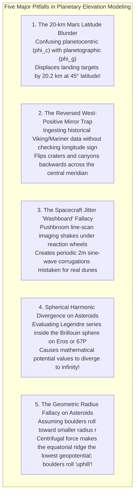

# Chapter 31: Planetary and Extraterrestrial DEMs (Moon, Mars, Asteroids, and Ocean Worlds)

*How mapping worlds without oceans, without GNSS, and sometimes without spherical symmetry forged modern photogrammetry and laser altimetry.*

---

## 31.7 Common Pitfalls and Key Takeaways

Mapping worlds across the solar system exposes terrestrial assumptions to failure. When geodesists assume planets are spherical, ignore reaction-wheel vibrations, mix coordinate definitions, or apply standard gravity concepts to rotating rubble-pile asteroids, their models introduce 20-kilometer coordinate errors, fabricate phantom tectonic corrugations, and violate potential theory.

---

### 31.7.1 Common Pitfalls in Planetary and Small-Body Elevation Modeling

#### 1. The 20-Kilometer Planetocentric vs. Planetographic Blunder
* **The Failure Mode:** An aerospace engineer or GIS analyst downloads a Martian digital elevation model and imports it into a trajectory simulator without verifying the latitude convention:
* **Mathematical Reality:** On an oblate spheroid with flattening $f = 0.00589$:
  $$\tan\phi_g = \frac{1}{(1 - f)^2} \tan\phi_c \approx 1.01189 \cdot \tan\phi_c$$
* **Forensic Consequence:** At $45^\circ$ latitude, the angular displacement between planetocentric latitude $\phi_c$ and planetographic latitude $\phi_g$ is $\Delta \phi = 0.3375^\circ$ ($20.25\text{ arcminutes}$). On Mars, this corresponds to an absolute ground displacement of **$19.95\text{ kilometers}$**. A robotic lander targeted to touch down on a smooth, flat alluvial plain is instead delivered into a jagged crater wall $20\text{ kilometers}$ away.
* **Remedy:** Always verify the IAU coordinate metadata in the SPICE kernel or GeoTIFF header. Clearly specify whether rasters are projected in Planetocentric or Planetographic coordinates.

#### 2. The Reversed West-Positive Longitude Mirror Trap
* **The Failure Mode:** A planetary scientist merges historical Viking Orbiter (1976) or Mariner 9 (1971) elevation contours with modern Mars Reconnaissance Orbiter (MRO) CTX DEMs.
* **Geodetic Reality:** Prior to the IAU 2000 cartographic resolutions, Martian cartography followed terrestrial astronomical telescope traditions, defining longitude as **West-positive ($0^\circ\text{–}360^\circ\text{ W}$)**. Modern IAU standards mandate **East-positive ($0^\circ\text{–}360^\circ\text{ E}$)** for all prograde-rotating bodies.
* **Forensic Consequence:** If the software assumes all datasets are East-positive, the historical dataset is mirrored across the prime meridian ($0^\circ$). Valles Marineris is plotted on the wrong side of the planet, corrupting long-term landing-site studies.
* **Remedy:** Explicitly check the `PositiveLongitudeDirection` tag in ISIS3 and GDAL metadata before executing spatial merges:
  $$\lambda_{\text{East}} = 360^\circ - \lambda_{\text{West}}$$

#### 3. Spacecraft Reaction-Wheel Jitter Corrugations
* **The Failure Mode:** A geomorphologist studying HiRISE or LROC NAC stereo DEMs identifies regular, periodic linear ripples (amplitude $1\text{–}2\text{ meters}$, wavelength $25\text{–}40\text{ meters}$) running perpendicular to the satellite ground track, publishing an interpretation of "fossilized aeolian megaripples" or "cyclic volcanic bedding."
* **Physical Reality:** High-speed reaction wheels inside the satellite bus vibrate at frequencies between $10\text{ Hz}$ and $100\text{ Hz}$. Because pushbroom cameras expose line-by-line as the satellite sweeps forward, this angular jitter introduces periodic **"washboard" sine-wave corrugations** into raw stereo parallax disparities.
* **Forensic Consequence:** The geomorphologist is studying the mechanical resonances of the spacecraft's reaction-wheel ball bearings, not planetary geology!
* **Remedy:** Process raw pushbroom stereo pairs using jitter-solving engines (such as the NASA Ames Stereo Pipeline `parallel_stereo --solve-jitter`), which cross-correlate overlapping CCD detector channels to invert and eliminate attitude oscillations.

#### 4. Evaluating Spherical Harmonics Inside the Brillouin Sphere
* **The Failure Mode:** A mission planning team models the gravitational acceleration and surface elevation of an elongated asteroid (such as 433 Eros or 243 Ida) using a high-degree spherical harmonic expansion ($N = 120$).
* **Mathematical Reality:** In potential theory, spherical harmonic expansions diverge mathematically inside the **Brillouin Sphere** (the minimum circumscribing sphere enclosing the asteroid's outermost tips).
* **Forensic Consequence:** Near the equatorial waist of an elongated asteroid, the evaluation point is deep inside the Brillouin sphere. The Legendre polynomial series diverges, calculating gravitational accelerations that oscillate wildly by hundreds of meters per second squared. A simulated asteroid lander is predicted to experience impossible violent repulsive forces.
* **Remedy:** Never evaluate spherical harmonics on irregular small bodies inside the Brillouin sphere. Use closed-form **Werner-Scheeres polyhedral mesh potentials** or mascon grids.

#### 5. The Geometric Radius Fallacy on Asteroids
* **The Failure Mode:** A mission planner designing a sample collection trajectory on asteroid Bennu or Ryugu selects a landing site by searching for the point of "lowest geometric radius" ($r = \sqrt{x^2 + y^2 + z^2}$), assuming loose boulders and dust roll downhill toward the center of mass.
* **Physical Reality:** On rapidly rotating small bodies, centrifugal acceleration counteracts gravity at the equator. The physical motion of regolith is governed by the **Effective Roche Geopotential $U(\mathbf{r}) = V_{\text{poly}} - \frac{1}{2}\omega^2(x^2+y^2)$**.
* **Forensic Consequence:** On top-shaped asteroids like Bennu and Ryugu, the equatorial ridge has the *largest* geometric radius from the center of mass, but represents the **lowest geopotential energy state**. Boulders roll "uphill" geometrically from the mid-latitudes toward the equator! Landing at the minimum geometric radius lands the spacecraft on a steep geopotential cliff, causing it to tip over.
* **Remedy:** Always map asteroids in **Dynamic Elevation ($H_{\text{dynamic}}$)** and **Geopotential Slope ($\theta_{\text{slope}}$)**, never in geometric radius.

---

### 31.7.2 Key Takeaways for Practitioners

1. **Beware the Coordinate Definitions:** On oblate bodies like Mars, confusing planetocentric ($\phi_c$) with planetographic ($\phi_g$) coordinates induces a $\sim 20\text{-kilometer}$ positional error at mid-latitudes.
2. **Anchor Geometry with SPICE:** Extraterrestrial mapping lacks GPS; all camera rays and altimeter bounces must be reconstructed using NASA/JPL NAIF SPICE kernels (`SPK`, `PCK`, `CK`, `IK`, `FK`).
3. **Orbit Crossovers Eliminate Flight Errors:** Intersecting ascending and descending altimeter tracks (MOLA, LOLA) provide self-consistent global vertical control without ground stations.
4. **Correct Pushbroom Jitter:** Always apply multi-CCD jitter inversion in NASA Ames Stereo Pipeline to remove reaction-wheel washboard ripples from high-resolution stereo DEMs.
5. **Photoclinometry Maps the Shadows:** In lunar polar craters where stereo fails, multi-view Shape-from-Shading (SfS) inverts reflectance laws to achieve single-pixel ($0.5\text{-m}$) elevation models for Artemis landing sites.
6. **Dynamic Height Governs Asteroids:** On rotating irregular bodies, replace 2.5D grids with watertight polyhedral meshes, and replace geometric radius with the Effective Roche Geopotential.
