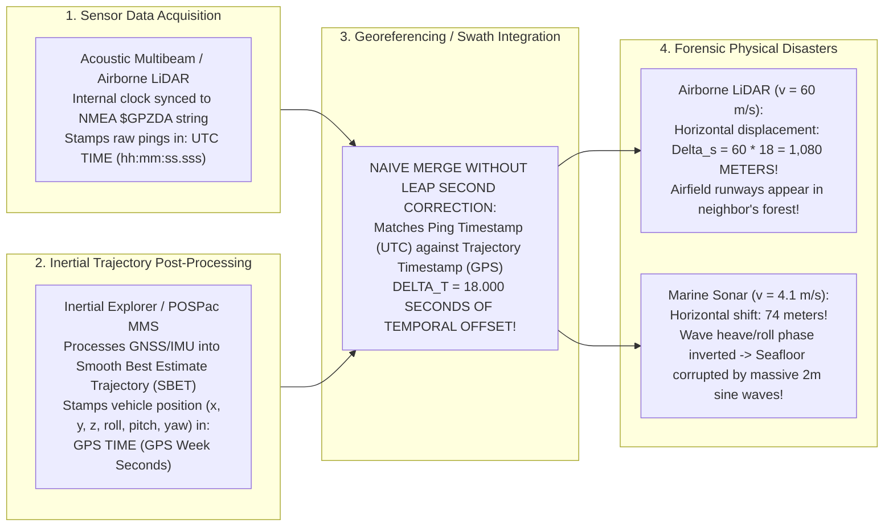

# Chapter 32: Hardware Timing, Synchronization, Leap Seconds, and Relativistic/Atmospheric Physics

*Why every range and position sensor is fundamentally a clock—and how microsecond timing bugs, leap seconds, and atmospheric refraction corrupt DEMs.*

---

## 32.1 Time Scales in Geodesy and Surveying

Every spatial elevation sensor—whether an airborne laser scanner firing millions of pulses per second, a satellite radar altimeter orbiting at $7\text{ km/s}$, or a multibeam echosounder mounted to a rolling ship hull—is fundamentally a high-precision **clock**. Distance is not measured with a physical tape; it is calculated from the two-way propagation time $\Delta t$ of an acoustic or electromagnetic wave:

$$\text{Range } R = \frac{c \cdot \Delta t}{2}$$

Because light travels at $c \approx 300,000\text{ km/s}$, a clock jitter of just **$1\text{ nanosecond}$ ($10^{-9}\text{ s}$)** produces an immediate ranging error of **$15\text{ centimeters}$**. Furthermore, an elevation model requires continuously marrying the sensor's range vector with the platform's position and orientation vectors in real time. If the clock recording vehicle trajectory drifts relative to the clock recording sensor pings, platform motion corrupts the digital elevation model with catastrophic geometric shear, artificial slope tilting, and phantom sinusoidal waves.

Navigating this domain requires mastering the conflicting definitions of astronomical, atomic, civil, and satellite time scales—and understanding how a failure to account for an **18-second leap second** can displace a survey by more than a kilometer.

```mermaid
flowchart TD
    subgraph TimeScalesFramework["The Hierarchy of Geodetic Time Scales"]
        direction TB
        subgraph ContinuousAtomic["Continuous Physical Atomic Time (Zero Discontinuities)"]
            TAI["International Atomic Time (TAI)\nSI Second defined by Cesium-133 ground-state hyperfine transition\nStrictly continuous, monotonic, invariant physical time"]
            GPST["GPS Time (GPST)\nCommenced 1980-01-06T00:00:00Z\nTAI - GPST = 19.000 seconds (constant offset)\nNever applies leap seconds!"]
            GST["Galileo System Time (GST)\nSteered to atomic clock ensembles, synchronized with GPST modulo 0s"]
            TAI ---|Offset: -19s| GPST
            GPST ---|Synchronized| GST
        end

        subgraph AstronomicalCivil["Civil & Earth-Rotation Time (Discontinuous)"]
            UT1["Universal Time (UT1)\nAstronomical time governed by Earth's variable rotation rate\nSlows down and speeds up due to tidal friction & core dynamics"]
            UTC["Coordinated Universal Time (UTC)\nCivil standard: Steered to TAI via integer LEAP SECONDS\nMaintains |UTC - UT1| < 0.9 seconds\nDiscontinuous: Can have 61-second minutes!"]
            UT1 ---|IERS Leap Seconds| UTC
            TAI ---|TAI - UTC = 37s (as of 2026)| UTC
            GPST ---|GPST - UTC = 18s (as of 2026)| UTC
        end

        subgraph OperatingSystems["Operating System Clocks"]
            UnixTime["Unix / POSIX Time (Epoch 1970-01-01)\nAssumes exactly 86,400 seconds per day\nRepeats second 86399 or 'smears' time during leap seconds\nNon-monotonic timestamps break sensor packet order!"]
            GLONASS_Time["GLONASS Time (Russia)\nUTC + 3 hours (Moscow time)\nINCLUDES LEAP SECONDS! (Causes receiver stutters)"]
        end

        UTC --> UnixTime
        UTC --> GLONASS_Time
    end
```

---

### 32.1.1 The Zoo of Modern Time Scales

In modern geospatial surveys, sensor components communicate using distinct, conflicting time standards:

#### 1. International Atomic Time (TAI - Temps Atomique International)
* **Definition:** Established by the Bureau International des Poids et Mesures (BIPM), TAI is computed from the weighted average of over 400 laboratory atomic clocks (cesium beam standards and hydrogen masers) distributed worldwide.
* **The SI Second:** Defined as the duration of $9,192,631,770$ periods of the radiation corresponding to the transition between the two hyperfine levels of the ground state of the Caesium-133 atom at $0\text{ Kelvin}$.
* **Property:** TAI is an immutable, strictly continuous, monotonic physical time scale. It never skips, rewinds, or adds leap seconds.

#### 2. Universal Time (UT1) and Coordinated Universal Time (UTC)
* **UT1 (Astronomical Time):** Governed directly by the Earth's actual physical rotation on its axis relative to distant quasars (measured via Very Long Baseline Interferometry - VLBI). Because tidal friction, atmospheric winds, and mantle-core interactions cause the Earth's rotation to fluctuate irregularly, the length of an astronomical day varies by milliseconds.
* **UTC (Civil Standard):** Created in 1960 to reconcile atomic precision with astronomical day/night cycles. UTC ticks at the exact rate of the atomic SI second (TAI). 
* **Leap Seconds:** To prevent civil noon from drifting away from the sun, the International Earth Rotation and Reference Systems Service (IERS) periodically inserts a **leap second** (a 61st second, `23:59:60 UTC`, typically on June 30 or December 31) whenever $| \text{UTC} - \text{UT1} |$ approaches $0.9\text{ seconds}$. 
* *As of 2026, exactly **27 leap seconds** have been inserted since 1972, resulting in:*
  $$\text{TAI} - \text{UTC} = 37\text{ seconds}$$

#### 3. GPS Time (GPST)
* **Definition:** The internal operational time scale of the US Global Positioning System constellation.
* **Epoch:** Started at midnight on **January 6, 1980 (1980-01-06T00:00:00Z)**. At that exact initial instant, GPS Time was aligned with UTC.
* **The Critical Property:** **GPS Time does not implement leap seconds.** When UTC inserted leap seconds in 1981, 1982, 1983, and beyond, GPS Time continued ticking monotonically.
* *As of 2026, GPS Time is ahead of UTC by exactly **18 seconds** (and behind TAI by 19 seconds):*
  $$\text{GPST} - \text{UTC} = 18.000\text{ seconds}$$
  $$\text{TAI} - \text{GPST} = 19.000\text{ seconds} \quad (\text{constant})$$

#### 4. GLONASS Time: The Anomaly
Unlike GPS, Galileo, and BeiDou (which operate on continuous atomic time scales), Russia's **GLONASS** system was architected to follow Moscow Local Time ($\text{UTC} + 3\text{ hours}$):
* **GLONASS implements leap seconds.**
* When an IERS leap second occurs, GLONASS satellite clocks step by exactly 1 second. 
* *The Multi-GNSS Trap:* Multi-constellation survey receivers (GPS + GLONASS + Galileo) that fail to properly decouple GLONASS clock steps from continuous GPS time experience catastrophic tracking loop resets and carrier-phase cycle slips during leap-second events.

#### 5. Unix / POSIX Time and the Leap-Second Smear
* By POSIX specification, Unix Time counts the number of seconds since January 1, 1970 (`1970-01-01T00:00:00Z`), assuming an immutable day length of exactly $86,400\text{ seconds}$.
* **The Non-Monotonic Collapse:** When UTC inserts a leap second (`23:59:60`), standard POSIX systems repeat the timestamp of second `86399` twice. If a high-speed sensor (such as a $1\text{-MHz}$ LiDAR) stamps packets using system Unix time, timestamps become non-monotonic ($t_{i+1} \le t_i$), breaking chronological sorting and corrupting trajectory interpolation.
* To prevent system crashes, major cloud providers (Google, AWS) implement **Leap Smearing**: stretching each second by $\sim 11.6\,\mu\text{s}$ over a 24-hour window surrounding the leap second. While effective for web servers, leap smearing introduces continuous microsecond time drifts that are fatal to geodetic sensor georeferencing.

---

### 32.1.2 The 18-Second Leap-Second Trajectory Offset Bug

The most common and destructive timing blunder in airborne LiDAR and marine hydrographic surveying is the **18-second leap-second offset bug**.



#### 1. How the Bug Happens
1. **The Sensor:** An airborne laser scanner or multibeam sonar logger receives time from a GNSS receiver via serial NMEA `$GPZDA` messages. Because `$GPZDA` reports civil UTC time (`hh:mm:ss`), the logger timestamps raw pulse returns in **UTC**.
2. **The Navigation Post-Processor:** The surveyor post-processes raw GNSS base station data and platform IMU accelerations in software like Applanix POSPac or NovAtel Inertial Explorer to produce a Smooth Best Estimate of Trajectory (SBET). By geodetic standard, SBET files are recorded in **GPS Week Seconds** (seconds elapsed since Sunday 00:00:00 GPST, ranging from $0$ to $604,800\text{ s}$).
3. **The Uncorrected Merge:** The GIS technician loads the raw sensor files and the SBET trajectory into georeferencing software (such as CARIS, Qimera, or PDAL), assuming that both datasets share the same time scale. The software matches a ping recorded at $T_{\text{UTC}}$ with a platform pose recorded at $T_{\text{GPS}} = T_{\text{UTC}}$, introducing a **constant time offset of $\Delta t = 18.000\text{ seconds}$**.

#### 2. The Forensic Consequences in the Air: A 1-Kilometer Blunder
In an airborne LiDAR survey, the aircraft cruises at ground speed $v = 60\text{–}80\text{ m/s}$ ($116\text{–}155\text{ knots}$):
* Over an 18-second temporal offset, the aircraft has traveled:
  $$\Delta s_{\text{horizontal}} = v \cdot \Delta t = 60\text{ m/s} \times 18.0\text{ s} = \mathbf{1,080\text{ meters}}$$
* When the laser pulses are ray-traced to the ground, every 3D coordinate $(x, y, z)$ is projected from an aircraft position **more than one kilometer away** from where the plane was physically located when the laser fired!
* Airport runways, bridges, and city streets are shifted horizontally by over a kilometer, plotting inside lakes and forests.

#### 3. The Forensic Consequences at Sea: The Sinusoidal Seafloor
On a hydrographic survey vessel, cruising speed is slower ($v = 4.1\text{ m/s} \approx 8\text{ knots}$), creating a horizontal along-track displacement of:
$$\Delta s_{\text{horizontal}} = 4.1\text{ m/s} \times 18.0\text{ s} = 73.8\text{ meters}$$

However, the vertical disaster is far worse:
* Ocean waves cause a vessel to roll, pitch, and heave periodically with swell periods typically between **$4\text{ and }8\text{ seconds}$**.
* An 18-second time offset corresponds to approximately **$2.5\text{ to }4.5\text{ complete wave motion cycles}$**.
* When the software attempts motion compensation, it applies a heave correction from four waves ago:
  * When the ship is in a wave trough, the software applies a crest correction!
  * Motion compensation, instead of canceling vessel heave, **doubles the motion artifact**.
* **The Forensic Signature:** A perfectly flat, horizontal sandy seabed is transformed into a bizarre, high-amplitude **sinusoidal washboard surface** with artificial $1\text{–}3\text{ meter}$ corrugations matching the vessel's wave encounter frequency.

*Remedy:* Every georeferencing pipeline must explicitly verify the time system of every input channel. Never merge raw sensor data with navigation trajectories without a rigorous time conversion:
$$t_{\text{GPST}} = t_{\text{UTC}} + \Delta t_{\text{leap}} \quad (\text{where } \Delta t_{\text{leap}} = 18.0\text{ s in } 2026)$$
