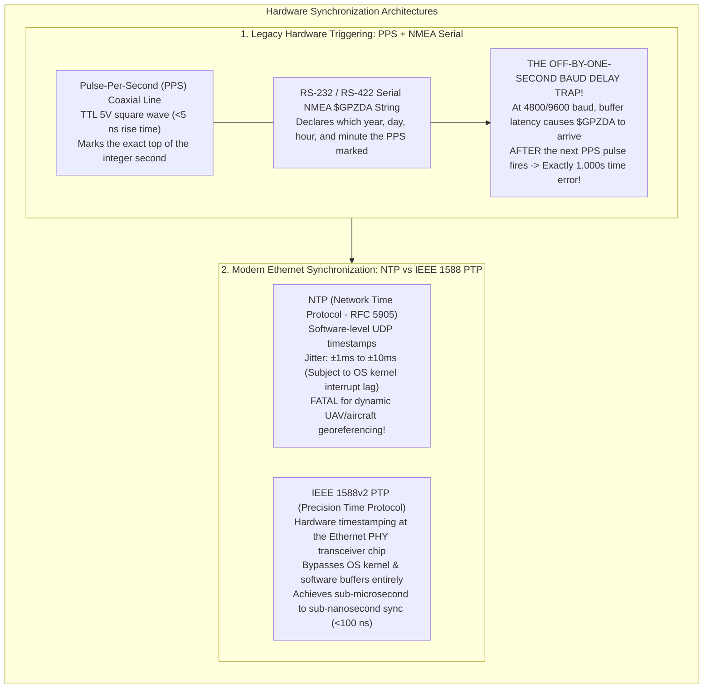
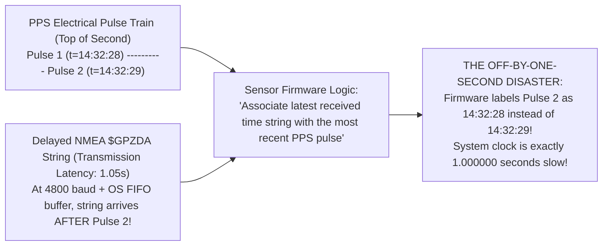
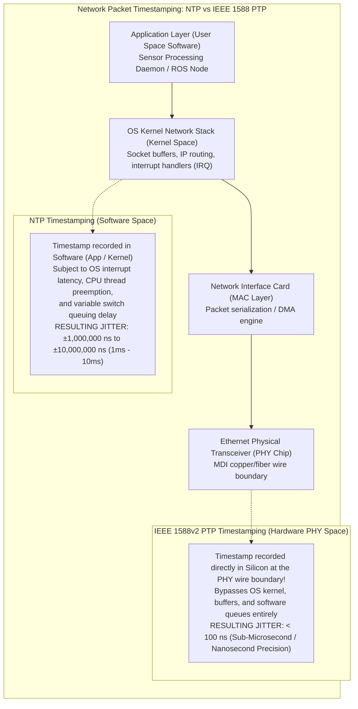

# Chapter 32: Hardware Timing, Synchronization, Leap Seconds, and Relativistic/Atmospheric Physics

*Why every range and position sensor is fundamentally a clock—and how microsecond timing bugs, leap seconds, and atmospheric refraction corrupt DEMs.*

---

## 32.2 Hardware Time Synchronization Architectures

A high-performance mapping payload—whether an airborne topo-bathy LiDAR pod, a mobile mapping vehicle, or an autonomous survey vessel—is a distributed network of asynchronous instruments. The platform carries an Inertial Measurement Unit (IMU) sampling accelerations at $200\text{–}1000\text{ Hz}$, a GNSS receiver updating position at $5\text{–}20\text{ Hz}$, a laser scanner firing at $1\text{–}2\text{ MHz}$, and an acoustic transceiver pinging at $10\text{–}50\text{ Hz}$.

If these independent electronic subsystems operate on drifting crystal clocks, the ray-tracing equations break down. Sub-decimeter 3D elevation modeling requires unifying all sensor clocks to within **sub-microsecond precision**. This section examines the physical architectures of hardware synchronization, the mechanics of physical Pulse-Per-Second (PPS) triggers, and the revolutionary transition from legacy serial/NTP networks to **IEEE 1588v2 Precision Time Protocol (PTP)**.



---

### 32.2.1 The Physical Layer: Pulse-Per-Second (PPS) and Serial NMEA `$GPZDA`

For four decades, the standard method for synchronizing geospatial hardware has been the pairing of a physical **Pulse-Per-Second (PPS)** electrical trigger with a serial ASCII time message:

#### 1. The Physics of the PPS Electrical Trigger
* **The Signal:** A dedicated coaxial cable (typically $50\,\Omega$ BNC or SMA) carries a Transistor-Transistor Logic (TTL) $5\text{-volt}$ electrical square wave from a master GNSS receiver to slave instruments (LiDAR, sonar, camera, IMU).
* **The Edge:** The leading rising edge of the pulse marks the **exact top of the integer second ($t = 0.000000000\text{ s}$)**.
* **Precision:** High-quality GNSS timing receivers (e.g., Trimble, Septentrio, NovAtel) generate PPS rising edges with a jitter of **$<5\text{ to }10\text{ nanoseconds}$** relative to GPS Time or UTC.
* **Limitation:** A bare electrical pulse is anonymous. The receiving sensor's internal counter knows *when* an integer second occurred with nanosecond precision, but it does not know *which* second it was (what year, month, day, hour, or minute).

#### 2. The NMEA `$GPZDA` Serial Association
To provide the calendar date and hour, the GNSS receiver transmits a companion ASCII serial message (such as the NMEA 0183 `$GPZDA` or proprietary Trimble `$PTNL,TIME` string) over RS-232 or RS-422:

```text
$GPZDA,143228.00,27,08,2026,00,00*6B
```
* **Decoded Content:** `14:32:28.00 UTC`, on August 27, 2026, with zero local hour/minute offsets.
* The sensor's firmware listens for the `$GPZDA` message and associates that calendar timestamp with the corresponding PPS electrical pulse edge.

---

### 32.2.2 The "Off-by-One-Second" Baud-Delay Pitfall

The most treacherous hardware bug in marine and airborne surveying occurs when the serial time message is delayed relative to the PPS pulse.



#### The Forensic Failure Mechanism
1. The GNSS receiver generates the PPS electrical pulse for $t = 14:32:28.000$.
2. The receiver's internal CPU begins composing the ASCII `$GPZDA` sentence. If the serial communication port is configured to a legacy low baud rate (e.g., **$4800\text{ or }9600\text{ baud}$**), transmitting the $38\text{-byte}$ message requires:
   $$t_{\text{tx}} = \frac{38 \text{ bytes} \times 10 \text{ bits/byte}}{4800 \text{ bits/s}} \approx 79.2\text{ milliseconds}$$
3. If the host operating system's serial UART buffer experiences scheduling latency, or if the serial line is multiplexed with high-bandwidth NMEA strings (`$GPGGA`, `$GPRMC`, `$GPVTG`), transmission is delayed.
4. **The Critical Threshold:** If the `$GPZDA` string finishes arriving at the sensor **$1.02\text{ seconds}$** after Pulse 1 was fired, the sensor's firmware sees that **Pulse 2** has already arrived!
5. The sensor mistakenly associates the timestamp `14:32:28` with Pulse 2 (which is physically `14:32:29`).
6. **The Result:** The entire sensor payload operates with a continuous, hardcoded **$1.000000\text{-second}$ time offset**.
   * On a survey aircraft flying at $70\text{ m/s}$, every LiDAR point is projected from a position **$70\text{ meters}$** behind where the plane was when the pulse fired.
   * On a hydrographic launch traveling at $8\text{ knots}$, soundings are displaced by **$4.1\text{ meters}$**, causing vertical depth mismatches on slopes during reciprocal survey lines.

*Remedy:* Always configure serial timing baud rates to **$115,200\text{ baud}$** or higher, minimize the number of broadcast NMEA sentences, and verify with an oscilloscope that the `$GPZDA` string completes transmission within $100\text{–}200\text{ ms}$ of its associated PPS rising edge.

---

### 32.2.3 Software Network Time (NTP) vs. Hardware Timestamped PTP (IEEE 1588)

Modern multi-sensor platforms have abandoned point-to-point coaxial and serial cables in favor of unified Gigabit Ethernet networks. However, synchronizing instruments over Ethernet requires understanding the vast divide between software and hardware time protocols:



#### 1. Network Time Protocol (NTP - RFC 5905): The Software Trap
NTP operates at the software application layer over UDP/IP:
* **The Latency Problem:** When an NTP client receives a time packet, the timestamp is recorded by the host operating system kernel after the packet has traversed the physical wire, the network card's DMA buffers, the hardware interrupt request (IRQ) handler, and the OS socket queues.
* **Variable Jitter:** Under heavy network traffic or high CPU loads, this software path introduces non-deterministic latency variations of **$\pm 1\text{ to }\pm 10\text{ milliseconds}$**.
* *Forensic Consequence for DEMs:* A drone flying at $20\text{ m/s}$ with a $5\text{-ms}$ NTP timing jitter will experience horizontal positioning errors of $\pm 10\text{ centimeters}$, completely obliterating the centimeter precision of high-density drone photogrammetry and mobile LiDAR.

#### 2. Precision Time Protocol (PTP - IEEE 1588v2): The Hardware Silicon Solution
Standardized by the IEEE, **Precision Time Protocol (IEEE 1588v2)** achieves sub-microsecond synchronization across Ethernet networks by taking timestamping out of software and executing it in hardware:
* **Hardware Timestamping at the PHY Chip:** The Ethernet physical layer transceiver (PHY) chip contains dedicated hardware registers that detect the precise nanosecond the first bit of an Ethernet PTP frame crosses the physical copper or fiber wire boundary.
* The timestamp is recorded in hardware silicon **before** the packet ever enters the operating system kernel or software network buffers, completely eliminating OS interrupt latency and thread scheduling delays.
* **Boundary and Transparent Clocks:** PTP-aware network switches measure the internal residence time of PTP packets within their internal memory queues and add this exact delay into the packet's `correctionField`, eliminating network jitter.
* *Result:* IEEE 1588v2 PTP synchronizes multi-sensor payloads (multi-beam sonars, scanning LiDARs, high-speed cameras, and IMUs) across standard Ethernet with a continuous, verified clock skew of **$<100\text{ nanoseconds}$**, providing the rock-solid timing backbone required for next-generation mobile elevation modeling.
