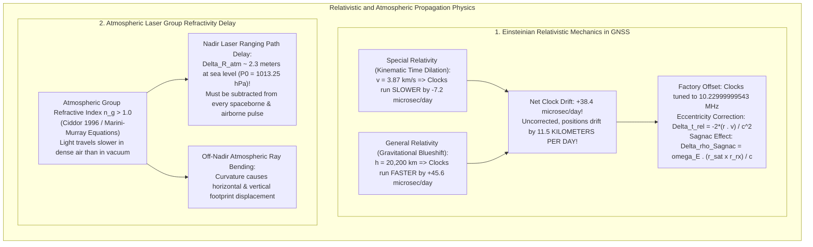

# Chapter 32: Hardware Timing, Synchronization, Leap Seconds, and Relativistic/Atmospheric Physics

*Why every range and position sensor is fundamentally a clock—and how microsecond timing bugs, leap seconds, and atmospheric refraction corrupt DEMs.*

---

## 32.3 Relativistic and Atmospheric Propagation Physics

High-accuracy digital elevation models are vulnerable to fundamental relativistic and atmospheric phenomena. When a satellite laser altimeter fires a pulse from space or a GNSS receiver calculates an RTK elevation fix, the signal traverses relativistic gravitational gradients and variable atmospheric refractivity. 

If Einstein's General Relativity is omitted from satellite clocks, global positioning errors compound by more than $11\text{ kilometers per day}$. Similarly, if atmospheric group delay is omitted from an airborne laser scanner, every elevation coordinate on Earth is displaced by over two meters. This section derives the exact relativistic corrections and atmospheric delay equations that govern geodetic elevation.

---

### 32.3.1 Relativistic Physics in Satellite Positioning

Every georeferenced elevation model depends on Global Navigation Satellite Systems (GPS, GLONASS, Galileo, BeiDou) to locate the aircraft, drone, or satellite in three-dimensional space. GNSS cannot function under classical Newtonian mechanics; it is an operational application of Albert Einstein's **Special and General Theories of Relativity**.

#### 1. The Twin Relativistic Clock Effects
A GNSS satellite orbits Earth at an altitude of $h \approx 20,200\text{ km}$ with an orbital speed of $v \approx 3.874\text{ km/s}$:
1. **Special Relativity (Kinematic Time Dilation):**
   Under Special Relativity (Einstein 1905), a clock in motion relative to an observer runs slower than a stationary clock. The fractional frequency shift is:
   $$\frac{\Delta f_{\text{SR}}}{f_0} = -\frac{v^2}{2 c^2} \approx -\frac{(3874\text{ m/s})^2}{2 (2.9979 \times 10^8\text{ m/s})^2} \approx -8.349 \times 10^{-11}$$
   Over a 24-hour day, moving satellite clocks **lose approximately $7.2\text{ microseconds}$** relative to ground clocks:
   $$\Delta t_{\text{SR}} = -8.349 \times 10^{-11} \times 86,400\text{ s} \approx -7.21\,\mu\text{s/day}$$
2. **General Relativity (Gravitational Blueshift):**
   Under General Relativity (Einstein 1915), clocks tick faster in weaker gravitational potentials. Because a GPS satellite orbits high above Earth's gravitational well, its potential $\Phi_{\text{sat}} = -\frac{GM_E}{R_{\text{sat}}}$ is significantly higher (less negative) than the surface potential $\Phi_{\text{ground}} = -\frac{GM_E}{R_E}$:
   $$\frac{\Delta f_{\text{GR}}}{f_0} = \frac{\Delta \Phi}{c^2} = \frac{GM_E}{c^2} \left( \frac{1}{R_E} - \frac{1}{R_{\text{sat}}} \right) \approx +5.284 \times 10^{-10}$$
   Over 24 hours, the weaker gravity causes satellite clocks to **gain approximately $45.6\text{ microseconds}$**:
   $$\Delta t_{\text{GR}} = +5.284 \times 10^{-10} \times 86,400\text{ s} \approx +45.65\,\mu\text{s/day}$$

#### 2. The Net Daily Drift: 11.5 Kilometers
Combining the two relativistic effects:
$$\Delta t_{\text{net}} = \Delta t_{\text{GR}} + \Delta t_{\text{SR}} = +45.65\,\mu\text{s} - 7.21\,\mu\text{s} = \mathbf{+38.44\text{ microseconds per day}}$$
* **The Catastrophic Consequence:** If uncorrected, this $38.44\,\mu\text{s}$ daily clock drift multiplied by the speed of light would cause pseudorange measurements to drift by:
  $$\Delta \rho = c \cdot \Delta t_{\text{net}} \approx (2.9979 \times 10^8\text{ m/s}) \times (38.44 \times 10^{-6}\text{ s}) \approx \mathbf{11,524\text{ meters per day!}}$$
  The entire global positioning system would fail within two minutes of operation.
* **The Hardware Factory Frequency Offset:**
  To cancel this drift, satellite manufacturers intentionally detune the master atomic clock oscillators prior to launch:
  $$f_{\text{satellite}} = 10.23\text{ MHz} \times \big( 1 - 4.4647 \times 10^{-10} \big) = \mathbf{10.22999999543\text{ MHz}}$$
  When the satellite reaches orbit, gravitational blueshift and time dilation shift the apparent frequency up to **exactly $10.23000000000\text{ MHz}$** as observed from the surface of Earth.

#### 3. Orbital Eccentricity Relativistic Correction ($\Delta t_r$)
Because real orbits are slightly elliptical ($e \ne 0$), satellite speed and altitude oscillate between perigee and apogee:
$$\Delta t_{\text{rel}} = -\frac{2 \sqrt{G M_E a}}{c^2} e \sin E = -\frac{2 (\mathbf{r}^s \cdot \mathbf{v}^s)}{c^2}$$
where $\mathbf{r}^s$ and $\mathbf{v}^s$ are the satellite position and velocity vectors, $e$ is eccentricity, and $E$ is eccentric anomaly. This introduces an oscillating correction of up to **$\pm 70\text{ nanoseconds}$ ($\pm 21\text{ meters}$)** that must be computed dynamically inside GNSS receiver firmware.

#### 4. The Sagnac Effect
During the time it takes for a GNSS signal to travel from satellite to receiver ($\tau \approx 0.07\text{ seconds}$), the Earth rotates beneath the signal by an angle $\omega_E \tau$. In the Earth-Centered Earth-Fixed (ECEF) rotating frame, this path length difference—the **Sagnac Effect**—must be corrected:
$$\Delta \rho_{\text{Sagnac}} = \frac{\boldsymbol{\omega}_E \cdot (\mathbf{r}^s \times \mathbf{r}_r)}{c}$$
where $\mathbf{r}_r$ is receiver position. The Sagnac range correction reaches up to **$\pm 30\text{ meters}$**, directly corrupting horizontal and vertical elevation coordinates if omitted.

---

### 32.3.2 Atmospheric Group Refractivity Delay for LiDAR and Altimetry

In vacuum, electromagnetic waves travel at $c_0 = 299,792,458\text{ m/s}$. When an airborne laser scanner, spaceborne altimeter (ICESat-2), or radar altimeter (CryoSat-2) fires a pulse through the atmosphere, the wave travels through air where the **group refractive index $n_g > 1.0$**.

#### 1. The Physics of Atmospheric Slowdown
The group velocity of a laser pulse of wavelength $\lambda$ in air is:
$$v_g = \frac{c_0}{n_g(P, T, e, \lambda)}$$
Because $v_g < c_0$, the pulse requires more time to travel to the ground and back than if the atmosphere were a vacuum. If an elevation processor converts two-way travel time $\Delta t$ to range using $c_0$, the calculated range is **artificially too long**, causing the reconstructed ground elevation to be **artificially too low**.

#### 2. The Ciddor (1996) Group Refractivity Formula
Standardized by the International Association of Geodesy (IAG), the group refractivity $N_g = (n_g - 1) \times 10^6$ for optical lasers is computed as a function of atmospheric pressure $P$ ($\text{hPa}$), temperature $T$ ($\text{K}$), and water vapor partial pressure $e$ ($\text{hPa}$):

$$N_g = \left( \frac{\rho_{\text{dry}}}{\rho_{\text{dry, std}}} \right) N_{\text{dry, std}} + \left( \frac{\rho_{\text{water}}}{\rho_{\text{water, std}}} \right) N_{\text{water, std}}$$

#### 3. Total Nadir Atmospheric Delay ($\Delta R_{\text{atm}}$)
The total one-way path delay accumulated by integrating group refractivity along the vertical atmospheric column from ground elevation $z_0$ to satellite altitude $H$ is:

$$\Delta R_{\text{atm}} = 10^{-6} \int_{z_0}^H N_g(z) \, dz$$

Applying the hydrostatic equation ($dP = -\rho g \, dz$), the integral simplifies to the **Saastamoinen / Marini-Murray formulation**:

$$\Delta R_{\text{atm}} \approx \frac{0.002277}{\cos\theta} \cdot \left[ P_0 + \left( \frac{1255}{T_0} + 0.05 \right) e_0 - B \tan^2\theta \right]$$
where $P_0$ is barometric surface pressure ($\text{hPa}$), $\theta$ is the off-nadir zenith angle, and $B$ is an empirical correction factor.

* **Magnitude of the Correction:**
  At sea level under standard atmospheric pressure ($P_0 = 1013.25\text{ hPa}$):
  $$\Delta R_{\text{atm, nadir}} = 0.002277 \times 1013.25 \approx \mathbf{2.307\text{ meters}}$$
  For an off-nadir scan angle of $\theta = 30^\circ$, the slant path length delay increases to:
  $$\Delta R_{\text{atm}}(30^\circ) = \frac{2.307\text{ m}}{\cos(30^\circ)} \approx \mathbf{2.664\text{ meters}}$$
* **The Forensic Disaster:** If an airborne LiDAR processing script fails to apply the atmospheric refractivity correction, **every point in the resulting DEM is systematically depressed by over $2.3\text{ meters}$**. In coastal wetlands or floodplains, a $2.3\text{-meter}$ vertical error drowns entire municipalities on paper!
