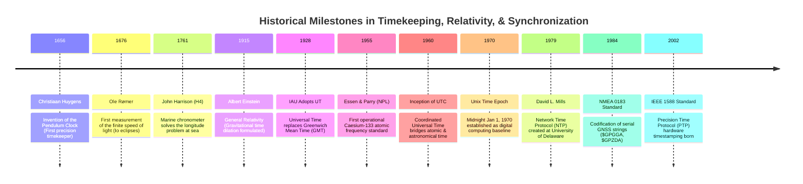

# Chapter 32: Hardware Timing, Synchronization, Leap Seconds, and Relativistic/Atmospheric Physics

*Why every range and position sensor is fundamentally a clock—and how microsecond timing bugs, leap seconds, and atmospheric refraction corrupt DEMs.*

---

## 32.4 Historical Evolution: From Marine Chronometers to Atomic Clocks and PTP

The history of spatial elevation modeling is inextricably bound to the history of horology and timekeeping. Long before satellites, the ability to determine longitude and chart coastal hazards depended on mechanical spring escapements. Today, microsecond timing protocols dictate whether a million-point-per-second LiDAR cloud resolves the crown of a road or projects a phantom double-surface.

The milestones below, anchored in the `schwehr/gis-history` repository, trace the lineage of timekeeping and synchronization from 17th-century pendulum clocks to modern hardware timestamping.

---

### 32.4.1 The Mechanical and Optical Dawn: 1656 to 1761

#### 1656: Christiaan Huygens and the Pendulum Clock
Dutch polymath Christiaan Huygens invented the **pendulum clock** (patented 1657). By harnessing the harmonic motion of a swinging pendulum, Huygens slashed daily timekeeping drift from roughly $15\text{ minutes per day}$ (in pre-existing verge-and-foliot clocks) to less than **$15\text{ seconds per day}$**. For the first time, scientists had a reliable laboratory instrument to measure rapid physical intervals.

#### 1676: Ole Rømer and the Finite Speed of Light
At the Royal Observatory in Paris, Danish astronomer Ole Rømer observed the orbital eclipses of Jupiter's moon Io:
* Rømer noticed that when Earth was traveling away from Jupiter, Io's eclipses occurred systematically later than predicted; when Earth was moving toward Jupiter, they occurred earlier.
* Rømer correctly deduced that light does not travel instantaneously; it has a **finite velocity**. Christiaan Huygens calculated Rømer's data to yield a speed of light of $\sim 220,000\text{ km/s}$. This discovery established the physical foundation of all distance-from-time remote sensing.

#### 1761: John Harrison and the H4 Marine Chronometer
Following the Scilly naval disaster of 1707 (in which four British warships wrecked on rocks with the loss of over 1,400 sailors due to navigational error), the British Parliament passed the **Longitude Act of 1714**, offering a $\pounds 20,000$ prize for determining longitude at sea.
* Self-taught Yorkshire carpenter and clockmaker **John Harrison** spent four decades developing marine timekeepers that could withstand the violent pitching, humidity, and temperature swings of a sailing ship.
* In 1761, Harrison's **H4 marine chronometer** was tested aboard HMS *Deptford* on a voyage to Jamaica. After 81 days at sea, H4 had drifted by only **$5.1\text{ seconds}$**, enabling navigators to calculate longitude to within $1.25\text{ nautical miles}$. Harrison's invention allowed James Cook and the British Admiralty to survey and chart the coasts of the Pacific with true geodetic accuracy.

---

### 32.4.2 Relativity and the Atomic Era: 1915 to 1960

#### 1915: Albert Einstein's General Relativity
In November 1915, Albert Einstein published the field equations of **General Relativity**, revolutionizing physics by proving that gravity is not a Newtonian force, but the curvature of four-dimensional spacetime. Einstein derived gravitational time dilation: clocks in stronger gravity tick slower than clocks in weaker gravity. A century later, this theoretical physics equation would be programmed into every GPS satellite chip to prevent multi-kilometer positioning failures.

#### 1955: Essen and Parry's Caesium-133 Atomic Clock
At the National Physical Laboratory (NPL) in Teddington, UK, **Louis Essen and Jack Parry** constructed the world's first operational atomic frequency standard using the Caesium-133 atom:
* Rather than relying on astronomical observations of Earth's variable rotation, time was locked to the invariant quantum transition frequency between the hyperfine ground states of cesium ($9,192,631,770\text{ Hz}$).
* In 1967, the 13th General Conference on Weights and Measures (CGPM) officially redefined the **SI Second** based on Essen's cesium resonance, severing the definition of physical time from the rotation of the Earth.

#### 1960: The Inception of UTC
As atomic time proved far more uniform than the slowing, irregular rotation of the Earth, astronomers and telecommunication engineers created **Coordinated Universal Time (UTC)** in 1960:
* Ticked with the exact physical rate of atomic time (TAI).
* Introduced periodic step adjustments—formalized as **leap seconds** in 1972—to maintain synchronization with the astronomical day (UT1).

---

### 32.4.3 Network Protocols and Serial Standards: 1970 to 2002

#### 1970: Unix Time Epoch
Computer scientists at Bell Labs developing the Unix operating system established **00:00:00 UTC on January 1, 1970** as the zero epoch of digital computing. Unix time counts integer seconds elapsed since this baseline, setting the software clock standard for all modern Linux, macOS, and Android computing systems.

#### 1979: David L. Mills and the Network Time Protocol (NTP)
At the University of Delaware, Dr. David L. Mills authored RFC 778, originating the **Network Time Protocol (NTP)**:
* Developed a hierarchical subnet architecture (Stratum 0 atomic clocks, Stratum 1 servers, Stratum 2 clients) communicating over UDP port 123.
* Implemented jitter filters and round-trip delay calculations that synchronized computers across the nascent ARPANET to within tens of milliseconds.

#### 1984: The NMEA 0183 Standard
The National Marine Electronics Association released the **NMEA 0183 standard**:
* Codified asynchronous serial ASCII communication protocols over RS-422 at 4800 baud.
* Standardized universal navigation strings (`$GPGGA` for position, `$GPZDA` for UTC date and time), creating the common language linking marine GPS receivers with single-beam and multibeam sonar loggers.

#### 2002: IEEE 1588 Precision Time Protocol (PTP)
As industrial automation, cellular base stations, and airborne sensor pods encountered the microsecond limits of software NTP, the IEEE standardized **PTP (IEEE 1588-2002 / IEEE 1588v2 in 2008)**:
* Pioneered **hardware physical-layer (PHY) timestamping**, measuring packet flight times directly on the network silicon.
* Sub-microsecond time synchronization was liberated from proprietary coaxial wiring and brought into standard Ethernet, setting the technical stage for multi-LiDAR mobile mapping and autonomous mapping vessels.
