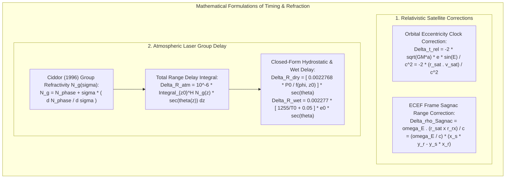

# Chapter 32: Hardware Timing, Synchronization, Leap Seconds, and Relativistic/Atmospheric Physics

*Why every range and position sensor is fundamentally a clock—and how microsecond timing bugs, leap seconds, and atmospheric refraction corrupt DEMs.*

---

## 32.5 Mathematical Foundations of Relativistic Timing and Atmospheric Delay

Precise geodetic positioning and laser ranging cannot be modeled with pure Euclidean geometry. This section derives the exact equations governing satellite orbital relativistic time corrections, the Earth-rotation Sagnac range effect, and the Ciddor atmospheric group refractivity integral for airborne and spaceborne laser altimetry.

---

### 32.5.1 Relativistic Clock Corrections in Satellite Positioning

A GNSS satellite clock is subject to continuous gravitational blueshift and special relativistic time dilation. While the constant component is canceled by the factory frequency preset ($10.22999999543\text{ MHz}$), periodic variations arise from orbital eccentricity.

#### 1. Derivation of the Eccentricity Relativistic Correction ($\Delta t_{\text{rel}}$)
In an elliptical Keplerian orbit, satellite speed $v$ and geocentric distance $r$ oscillate between perigee and apogee according to Kepler's laws:
$$r(E) = a (1 - e \cos E)$$
$$v^2 = G M_E \left( \frac{2}{r} - \frac{1}{a} \right)$$
where $a$ is the semi-major axis, $e$ is eccentricity, and $E$ is the eccentric anomaly.

The combined special and general relativistic fractional frequency variation is:
$$\frac{df}{f_0} = \frac{\Delta \Phi(r)}{c^2} - \frac{v^2}{2 c^2} = \frac{G M_E}{c^2 r} - \frac{G M_E}{2 c^2} \left( \frac{2}{r} - \frac{1}{a} \right) = \frac{G M_E}{2 a c^2} \left( \frac{2 a}{r} - 1 \right)$$

Integrating this frequency perturbation over time to obtain the clock phase offset $\Delta t_{\text{rel}}$:
$$\Delta t_{\text{rel}} = \int \frac{df}{f_0} \, dt$$

Using Kepler's equation, $M = E - e \sin E = n (t - t_p)$ where mean motion is $n = \sqrt{\frac{G M_E}{a^3}}$, the differential relationship is:
$$dt = \frac{r}{a n} \, dE = \frac{r}{\sqrt{G M_E / a}} \, dE$$

Substituting into the integral:
$$\Delta t_{\text{rel}} = \int \left[ \frac{G M_E}{2 a c^2} \left( \frac{2 a}{r} - 1 \right) \right] \frac{r}{\sqrt{G M_E / a}} \, dE = \frac{\sqrt{G M_E a}}{c^2} \int (2 - \frac{r}{a}) \, dE$$

Since $\frac{r}{a} = 1 - e \cos E$:
$$\Delta t_{\text{rel}} = \frac{\sqrt{G M_E a}}{c^2} \int \big( 2 - (1 - e \cos E) \big) \, dE = \frac{\sqrt{G M_E a}}{c^2} \int (1 + e \cos E) \, dE$$

Retaining only the periodic, non-secular component:

$$\Delta t_{\text{rel}} = -\frac{2 \sqrt{G M_E a}}{c^2} e \sin E$$

In vector notation, using $\mathbf{r}^s \cdot \mathbf{v}^s = \sqrt{G M_E a} \, e \sin E$:

$$\Delta t_{\text{rel}} = -\frac{2 (\mathbf{r}^s \cdot \mathbf{v}^s)}{c^2}$$
* **Magnitude:** For a GPS orbit with typical eccentricity $e \approx 0.01$, $\Delta t_{\text{rel}}$ oscillates with an amplitude of **$\approx 46\text{ nanoseconds}$**, corresponding to a periodic ranging wave of **$\pm 13.8\text{ meters}$**.

#### 2. Derivation of the Sagnac Range Correction
Because GNSS coordinates are computed in the Earth-Centered Earth-Fixed (ECEF) rotating coordinate system, the rotation of the Earth during the signal transit time $\tau = \frac{\rho}{c}$ shifts the apparent position of the receiver.

Under Special Relativity, the path difference for an electromagnetic wave propagating in a rotating reference frame rotating with angular velocity $\boldsymbol{\omega}_E = (0, 0, \omega_E)^T$ (where $\omega_E \approx 7.2921151467 \times 10^{-5}\text{ rad/s}$) is:

$$\Delta \rho_{\text{Sagnac}} = \frac{2 \omega_E \cdot A_{\text{projected}}}{c} = \frac{\boldsymbol{\omega}_E \cdot (\mathbf{r}^s \times \mathbf{r}_r)}{c}$$
where $\mathbf{r}^s = (x^s, y^s, z^s)^T$ is the satellite position at transmission, and $\mathbf{r}_r = (x_r, y_r, z_r)^T$ is the receiver position at reception.

Computing the cross product with $\boldsymbol{\omega}_E$ along $+z$:

$$\Delta \rho_{\text{Sagnac}} = \frac{\omega_E}{c} \big( x^s y_r - y^s x_r \big)$$
* **Magnitude:** For a typical GPS satellite-to-receiver geometry, $\Delta \rho_{\text{Sagnac}}$ reaches **$\pm 20\text{ to }\pm 30\text{ meters}$**.

---

### 32.5.2 Atmospheric Group Refractivity Delay (Ciddor & Saastamoinen Formulations)

In laser altimetry and LiDAR (e.g., $1064\text{ nm}$ or $532\text{ nm}$ pulses), the optical wave packet propagates at the **group velocity** $v_g = c / n_g$.

#### 1. Group Refractivity from Phase Refractivity
The phase refractive index $n_{\text{phase}}$ is related to vacuum wavenumber $\sigma = 1/\lambda$ ($\mu\text{m}^{-1}$). Group refractivity $N_g = (n_g - 1) \times 10^6$ is derived from phase refractivity by taking the chromatic dispersion derivative:

$$N_g(\sigma) = N_{\text{phase}}(\sigma) + \sigma \frac{d N_{\text{phase}}(\sigma)}{d\sigma}$$

Under the Ciddor (1996) standard for standard dry air ($15^\circ\text{C}$, $1013.25\text{ hPa}$, $450\text{ ppm CO}_2$):
$$N_{\text{dry, std}}(\sigma) = \frac{k_1}{k_0 - \sigma^2} + \frac{k_3}{k_2 - \sigma^2}$$
where constants are:
$$k_0 = 238.0185\,\mu\text{m}^{-2}, \quad k_1 = 5792105\,\mu\text{m}^{-2}, \quad k_2 = 57.362\,\mu\text{m}^{-2}, \quad k_3 = 167909\,\mu\text{m}^{-2}$$

#### 2. The Total Two-Way Range Delay Integral
The total one-way excess path delay $\Delta R_{\text{atm}}$ experienced by a laser pulse traveling between ground elevation $z_0$ and aircraft/satellite altitude $H$ along zenith angle $\theta$ is:

$$\Delta R_{\text{atm}} = 10^{-6} \int_{z_0}^H N_g(z) \sec\theta(z) \, dz$$

Applying the hydrostatic equation ($dP = -\rho g \, dz$) and separating atmospheric refractivity into dry (hydrostatic) and wet (water vapor) components yields the **Saastamoinen (1972) / Davis et al. (1985)** closed-form solution:

$$\Delta R_{\text{atm}} = \Delta R_{\text{dry}} + \Delta R_{\text{wet}}$$

$$\Delta R_{\text{dry}} = \frac{0.0022768 \cdot P_0}{1 - 0.00266 \cos(2\phi) - 0.00028 z_0} \cdot \sec\theta$$

$$\Delta R_{\text{wet}} = 0.002277 \cdot \left( \frac{1255}{T_0} + 0.05 \right) \cdot e_0 \cdot \sec\theta$$
where:
* $P_0$: Total surface barometric pressure ($\text{hPa}$).
* $T_0$: Surface air temperature ($\text{Kelvin}$).
* $e_0$: Surface water vapor pressure ($\text{hPa}$).
* $\phi$: Geographic latitude of the ground footprint.
* $z_0$: Ground elevation above sea level ($\text{kilometers}$).
* $\theta$: Off-nadir scan zenith angle ($\text{radians}$).

#### 3. Correcting the Measured Laser Range
Let $\Delta t_{\text{measured}}$ be the observed two-way travel time recorded by the LiDAR time-to-digital converter (TDC). The true physical geometric range $R_{\text{true}}$ from sensor to target is:

$$R_{\text{true}} = \frac{c_0 \cdot \Delta t_{\text{measured}}}{2} - \Delta R_{\text{atm}}(\theta, P_0, T_0, e_0)$$

Because $\Delta R_{\text{atm}} \approx 2.3\text{ meters}$ at nadir, subtracting this term is mandatory to prevent all LiDAR point clouds from sinking more than two meters into the Earth.
