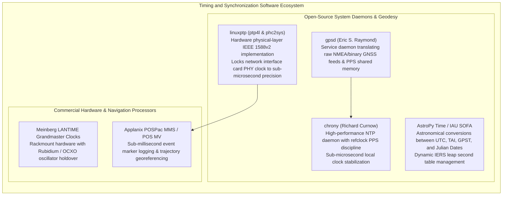

# Chapter 32: Hardware Timing, Synchronization, Leap Seconds, and Relativistic/Atmospheric Physics

*Why every range and position sensor is fundamentally a clock—and how microsecond timing bugs, leap seconds, and atmospheric refraction corrupt DEMs.*

---

## 32.6 Software Ecosystem

Managing microsecond synchronization, discipline clocks, and relativistic astronomical time conversions requires a specialized software stack spanning Linux kernel network drivers, geodetic astronomy libraries, and hardware grandmaster clocks. This section reviews the open-source tools and commercial hardware suites that keep geospatial mapping payloads synchronized.



---

### 32.6.1 Open-Source Linux Daemons and Astronomy Libraries

#### 1. `linuxptp`: Hardware PTP on Linux
Maintained by Richard Cochran, **`linuxptp`** is the standard open-source implementation of the Precision Time Protocol (IEEE 1588v2) for Linux:
* **`ptp4l`:** Communicates directly with the Network Interface Card (NIC) hardware transceiver, using kernel `SO_TIMESTAMPING` sockets to capture hardware timestamps at the PHY chip.
* **`phc2sys`:** Synchronizes the physical hardware clock (PHC) on the network card with the host operating system's system clock (`CLOCK_REALTIME`).

```bash
# Start PTP hardware synchronization on interface eth0 as a slave clock
sudo ptp4l -i eth0 -m -s -H

# Synchronize Linux system time from the network card's hardware clock (PHC)
sudo phc2sys -s eth0 -w -m
```

#### 2. `chrony`: High-Precision PPS Discipline
Developed by Richard Curnow and Miroslav Lichvar, **`chrony`** is the premier NTP daemon for Linux:
* Supports direct kernel PPS discipline via `/dev/pps0`.
* Ingests high-precision PPS square-wave edges and pairs them with NMEA `$GPZDA` sentences from `gpsd` via shared memory (`SHM 0` and `SHM 1`), disciplining the local system clock to within **$<1\text{ microsecond}$** of true UTC.

#### 3. `AstroPy Time` and the IAU SOFA Standards
Astronomical and geodetic time conversions require rigorous handling of leap seconds. The open-source **`astropy.time`** package wraps the International Astronomical Union's Standards of Fundamental Astronomy (SOFA) algorithms:

```python
"""
Python script for geodetic time conversion using astropy.time.
Demonstrates converting UTC timestamps to TAI, GPS Time, and GPS Week Seconds,
explicitly revealing the 18-second leap second offset.
"""

from astropy.time import Time
import datetime

def audit_survey_timestamps(utc_str: str):
    """
    Audits and converts a survey timestamp across conflicting geodetic time scales.
    
    Args:
        utc_str: ISO UTC timestamp (e.g., "2026-08-27T14:32:28.000").
    """
    print(f"--- Geodetic Time Scale Audit for Timestamp: {utc_str} ---")
    
    # 1. Initialize time object in UTC
    t_utc = Time(utc_str, format="isot", scale="utc")
    
    # 2. Convert to continuous International Atomic Time (TAI)
    t_tai = t_utc.tai
    
    # 3. Convert to GPS Time (GPST)
    t_gps = t_utc.gps
    
    # Calculate exact offsets in seconds
    tai_utc_offset = (t_tai.mjd - t_utc.mjd) * 86400.0
    gps_utc_offset = (t_gps.mjd - t_utc.mjd) * 86400.0
    tai_gps_offset = (t_tai.mjd - t_gps.mjd) * 86400.0
    
    # 4. Calculate GPS Week Number and GPS Week Seconds (standard for SBET trajectory files)
    # GPS epoch is 1980-01-06 00:00:00 UTC (MJD 44244.0)
    gps_epoch_mjd = 44244.0
    days_since_gps_epoch = t_gps.mjd - gps_epoch_mjd
    gps_week = int(days_since_gps_epoch // 7)
    gps_week_seconds = (days_since_gps_epoch % 7) * 86400.0
    
    print(f"Civil Time (UTC):       {t_utc.iso}")
    print(f"Atomic Time (TAI):      {t_tai.iso}  [Offset: TAI - UTC = {tai_utc_offset:.1f} s]")
    print(f"GPS Time (GPST):        {t_gps.iso}  [Offset: GPST - UTC = {gps_utc_offset:.1f} s]")
    print(f"Constant Invariant:     TAI - GPST = {tai_gps_offset:.1f} s")
    print(f"\nSBET Trajectory Format:")
    print(f"  GPS Week Number:      {gps_week}")
    print(f"  GPS Week Seconds:     {gps_week_seconds:.3f} s")
    print("\nWARNING: Merging raw UTC pings with GPS Week Seconds without subtracting")
    print(f"         {gps_utc_offset:.1f} seconds will displace survey coordinates by hundreds of meters!")

# Example execution for year 2026:
audit_survey_timestamps("2026-08-27T14:32:28.000")
```

---

### 32.6.2 Commercial Hardware Grandmasters and Inertial Systems

#### 1. Meinberg LANTIME Grandmaster Clocks
Manufactured in Bad Pyrmont, Germany, **Meinberg LANTIME** servers (such as the M600 and M1000) are the industry standard for shipboard and aircraft timing:
* Integrated high-sensitivity multi-constellation GNSS receivers (GPS, Galileo, GLONASS, BeiDou).
* Equipped with internal **Oven-Controlled Crystal Oscillators (OCXO)** or **Rubidium atomic standards**, providing continuous sub-microsecond holdover capability even if GNSS signals are lost or jammed for hours during electronic warfare.
* Broadcasts synchronized IEEE 1588v2 PTP, optical IRIG-B, PPS TTL, and NTP to all sensors aboard the vessel.

#### 2. Applanix POSPac MMS and POS MV
Developed by Trimble Applanix (Richmond Hill, Canada), the **POS MV (Marine Vessels)** and **POSPac MMS (Mobile Mapping Systems)** are the leading position and orientation solutions in surveying:
* Features hardware **Event Marker Channels**: when a camera shutter fires or a sonar ping transmits, an electrical TTL pulse triggers a dedicated hardware capture register on the Applanix board, timestamping the event to within **$<5\text{ nanoseconds}$** of GPS Time.
* Post-processes tightly coupled GNSS and inertial measurements into Smooth Best Estimate Trajectory (SBET) files, providing the definitive, geodetically rigid flight path for DEM compilation.
