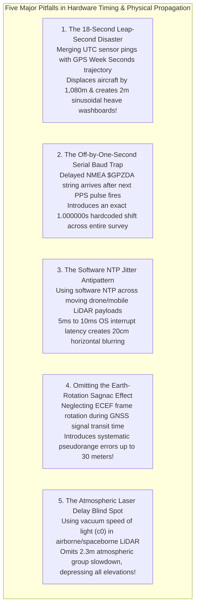

# Chapter 32: Hardware Timing, Synchronization, Leap Seconds, and Relativistic/Atmospheric Physics

*Why every range and position sensor is fundamentally a clock—and how microsecond timing bugs, leap seconds, and atmospheric refraction corrupt DEMs.*

---

## 32.7 Common Pitfalls and Key Takeaways

Hardware timing and physical propagation delays are the silent saboteurs of digital elevation modeling. A single misconfigured serial baud rate, an unhandled leap second, or a software network interrupt can introduce kilometer-scale position blunders or distort flat surfaces into phantom sinusoidal waves.

---

### 32.7.1 Common Pitfalls in Timing, Relativity, and Atmospheric Physics

#### 1. The 18-Second Leap-Second Disaster
* **The Failure Mode:** An airborne LiDAR or marine multibeam processing team merges raw sensor pings stamped in UTC with an inertial trajectory (SBET) recorded in GPS Time (GPS Week Seconds) without accounting for the integer leap-second difference.
* **Physical Reality:** As of 2026, GPS Time is ahead of UTC by exactly **18.000 seconds**.
* **Forensic Consequence:**
  * In the air ($v = 60\text{ m/s}$), the aircraft position is shifted by **$1,080\text{ meters}$ horizontally**. Laser points are projected from an aircraft location more than a kilometer away from the true firing point.
  * At sea ($v = 4.1\text{ m/s}$), the vessel is displaced by $74\text{ meters}$. Furthermore, because ocean swell periods ($4\text{–}8\text{ s}$) are out of phase by $18\text{ seconds}$, motion compensation inverts heave and pitch, transforming a flat sandy seabed into a **high-amplitude sinusoidal washboard surface** with $1\text{–}3\text{ meter}$ artificial waves.
* **Remedy:** Audit all timestamp headers. Ensure that pings and trajectories are converted to a single common time scale (GPST or TAI) prior to spatial ray-tracing.

#### 2. The Off-by-One-Second Serial Baud Trap
* **The Failure Mode:** A hydrographic survey launch synchronizes an echosounder by wiring a PPS TTL pulse along with an RS-232 serial cable broadcasting NMEA `$GPZDA` at 4800 or 9600 baud.
* **Physical Reality:** At low baud rates, combined with operating system FIFO buffer delays and serial multiplexing, transmitting the ASCII sentence takes over $80\text{ milliseconds}$. If transmission latency exceeds $1.0\text{ second}$, the `$GPZDA` string arrives at the sensor's microcontroller **after the next PPS pulse has already fired**.
* **Forensic Consequence:** The sensor firmware mistakenly binds the timestamp of Second $N$ to the rising edge of Second $N+1$. The entire survey payload operates with a continuous, hardcoded **$1.000000\text{-second}$ time lag**. On reciprocal survey lines (running North, then South), bathymetric features fail to align, creating a systematic **$8.2\text{-meter}$ along-track horizontal displacement** ($2 \times 4.1\text{ m/s}$) that fails IHO Order 1a cross-line checks.
* **Remedy:** Increase serial timing baud rates to **$115,200\text{ baud}$** or higher, verify timing offsets on an oscilloscope, or replace serial cables with **IEEE 1588v2 PTP Ethernet**.

#### 3. Relying on Software NTP for Dynamic Mobile Sensors
* **The Failure Mode:** A commercial drone mapping operator or autonomous mobile vehicle team synchronizes high-speed LiDAR scanners and digital framing cameras over standard Ethernet using the Network Time Protocol (NTP).
* **Physical Reality:** Software NTP operates at the operating system application/kernel layer over UDP/IP. Timestamping packets after they traverse network card queues, OS interrupt handlers, and thread schedulers introduces non-deterministic jitter of **$\pm 5\text{ to }\pm 10\text{ milliseconds}$**.
* **Forensic Consequence:** At highway driving speeds ($30\text{ m/s}$) or drone flight speeds ($20\text{ m/s}$), a $5\text{-millisecond}$ timing jitter produces horizontal positioning errors of **$\pm 10\text{ to }\pm 15\text{ centimeters}$**. When multiple passes over the same street are merged, vertical curb faces, building facades, and utility poles appear double-rendered or smeared into thick, blurry point bands.
* **Remedy:** Ban software NTP on dynamic mobile sensor payloads. Mandate **IEEE 1588v2 Precision Time Protocol (PTP)** with hardware physical-layer (PHY) timestamping, which guarantees clock synchronization of **$<100\text{ nanoseconds}$**.

#### 4. Omitting the Earth-Rotation Sagnac Effect
* **The Failure Mode:** An engineer writing custom GNSS positioning software or spaceborne radar altimetry processors converts signal travel time to geometric distance assuming a static reference frame.
* **Physical Reality:** GNSS coordinates are defined in the Earth-Centered Earth-Fixed (ECEF) rotating coordinate system. During the $70\text{ milliseconds}$ it takes for a radio pulse to travel from satellite orbit to the ground, the Earth rotates eastward beneath the signal by $\Delta \theta = \omega_E \tau$.
* **Forensic Consequence:** Failing to apply the relativistic Sagnac range correction introduces a coordinate-dependent pseudorange error of **up to $\pm 30\text{ meters}$**. All calculated receiver coordinates—and the resulting DEM elevation benchmarks—are systematically warped horizontally and vertically.
* **Remedy:** Implement the standard relativistic Sagnac correction equation $\Delta \rho_{\text{Sagnac}} = \frac{\omega_E}{c}(x^s y_r - y^s x_r)$ in all GNSS processing engines.

#### 5. The Atmospheric Group Refractivity Omission in LiDAR
* **The Failure Mode:** A geospatial software developer writes a point-cloud projection engine, converting two-way laser travel time $\Delta t$ directly to slant range using the speed of light in vacuum: $R = \frac{c_0 \Delta t}{2}$.
* **Physical Reality:** In the dense troposphere, the group refractive index of air at optical wavelengths ($1064\text{ nm}$ or $532\text{ nm}$) is $n_g \approx 1.000277$. Photons travel slower in air than in vacuum.
* **Forensic Consequence:** Over a vertical atmospheric column, this group velocity slowdown adds an extra **$2.307\text{ meters}$ of apparent travel distance** at sea level under standard pressure ($1013.25\text{ hPa}$). If uncorrected, **every point in the resulting digital elevation model is systematically depressed by over $2.3\text{ meters}$**. In coastal lowlands, entire dry barrier islands are mapped as submerged underwater.
* **Remedy:** Always apply the Ciddor / Saastamoinen atmospheric group delay correction, integrating local barometric pressure, temperature, and humidity profiles to correct laser ranges before georeferencing.

---

### 32.7.2 Key Takeaways for Practitioners

1. **Every Sensor Is a Clock:** Elevation is computed from wave propagation time. Sub-decimeter 3D mapping requires sub-microsecond synchronization across all platform subsystems.
2. **Beware the 18-Second Leap-Second Offset:** GPS Time does not have leap seconds; UTC does. Never merge UTC sensor timestamps with GPS Week Seconds navigation trajectories without accounting for the exact integer leap second offset.
3. **PTP Replaces Serial and NTP:** Replace point-to-point coaxial PPS/serial cables and jittery software NTP with IEEE 1588v2 Precision Time Protocol (PTP) utilizing hardware PHY timestamping ($<100\text{ ns}$).
4. **Relativity Is an Operational Reality:** Satellite positioning requires compensating for Special Relativistic time dilation ($-7.2\,\mu\text{s/day}$), General Relativistic blueshift ($+45.6\,\mu\text{s/day}$), orbital eccentricity, and the Earth-rotation Sagnac effect.
5. **Light Slows Down in Air:** Atmospheric group refractivity delays laser pulses by $\sim 2.3\text{ meters}$ at nadir; always subtract atmospheric delay before computing 3D coordinates.
