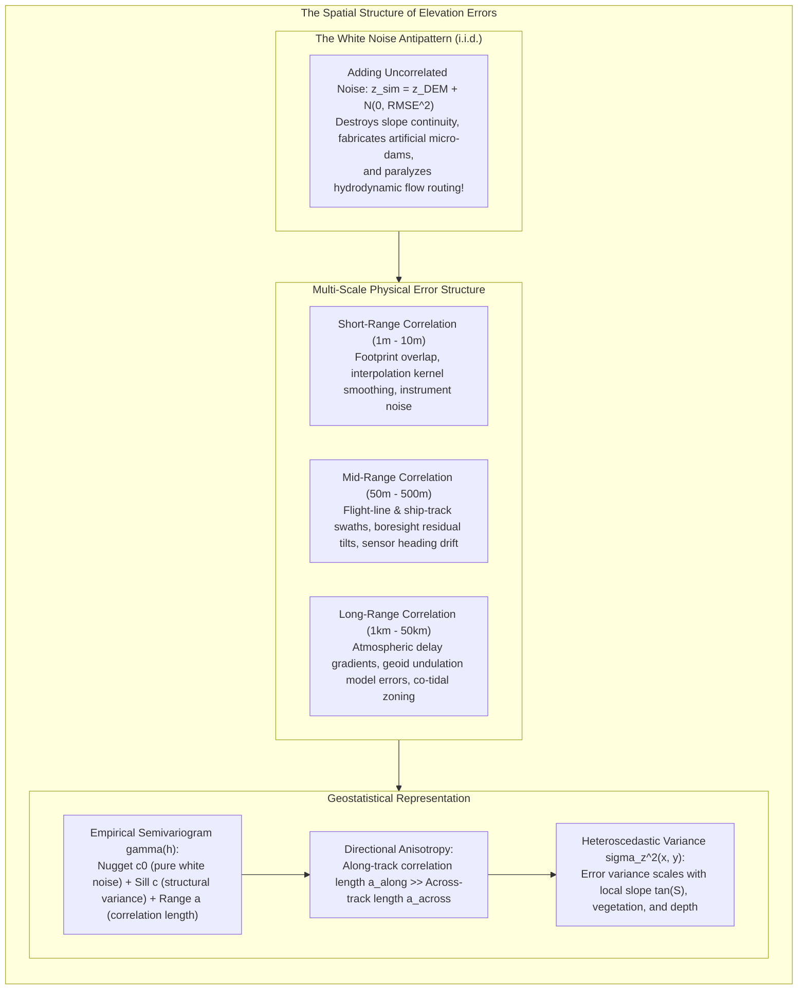
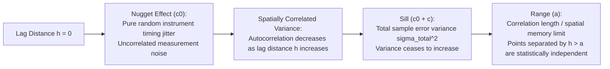
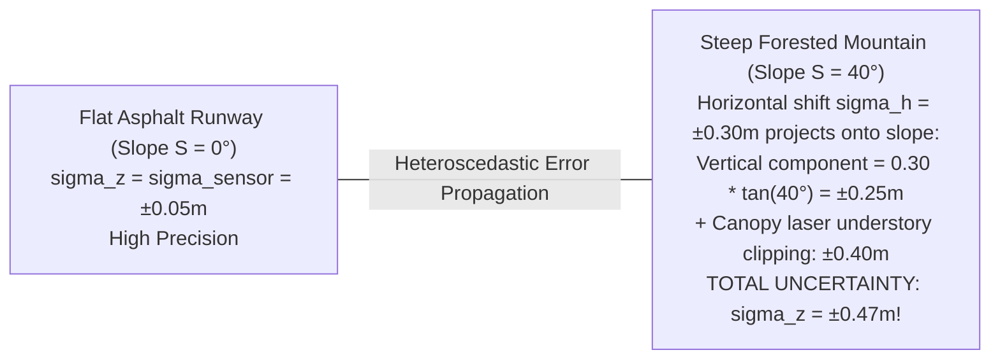

# Chapter 33: Geostatistical Error Simulation and Downstream Uncertainty Propagation

*Beyond static error metrics: generating equiprobable stochastic terrain ensembles to bound real-world risks in hydrology, viewsheds, and earthwork.*

---

## 33.1 Modeling Spatial Autocorrelation of DEM Errors

When an elevation dataset is published with an accuracy statement—such as "$\text{RMSE}_z = \pm 10\text{ cm}$" or "IHO Special Order compliant"—practitioners routinely make a fatal modeling assumption: they treat elevation error as independent, identically distributed (i.i.d.) Gaussian white noise. Adding uncorrelated white noise to a DEM creates an artificial "salt-and-pepper" or "gravel-bed" micro-texture that does not exist in nature, artificially increasing terrain surface area, obliterating drainage networks, and paralyzing hydrodynamic models.

In physical reality, **elevation errors are heavily spatially autocorrelated**. If an airborne LiDAR flight line suffers a $5\text{-cm}$ roll calibration bias, or if a multibeam sonar line is affected by an uncorrected tidal datum phase lag, adjacent elevation cells share nearly identical errors. Rigorous uncertainty modeling requires characterizing the spatial correlation structure of errors across multiple scales using **empirical semivariograms**, **directional anisotropy**, and **heteroscedastic variance scaling**.

---

### 33.1.1 The Failure of the Independent White Noise Myth

In many legacy GIS modeling workflows, uncertainty is simulated via naive Monte Carlo perturbation:
$$z_{\text{sim}}(x, y) = z_{\text{DEM}}(x, y) + \epsilon(x, y), \quad \text{where } \epsilon(x, y) \stackrel{\text{i.i.d.}}{\sim} \mathcal{N}(0, \sigma^2)$$

This formulation violates the physics of remote sensing and geomorphology:
1. **Destruction of Surface Slope:** 
   The spatial gradient of white noise is mathematically unbounded as cell size $\Delta x \to 0$:
   $$\mathbb{E}\left[ \left(\frac{\partial \epsilon}{\partial x}\right)^2 \right] \approx \frac{2\sigma^2}{\Delta x^2}$$
   On a $1\text{-meter}$ LiDAR grid with $\sigma = 0.10\text{ m}$, adding white noise creates random artificial slopes of $\pm 14\%$, turning a smooth, flat parking lot or water reservoir into a jagged field of spikes and pits.
2. **Artificial Micro-Dams in Hydrology:** 
   Water routing algorithms (D8, D-infinity) evaluate flow along the steepest downward descent. White noise introduces artificial $10\text{-cm}$ depressions in every stream channel, creating thousands of artificial sinks that trap simulated water, stopping overland flow and preventing floodwaters from reaching the river outlet.
3. **Overestimation of Volume Uncertainty:** 
   When integrating elevation across an area of $N$ pixels to compute cut-and-fill volume or reservoir capacity:
   $$V = \Delta x \Delta y \sum_{i=1}^N z_i$$
   Under white noise, errors cancel out via the Law of Large Numbers ($\sigma_V \propto \sqrt{N}$). But in physical reality, if an entire $10\text{-km}$ survey swath has an uncorrected $+8\text{-cm}$ vertical datum bias, the error does **not cancel**; it sums coherently ($\sigma_V \propto N$), creating multi-million-dollar volume accounting blunders!

---

### 33.1.2 The Multi-Scale Semivariogram Architecture

Geostatistical modeling characterizes spatial continuity using the **semivariance $\gamma(\mathbf{h})$** as a function of the spatial lag separation vector $\mathbf{h}$:

$$\gamma(\mathbf{h}) = \frac{1}{2 N(\mathbf{h})} \sum_{i=1}^{N(\mathbf{h})} \Big( \epsilon(\mathbf{x}_i) - \epsilon(\mathbf{x}_i + \mathbf{h}) \Big)^2$$
where $\epsilon(\mathbf{x}) = z_{\text{DEM}}(\mathbf{x}) - z_{\text{truth}}(\mathbf{x})$ is the residual vertical error measured at geodetic check points, and $N(\mathbf{h})$ is the number of point pairs separated by vector $\mathbf{h}$.

#### 1. Anatomy of the Semivariogram
* **The Nugget Effect ($c_0$):** The apparent semivariance as $|\mathbf{h}| \to 0$. Represents uncorrelated detector noise, pulse timing jitter, and positioning noise.
* **The Structural Sill ($c$):** The spatially autocorrelated variance component.
* **The Total Sill ($c_0 + c$):** The asymptotic maximum variance, equal to the total sample error variance $\sigma_z^2$.
* **The Range ($a$):** The correlation length. Check points separated by distances $h < a$ share correlated errors; points separated by $h \ge a$ are statistically independent.

#### 2. Nested Theoretical Semivariogram Models
Real elevation errors exhibit **nested structures** spanning short, medium, and long correlation ranges. Glaciological and geostatistical modeling (e.g., Hugonnet et al. 2021 in `xdem`) represents error semivariance as a sum of spherical, exponential, and Gaussian models:

$$\gamma(h) = c_0 + c_1 \left( 1 - e^{-\frac{3 h}{a_1}} \right) + c_2 \left( 1 - e^{-\left(\frac{3 h}{a_2}\right)^2} \right) + c_3 \left( 1 - e^{-\frac{3 h}{a_3}} \right)$$
* **Short Range ($a_1 \approx 10\text{–}30\text{ m}$):** Spatial filtering kernels, DEM gridding interpolation ringing, and laser footprint point-density variations.
* **Medium Range ($a_2 \approx 200\text{–}800\text{ m}$):** Flight-line swath spacing, scan-angle dependent roll errors, and multi-beam refraction smiles.
* **Long Range ($a_3 \approx 5\text{–}50\text{ km}$):** Regional atmospheric water vapor delays, satellite orbital ephemeris baseline drifts, and geoid model interpolation undulations.

---

### 33.1.3 Directional Anisotropy: Flight-Line Striping

Elevation errors are rarely isotropic (identical in all directions). In airborne LiDAR, drone photogrammetry, and marine multibeam sonar, platforms move along parallel survey tracks:

* **The Along-Track Dimension:** Vehicle trajectory drift (IMU gyro bias drift, kinematic GPS pitch wander, dynamic vessel heave) evolves slowly over time, producing long correlation lengths along the flight direction:
  $$a_{\text{along}} \approx 2,000\text{ to }10,000\text{ meters}$$
* **The Across-Track Dimension:** Swath geometry, scan-angle mirror errors, and multibeam ray refraction oscillate across the swath width, yielding short correlation lengths perpendicular to the track:
  $$a_{\text{across}} \approx 50\text{ to }200\text{ meters}$$

This **geometric anisotropy ratio** ($k_{\text{aniso}} = a_{\text{along}} / a_{\text{across}} \approx 10:1\text{ to }50:1$) must be parameterized into an elliptical covariance tensor:
$$\mathbf{h}_{\text{aniso}} = \sqrt{ \left(\frac{h_{\text{along}}}{a_{\text{along}}}\right)^2 + \left(\frac{h_{\text{across}}}{a_{\text{across}}}\right)^2 }$$

Simulating errors without directional anisotropy fails to capture the prominent along-track striping patterns that govern real elevation artifacts.

---

### 33.1.4 Heteroscedastic Error Scaling ($\sigma_z(x, y)$)

In real terrain, error variance is **heteroscedastic** (non-uniform across the map). A DEM is far more uncertain on steep, forested mountain cliffs than on flat, paved airport runways.

The local standard deviation of elevation error $\sigma_z(x, y)$ is formulated as a coupled physical function of terrain slope $S(x, y)$, land cover classification, and horizontal positioning uncertainty $\sigma_{\text{horiz}}$:

$$\sigma_z^2(x, y) = \sigma_{\text{sensor}}^2 + \big( \sigma_{\text{horiz}} \cdot \tan S(x, y) \big)^2 + \sigma_{\text{cover}}^2(\text{landcover})$$

* On flat bare ground ($S \approx 0^\circ$): The horizontal error component vanishes ($\tan 0^\circ = 0$), leaving pure sensor ranging precision ($\sigma_z \approx \pm 0.05\text{ m}$).
* On steep slopes ($S = 45^\circ$, $\tan 45^\circ = 1.0$): Any horizontal positioning error $\sigma_{\text{horiz}}$ translates directly into an equivalent vertical error: $\Delta z = \sigma_{\text{horiz}} \cdot \tan S$. A sub-meter horizontal GNSS drift of $\pm 0.50\text{ m}$ instantly introduces a $\pm 0.50\text{-meter}$ vertical elevation error!

To simulate realistic error fields, geostatistical simulation engines must generate stationary, standardized spatial correlation fields and scale them point-by-point by the **local heteroscedastic standard deviation map $\sigma_z(x, y)$**.
