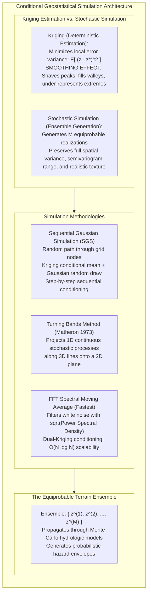
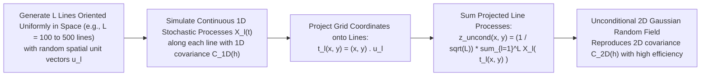
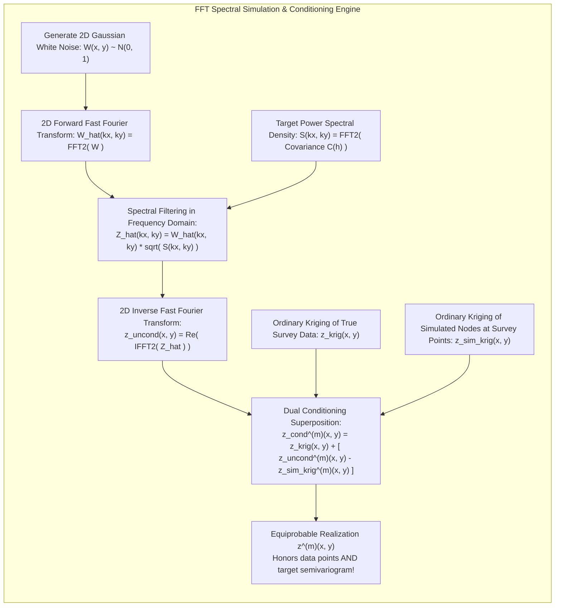

# Chapter 33: Geostatistical Error Simulation and Downstream Uncertainty Propagation

*Beyond static error metrics: generating equiprobable stochastic terrain ensembles to bound real-world risks in hydrology, viewsheds, and earthwork.*

---

## 33.2 Conditional Geostatistical Simulation of Equiprobable DEMs

In deterministic GIS workflows, an analyst produces a single "best estimate" digital elevation model and treats it as absolute physical truth. If the analyst applies geostatistical Kriging, the resulting surface is the Best Linear Unbiased Estimator (BLUE). However, Kriging possesses a well-known smoothing property: it systematically underestimates natural terrain variance, shaving down sharp mountain peaks and filling in deep stream channels.

To propagate elevation uncertainty into downstream non-linear models (such as flood inundation, infrastructure line-of-sight, or coastal storm surge), one must abandon the illusion of a single surface. Instead, geodesists deploy **Conditional Geostatistical Simulation** to generate an ensemble of $M$ alternative, **equiprobable terrain realizations**:

$$\mathcal{Z} = \big\{ z^{(1)}(\mathbf{x}), \; z^{(2)}(\mathbf{x}), \; \dots, \; z^{(M)}(\mathbf{x}) \big\}$$

Every simulated realization satisfies two immutable mathematical conditions:
1. **Conditioning:** It honors the true measured elevations exactly at all survey check points ($\forall i, z^{(m)}(\mathbf{x}_i) = z_{\text{truth}}(\mathbf{x}_i)$).
2. **Spatial Structure:** It reproduces the exact global variance, spatial autocorrelation, and micro-roughness dictated by the target semivariogram.

---

### 33.2.1 Sequential Gaussian Simulation (SGS)

The classical benchmark algorithm in spatial geostatistics is **Sequential Gaussian Simulation (SGS)** (Journel 1974; Deutsch & Journel 1998):

#### 1. The Normal Score Transform
Because SGS requires variables to follow a standard Gaussian distribution $\mathcal{N}(0, 1)$, non-Gaussian elevations or residuals $\epsilon(\mathbf{x})$ are mapped to standard normal scores $y(\mathbf{x})$ using the empirical cumulative distribution function (CDF):

$$y(\mathbf{x}) = \Phi^{-1}\big( F_{\epsilon}(\epsilon(\mathbf{x})) \big)$$
where $F_\epsilon$ is the sample CDF of the data, and $\Phi^{-1}$ is the inverse standard normal CDF.

#### 2. The Sequential Node Path
1. Define a regular computational grid of $N$ unvisited nodes.
2. Generate a **random spatial path** that visits every grid node exactly once. Randomizing the path prevents directional artifact propagation across the grid.
3. At the current node $\mathbf{x}_k$:
   * Identify all neighboring conditioning data within the search neighborhood radius. Crucially, the conditioning data includes both **original measured survey check points** and **previously simulated grid nodes**.
   * Execute Simple Kriging to compute the conditional expectation (mean) $\mu_k$ and the conditional Kriging variance $\sigma_k^2$:
     $$\mu_k = \mathbf{c}_k^T \mathbf{C}^{-1} \mathbf{y}_{\text{cond}}$$
     $$\sigma_k^2 = C(0) - \mathbf{c}_k^T \mathbf{C}^{-1} \mathbf{c}_k$$
   * Draw a random realization from the local Gaussian conditional distribution:
     $$y_{\text{sim}}(\mathbf{x}_k) \sim \mathcal{N}\big( \mu_k, \, \sigma_k^2 \big)$$
   * Add the newly simulated value $y_{\text{sim}}(\mathbf{x}_k)$ into the active conditioning dataset.
4. Advance to the next node in the random path until all $N$ nodes are simulated.
5. Back-transform the simulated normal scores to physical elevation units:
   $$\epsilon_{\text{sim}}(\mathbf{x}) = F_\epsilon^{-1}\big( \Phi(y_{\text{sim}}(\mathbf{x})) \big)$$

*Computational Bottleneck:* While rigorous, SGS scales as $O(N \cdot k^3)$ (where $k$ is neighborhood size). Simulating hundreds of realizations on a multi-million-pixel DEM is computationally prohibitive for real-time applications.

---

### 33.2.2 The Turning Bands Method (Matheron 1973)

Developed by Georges Matheron at the École des Mines de Paris, the **Turning Bands Method** circumvents high-dimensional 2D/3D covariance matrix inversions by reducing multidimensional simulation to a collection of independent **one-dimensional stochastic line processes**:

#### The Mathematical Projection
To simulate an isotropic 2D covariance $C_{\text{2D}}(h)$, Matheron proved that the corresponding 1D line covariance $C_{\text{1D}}(h)$ is related via the integral transform:
$$C_{\text{2D}}(h) = \int_0^1 C_{\text{1D}}(h v) \, dv$$

By simulating fast 1D spectral processes $X_l(t)$ along $L$ uniformly distributed lines (typically $L = 100\text{ to }500$), the 2D value at any grid coordinate $\mathbf{x} = (x, y)$ is evaluated by simple linear projection:
$$z_{\text{uncond}}(\mathbf{x}) = \frac{1}{\sqrt{L}} \sum_{l=1}^L X_l\big( \mathbf{x} \cdot \mathbf{u}_l \big)$$
where $\mathbf{u}_l$ is the unit direction vector of line $l$. The Turning Bands method is extremely fast and parallelizable, but can introduce subtle radial striping artifacts if the number of lines $L$ is too small.

---

### 33.2.3 Fast Fourier Transform (FFT) Spectral Simulation and Dual Conditioning

For large-scale, petabyte digital elevation pipelines, the modern computational benchmark is **FFT Spectral Simulation** paired with **Kriging Conditioning** (Dietrich & Newsam 1993):

#### 1. Unconditional Simulation via Spectral Factorization
Under the **Wiener-Khinchin theorem**, the covariance function $C(\mathbf{h})$ and the power spectral density $S(\mathbf{k})$ of a stationary random field form a Fourier transform pair:
$$S(\mathbf{k}) = \iint_{\mathbb{R}^2} C(\mathbf{h}) e^{-i \mathbf{k} \cdot \mathbf{h}} \, d\mathbf{h}$$

To synthesize an unconditional realization $z_{\text{uncond}}(\mathbf{x})$ on a grid of $N_x \times N_y$ pixels:
1. Generate an array of independent standard normal random variables: $W(x, y) \sim \mathcal{N}(0, 1)$.
2. Compute the 2D forward FFT: $\widehat{W}(k_x, k_y) = \mathcal{F}\big( W(x, y) \big)$.
3. Filter in the frequency domain by multiplying by the square root of the power spectrum:
   $$\widehat{Z}(k_x, k_y) = \widehat{W}(k_x, k_y) \cdot \sqrt{S(k_x, k_y)}$$
4. Compute the 2D inverse FFT to return to the spatial domain:
   $$z_{\text{uncond}}(x, y) = \text{Re}\left( \mathcal{F}^{-1}\big( \widehat{Z}(k_x, k_y) \big) \right)$$
*Computational Complexity:* Because the FFT operates in **$O(N \log N)$** time, generating an unconditional multi-million-pixel realization requires only a fraction of a second on modern multi-core CPUs or GPUs.

#### 2. Conditioning via Dual Kriging
The unconditional realization $z_{\text{uncond}}^{(m)}(\mathbf{x})$ possesses the correct spatial covariance structure, but does not honor the true observed elevations at survey check points $\mathbf{x}_i$.

To enforce conditioning without destroying covariance properties, we apply the **Dual Kriging conditioning formula**:

$$z_{\text{cond}}^{(m)}(\mathbf{x}) = z_{\text{Krig}}(\mathbf{x}) + \Big( z_{\text{uncond}}^{(m)}(\mathbf{x}) - z_{\text{uncond, Krig}}^{(m)}(\mathbf{x}) \Big)$$
where:
* $z_{\text{Krig}}(\mathbf{x})$: The Kriging estimation surface derived from the **true physical survey data**.
* $z_{\text{uncond}}^{(m)}(\mathbf{x})$: The unconditional spectral realization.
* $z_{\text{uncond, Krig}}^{(m)}(\mathbf{x})$: The Kriging estimation surface derived by sampling the unconditional realization $z_{\text{uncond}}^{(m)}$ at the exact same survey coordinates $\mathbf{x}_i$ and Kriging them.

#### Mathematical Proof of Conditioning:
At any surveyed check point $\mathbf{x}_i$:
$$z_{\text{cond}}^{(m)}(\mathbf{x}_i) = z_{\text{Krig}}(\mathbf{x}_i) + \Big( z_{\text{uncond}}^{(m)}(\mathbf{x}_i) - z_{\text{uncond, Krig}}^{(m)}(\mathbf{x}_i) \Big)$$
Since Kriging is an exact interpolator at sample points ($z_{\text{Krig}}(\mathbf{x}_i) = z_{\text{true}}(\mathbf{x}_i)$ and $z_{\text{uncond, Krig}}^{(m)}(\mathbf{x}_i) = z_{\text{uncond}}^{(m)}(\mathbf{x}_i)$):
$$z_{\text{cond}}^{(m)}(\mathbf{x}_i) = z_{\text{true}}(\mathbf{x}_i) + \big( z_{\text{uncond}}^{(m)}(\mathbf{x}_i) - z_{\text{uncond}}^{(m)}(\mathbf{x}_i) \big) = \mathbf{z_{\text{true}}(\mathbf{x}_i)}$$
The error residual at all sample points is identically zero!

In data gaps far from sample points, the Kriging terms decay to the regional mean, leaving the pure, unconstrained stochastic fluctuations $z_{\text{uncond}}^{(m)}(\mathbf{x})$. Repeating this process with $M$ independent white-noise seeds produces an ensemble of $M$ alternative, fully conditioned DEMs in minutes.
