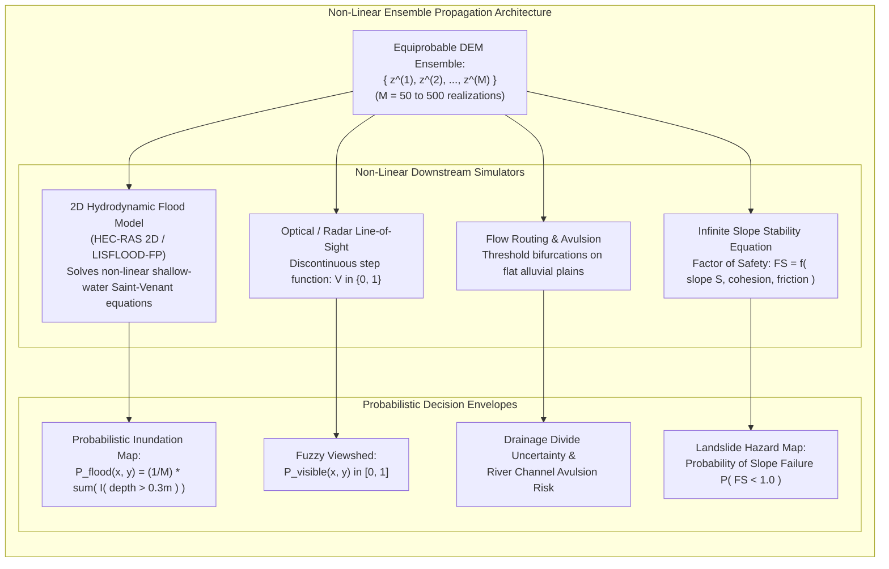
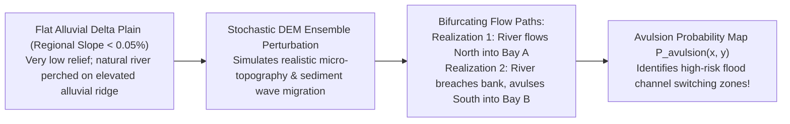

# Chapter 33: Geostatistical Error Simulation and Downstream Uncertainty Propagation

*Beyond static error metrics: generating equiprobable stochastic terrain ensembles to bound real-world risks in hydrology, viewsheds, and earthwork.*

---

## 33.3 Propagating DEM Ensembles Through Non-Linear Downstream Models

In geospatial analysis, digital elevation models are rarely the final product. They are intermediate boundary conditions ingested by non-linear physical simulators: 2D hydrodynamic flood solvers, ray-tracing line-of-sight algorithms, cellular overland flow routers, and geotechnical slope stability equations.

A foundational principle of non-linear systems is Jensen's Inequality: **the expected value of a non-linear function does not equal the function of the expected value**:

$$\mathbb{E}\big[ \mathcal{M}(z) \big] \ne \mathcal{M}\big( \mathbb{E}[z] \big)$$

Running a simulation on a single "average" or "best-estimate" DEM does not yield the average outcome; it produces an unquantified, systematically biased output that conceals tipping points and threshold failures. By propagating an ensemble of $M$ equiprobable simulated DEMs through downstream models, practitioners transform brittle, deterministic predictions into defensible **probabilistic risk envelopes**.

---

### 33.3.1 Probabilistic Flood Inundation and Levee Overtopping

Standard regulatory flood mapping (such as FEMA Base Flood Elevation maps) calculates a single deterministic flood inundation boundary. In low-relief coastal plains and river floodplains, this binary "wet/dry" line is dangerously misleading:

#### 1. The Threshold Overtopping Catastrophe
Consider an earthen flood protection levee protecting an urban community. The nominal levee crest elevation is $z_{\text{levee}} = 10.0\text{ m}$, and a simulated 100-year river flood peak reaches water level $h_{\text{flood}} = 9.85\text{ m}$.
* Under a deterministic DEM, the levee crest everywhere exceeds water elevation by $15\text{ cm}$. The simulation reports: **Zero flooding; community 100% safe.**
* If the underlying DEM has a spatial vertical uncertainty of $\sigma_z = \pm 20\text{ cm}$ with an along-track correlation length of $200\text{ meters}$:
* In $30\%$ of the equiprobable realizations, small local depressions or unmapped settling in the levee crest drop the local crest below $9.85\text{ m}$.
* Once water overtops a single low point on the levee, 2D hydrodynamic flow equations route catastrophic discharge into the urban interior, completely flooding the city behind the wall!

#### 2. Constructing the Probabilistic Inundation Map
By running a 2D shallow-water model (such as LISFLOOD-FP) across all $M$ realizations $\{z^{(1)}, \dots, z^{(M)}\}$, the inundation probability $P_{\text{flood}}(x, y)$ is evaluated as the ensemble frequency:

$$P_{\text{flood}}(x, y) = \frac{1}{M} \sum_{m=1}^M \mathbb{I}\Big( h_{\text{water}}^{(m)}(x, y) \ge h_{\text{crit}} \Big)$$
where $\mathbb{I}(\cdot)$ is the indicator function, $h_{\text{water}}^{(m)}$ is the maximum water depth modeled in realization $m$, and $h_{\text{crit}}$ is a hazard threshold (e.g., $h_{\text{crit}} = 0.30\text{ meters}$).
* *Decision Utility:* Emergency managers receive continuous probability contours ($P = 10\%, 50\%, 90\%$). Infrastructure inside the $P \ge 10\%$ zone is evacuated, and municipal engineers identify the exact $50\text{-meter}$ levee reach most vulnerable to overtopping failure.

---

### 33.3.2 Fuzzy Viewsheds: Line-of-Sight Uncertainty

Line-of-sight visibility analysis is critical for siting microwave telecommunication towers, radar air-defense installations, and wind turbine visual impact assessments:

#### 1. The Discontinuous Nature of Visibility
In classical GIS, binary visibility $V(\mathbf{x}) \in \{0, 1\}$ from transmitter $\mathbf{x}_{\text{tx}}$ to receiver $\mathbf{x}_{\text{rx}}$ is a discontinuous step function:
* A ray is traced through 3D space: if the ray clears the intervening terrain by even $1\text{ millimeter}$, $V = 1$ (visible); if the terrain touches the ray by $1\text{ millimeter}$, $V = 0$ (occluded).
* Because visibility is non-linear and discontinuous, calculating a viewshed on a single DEM is hypersensitive to tiny interpolation errors. A $10\text{-cm}$ elevation spike on a distant ridgeline $15\text{ km}$ away can cast a massive shadow that artificially blinds an entire mountain valley.

#### 2. The Fuzzy Viewshed Formulation
Evaluating the viewshed across the stochastic DEM ensemble yields the **Fuzzy (Probabilistic) Viewshed**:

$$P_{\text{visible}}(\mathbf{x}) = \frac{1}{M} \sum_{m=1}^M V^{(m)}(\mathbf{x})$$
* Cells with $P_{\text{visible}} = 1.0$ are guaranteed to possess clear line-of-sight across all realistic terrain perturbations.
* Cells with $P_{\text{visible}} \approx 0.5$ indicate marginal, highly volatile links that depend heavily on vegetation growth or minor antenna height adjustments. Telecom engineers use $P_{\text{visible}} \ge 0.95$ to guarantee cellular microwave uptime.

---

### 33.3.3 Watershed Delineation and River Channel Avulsion

In geomorphology, drainage network extraction relies on flow-direction operators (such as D8 or D-infinity) that route simulated water toward the steepest downward slope neighbor.

#### The Avulsion Tipping Point
On flat deltaic plains (e.g., the Mississippi Delta, the Yellow River, or Arctic permafrost fans), regional slopes are less than $0.05\%$:
* Rivers flow atop natural elevated alluvial ridges (levees) built up by sediment deposition over centuries.
* During high-discharge flood events, a small $20\text{-cm}$ change in bank elevation determines whether the river stays in its historic channel or breaches its banks and **avulses** (permanently carving a completely new course to the sea, bypassing existing port cities).
* Running stochastic flow-routing ensembles calculates the spatial probability of channel avulsion, identifying the exact geomorphic bottlenecks where levee breaches will trigger permanent channel relocation.

---

### 33.3.4 Geotechnical Landslide Slope Stability ($FS$)

In geotechnical hazard mapping, regional slope failure risk is evaluated using the **Infinite Slope Stability Model**:

$$\text{Factor of Safety } (FS) = \frac{c' + \big( \gamma_{\text{soil}} D \cos^2 S - \gamma_w D_w \cos^2 S \big) \tan\phi'}{\gamma_{\text{soil}} D \sin S \cos S}$$
where:
* $S = \arctan\|\nabla z\|$: Local ground slope angle ($\text{degrees}$), derived directly from the DEM.
* $c'$: Effective soil cohesion ($\text{kPa}$).
* $\phi'$: Effective internal friction angle ($\text{degrees}$).
* $\gamma_{\text{soil}}, \gamma_w$: Unit weights of moist soil and water ($\text{kN/m}^3$).
* $D$: Soil mantle thickness down to slip plane ($\text{meters}$).
* $D_w$: Depth of saturated phreatic groundwater table above slip plane ($\text{meters}$).

#### Slope Non-Linearity and Failure Probability
A slope is physically unstable when the Factor of Safety drops below unity:
$$\text{Slope Failure Condition: } \quad FS < 1.0$$

Because slope $S$ enters the denominator through $\sin S \cos S$ and the numerator through $\cos^2 S$, $FS$ is a highly non-linear, concave function of terrain gradient:
* In steep terrain ($S \approx 30^\circ\text{–}40^\circ$), a tiny elevation error that steepens the DEM by just $2^\circ$ drops the calculated Factor of Safety from $1.15$ (stable) to $0.92$ (catastrophic failure).
* By calculating $FS^{(m)}(\mathbf{x})$ across all $M$ realizations in the DEM ensemble, geotechnical engineers generate the **Probability of Slope Failure**:
  $$P_{\text{failure}}(\mathbf{x}) = P\big( FS < 1.0 \big) = \frac{1}{M} \sum_{m=1}^M \mathbb{I}\Big( FS^{(m)}(\mathbf{x}) < 1.0 \Big)$$
* Municipal zoning authorities use $P_{\text{failure}} > 5\%$ to prohibit residential construction on unstable hillsides, saving lives and preventing catastrophic landslide disasters.
