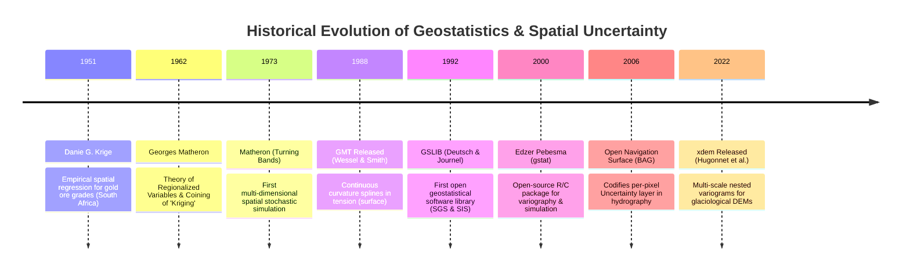

# Chapter 33: Geostatistical Error Simulation and Downstream Uncertainty Propagation

*Beyond static error metrics: generating equiprobable stochastic terrain ensembles to bound real-world risks in hydrology, viewsheds, and earthwork.*

---

## 33.4 Historical Evolution: From Gold Mining to Cloud-Native Ensembles

The mathematical framework used to simulate digital elevation error originated far from cartography: in the gold and diamond mines of South Africa. Over seven decades, geostatistics evolved from manual mining regression tables into rigorous spatial covariance theory, international hydrographic standards, and modern open-source Python packages for glaciology.

The milestones below, anchored in the `schwehr/gis-history` repository, trace the historical lineage of spatial error modeling and geostatistical simulation.

---

### 33.4.1 The South African Mining Origins: 1951 to 1965

#### 1951: Danie G. Krige and Gold Ore Valuation
In the Witwatersrand gold fields of South Africa, mining engineers faced severe financial risks: exploratory core drillholes regularly under-predicted gold concentration in rich reefs and over-predicted it in poor reefs. 
* In his 1951 master's thesis at the University of the Witwatersrand, mining engineer **Daniel Gerhardus Krige** noticed that sample ore grades were spatially autocorrelated: samples taken close together were more similar than samples taken far apart.
* Krige developed weighted spatial moving averages that used surrounding drillholes to compute unbiased, minimum-variance estimates of block ore grades.

#### 1962–1965: Georges Matheron and the Theory of Regionalized Variables
At the École des Mines de Paris in Fontainebleau, French mathematician **Georges Matheron** formalized Krige's empirical formulas into a rigorous mathematical theory:
* Matheron coined the term **"Kriging"** to honor Danie Krige.
* Formulated the **Theory of Regionalized Variables**, defining the spatial random function $Z(\mathbf{x})$, the intrinsic hypothesis, and the **semivariogram $\gamma(\mathbf{h})$**.
* Proved that Ordinary Kriging is the **Best Linear Unbiased Estimator (BLUE)**, minimizing error variance while ensuring expected error equals zero.

---

### 33.4.2 The Emergence of Stochastic Simulation: 1973 to 1992

#### 1973: Matheron's Turning Bands Method
By the early 1970s, petroleum and mining engineers realized that Kriging produced an artificially smoothed surface that concealed high-frequency spatial variability. In 1973, Matheron published the **Turning Bands Method**:
* Established the mathematical bridge allowing fast 1D spectral stochastic processes to be projected into 2D and 3D space.
* Allowed practitioners to generate the first **equiprobable stochastic realizations** that reproduced true physical variance and spatial roughness rather than smoothed estimates.

#### 1988: Generic Mapping Tools (GMT)
Paul Wessel and Walter H. F. Smith released **GMT**, introducing the `surface` module. Based on Smith & Wessel's continuous-curvature splines in tension, GMT brought geostatistical gridding into Unix scientific research, establishing the standard for compiling regional bathymetry and global topography.

#### 1992: GSLIB (Stanford Geostatistical Software Library)
Clayton V. Deutsch and André G. Journel at Stanford University published *GSLIB: Geostatistical Software Library and User's Guide*:
* Provided open, portable Fortran source code for variogram calculation, Kriging, and **Sequential Gaussian Simulation (SGS)**.
* GSLIB became the foundational software engine implemented inside commercial oil and gas reservoir modeling suites (e.g., Petrel, Gocad, EarthVision).

---

### 33.4.3 Open Source, Hydrographic Standards, and Modern Glaciology: 2000 to 2022

#### 2000: Edzer Pebesma and `gstat`
Dutch geostatistician Edzer Pebesma released **`gstat`**:
* Initially written in C and subsequently ported to the R statistical language, `gstat` democratized advanced spatial statistics.
* Allowed users to model multi-variable directional variograms, perform indicator Kriging, and execute parallelized conditional simulations across complex geospatial grids, establishing the benchmark library for academic spatial uncertainty analysis.

#### 2006: The Bathymetric Attributed Grid (BAG) Uncertainty Layer
Recognizing that hydrographic surfaces must convey measurement confidence alongside depth, the Open Navigation Surface Working Group (ONSWG) standardized the **Bathymetric Attributed Grid (BAG)**:
* Formally codified the **`Uncertainty` raster band** as an immutable, mandatory component of the HDF5 file container.
* For the first time in government surveying, every single elevation node $(x, y)$ was legally required to carry a co-registered 1-sigma Total Propagated Uncertainty (TPU) value, paving the way for automated compliance checking against IHO S-44 standards.

#### 2022: `xdem` and Multi-Scale Spatial Autocorrelation
In 2021–2022, Romain Hugonnet, Amaury Dehecq, and international colleagues released **`xdem`**:
* Developed specifically to address the systematic failure of independent error propagation in glaciology and mountain geomorphology.
* Implemented automated **nested multi-scale variogram fitting** to separate short-range DEM interpolation noise ($<50\text{ m}$), medium-range flight-line striping ($500\text{ m}$), and long-range orbital baseline errors ($>20\text{ km}$).
* Enabled the first statistically rigorous global accounting of mountain glacier volume loss and regional sea-level rise contributions without relying on naive white-noise assumptions.
