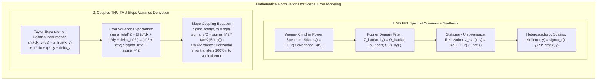

# Chapter 33: Geostatistical Error Simulation and Downstream Uncertainty Propagation

*Beyond static error metrics: generating equiprobable stochastic terrain ensembles to bound real-world risks in hydrology, viewsheds, and earthwork.*

---

## 33.5 Mathematical Foundations of Error Simulation and Slope Variance Coupling

Simulating realistic, spatially correlated error fields and propagating them through spatial models requires two core mathematical derivations:
1. **2D Fast Fourier Transform (FFT) Spectral Covariance Synthesis** with point-by-point heteroscedastic modulation.
2. The **Coupled THU-TVU Slope Variance Formula**, which proves why horizontal positioning uncertainty dominates vertical elevation uncertainty in steep topography.

---

### 33.5.1 Derivation of 2D FFT Spectral Covariance Synthesis

Let $\epsilon_{\text{stat}}(\mathbf{x})$ be a 2D stationary, zero-mean Gaussian random field on $\mathbb{R}^2$ governed by an isotropic target covariance function $C(\mathbf{h}) = \sigma^2 \rho(\|\mathbf{h}\|)$, where $\mathbf{h} = (h_x, h_y)$ is the spatial lag vector and $\rho$ is the correlation function (e.g., Gaussian $\rho(h) = e^{-(h/a)^2}$ or Exponential $\rho(h) = e^{-3h/a}$).

#### 1. The Wiener-Khinchin Theorem
Under the Wiener-Khinchin theorem, the covariance function $C(\mathbf{h})$ and the power spectral density $S(\mathbf{k})$ form a 2D continuous Fourier transform pair:

$$S(k_x, k_y) = \iint_{\mathbb{R}^2} C(h_x, h_y) e^{-i (k_x h_x + k_y h_y)} \, dh_x \, dh_y$$
where $\mathbf{k} = (k_x, k_y)$ is the spatial wavenumber vector ($\text{rad/m}$).

For an isotropic Gaussian covariance $C(h) = \sigma^2 e^{-(h/a)^2}$, the analytic 2D Fourier transform is:
$$S(k_x, k_y) = \pi a^2 \sigma^2 \exp\left( -\frac{a^2 (k_x^2 + k_y^2)}{4} \right)$$

For an isotropic Exponential covariance $C(h) = \sigma^2 e^{-3h/a}$:
$$S(k_x, k_y) = \frac{6\pi a^2 \sigma^2}{\big( 9 + a^2 (k_x^2 + k_y^2) \big)^{3/2}}$$

#### 2. Discrete Frequency-Domain Synthesis
On a discrete $N_x \times N_y$ raster grid with grid spacing $\Delta x$ and $\Delta y$:
1. Discretize spatial frequency coordinates:
   $$k_{x, u} = \frac{2\pi u}{N_x \Delta x}, \quad k_{y, v} = \frac{2\pi v}{N_y \Delta y}, \quad u \in \left[-\frac{N_x}{2}, \frac{N_x}{2}-1\right], \quad v \in \left[-\frac{N_y}{2}, \frac{N_y}{2}-1\right]$$
2. Generate a 2D matrix of independent, identically distributed standard normal random variables:
   $$W(x, y) \sim \mathcal{N}(0, 1)$$
3. Compute the 2D discrete forward Fourier transform:
   $$\widehat{W}(k_x, k_y) = \mathcal{F}_{2D}\big\{ W(x, y) \big\}$$
4. Multiply in the frequency domain by the amplitude spectrum $\sqrt{S(k_x, k_y)}$:
   $$\widehat{Z}(k_x, k_y) = \widehat{W}(k_x, k_y) \cdot \sqrt{S(k_x, k_y)}$$
5. Compute the 2D inverse discrete Fourier transform and extract the real component:
   $$z_{\text{stat}}(x, y) = \text{Re}\left( \mathcal{F}_{2D}^{-1}\big\{ \widehat{Z}(k_x, k_y) \big\} \right)$$
*By construction, $z_{\text{stat}}(x, y)$ is a Gaussian random field with mean zero, variance $\sigma^2 = C(0)$, and exact spatial covariance $C(\mathbf{h})$.*

#### 3. Heteroscedastic Point-by-Point Modulation
In real terrain, the error standard deviation $\sigma_z(x, y)$ varies across space due to slope and vegetation. To apply heteroscedasticity without destroying spatial autocorrelation:
1. Generate $z_{\text{stat}}(x, y)$ with unit variance ($\sigma^2 = 1.0$).
2. Modulate the stationary field point-by-point by the local, spatially variable standard deviation raster $\sigma_z(x, y)$:

$$\epsilon_{\text{hetero}}^{(m)}(x, y) = \sigma_z(x, y) \cdot z_{\text{stat}}^{(m)}(x, y)$$

3. Add the heteroscedastic error field to the baseline DEM:
   $$z_{\text{sim}}^{(m)}(x, y) = z_{\text{DEM}}(x, y) + \epsilon_{\text{hetero}}^{(m)}(x, y)$$
The resulting simulated terrain realization retains the spatial correlation length $a$ everywhere, while naturally scaling error amplitudes up on steep mountain slopes and down on flat runways.

---

### 33.5.2 Derivation of the Coupled THU-TVU Slope Variance Formula

A major misconception in elevation error analysis is treating horizontal uncertainty ($\text{THU}$) and vertical uncertainty ($\text{TVU}$) as independent orthogonal quantities. On sloping terrain, **horizontal positioning error couples directly into vertical elevation error**.

#### 1. Taylor Series Perturbation
Let the true ground elevation surface be $z_{\text{true}}(x, y)$. 

Suppose a survey instrument attempts to measure a point at true location $(x, y)$, but suffers a horizontal positioning displacement error $(\delta x, \delta y)$ and a vertical sensor measurement error $\delta z_{\text{sensor}}$:

The recorded elevation $z_{\text{meas}}$ is:
$$z_{\text{meas}} = z_{\text{true}}(x + \delta x, \, y + \delta y) + \delta z_{\text{sensor}}$$

Assuming the horizontal errors $(\delta x, \delta y)$ are small relative to terrain curvature, we expand $z_{\text{true}}$ in a first-order Taylor series around $(x, y)$:

$$z_{\text{meas}} \approx z_{\text{true}}(x, y) + \frac{\partial z}{\partial x} \delta x + \frac{\partial z}{\partial y} \delta y + \delta z_{\text{sensor}}$$

Let the directional spatial terrain gradients be denoted as $p = \frac{\partial z}{\partial x}$ and $q = \frac{\partial z}{\partial y}$. The net vertical elevation error is:

$$\epsilon_z = z_{\text{meas}} - z_{\text{true}}(x, y) = p \cdot \delta x + q \cdot \delta y + \delta z_{\text{sensor}}$$

#### 2. Evaluating Total Error Variance
Assuming that horizontal positioning errors $\delta x, \delta y$ and vertical sensor noise $\delta z_{\text{sensor}}$ are zero-mean, mutually uncorrelated random variables:
$$\mathbb{E}[\delta x] = \mathbb{E}[\delta y] = \mathbb{E}[\delta z_{\text{sensor}}] = 0$$
$$\mathbb{E}[\delta x \cdot \delta y] = \mathbb{E}[\delta x \cdot \delta z_{\text{sensor}}] = \mathbb{E}[\delta y \cdot \delta z_{\text{sensor}}] = 0$$

Let horizontal positioning be isotropic with variance $\sigma_x^2 = \sigma_y^2 = \sigma_{\text{horiz}}^2$, and let vertical sensor variance be $\sigma_{\text{vert}}^2$.

The total vertical elevation error variance is the statistical expectation of $\epsilon_z^2$:

$$\sigma_{\text{total}, z}^2 = \mathbb{E}\big[ \epsilon_z^2 \big] = \mathbb{E}\left[ \big( p \cdot \delta x + q \cdot \delta y + \delta z_{\text{sensor}} \big)^2 \right]$$

Expanding the square:
$$\sigma_{\text{total}, z}^2 = p^2 \mathbb{E}[\delta x^2] + q^2 \mathbb{E}[\delta y^2] + \mathbb{E}[\delta z_{\text{sensor}}^2] + 2pq\mathbb{E}[\delta x \delta y] + 2p\mathbb{E}[\delta x \delta z] + 2q\mathbb{E}[\delta y \delta z]$$

All cross-terms vanish:
$$\sigma_{\text{total}, z}^2 = p^2 \sigma_{\text{horiz}}^2 + q^2 \sigma_{\text{horiz}}^2 + \sigma_{\text{vert}}^2 = \big( p^2 + q^2 \big) \sigma_{\text{horiz}}^2 + \sigma_{\text{vert}}^2$$

#### 3. Slope Angle Substitution
The terrain slope gradient magnitude is $\|\nabla z\| = \sqrt{p^2 + q^2}$. The physical ground slope angle $S$ is defined as:
$$\tan S = \|\nabla z\| = \sqrt{p^2 + q^2} \implies \tan^2 S = p^2 + q^2$$

Substituting $\tan^2 S$ into the variance equation:

$$\sigma_{\text{total}, z}^2(x, y) = \sigma_{\text{vert}}^2 + \sigma_{\text{horiz}}^2 \cdot \tan^2 S(x, y)$$

Taking the square root yields the **Coupled THU-TVU Slope Equation**:

$$\sigma_{\text{total}, z}(x, y) = \sqrt{\sigma_{\text{vert}}^2 + \big( \sigma_{\text{horiz}} \cdot \tan S(x, y) \big)^2}$$

#### 4. Physical and Operational Implications
* **Flat Terrain ($S = 0^\circ$):** $\tan 0^\circ = 0 \implies \sigma_{\text{total}, z} = \sigma_{\text{vert}}$. Horizontal errors have zero vertical impact.
* **$45^\circ$ Slopes ($S = 45^\circ$):** $\tan 45^\circ = 1.0 \implies \sigma_{\text{total}, z} = \sqrt{\sigma_{\text{vert}}^2 + \sigma_{\text{horiz}}^2}$. Horizontal positioning uncertainty transfers $100\%$ into vertical uncertainty!
* **Steep Mountain Cliffs / Fjord Walls ($S = 60^\circ$):** $\tan 60^\circ = \sqrt{3} \approx 1.732 \implies \tan^2 60^\circ = 3.0$.
  $$\sigma_{\text{total}, z} = \sqrt{\sigma_{\text{vert}}^2 + 3 \cdot \sigma_{\text{horiz}}^2}$$
  If an airborne drone has vertical sensor precision $\sigma_{\text{vert}} = \pm 0.05\text{ m}$ but horizontal GNSS position drift $\sigma_{\text{horiz}} = \pm 0.30\text{ m}$:
  $$\sigma_{\text{total}, z} = \sqrt{(0.05)^2 + 3 \cdot (0.30)^2} = \sqrt{0.0025 + 0.27} = \sqrt{0.2725} \approx \mathbf{\pm 0.522\text{ meters}}$$
  The total vertical elevation error is **over ten times larger** than the raw vertical sensor precision! Horizontal positioning drift completely overwhelms vertical laser accuracy on steep slopes.
