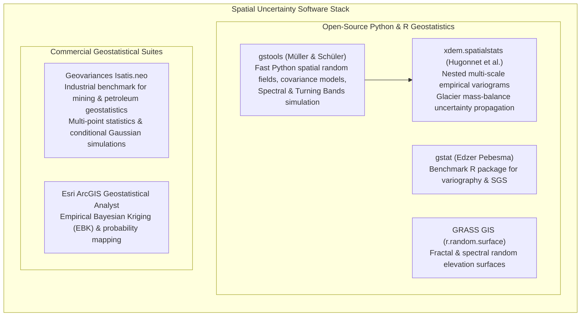

# Chapter 33: Geostatistical Error Simulation and Downstream Uncertainty Propagation

*Beyond static error metrics: generating equiprobable stochastic terrain ensembles to bound real-world risks in hydrology, viewsheds, and earthwork.*

---

## 33.6 Software Ecosystem

Executing geostatistical error simulation and propagating uncertainty through spatial pipelines requires software capable of variogram estimation, fast Gaussian random field generation, and large-array raster modulation. This section reviews the open-source libraries and enterprise software suites used in spatial uncertainty analysis.



---

### 33.6.1 Open-Source Geostatistical Libraries

#### 1. `gstools`: Fast Geostatistical Tools in Python
Developed by Sebastian Müller and Lennart Schüler, **`gstools`** is a high-performance, object-oriented geostatistical Python library built on Cython and SciPy:
* **Covariance Models:** Provides rich theoretical covariance structures (Gaussian, Exponential, Matérn, Stable, Spherical).
* **Random Field Generation:** Implements the **Spectral Method** (randomized FFT phase synthesis) and **Turning Bands Method** to generate 2D and 3D spatial random fields in milliseconds.
* **Conditioning:** Supports Kriging-based conditioning to force random fields to honor sparse point observations.

```python
"""
Generate an equiprobable stochastic terrain realization using gstools.
Synthesizes a spatially autocorrelated error field, modulates it by local
slope-dependent heteroscedastic variance, and adds it to a baseline DEM.
"""

import numpy as np
import gstools as gs
import matplotlib.pyplot as plt

def generate_stochastic_dem_realization(
    base_dem: np.ndarray,
    dx: float,
    dy: float,
    corr_range_meters: float = 250.0,
    sensor_vert_noise: float = 0.05,
    horiz_pos_noise: float = 0.30,
    seed: int = 42
) -> np.ndarray:
    """
    Generates a single equiprobable DEM realization with autocorrelated,
    heteroscedastic elevation error.
    
    Args:
        base_dem: 2D array of baseline elevation values (meters).
        dx, dy: Pixel resolution in meters.
        corr_range_meters: Spatial correlation length of systematic error.
        sensor_vert_noise: Vertical 1-sigma sensor noise on flat ground (m).
        horiz_pos_noise: Horizontal 1-sigma positioning uncertainty (m).
        seed: Random seed for reproducible realization.
        
    Returns:
        2D array representing the simulated equiprobable DEM realization.
    """
    ny, nx = base_dem.shape
    x_coords = np.arange(nx) * dx
    y_coords = np.arange(ny) * dy
    
    print(f"Synthesizing error field for {nx}x{ny} grid (res={dx}m)...")
    
    # 1. Define theoretical Exponential covariance model with unit variance (var=1.0)
    model = gs.Exponential(dim=2, var=1.0, len_scale=corr_range_meters)
    
    # 2. Synthesize stationary 2D Gaussian random field via Spectral Generator
    srf = gs.SRF(model, seed=seed)
    stat_error_field = srf.structured([x_coords, y_coords])
    
    # 3. Compute local terrain slope gradient from baseline DEM
    grad_y, grad_x = np.gradient(base_dem, dy, dx)
    tan_slope = np.sqrt(grad_x**2 + grad_y**2)
    
    # 4. Compute Coupled THU-TVU Heteroscedastic Error Standard Deviation:
    # sigma_total(x, y) = sqrt( sigma_v^2 + (sigma_h * tan(S))^2 )
    sigma_hetero = np.sqrt(sensor_vert_noise**2 + (horiz_pos_noise * tan_slope)**2)
    
    # 5. Point-by-point modulation of stationary field by heteroscedastic sigma
    hetero_error_field = stat_error_field * sigma_hetero
    
    # 6. Construct simulated equiprobable realization
    simulated_dem = base_dem + hetero_error_field
    
    print(f"Realization generated: mean error={np.mean(hetero_error_field):.3f}m, "
          f"max error={np.max(np.abs(hetero_error_field)):.3f}m")
    
    return simulated_dem
```

#### 2. `xdem.spatialstats`: Multi-Scale Nested Variograms
Developed for glaciology, **`xdem`** provides specialized tools to calculate empirical semivariograms from millions of elevation differences:
* **`xdem.spatialstats.sample_covariance`:** Calculates spatial semivariance across logarithmic lag bins, estimating correlation lengths from $10\text{ meters}$ to $100\text{ kilometers}$.
* **Automated Multi-Scale Fitting:** Fits nested variogram models combining short-range instrument noise with long-range orbital baseline tilts.
* **Correlated Error Propagation:** Implements spatial integration formulas that correctly compute the standard error of volume change across large drainage basins without assuming white noise.

#### 3. `gstat` (R Language)
Maintained by Edzer Pebesma:
* The gold standard for multi-variable geostatistics in R.
* Features `gstat::predict(..., nsim=M)` for generating multi-realization Sequential Gaussian Simulations (SGS) and indicator simulations across `sp` and `sf` spatial spatial spatial layers.

---

### 33.6.2 Commercial and Industrial Geostatistical Platforms

#### 1. Geovariances Isatis.neo
The benchmark commercial geostatistical software package in the global mining and petroleum industries:
* Developed in collaboration with the École des Mines de Paris (Matheron's laboratory).
* Provides enterprise-grade **Multi-Point Statistics (MPS)** and **Gaussian Plurimodal Simulations**.
* Capable of generating thousands of conditional 3D realizations of complex faulted subterranean geological strata and bathymetric surfaces.

#### 2. Esri ArcGIS Pro Geostatistical Analyst
Esri's spatial statistics suite:
* **Empirical Bayesian Kriging (EBK):** Automates the difficult task of variogram parameter selection by generating local subsets and simulating variograms via Bayesian estimation.
* **Regression Kriging:** Incorporates external terrain covariates (slope, distance to stream, vegetation index) to model elevation error trends before kriging residuals.
