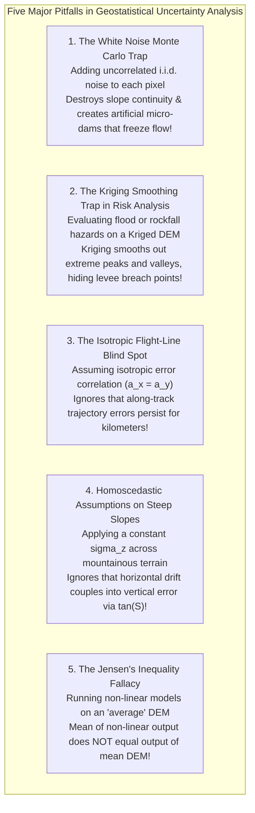

# Chapter 33: Geostatistical Error Simulation and Downstream Uncertainty Propagation

*Beyond static error metrics: generating equiprobable stochastic terrain ensembles to bound real-world risks in hydrology, viewsheds, and earthwork.*

---

## 33.7 Common Pitfalls and Key Takeaways

Propagating digital elevation uncertainty into non-linear physical models requires unlearning common GIS heuristics. When practitioners assume errors are spatially independent, ignore directional flight-line striping, or evaluate non-linear flood models on smoothed mean surfaces, their risk assessments under-predict catastrophic levee failures and misallocate infrastructure capital.

---

### 33.7.1 Common Pitfalls in Spatial Uncertainty Modeling

#### 1. The White Noise Monte Carlo Trap
* **The Failure Mode:** A hydrological modeler simulates DEM uncertainty by adding independent Gaussian noise $\epsilon \sim \mathcal{N}(0, \text{RMSE}^2)$ to every raster cell before running a 2D overland flow simulation.
* **Physical Reality:** In physical reality, elevation errors are spatially autocorrelated. Adding independent white noise destroys local slope gradients:
  $$\mathbb{E}\left[ \left(\frac{\partial \epsilon}{\partial x}\right)^2 \right] \approx \frac{2\sigma^2}{\Delta x^2}$$
* **Forensic Consequence:** On a $1\text{-meter}$ grid with $\sigma = 0.10\text{ m}$, adding white noise creates artificial $\pm 14\%$ random slopes. Every stream channel is choked with thousands of artificial pits and micro-dams. Simulated water is trapped in local depressions, stopping overland flow and preventing the model from predicting downstream inundation. Furthermore, when computing cut-and-fill volumes across $10,000$ cells, white noise cancels out via the Law of Large Numbers ($\sigma_V \propto \sqrt{N}$), severely underestimating true volume uncertainty!
* **Remedy:** Never use independent white noise. Always simulate **spatially autocorrelated error fields** using Sequential Gaussian Simulation (SGS), Turning Bands, or FFT spectral synthesis matching the empirical semivariogram.

#### 2. The Kriging Smoothing Trap in Risk Assessment
* **The Failure Mode:** An engineer evaluates levee overtopping risk using an elevation surface generated by Ordinary Kriging.
* **Mathematical Reality:** Kriging is a Best Linear Unbiased Estimator (BLUE) designed to minimize local error variance. In doing so, it acts as a **low-pass smoothing filter**:
  $$\text{Var}(z_{\text{Krig}}^*) < \text{Var}(z_{\text{true}})$$
* **Forensic Consequence:** Kriging systematically rounds off sharp peaks, raises deep channel bottoms, and smooths out local depressions along narrow levee crests. A real $30\text{-cm}$ dip in an earthen levee is smoothed away by the Kriging algorithm. The model reports that the levee is safe, when in reality floodwaters will breach the smoothed-out low point.
* **Remedy:** Do not use Kriging for non-linear extreme risk assessment. Generate **conditional stochastic simulation ensembles** that preserve the true physical variance and micro-relief of the terrain.

#### 3. The Isotropic Flight-Line Blind Spot
* **The Failure Mode:** A geostatistician models DEM errors assuming an isotropic semivariogram (correlation length $a_x = a_y = 200\text{ m}$).
* **Physical Reality:** In airborne LiDAR and marine multibeam sonar, sensor platforms move along parallel tracklines. Errors originating from platform trajectory drift (IMU pitch wander, kinematic GPS bias) persist along the entire flight line:
  $$a_{\text{along}} \approx 2,000\text{ to }10,000\text{ meters}$$
  while across-track errors (swath edge noise, mirror scan angles) decorrelate within the swath width:
  $$a_{\text{across}} \approx 50\text{ to }200\text{ meters}$$
* **Forensic Consequence:** Isotropic simulations generate circular, blotchy error patterns, completely failing to reproduce the long, linear **flight-line striping** that governs real sensor artifacts.
* **Remedy:** Fit **anisotropic semivariograms** with an elliptical covariance tensor, aligning the major correlation axis with the primary flight or vessel heading.

#### 4. The Homoscedastic Error Fallacy on Steep Slopes
* **The Failure Mode:** A geotechnical landslide modeler applies a constant vertical uncertainty of $\sigma_z = \pm 0.10\text{ m}$ across an entire mountainous watershed.
* **Physical Reality:** Error variance is strongly **heteroscedastic**: on sloping terrain, horizontal positioning drift $\sigma_{\text{horiz}}$ couples directly into vertical elevation error:
  $$\sigma_{\text{total}, z}(x, y) = \sqrt{\sigma_{\text{vert}}^2 + \big( \sigma_{\text{horiz}} \cdot \tan S(x, y) \big)^2}$$
* **Forensic Consequence:** On a $45^\circ$ mountain slope ($\tan 45^\circ = 1.0$), a horizontal GNSS uncertainty of $\sigma_{\text{horiz}} = \pm 0.40\text{ m}$ produces an additional $\pm 0.40\text{ meters}$ of vertical elevation uncertainty. Assuming a constant $\pm 0.10\text{-meter}$ error underestimates vertical uncertainty on steep cliffs by a **factor of four**, causing slope stability models to drastically under-predict landslide failure probabilities ($P(FS < 1.0)$).
* **Remedy:** Modulate stochastic error fields using the **Coupled THU-TVU Slope Equation**, scaling vertical error amplitudes point-by-point by local terrain slope and land cover.

#### 5. The Jensen's Inequality Fallacy
* **The Failure Mode:** A municipal planning board runs a complex 2D hydrodynamic storm surge model on the "mean" digital elevation model, assuming that the resulting inundation map represents the "mean" flood hazard.
* **Mathematical Reality:** Hydrodynamic flow routing, levee overtopping, and wave runup are highly non-linear, threshold-driven processes. Under Jensen's Inequality:
  $$\mathbb{E}\big[ \mathcal{M}(z) \big] \ne \mathcal{M}\big( \mathbb{E}[z] \big)$$
* **Forensic Consequence:** Running the simulation on the average DEM completely misses levee overtopping events that occur in $30\%$ of the realistic terrain realizations. The resulting flood map dangerously under-predicts municipal flood exposure.
* **Remedy:** Always propagate the full stochastic DEM ensemble $\{z^{(1)}, \dots, z^{(M)}\}$ through the non-linear model, and compute the expectation across the **output ensemble**.

---

### 33.7.2 Key Takeaways for Practitioners

1. **Never Add White Noise:** Elevation errors are spatially autocorrelated across short, medium, and long ranges. Simulate errors using empirical semivariograms.
2. **Kriging Smooths; Simulation Preserves Texture:** Kriging is for estimation; conditional simulation is for risk analysis. Use simulation ensembles to evaluate threshold failures.
3. **Model Along-Track Anisotropy:** Trajectory drift creates along-track correlation lengths that are orders of magnitude longer than across-track lengths.
4. **Horizontal Errors Become Vertical Errors on Slopes:** Always scale vertical error by terrain slope: $\sigma_{\text{total}} = \sqrt{\sigma_v^2 + \sigma_h^2 \tan^2 S}$.
5. **Honor Jensen's Inequality:** Never evaluate non-linear models on a single "average" DEM; evaluate models across the stochastic ensemble to generate probabilistic risk maps ($P_{\text{flood}}$, $P_{\text{failure}}$).
