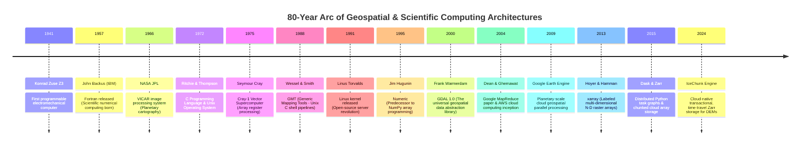
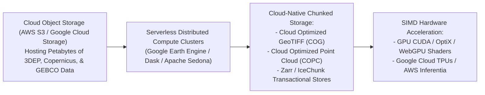

# Chapter 34: Cloud-Native Petabyte Pipelines, GPU Acceleration, and Automated Testing for DEMs

*Software engineering at planetary scale: building reproducible, high-throughput, thoroughly tested elevation processing systems.*

---

## 34.1 Evolution of Geospatial Computing Architectures

Digital elevation modeling has always pushed the absolute limits of computational hardware and software engineering. In the 1960s, a $512 \times 512$ elevation matrix was a massive dataset that strained the magnetic core memory of an IBM mainframe. Today, continental-scale programs like USGS 3DEP, Copernicus GLO-30, and Nippon Foundation-GEBCO Seabed 2030 process petabytes of point clouds and multi-resolution raster pyramids distributed across thousands of cloud-native worker nodes.

The eighty-year computational arc below—anchored in the historical computing milestones of the `schwehr/gis-history` repository—traces how computing paradigms shifted from early vacuum-tube mainframes and Fortran numerical algorithms to Unix C toolchains, open-source Python scientific libraries, distributed MapReduce clusters, GPU/TPU accelerators, and cloud-native transactional array storage.

---

### 34.1.1 The Mainframe and Vector Supercomputing Era: 1941 to 1982

#### 1. From Z3 to Fortran
* **1941–1951:** The birth of digital computing: Konrad Zuse's **Z3** (1941) in Germany, the **ENIAC** (1945) at the University of Pennsylvania, and the commercial **UNIVAC I** (1951). Early military geodesists used these machines to calculate ballistic trajectories and ellipsoidal geodetic distance tables.
* **1957: Fortran (Formula Translation):** Developed by John Backus at IBM, Fortran became the language of scientific computing. It introduced multidimensional arrays, floating-point arithmetic optimizations, and DO-loops. Landmark terrain algorithms (such as the early USGS surface interpolation codes and the 1970s SYMAP/SYMVU programs) were written in Fortran.

#### 2. JPL VICAR and the Unix/C Revolution
* **1966: JPL VICAR (Video Image Communication and Retrieval):** Developed at NASA JPL to process television signals from the Ranger and Mariner missions. VICAR established the modular Unix-like philosophy: breaking image processing into distinct command-line programs connected by standardized image files containing self-describing header labels.
* **1972–1973: C and Unix:** Dennis Ritchie and Ken Thompson at Bell Labs created the **C language** and the **Unix operating system**. Unix introduced the concept that "everything is a file," stream redirection, pipes (`|`), and modular command-line toolchains. Marc Rochkind created **SCCS** (Source Code Control System) in 1973, launching software version control.
* **1975: The Cray-1 Supercomputer:** Seymour Cray unveiled the Cray-1, introducing vector registers that executed parallel floating-point operations across array vectors, enabling the first global atmospheric circulation and geophysical terrain models.

---

### 34.1.2 Workstations, Open-Source Scripting, and GDAL: 1984 to 2001

#### 1. The Unix Workstation and Scripting Transition
During the 1980s and 1990s, scientific computing moved from centralized mainframes to departmental Unix workstations (Sun Microsystems, Silicon Graphics, DEC):
* **1988: Generic Mapping Tools (GMT):** Paul Wessel and Walter H. F. Smith leveraged Unix shell scripting and C to build GMT, creating the first open-source toolchain capable of gridding, filtering, and rendering publication-grade shaded relief directly from the terminal.
* **1991–1992: Linux and Python:** Linus Torvalds released the Linux kernel, while Guido van Rossum created Python. Python's clean syntax and dynamic typing made it the ideal glue language for connecting complex C/Fortran spatial libraries.
* **1995: Numeric (NumPy):** Jim Hugunin and colleagues developed `Numeric` (later refactored by Travis Oliphant into **NumPy** in 2006). NumPy introduced the `ndarray` C-contiguous memory buffer, enabling vectorized array math in Python without C-loop overhead.

#### 2. 2000: Frank Warmerdam and GDAL
In 2000, Frank Warmerdam released **GDAL/OGR 1.0 (Geospatial Data Abstraction Library)**:
* Solved the "Tower of Babel" in spatial data: instead of writing custom parsers for GeoTIFF, HDF, NetCDF, ARC/INFO ASCII, and USGS DEM formats, software developers programmed against a single, abstract C++ API (`GDALDataset`, `GDALRasterBand`).
* GDAL became the foundational translation substrate of all modern GIS software—embedded inside QGIS, ArcGIS, Google Earth, GRASS, PostGIS, MapServer, and Python raster packages (`rasterio`).

---

### 34.1.3 The Cloud-Native Distributed Era: 2004 to Present

By the mid-2000s, global satellite constellations and airborne LiDAR campaigns generated data volumes that overwhelmed single-machine desktop computers. The computing paradigm shifted from "bring data to the compute" to **"bring compute to the data"**.

#### 1. MapReduce and Google Earth Engine (2004–2009)
* **2004: MapReduce:** Jeffrey Dean and Sanjay Ghemawat at Google published the *MapReduce* framework, formalizing distributed computation across thousands of commodity server nodes.
* **2009: Google Earth Engine (GEE):** Noel Gorelick, Matt Hancher, and colleagues launched Google Earth Engine. GEE ingested the world's public remote sensing archives (Landsat, SRTM, MODIS, Copernicus), placing petabytes of raster data alongside a distributed, lazy-evaluating compute cluster. Earth Engine eliminated the local downloading of satellite imagery: scientists wrote simple JavaScript/Python scripts, and Google's servers evaluated spatial reductions across continents in seconds.

#### 2. Dask, xarray, and Zarr (2013–2018)
In the open-source scientific Python ecosystem (Pangeo), researchers developed a cloud-native parallel stack:
* **`xarray` (2013):** Stephan Hoyer and colleagues brought labeled dimensions, coordinates, and metadata attributes to multi-dimensional NumPy arrays, implementing the NetCDF data model in Python.
* **`Dask` (2015):** Matthew Rocklin and Continuum Analytics created Dask, providing dynamic parallel task scheduling and blocked out-of-core array computing (`dask.array`), allowing multi-terabyte elevation rasters to be processed on laptops or multi-node cloud clusters.
* **`Zarr` (2015):** Alistair Miles created Zarr, a cloud-native storage format that splits N-dimensional arrays into compressed, chunked binary files stored as independent keys in cloud object storage (AWS S3, Google Cloud Storage), eliminating the file-locking and sequential bottlenecks of legacy NetCDF and HDF5 files.

#### 3. 2024+: IceChunk and Transactional Cloud Arrays
The latest evolution in cloud-native elevation modeling is **IceChunk**:
* Combines Zarr arrays with Git-like **transactional time-travel versioning**.
* Enables multiple distributed cloud worker nodes to concurrently write, merge, and commit regional LiDAR DTM updates to petabyte-scale cloud datasets with atomic, consistent, isolated, and durable (ACID) guarantees, preventing data corruption during multi-sensor composite compilations.
