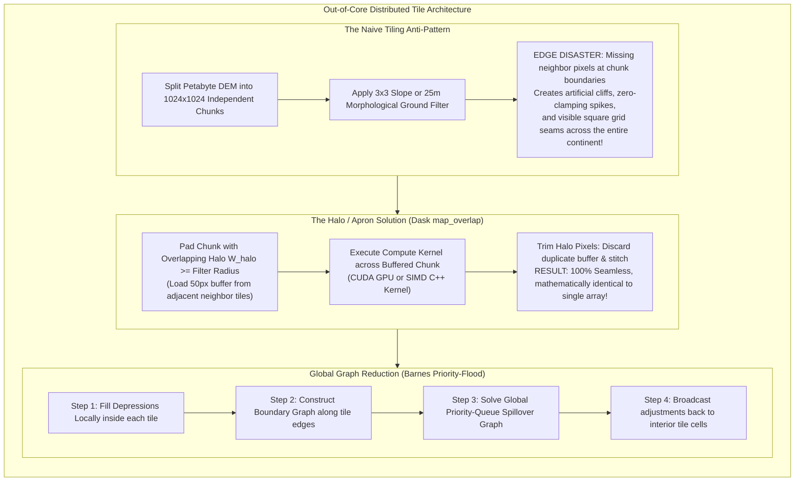

# Chapter 34: Cloud-Native Petabyte Pipelines, GPU Acceleration, and Automated Testing for DEMs

*Software engineering at planetary scale: building reproducible, high-throughput, thoroughly tested elevation processing systems.*

---

## 34.2 Out-of-Core Tiled Processing and Halo/Apron Management

When a digital elevation dataset spans hundreds of gigabytes or petabytes (such as the 3DEP continental $1\text{-meter}$ LiDAR mosaic or global Copernicus GLO-30), it cannot be loaded into random-access memory (RAM) as a single array. The dataset must be processed **out-of-core**: partitioned into regular spatial chunks or tiles (typically $512\times 512$ or $2048\times 2048$ pixels) distributed across hundreds of CPU/GPU worker nodes.

However, naive tile-by-tile processing introduces a catastrophic failure mode: **boundary seam artifacts**. Spatial convolutions (hillshading, slope, curvature), morphological ground filters, and spline interpolations evaluate a moving window of neighboring pixels. At tile edges, missing neighbors produce artificial cliffs, black borders, and severed drainage lines. Solving this requires rigorous **halo/apron buffer management** and **distributed boundary-graph algorithms**.



---

### 34.2.1 The Tile-Boundary Artifact Disaster

In distributed Python frameworks (`Dask`, `Ray`, `Spark`) or C++ tile engines, a 2D elevation matrix is broken into a regular grid of chunks.

#### 1. The Finite-Difference Boundary Collapse
Consider an analytical hillshade or slope calculation using Horn's $3\times 3$ finite-difference operator. To evaluate the horizontal gradient $p = \frac{\partial z}{\partial x}$ at cell $(i, j)$, the algorithm requires cells $(i-1, j)$ and $(i+1, j)$.
* When the kernel evaluates the rightmost column of an unbuffered chunk ($i = 1023$ in a $1024\times 1024$ tile), the neighbor $(i+1, j)$ sits in the adjacent chunk.
* If the chunk is processed in isolation, the software defaults to **zero-padding** ($z = 0$) or **edge clamping** ($z_{1024} = z_{1023}$).
* Clamping makes the gradient zero ($p = 0$), flattening the edge; zero-padding causes the gradient to compute a vertical drop of thousands of meters down to sea level.
* **The Forensic Signature:** The stitched mosaic displays glaring, razor-sharp **grid line scars** outlining every $1024\times 1024$ chunk across the entire map sheet.

#### 2. Morphological and Filtering Ringing
For larger neighborhood operators—such as a $50\text{-meter}$ Progressive Morphological Filter (PMF) used to separate ground from trees, or biharmonic spline gap filling:
* The filter radius spans dozens to hundreds of pixels ($R = 50\text{ cells}$).
* Edge effects penetrate deep into the interior of the tile, warping elevations by meters across a wide band along every tile border.

---

### 34.2.2 Halo / Apron Management with Dask `map_overlap`

The solution to boundary artifacts is **Halo Management** (also known as apron, ghost-cell, or guard-band padding):
1. **Pad:** Prior to executing the spatial operation, each tile is expanded by a halo buffer of width $W_{\text{halo}}$ loaded from the surrounding neighbor tiles:
   $$W_{\text{halo}} \ge R_{\text{filter}}$$
2. **Compute:** The spatial filter is executed across the entire padded tile of dimension $(N_x + 2 W_{\text{halo}}) \times (N_y + 2 W_{\text{halo}})$.
3. **Trim:** After computation, the outer $W_{\text{halo}}$ pixels are discarded, retaining only the valid, uncorrupted interior core of size $N_x \times N_y$.

In the scientific Python stack, this operation is automated by **`dask.array.map_overlap`**:

```python
"""
Seamless parallel out-of-core hillshading using Dask map_overlap.
Demonstrates halo management that eliminates tile boundary seams across
a multi-gigabyte chunked elevation raster.
"""

import dask.array as da
import numpy as np

def compute_horn_slope_aspect(chunk: np.ndarray, res_x: float = 1.0, res_y: float = 1.0) -> np.ndarray:
    """
    Computes terrain slope in degrees using Horn's 3x3 finite-difference operator.
    Input chunk is guaranteed to have a halo buffer provided by map_overlap.
    """
    # Slice 3x3 neighborhood across the interior of the buffered chunk
    z = chunk
    dz_dx = ((z[:-2, 2:] + 2 * z[1:-1, 2:] + z[2:, 2:]) - 
             (z[:-2, :-2] + 2 * z[1:-1, :-2] + z[2:, :-2])) / (8.0 * res_x)
    
    dz_dy = ((z[2:, :-2] + 2 * z[2:, 1:-1] + z[2:, 2:]) - 
             (z[:-2, :-2] + 2 * z[:-2, 1:-1] + z[:-2, 2:])) / (8.0 * res_y)
    
    slope_rad = np.arctan(np.sqrt(dz_dx**2 + dz_dy**2))
    slope_deg = np.degrees(slope_rad)
    
    # Pad back by 1 pixel to preserve original chunk dimension for Dask trimming
    return np.pad(slope_deg, pad_width=1, mode='edge')

def parallel_seamless_slope_pipeline(dask_dem_array: da.Array, cell_size: float = 1.0) -> da.Array:
    """
    Executes distributed slope calculation across chunks with automated halo buffering.
    
    Args:
        dask_dem_array: Out-of-core Dask Array chunked into e.g. (2048, 2048) blocks.
        cell_size: Grid spacing in meters.
        
    Returns:
        Dask Array of slope with zero tile-boundary artifacts.
    """
    print(f"Executing out-of-core slope with Dask chunks: {dask_dem_array.chunksize}")
    
    # map_overlap automatically:
    # 1. Pads each chunk with depth=1 pixel from neighboring chunks
    # 2. Executes compute_horn_slope_aspect on the buffered block
    # 3. Trims away the 1-pixel halo, stitching a perfectly seamless output
    seamless_slope = da.map_overlap(
        compute_horn_slope_aspect,
        dask_dem_array,
        depth=1,            # Halo buffer width (1 cell for 3x3 kernel)
        boundary='reflect', # Fallback for absolute outer perimeter of global DEM
        trim=True,          # Automatically slice away halo after computation
        dtype=np.float32,
        res_x=cell_size,
        res_y=cell_size
    )
    
    return seamless_slope
```

---

### 34.2.3 Non-Local Graph Operations: Distributed Priority-Flood

Local convolutions (slope, hillshade) require only small halos ($W_{\text{halo}} = 1\text{ to }50\text{ cells}$). However, **hydrological depression filling and flow routing** represent **non-local global graph operations**:
* A sink or karst depression in Tile A may only spill over a low saddle point located in Tile F, fifty kilometers away.
* Water backed up behind that saddle point floods backward across Tiles B, C, D, and E.
* Naive halo buffering fails because the required halo width is unknown and could span the entire continent!

#### The Barnes, Lehman, & Mulla (2014, 2016) Boundary Graph Reduction
To solve hydrological conditioning on petabyte grids, Richard Barnes and colleagues formulated the **Parallel Priority-Flood** algorithm:
1. **Local Tile Fill:** Each distributed worker node loads a local DEM chunk independently. Using the $O(N \log N)$ priority-queue algorithm, the node fills all depressions that are internally contained within the chunk, and labels potential spillover paths to the chunk's four boundaries.
2. **Boundary Graph Extraction:** Each node extracts a lightweight 1D topological graph consisting only of the perimeter cells along its four edges, recording the minimum elevation required to traverse between boundary edges.
3. **Global Network Reduction:** The lightweight boundary graphs from all thousands of tiles are assembled into a single master network on a central coordinator node. The coordinator solves the global priority-queue spillover across the inter-tile network in seconds.
4. **Local Elevation Broadcast:** The global spillover water levels are broadcast back to the worker nodes, which apply a simple local elevation adjustment ($z_{\text{filled}} = \max(z, h_{\text{spill}})$) across their interior cells.
* *Result:* Enables depression filling and watershed delineation across **hundreds of billions of cells** on distributed cloud clusters with zero memory bottlenecks and zero tile-boundary seams.

---

### 34.2.4 GPU Acceleration: CUDA, OptiX, and WebGPU

While CPUs manage distributed file I/O and task graphs, the heavy floating-point raster computations are increasingly delegated to **Graphics Processing Units (GPUs)**:

* **Massive Thread Parallelism:** An NVIDIA H100 or RTX 4090 GPU contains over $16,000$ CUDA cores capable of executing parallel SIMD (Single Instruction, Multiple Data) operations across millions of raster cells simultaneously.
* **Shared Memory Tiling:** CUDA kernels load a $32 \times 32$ tile of elevation points into high-speed on-chip **Shared Memory (L1 cache)**, allowing all 1,024 threads in a warp block to access neighboring $3\times 3$ or $5\times 5$ cells with sub-nanosecond latency, bypassing slow global VRAM.
* **Hardware Ray-Tracing Engines (NVIDIA OptiX / Vulkan RT):** Historically, computing a 3D viewshed across a high-resolution DEM required traversing millions of Bresenham line rays in software, taking hours. Modern engines map the elevation grid into a hardware-accelerated **Bounding Volume Hierarchy (BVH)**:
  * Hardware RT (Ray Tracing) cores execute billions of ray-triangle intersections per second.
  * Multi-target radar visibility, LiDAR line-of-sight coverage, and diffuse ambient occlusion maps across entire mountain ranges are evaluated in **real time ($>60\text{ fps}$)** inside WebGL/WebGPU web browsers.
