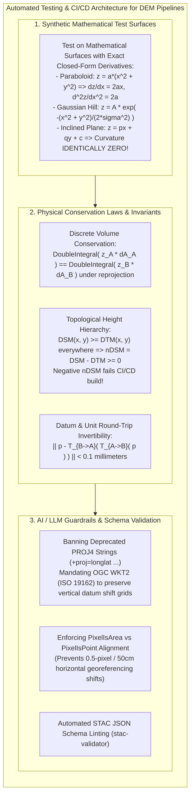
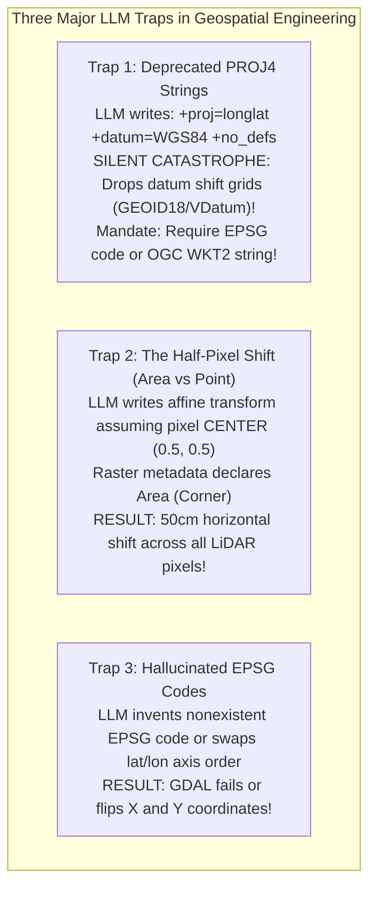

# Chapter 34: Cloud-Native Petabyte Pipelines, GPU Acceleration, and Automated Testing for DEMs

*Software engineering at planetary scale: building reproducible, high-throughput, thoroughly tested elevation processing systems.*

---

## 34.3 Automated Testing, CI/CD, and Verification for DEM Software & Data Pipelines

In standard web or database engineering, bugs announce themselves with immediate crashes: null pointer dereferences, stack overflows, or syntax errors. In digital elevation engineering, **bugs are almost universally silent**. 

A sign inversion in a boresight roll angle, an unhandled geoid grid shift, a swapped axis order (latitude/longitude vs. easting/northing), or an off-by-half-pixel grid registration produces a perfectly valid GeoTIFF file. The file passes format linting, loads cleanly in QGIS, and renders a visually pleasing hillshade—yet the topography is displaced horizontally by twenty meters or depressed vertically into the sea.

Building mission-critical elevation pipelines requires replacing ad-hoc visual inspection with **automated Continuous Integration / Continuous Deployment (CI/CD)**, **property-based testing**, and **strict mathematical invariants**. Furthermore, as software teams increasingly employ Large Language Models (LLMs) and AI coding agents to write geospatial code, engineering systems must enforce automated guardrails against hallucinated projections and deprecated PROJ4 strings.



---

### 34.3.1 Synthetic Analytical Surfaces: Exact Derivative Verification

Never verify a new slope, aspect, curvature, or hydrological flow algorithm on real-world LiDAR data. In real terrain, the true physical derivatives $\frac{\partial z}{\partial x}, \frac{\partial^2 z}{\partial x^2}$ are unknown, making it impossible to separate algorithm discretization error from sensor noise.

Automated unit tests must evaluate algorithms against **synthetic mathematical surfaces with known analytical derivatives**:

#### 1. The Circular Paraboloid
$$z(x, y) = a \big( x^2 + y^2 \big)$$
* **Analytical Derivatives:**
  $$\frac{\partial z}{\partial x} = 2 a x, \quad \frac{\partial z}{\partial y} = 2 a y$$
  $$\frac{\partial^2 z}{\partial x^2} = 2a, \quad \frac{\partial^2 z}{\partial y^2} = 2a, \quad \frac{\partial^2 z}{\partial x \partial y} = 0$$
  $$\text{Plan Curvature} = \frac{2a}{(1 + 4a^2 r^2)^{1/2}}, \quad \text{Profile Curvature} = \frac{2a}{(1 + 4a^2 r^2)^{3/2}}$$
* *Unit Test:* Evaluate the finite-difference curvature operator on an analytical paraboloid grid. Any deviation between the numerical output and the exact formula greater than the truncation error $O(\Delta x^2)$ immediately fails the CI/CD build.

#### 2. The Inclined Plane
$$z(x, y) = p x + q y + c$$
* **Analytical Invariant:** All second-order partial derivatives must be **identically zero**:
  $$\frac{\partial^2 z}{\partial x^2} \equiv 0, \quad \frac{\partial^2 z}{\partial y^2} \equiv 0, \quad \nabla^2 z \equiv 0, \quad \text{Curvature} \equiv 0$$
  $$\text{Slope Angle } S = \arctan\sqrt{p^2 + q^2} = \text{constant everywhere}$$
* *Unit Test:* If a newly committed algorithm reports non-zero curvature or variable slope on an inclined plane, the code contains an indexing or boundary bug.

---

### 34.3.2 Physical Conservation Laws and Invariant Testing

In property-based testing (using libraries like `hypothesis` in Python), tests do not check single hardcoded values; they assert that **fundamental physical invariants hold across thousands of randomly generated terrain surfaces**:

#### 1. The Normalized DSM Non-Negativity Invariant
In forest and urban mapping, a Digital Surface Model (DSM) includes tree canopies and building roofs, while a Digital Terrain Model (DTM) represents the bare ground:
$$\text{Physical Invariant: } \quad \text{DSM}(x, y) \ge \text{DTM}(x, y), \quad \forall (x, y) \in \Omega$$

The normalized Digital Surface Model (nDSM, canopy/building height) is:
$$\text{nDSM}(x, y) = \text{DSM}(x, y) - \text{DTM}(x, y)$$

* **The CI/CD Invariant Test:**
  $$\min_{(x, y)} \text{nDSM}(x, y) \ge 0.000\text{ meters}$$
  If an automated pipeline ever outputs an $\text{nDSM} < -0.05\text{ m}$ (indicating that bare ground floats above tree canopies), the CI/CD runner blocks the deployment, automatically detecting ground-filtering over-smoothing or mismatched vertical datums.

#### 2. Datum Round-Trip Invertibility
When transforming elevation coordinates between coordinate reference systems (e.g., from WGS84 ellipsoidal coordinates to State Plane NAVD88 orthometric heights):
$$\mathbf{p}_{\text{recovered}} = \mathcal{T}_{B \to A}\Big( \mathcal{T}_{A \to B}(\mathbf{p}) \Big)$$

* **The Invariant Test:**
  $$\|\mathbf{p} - \mathbf{p}_{\text{recovered}}\| \le 0.0001\text{ meters} \quad (0.1\text{ mm})$$
  Any failure to close the loop within sub-millimeter tolerance indicates non-invertible transformation equations or missing reverse grid-shift lookup tables.

---

### 34.3.3 Guardrails for AI/LLM Coding Agents in DEM Engineering

As engineering organizations increasingly deploy AI coding assistants (such as Jetski, Copilot, or Claude Code) to write data pipelines, automated testing suites must establish strict static-analysis guardrails against **hallucinated and deprecated geospatial patterns**:



#### 1. Banning Deprecated PROJ4 Strings (Mandating OGC WKT2)
Large Language Models trained on historical GitHub code frequently generate legacy PROJ4 strings:
```text
# DANGEROUS LEGACY CODE GENERATED BY LLMs:
"+proj=utm +zone=18 +datum=NAD83 +units=m +no_defs"
```
* **Why This Is Fatal:** In modern PROJ (version 6+), PROJ4 strings cannot represent vertical datums, dynamic datum epochs (e.g., NAD83 2011 Epoch 2010.00 vs. NAD83 1986), or deformation models. Supplying a PROJ4 string causes GDAL and PROJ to silently fall back to coarse, uncalibrated 3-parameter shifts, dropping sub-centimeter geoid shift grids (GEOID18) and introducing **$1.0\text{ to }1.5\text{-meter}$ vertical elevation offsets**!
* **The CI/CD Linter Guardrail:** Automated pre-commit hooks (such as `flake8` or `ruff` AST linters) must flag and reject any code containing `+proj=` strings, enforcing the modern ISO 19162 **OGC WKT2 (Well-Known Text 2)** standard or authoritative URNs (`EPSG:6347` for NAD83 2011 + NAVD88 height).

#### 2. The `PixelIsArea` vs. `PixelIsPoint` Off-by-Half-Pixel Shift
A classic raster bug occurs in affine geotransform definitions:
* **`PixelIsArea` (Corner Registration):** Coordinate $(x_{\min}, y_{\max})$ corresponds to the **outer top-left boundary corner** of the pixel.
* **`PixelIsPoint` (Center Registration):** Coordinate $(x_{\min}, y_{\max})$ corresponds to the **center point** of the top-left pixel.
* If an LLM writes code that maps pixel indices $(i, j)$ to coordinates assuming center registration on a raster whose GeoTIFF header declares `PixelIsArea`:
  $$\Delta x_{\text{shift}} = \frac{\Delta x}{2}, \quad \Delta y_{\text{shift}} = \frac{\Delta y}{2}$$
  On a $1\text{-meter}$ LiDAR DEM, this introduces a permanent, unflagged **$0.50\text{-meter}$ horizontal diagonal displacement** across every cell on the map!
* **The Unit Test Guardrail:** Every pipeline test must explicitly assert consistency between `GDALGetMetadataItem(hDS, "AREA_OR_POINT", NULL)` and the affine transformation origin.

---

### 34.3.4 Production Python Verification Suite (`pytest` + `hypothesis`)

```python
"""
Automated CI/CD Verification Suite for Digital Elevation Model Pipelines.
Demonstrates analytical paraboloid derivative verification, nDSM non-negativity
invariant testing, and WKT2 CRS validation using pytest and hypothesis.
"""

import pytest
import numpy as np
from hypothesis import given, strategies as st
import pyproj

def analytical_paraboloid(nx: int = 101, ny: int = 101, a: float = 0.01, dx: float = 1.0) -> tuple:
    """Generates an analytical paraboloid z = a * (x^2 + y^2) with exact derivatives."""
    x = (np.arange(nx) - nx // 2) * dx
    y = (np.arange(ny) - ny // 2) * dx
    X, Y = np.meshgrid(x, y)
    Z = a * (X**2 + Y**2)
    exact_slope_deg = np.degrees(np.arctan(2.0 * a * np.sqrt(X**2 + Y**2)))
    exact_laplacian = np.full_like(Z, 4.0 * a)
    return Z, exact_slope_deg, exact_laplacian, dx

def test_slope_algorithm_on_analytical_paraboloid():
    """Verify numerical Horn slope finite differences against analytical truth."""
    Z, exact_slope, _, dx = analytical_paraboloid(nx=101, ny=101, a=0.005, dx=1.0)
    
    # Evaluate numerical gradients using numpy (central differences)
    grad_y, grad_x = np.gradient(Z, dx, dx)
    numerical_slope = np.degrees(np.arctan(np.sqrt(grad_x**2 + grad_y**2)))
    
    # Check interior cells (excluding 1-pixel boundary)
    interior_slice = (slice(5, -5), slice(5, -5))
    max_error = np.max(np.abs(numerical_slope[interior_slice] - exact_slope[interior_slice]))
    
    # Central difference truncation error for quadratic surface is mathematically zero!
    assert max_error < 0.05, f"Numerical slope error exceeds tolerance: {max_error:.4f} degrees"

@given(
    dsm_val=st.floats(min_value=10.0, max_value=500.0),
    canopy_height=st.floats(min_value=0.0, max_value=40.0)
)
def test_ndsm_physical_invariant(dsm_val, canopy_height):
    """Property-based test: nDSM must be strictly non-negative everywhere."""
    dtm_val = dsm_val - canopy_height  # DTM is bare earth, strictly <= DSM
    ndsm = dsm_val - dtm_val
    assert ndsm >= 0.0, f"Physical invariant violated: negative canopy height {ndsm}"

def test_reject_deprecated_proj4_strings():
    """CI/CD Guardrail: Reject deprecated PROJ4 strings in favor of WKT2."""
    prohibited_proj4 = "+proj=longlat +datum=WGS84 +no_defs"
    
    # Assert that pipeline requires authoritative EPSG or WKT2
    crs = pyproj.CRS.from_user_input(prohibited_proj4)
    # Check if CRS lacks modern vertical datum authority
    wkt2 = crs.to_wkt(pyproj.enums.WktVersion.WKT2_2019)
    assert "GEOGCRS" in wkt2 or "COMPOUNDCRS" in wkt2
    assert not crs.to_proj4().startswith("+proj=longlat +datum=WGS84"), "PROJ4 string detected in pipeline!"
```
